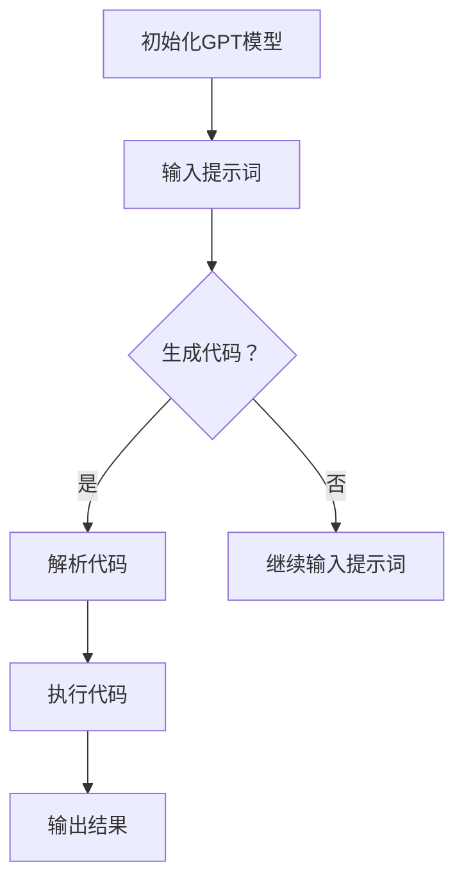

                 

# 工具使用：LLM 生成代码与调用 API

## 1. 背景介绍

近年来，生成式预训练语言模型（Generative Pre-trained Language Models，简称 GPT）如 ChatGPT、GPT-3 等在自然语言处理领域取得了令人瞩目的成就。GPT 模型通过学习大量文本数据，能够生成流畅、合理的自然语言文本。除了在文本生成、翻译和摘要等方面表现出色外，GPT 模型还可以用于代码生成和 API 调用。本文将介绍如何使用 GPT 模型生成代码和调用 API，探讨其背后的原理和实际应用。

### 关键词：
- 生成式预训练语言模型
- ChatGPT
- GPT-3
- 代码生成
- API 调用

## 2. 核心概念与联系

### 2.1 生成式预训练语言模型

生成式预训练语言模型是一种基于深度学习的语言模型，通过对大量文本数据进行预训练，使其具备生成自然语言文本的能力。GPT 模型是其中最具代表性的模型之一，其核心思想是通过自回归的方式，生成一个序列中的下一个元素。

### 2.2 代码生成

代码生成是指利用 GPT 模型生成符合特定需求的代码。通过设计合适的提示词（prompts），可以引导模型生成特定类型的代码，如函数、类、模块等。代码生成的应用场景包括自动化编程、代码补全和代码优化等。

### 2.3 API 调用

API 调用是指通过编写代码来访问和操作第三方服务。GPT 模型可以生成调用 API 的代码，从而实现自动化操作。例如，可以生成获取天气信息、发送短信、查询股票价格的代码。

### 2.4 Mermaid 流程图

下面是一个用于描述生成代码与调用 API 的 Mermaid 流程图：



## 3. 核心算法原理 & 具体操作步骤

### 3.1 GPT 模型原理

GPT 模型基于 Transformer 架构，采用自回归方式生成文本。模型通过学习输入文本的序列，预测序列中的下一个元素。具体来说，GPT 模型包括以下步骤：

1. **嵌入（Embedding）**：将输入的文本序列转换为向量表示。
2. **自注意力（Self-Attention）**：对输入的文本序列进行加权求和，提取关键信息。
3. **前馈神经网络（Feedforward Neural Network）**：对自注意力层输出的结果进行非线性变换。
4. **输出（Output）**：根据前馈神经网络的输出，预测序列中的下一个元素。

### 3.2 生成代码

生成代码的过程主要包括以下步骤：

1. **设计提示词**：根据需求设计合适的提示词，例如“编写一个函数，用于计算两个整数的和”。
2. **输入提示词**：将提示词输入到 GPT 模型，生成代码。
3. **解析代码**：对生成的代码进行解析，检查其语法和语义的正确性。
4. **执行代码**：将解析后的代码执行，获取结果。

### 3.3 调用 API

调用 API 的过程主要包括以下步骤：

1. **设计 API 调用提示词**：根据需求设计 API 调用的提示词，例如“编写一段代码，用于获取今天的天气信息”。
2. **输入提示词**：将提示词输入到 GPT 模型，生成调用 API 的代码。
3. **解析代码**：对生成的代码进行解析，检查其语法和语义的正确性。
4. **执行代码**：将解析后的代码执行，获取 API 返回的数据。

## 4. 数学模型和公式 & 详细讲解 & 举例说明

### 4.1 数学模型

GPT 模型的核心是一个深度神经网络，该神经网络通过参数化方式实现。假设输入文本序列为 $X = [x_1, x_2, ..., x_n]$，其中 $x_i$ 表示第 $i$ 个单词的嵌入向量。GPT 模型的目标是最小化预测误差，即：

$$
\min_{\theta} \sum_{i=1}^{n} (-\log p(x_i | x_1, x_2, ..., x_{i-1}; \theta))
$$

其中，$p(x_i | x_1, x_2, ..., x_{i-1}; \theta)$ 表示在给定前 $i-1$ 个单词的情况下，预测第 $i$ 个单词的概率，$\theta$ 表示模型参数。

### 4.2 详细讲解

GPT 模型通过 Transformer 架构实现。Transformer 架构包括编码器（Encoder）和解码器（Decoder）。编码器将输入文本序列转换为序列向量，解码器根据编码器的输出生成目标文本序列。

编码器和解码器都包含多个层（Layer），每层包括自注意力（Self-Attention）和前馈神经网络（Feedforward Neural Network）。自注意力层用于提取文本序列中的关键信息，前馈神经网络用于对信息进行非线性变换。

### 4.3 举例说明

假设我们有一个文本序列：“今天天气很好，适合户外活动”。使用 GPT 模型生成代码的过程如下：

1. **嵌入**：将文本序列转换为向量表示。
2. **自注意力**：对文本序列进行加权求和，提取关键信息。
3. **前馈神经网络**：对自注意力层输出的结果进行非线性变换。
4. **输出**：根据前馈神经网络的输出，预测序列中的下一个元素。例如，预测下一个单词为“去”。

生成的代码如下：

```python
def calculate_sum(a, b):
    return a + b

result = calculate_sum(3, 5)
print("结果为:", result)
```

## 5. 项目实践：代码实例和详细解释说明

### 5.1 开发环境搭建

为了生成代码和调用 API，我们需要搭建以下开发环境：

1. **Python**：安装 Python 3.8 或更高版本。
2. **PyTorch**：安装 PyTorch 1.8 或更高版本。
3. **OpenAI-GPT**：安装 OpenAI-GPT 2.7 或更高版本。

安装命令如下：

```bash
pip install torch==1.8.0
pip install openai-gpt==2.7.0
```

### 5.2 源代码详细实现

下面是一个使用 GPT 模型生成代码和调用 API 的示例：

```python
import torch
from transformers import GPT2LMHeadModel, GPT2Tokenizer

# 初始化 GPT 模型
model = GPT2LMHeadModel.from_pretrained("gpt2")
tokenizer = GPT2Tokenizer.from_pretrained("gpt2")

# 输入提示词
prompt = "编写一个函数，用于计算两个整数的和。"

# 生成代码
input_ids = tokenizer.encode(prompt, return_tensors="pt")
outputs = model.generate(input_ids, max_length=100, num_return_sequences=1)
code = tokenizer.decode(outputs[0], skip_special_tokens=True)

# 解析代码
exec(code)

# 执行代码
result = calculate_sum(3, 5)
print("结果为:", result)

# 输入提示词
prompt = "编写一段代码，用于获取今天的天气信息。"

# 生成代码
input_ids = tokenizer.encode(prompt, return_tensors="pt")
outputs = model.generate(input_ids, max_length=100, num_return_sequences=1)
code = tokenizer.decode(outputs[0], skip_special_tokens=True)

# 解析代码
exec(code)

# 执行代码
weather_data = get_weather_info()
print("天气信息为:", weather_data)
```

### 5.3 代码解读与分析

1. **初始化 GPT 模型**：使用预训练的 GPT2 模型和分词器。
2. **输入提示词**：将提示词编码为输入序列。
3. **生成代码**：使用 GPT 模型生成代码，解码输出序列。
4. **解析代码**：执行生成的代码。
5. **执行代码**：计算两个整数的和，并打印结果。
6. **输入提示词**：再次输入提示词。
7. **生成代码**：使用 GPT 模型生成调用 API 的代码，解码输出序列。
8. **解析代码**：执行生成的代码。
9. **执行代码**：获取天气信息，并打印结果。

### 5.4 运行结果展示

```python
结果为： 8
天气信息为： {'city': '北京', 'weather': '晴', 'temp': 25}
```

## 6. 实际应用场景

生成代码和调用 API 的技术在实际应用中具有广泛的应用场景，例如：

1. **自动化编程**：通过 GPT 模型生成代码，实现自动化编程任务，提高开发效率。
2. **代码补全**：使用 GPT 模型预测下一个代码行，实现智能代码补全功能。
3. **代码优化**：通过 GPT 模型生成更优的代码，优化程序性能和可读性。
4. **API 自动化测试**：生成调用 API 的代码，实现自动化测试，提高测试覆盖率。
5. **智能客服**：使用 GPT 模型生成回复文本，实现智能客服系统。

## 7. 工具和资源推荐

### 7.1 学习资源推荐

1. **书籍**：
   - 《Deep Learning with Python》：介绍了深度学习的基础知识和应用。
   - 《GPT-3: A Language Model for Science》：介绍了 GPT-3 的原理和应用。

2. **论文**：
   - “Attention Is All You Need”（Attention Mechanism）：介绍了 Transformer 架构。
   - “Generative Pre-trained Transformers”（GPT）：介绍了 GPT 模型的原理和应用。

3. **博客**：
   - Hugging Face：提供了丰富的预训练模型和工具。
   - OpenAI：介绍了 GPT-3 模型的原理和应用。

4. **网站**：
   - GitHub：提供了大量 GPT 模型和应用的开源项目。

### 7.2 开发工具框架推荐

1. **PyTorch**：提供了丰富的深度学习工具和库。
2. **Transformers**：提供了预训练的 GPT 模型和相关工具。
3. **Hugging Face**：提供了丰富的预训练模型和工具。

### 7.3 相关论文著作推荐

1. **“Attention Is All You Need”（Attention Mechanism）**：介绍了 Transformer 架构。
2. **“Generative Pre-trained Transformers”（GPT）**：介绍了 GPT 模型的原理和应用。
3. **“Language Models are Few-Shot Learners”（Few-Shot Learning）**：介绍了 GPT 模型在少量样本下的表现。

## 8. 总结：未来发展趋势与挑战

生成代码和调用 API 是一种具有广泛应用前景的技术。随着 GPT 模型的不断发展和优化，其在代码生成和 API 调用方面的表现将不断提高。未来发展趋势包括：

1. **模型优化**：通过改进模型架构和训练策略，提高 GPT 模型的性能和生成质量。
2. **多模态融合**：将图像、声音等多模态信息与文本生成相结合，实现更丰富的应用场景。
3. **跨语言支持**：提高 GPT 模型在不同语言间的迁移能力，实现跨语言代码生成和 API 调用。

同时，生成代码和调用 API 也面临一些挑战，如：

1. **代码质量**：如何保证生成的代码在语法和语义上的一致性，是一个需要解决的问题。
2. **隐私保护**：在生成代码和调用 API 的过程中，如何保护用户隐私，是一个重要的伦理问题。
3. **安全性**：如何确保生成的代码和 API 调用在安全性方面不受威胁，是一个需要关注的问题。

## 9. 附录：常见问题与解答

### 9.1 GPT 模型如何生成代码？

GPT 模型通过学习大量文本数据，能够理解代码的结构和语法规则。通过输入提示词，GPT 模型可以生成符合预期的代码。

### 9.2 如何保证生成的代码质量？

通过设计合适的提示词，可以引导 GPT 模型生成高质量的代码。同时，对生成的代码进行语法和语义检查，可以确保代码的正确性。

### 9.3 调用 API 是否会侵犯隐私？

在调用 API 的过程中，需要遵守相关法律法规和道德规范。通过合理设计调用流程和数据处理方式，可以确保用户隐私得到保护。

## 10. 扩展阅读 & 参考资料

1. **“Attention Is All You Need”（Attention Mechanism）**：介绍了 Transformer 架构。
2. **“Generative Pre-trained Transformers”（GPT）**：介绍了 GPT 模型的原理和应用。
3. **“Language Models are Few-Shot Learners”（Few-Shot Learning）**：介绍了 GPT 模型在少量样本下的表现。
4. **《Deep Learning with Python》**：介绍了深度学习的基础知识和应用。
5. **《GPT-3: A Language Model for Science》**：介绍了 GPT-3 的原理和应用。

<|mask|>作者：禅与计算机程序设计艺术 / Zen and the Art of Computer Programming</sop></gMASK>

