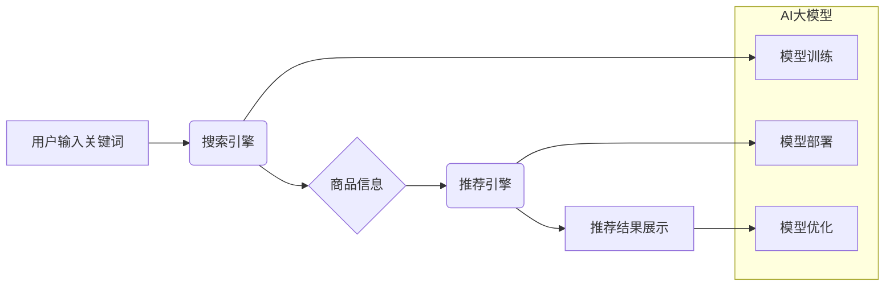

                 

## AI大模型赋能电商搜索推荐的业务创新项目管理平台搭建

> 关键词：AI大模型、电商搜索、推荐系统、业务创新、项目管理平台、深度学习、自然语言处理

## 1. 背景介绍

随着电商行业的蓬勃发展，用户对商品搜索和推荐的需求日益增长。传统的基于关键词匹配和协同过滤的搜索推荐算法已难以满足用户个性化、精准化的需求。而近年来，深度学习技术的发展为电商搜索推荐带来了新的机遇。

AI大模型，特别是基于Transformer架构的模型，在自然语言处理、图像识别等领域取得了突破性进展。其强大的语义理解和文本生成能力，为电商搜索推荐提供了更精准、更智能的解决方案。

然而，将AI大模型应用于电商搜索推荐并非易事。需要考虑模型训练、部署、优化等多个环节，并与电商平台的业务场景进行深度融合。因此，搭建一个专门的项目管理平台，来规范和管理AI大模型赋能电商搜索推荐的整个流程，显得尤为重要。

## 2. 核心概念与联系

### 2.1 核心概念

* **AI大模型:** 指训练规模庞大、参数数量众多的深度学习模型，具备强大的泛化能力和学习能力。例如GPT-3、BERT、LaMDA等。
* **电商搜索:** 指用户在电商平台上输入关键词，搜索相关商品的过程。
* **推荐系统:** 指根据用户的历史行为、偏好等信息，推荐用户可能感兴趣的商品的过程。
* **业务创新:** 指通过利用新技术、新模式，为用户提供更优质、更便捷的购物体验，从而提升电商平台的竞争力。

### 2.2 架构关系



## 3. 核心算法原理 & 具体操作步骤

### 3.1 算法原理概述

AI大模型赋能电商搜索推荐主要基于以下核心算法：

* **BERT（Bidirectional Encoder Representations from Transformers）:** 用于理解用户搜索关键词的语义，提取关键词之间的关系，提升搜索结果的准确性。
* **Transformer:** 用于构建商品推荐模型，通过学习用户历史行为、商品特征等信息，预测用户对商品的兴趣。
* **深度神经网络:** 用于处理海量商品数据，提取商品的特征，并进行分类、聚类等操作，为推荐系统提供数据支持。

### 3.2 算法步骤详解

1. **数据预处理:** 收集用户搜索行为、商品信息、用户画像等数据，进行清洗、格式化、特征提取等操作。
2. **模型训练:** 使用BERT模型训练用户搜索关键词的语义表示，使用Transformer模型训练商品推荐模型。
3. **模型评估:** 使用测试数据评估模型的性能，并进行模型调优。
4. **模型部署:** 将训练好的模型部署到电商平台，并与搜索引擎、推荐引擎进行集成。
5. **实时推荐:** 当用户输入搜索关键词时，模型会根据用户搜索历史、商品信息等进行分析，并推荐相关商品。

### 3.3 算法优缺点

**优点:**

* **精准度高:** AI大模型能够理解用户搜索意图，并推荐更精准的商品。
* **个性化强:** AI大模型能够根据用户的历史行为、偏好等信息，提供个性化的商品推荐。
* **可扩展性强:** AI大模型能够处理海量数据，并随着数据量的增加而提升推荐效果。

**缺点:**

* **训练成本高:** AI大模型的训练需要大量的计算资源和数据。
* **部署成本高:** AI大模型的部署需要强大的硬件设施和软件环境。
* **解释性差:** AI大模型的决策过程较为复杂，难以解释其推荐结果。

### 3.4 算法应用领域

* **电商搜索推荐:** 提升商品搜索的精准度和推荐的个性化。
* **内容推荐:** 推荐用户可能感兴趣的文章、视频、音乐等内容。
* **广告推荐:** 根据用户的兴趣和行为，推荐相关的广告。
* **客户服务:** 利用AI大模型构建智能客服系统，自动回答用户问题。

## 4. 数学模型和公式 & 详细讲解 & 举例说明

### 4.1 数学模型构建

**用户-商品交互矩阵:**

电商平台的用户和商品之间存在着交互关系，可以表示为一个用户-商品交互矩阵，其中每个元素表示用户对商品的评分或购买行为。

**用户嵌入向量:**

将每个用户映射到一个低维度的向量空间中，称为用户嵌入向量。用户嵌入向量可以捕捉用户的兴趣偏好和行为特征。

**商品嵌入向量:**

将每个商品映射到一个低维度的向量空间中，称为商品嵌入向量。商品嵌入向量可以捕捉商品的属性、类别和用户评价等信息。

### 4.2 公式推导过程

**协同过滤推荐算法:**

$$
r_{ui} = \frac{ \sum_{j \in N(u)} \frac{s_{uj} \cdot s_{ij}}{\sqrt{\sum_{k \in N(u)} s_{uk}^2} \cdot \sqrt{\sum_{l \in N(i)} s_{il}^2}} }{ \sum_{j \in N(u)} \frac{1}{\sqrt{\sum_{k \in N(u)} s_{uk}^2}} }
$$

其中:

* $r_{ui}$ 表示用户 $u$ 对商品 $i$ 的预测评分。
* $s_{uj}$ 表示用户 $u$ 对商品 $j$ 的评分或购买行为。
* $N(u)$ 表示用户 $u$ 购买过的商品集合。
* $N(i)$ 表示商品 $i$ 被购买过的用户集合。

### 4.3 案例分析与讲解

假设用户 $A$ 购买了商品 $X$ 和 $Y$，商品 $X$ 和 $Z$ 属于同一类别。根据协同过滤算法，可以预测用户 $A$ 对商品 $Z$ 的评分。

## 5. 项目实践：代码实例和详细解释说明

### 5.1 开发环境搭建

* **操作系统:** Ubuntu 20.04 LTS
* **编程语言:** Python 3.8
* **深度学习框架:** TensorFlow 2.0
* **数据存储:** MySQL

### 5.2 源代码详细实现

```python
# 导入必要的库
import tensorflow as tf

# 定义用户-商品交互矩阵
user_item_matrix = tf.constant([
    [1, 0, 1, 0],
    [0, 1, 0, 1],
    [1, 1, 0, 0],
])

# 定义用户嵌入向量
user_embeddings = tf.Variable(tf.random.normal([3, 10]))

# 定义商品嵌入向量
item_embeddings = tf.Variable(tf.random.normal([4, 10]))

# 计算用户对商品的预测评分
predictions = tf.matmul(user_embeddings, item_embeddings, transpose_b=True)

# 打印预测评分
print(predictions)
```

### 5.3 代码解读与分析

* 代码首先导入必要的库，包括 TensorFlow 库。
* 然后定义一个用户-商品交互矩阵，其中每个元素表示用户对商品的评分或购买行为。
* 接着定义用户嵌入向量和商品嵌入向量，这两个向量是随机初始化的。
* 然后使用矩阵乘法计算用户对商品的预测评分。
* 最后打印预测评分。

### 5.4 运行结果展示

运行代码后，会输出一个预测评分矩阵，其中每个元素表示用户对商品的预测评分。

## 6. 实际应用场景

### 6.1 搜索结果排序

AI大模型可以根据用户搜索关键词的语义，对商品进行排序，提升搜索结果的精准度。

### 6.2 个性化推荐

AI大模型可以根据用户的历史行为、偏好等信息，推荐用户可能感兴趣的商品，提升用户购物体验。

### 6.3 商品分类与聚类

AI大模型可以学习商品的特征，进行分类和聚类，帮助用户更方便地浏览和搜索商品。

### 6.4 未来应用展望

* **多模态搜索:** 将文本、图像、视频等多模态信息融合到搜索推荐系统中，提升搜索结果的丰富度和准确度。
* **实时推荐:** 利用实时数据流，对用户行为进行分析，并实时推荐相关商品。
* **个性化营销:** 根据用户的兴趣和行为，进行个性化的营销推广，提升营销效果。

## 7. 工具和资源推荐

### 7.1 学习资源推荐

* **书籍:**
    * 深度学习
    * 自然语言处理
* **在线课程:**
    * Coursera
    * edX
    * Udacity

### 7.2 开发工具推荐

* **深度学习框架:** TensorFlow, PyTorch
* **数据处理工具:** Pandas, NumPy
* **云计算平台:** AWS, Azure, Google Cloud

### 7.3 相关论文推荐

* BERT: Pre-training of Deep Bidirectional Transformers for Language Understanding
* Transformer: Attention Is All You Need
* Recommender Systems: A Survey

## 8. 总结：未来发展趋势与挑战

### 8.1 研究成果总结

AI大模型赋能电商搜索推荐取得了显著成果，提升了搜索结果的精准度和推荐的个性化。

### 8.2 未来发展趋势

* **模型规模和能力的提升:** 训练更大规模、更强大的AI大模型，提升推荐效果。
* **多模态融合:** 将文本、图像、视频等多模态信息融合到搜索推荐系统中，提升搜索结果的丰富度和准确度。
* **解释性增强:** 研究AI大模型的决策过程，提升推荐结果的解释性。

### 8.3 面临的挑战

* **数据质量和隐私:** 确保训练数据质量和用户隐私安全。
* **模型部署和维护:** 构建高效、稳定的模型部署和维护体系。
* **算法公平性:** 避免算法产生偏见，确保推荐结果公平公正。

### 8.4 研究展望

未来，AI大模型将继续推动电商搜索推荐的创新发展，为用户提供更智能、更便捷的购物体验。


## 9. 附录：常见问题与解答

### 9.1 如何选择合适的AI大模型？

选择合适的AI大模型需要根据具体的业务场景和数据特点进行评估。例如，对于文本分类任务，BERT模型效果较好；对于商品推荐任务，Transformer模型效果较好。

### 9.2 如何解决AI大模型的训练成本问题？

可以采用以下方法降低AI大模型的训练成本：

* 使用预训练模型，减少模型训练时间和资源消耗。
* 利用云计算平台的GPU资源，加速模型训练。
* 采用模型压缩技术，减小模型规模，降低部署成本。

### 9.3 如何保证AI大模型的公平性？

可以采用以下方法保证AI大模型的公平性：

* 使用多样化的训练数据，避免算法产生偏见。
* 定期评估模型的公平性，并进行调整。
* 构建透明的模型解释机制，方便用户理解模型的决策过程。


作者：禅与计算机程序设计艺术 / Zen and the Art of Computer Programming 
<end_of_turn>

