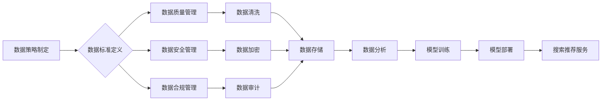

                 

## AI大模型重构电商搜索推荐的数据治理组织架构优化实践与案例分析

> 关键词：AI大模型、电商搜索推荐、数据治理、组织架构、实践案例、优化

## 1. 背景介绍

随着电商行业的蓬勃发展，搜索推荐系统已成为电商平台的核心竞争力之一。传统的搜索推荐系统主要依赖于基于规则和特征工程的方法，难以应对海量数据和用户行为的复杂变化。近年来，随着深度学习技术的快速发展，基于AI大模型的搜索推荐系统逐渐成为主流趋势。

AI大模型，例如Transformer、BERT等，凭借其强大的语义理解和学习能力，能够从海量数据中挖掘更深层的用户需求和商品特征，从而提供更精准、个性化的搜索推荐服务。然而，AI大模型的应用也带来了新的挑战，例如数据质量、模型训练、模型部署、模型安全等方面。

为了有效应对这些挑战，电商平台需要构建完善的数据治理体系，并优化相应的组织架构，以确保AI大模型的健康发展和可持续应用。

## 2. 核心概念与联系

### 2.1 数据治理

数据治理是指对数据生命周期进行全面的管理和控制，以确保数据的质量、安全、一致性和可用性。

数据治理体系通常包括以下几个关键要素：

* **数据策略:** 明确数据的使用目的、价值和风险，制定数据管理的总体方针和原则。
* **数据标准:** 定义数据格式、结构、编码和元数据等标准，确保数据的一致性和可交换性。
* **数据质量管理:** 建立数据质量监控和评估机制，及时发现和解决数据质量问题。
* **数据安全管理:** 采取相应的安全措施，保护数据免受未授权访问、泄露和篡改。
* **数据合规管理:** 确保数据处理符合相关法律法规和行业标准。

### 2.2 组织架构

组织架构是指企业内部人员、部门、职责和关系的结构化安排。

在AI大模型应用场景下，需要构建专门的数据治理团队，负责制定和实施数据治理策略，并协调各部门的数据管理工作。

数据治理团队通常包括以下几个角色：

* **数据治理负责人:** 负责制定和执行数据治理策略，协调各部门的数据管理工作。
* **数据工程师:** 负责数据采集、清洗、转换和存储等工作，确保数据质量和可用性。
* **数据科学家:** 负责数据分析、模型训练和评估等工作，利用数据驱动AI模型的开发和应用。
* **数据安全专家:** 负责数据安全策略的制定和实施，保护数据免受安全威胁。

### 2.3 数据治理与组织架构的联系

数据治理和组织架构是相互关联的，数据治理体系需要得到有效的组织架构支撑，才能顺利实施。

良好的组织架构可以明确数据治理职责，提高数据治理效率，并促进数据治理文化的形成。

**Mermaid 流程图**



## 3. 核心算法原理 & 具体操作步骤

### 3.1 算法原理概述

基于AI大模型的电商搜索推荐系统通常采用以下核心算法：

* **协同过滤:** 根据用户的历史行为和商品的购买记录，预测用户对商品的兴趣。
* **内容过滤:** 根据商品的属性和描述，以及用户的兴趣偏好，推荐相关的商品。
* **深度学习:** 利用深度神经网络，从海量数据中学习用户和商品的特征，并进行精准的推荐。

### 3.2 算法步骤详解

**协同过滤算法步骤:**

1. **数据收集:** 收集用户历史行为数据和商品购买记录。
2. **用户和商品表示:** 将用户和商品表示为向量，例如使用one-hot编码或词嵌入技术。
3. **相似度计算:** 计算用户之间的相似度或商品之间的相似度，例如使用余弦相似度或皮尔逊相关系数。
4. **推荐生成:** 根据用户与其他用户的相似度，推荐其他用户喜欢的商品。

**内容过滤算法步骤:**

1. **商品特征提取:** 从商品的属性和描述中提取特征，例如商品类别、品牌、价格、颜色等。
2. **用户兴趣建模:** 根据用户的历史行为数据，构建用户的兴趣模型，例如使用词袋模型或主题模型。
3. **推荐生成:** 根据商品特征和用户的兴趣模型，推荐与用户兴趣相符的商品。

**深度学习算法步骤:**

1. **数据预处理:** 对数据进行清洗、转换和编码。
2. **模型构建:** 选择合适的深度神经网络架构，例如Transformer或BERT。
3. **模型训练:** 利用训练数据训练模型，并进行参数优化。
4. **模型评估:** 使用测试数据评估模型的性能，例如使用准确率、召回率和F1-score等指标。
5. **模型部署:** 将训练好的模型部署到生产环境中，进行实时推荐。

### 3.3 算法优缺点

| 算法 | 优点 | 缺点 |
|---|---|---|
| 协同过滤 | 能够发现隐性关联，推荐个性化商品 | 数据稀疏性问题，冷启动问题 |
| 内容过滤 | 基于商品特征，推荐更精准的商品 | 难以发现用户隐性需求，数据维度问题 |
| 深度学习 | 能够学习更复杂的特征，推荐更精准的商品 | 数据量要求高，训练成本高 |

### 3.4 算法应用领域

* **电商搜索推荐:** 根据用户的搜索历史和浏览记录，推荐相关的商品。
* **个性化广告推荐:** 根据用户的兴趣和行为，推荐个性化的广告。
* **内容推荐:** 根据用户的阅读历史和兴趣，推荐相关的文章、视频和音频内容。
* **音乐推荐:** 根据用户的音乐偏好，推荐相关的歌曲和音乐人。

## 4. 数学模型和公式 & 详细讲解 & 举例说明

### 4.1 数学模型构建

协同过滤算法的数学模型通常基于矩阵分解，将用户和商品表示为低维向量，并通过最小化预测误差来学习这些向量。

假设用户集合为U，商品集合为I，用户-商品交互矩阵为R，其中R(u,i)表示用户u对商品i的评分或购买行为。

目标是学习用户向量u和商品向量v，使得预测评分与实际评分之间的误差最小化。

### 4.2 公式推导过程

常用的损失函数为均方误差 (MSE)：

$$
L = \frac{1}{2} \sum_{u \in U, i \in I} (R(u,i) - \hat{R}(u,i))^2
$$

其中，$\hat{R}(u,i)$为预测评分，由用户向量u和商品向量v计算得到：

$$
\hat{R}(u,i) = u^T v
$$

通过梯度下降算法，更新用户向量u和商品向量v，使得损失函数最小化。

### 4.3 案例分析与讲解

假设有一个用户-商品交互矩阵R，其中R(u,i)表示用户u对商品i的评分。

可以使用协同过滤算法学习用户向量u和商品向量v，并预测用户u对商品i的评分。

例如，用户1对商品1评分为5，用户1对商品2评分为3，用户2对商品1评分为4，用户2对商品2评分为5。

通过协同过滤算法，可以学习到用户1和用户2的向量，以及商品1和商品2的向量。

然后，可以预测用户1对商品2的评分，以及用户2对商品1的评分。

## 5. 项目实践：代码实例和详细解释说明

### 5.1 开发环境搭建

* Python 3.x
* TensorFlow 或 PyTorch
* Jupyter Notebook

### 5.2 源代码详细实现

```python
import tensorflow as tf

# 定义用户-商品交互矩阵
R = tf.constant([[5, 3], [4, 5]])

# 定义用户和商品的维度
user_dim = 2
item_dim = 2

# 定义用户向量和商品向量
user_embeddings = tf.Variable(tf.random.normal([2, user_dim]))
item_embeddings = tf.Variable(tf.random.normal([2, item_dim]))

# 计算预测评分
predictions = tf.matmul(user_embeddings, item_embeddings, transpose_b=True)

# 定义损失函数
loss = tf.reduce_mean(tf.square(predictions - R))

# 定义优化器
optimizer = tf.keras.optimizers.Adam()

# 训练模型
for epoch in range(100):
    with tf.GradientTape() as tape:
        loss_value = loss
    gradients = tape.gradient(loss_value, [user_embeddings, item_embeddings])
    optimizer.apply_gradients(zip(gradients, [user_embeddings, item_embeddings]))

# 打印训练结果
print(f"Loss: {loss_value.numpy()}")
```

### 5.3 代码解读与分析

* 代码首先定义了用户-商品交互矩阵R。
* 然后定义了用户向量和商品向量，并使用随机初始化。
* 计算预测评分，并定义损失函数。
* 使用Adam优化器训练模型，并打印训练结果。

### 5.4 运行结果展示

训练完成后，可以将学习到的用户向量和商品向量用于预测用户对商品的评分。

## 6. 实际应用场景

### 6.1 电商平台搜索推荐

基于AI大模型的搜索推荐系统可以帮助电商平台提高商品曝光率，提升用户转化率，并增强用户体验。

例如，当用户搜索“手机”时，系统可以根据用户的历史行为和商品特征，推荐与用户需求相符的手机型号，并根据用户的偏好排序推荐结果。

### 6.2 个性化广告推荐

AI大模型可以分析用户的兴趣和行为，并推荐个性化的广告，提高广告点击率和转化率。

例如，当用户浏览电商平台的服装页面时，系统可以根据用户的浏览历史和购买记录，推荐与用户兴趣相符的服装广告。

### 6.3 内容推荐

AI大模型可以分析用户的阅读历史和兴趣，并推荐相关的文章、视频和音频内容，提高用户粘性和活跃度。

例如，当用户阅读电商平台的科技新闻时，系统可以根据用户的阅读历史和兴趣，推荐与科技相关的其他文章和视频。

### 6.4 未来应用展望

随着AI技术的不断发展，AI大模型在电商搜索推荐领域的应用将更加广泛和深入。

例如，可以利用多模态数据，例如文本、图像和视频，进行更精准的推荐；可以利用强化学习算法，优化推荐策略，提高推荐效果；可以利用联邦学习技术，保护用户隐私，同时实现数据共享和模型训练。

## 7. 工具和资源推荐

### 7.1 学习资源推荐

* **书籍:**
    * 深度学习
    * 自然语言处理
    * 机器学习
* **在线课程:**
    * Coursera
    * edX
    * Udacity

### 7.2 开发工具推荐

* **Python:**
    * TensorFlow
    * PyTorch
    * scikit-learn
* **云平台:**
    * AWS
    * Azure
    * Google Cloud

### 7.3 相关论文推荐

* Attention Is All You Need
* BERT: Pre-training of Deep Bidirectional Transformers for Language Understanding
* Collaborative Filtering for Recommender Systems

## 8. 总结：未来发展趋势与挑战

### 8.1 研究成果总结

基于AI大模型的电商搜索推荐系统已经取得了显著的成果，能够提供更精准、个性化的推荐服务，提升用户体验和商业价值。

### 8.2 未来发展趋势

未来，AI大模型在电商搜索推荐领域的应用将更加广泛和深入，例如：

* **多模态推荐:** 利用文本、图像、视频等多模态数据进行更精准的推荐。
* **个性化推荐:** 基于用户的个性化需求和行为，提供更个性化的推荐服务。
* **实时推荐:** 利用实时数据流，进行实时推荐，提高推荐的时效性。

### 8.3 面临的挑战

* **数据质量:** AI大模型的训练需要海量高质量的数据，而电商平台的数据往往存在脏数据、缺失数据等问题。
* **模型训练:** AI大模型的训练成本高，需要强大的计算资源和专业技术。
* **模型部署:** AI大模型的部署需要考虑模型的实时性、可扩展性和安全性。
* **数据隐私:** AI大模型的训练和应用需要保护用户隐私，避免数据泄露和滥用。

### 8.4 研究展望

未来，需要进一步研究以下问题：

* 如何提高AI大模型的鲁棒性和泛化能力，使其能够应对数据变化和噪声。
* 如何降低AI大模型的训练成本，使其能够更广泛地应用于中小企业。
* 如何更好地保护用户隐私，确保AI大模型的伦理和可持续发展。

## 9. 附录：常见问题与解答

**Q1: 如何评估AI大模型的推荐效果？**

**A1:** 可以使用以下指标评估AI大模型的推荐效果：

* **准确率:** 推荐结果与用户实际行为的匹配度。
* **召回率:** 推荐结果覆盖了用户实际需求的比例。
* **点击率:** 用户点击推荐结果的比例。
* **转化率:** 用户通过推荐结果完成购买或其他目标行为的比例。

**Q2: 如何解决AI大模型的冷启动问题？**

**A2:** 可以采用以下方法解决AI大模型的冷启动问题：

* **利用用户画像:** 根据用户的基本信息和行为特征，进行初始推荐。
* **利用协同过滤的冷启动策略:** 利用与用户相似用户的行为数据进行推荐。
* **利用内容过滤的冷启动策略:** 利用商品的属性和描述进行推荐。

**Q3: 如何保护AI大模型的安全性？**

**A3:** 可以采用以下方法保护AI大模型的安全性：

* **数据加密:** 对用户数据进行加密，防止数据泄露。
* **模型安全审计:** 定期对模型进行安全审计，发现潜在的漏洞。
* **模型对抗攻击防御:** 对模型进行对抗攻击防御训练，提高模型的鲁棒性。


作者：禅与计算机程序设计艺术 / Zen and the Art of Computer Programming<end_of_turn>

