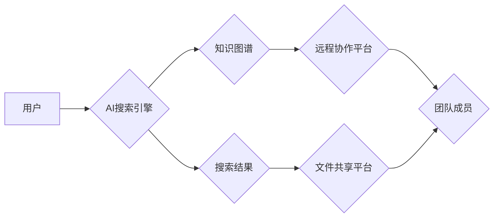

                 

## AI搜索如何促进远程工作和虚拟协作

> 关键词：人工智能、搜索引擎、远程工作、虚拟协作、知识管理、信息检索、协作工具

### 1. 背景介绍

随着科技的飞速发展，远程工作和虚拟协作已成为现代工作模式的重要组成部分。远程工作不仅可以提高工作效率，还能打破地域限制，吸引更多人才。然而，远程工作也面临着一些挑战，例如信息孤岛、沟通障碍和协作效率低下。

传统的搜索引擎在信息检索方面已经取得了巨大成就，但对于远程工作和虚拟协作场景下的信息需求却存在一些局限性。传统的搜索引擎主要依赖关键词匹配，难以理解用户复杂的意图和上下文信息。此外，传统的搜索引擎也难以有效地整合来自不同来源的信息，导致用户难以获取到全面、准确的信息。

人工智能（AI）技术的兴起为解决这些问题提供了新的思路。AI搜索引擎能够利用自然语言处理（NLP）、机器学习（ML）等技术，更深入地理解用户的搜索意图，并提供更精准、更相关的搜索结果。同时，AI搜索引擎还可以整合来自不同平台和系统的知识，构建一个更加完整的知识图谱，帮助用户更有效地获取信息和进行协作。

### 2. 核心概念与联系

**2.1 核心概念**

* **AI搜索引擎:** 基于人工智能技术的搜索引擎，能够理解用户的自然语言查询，并提供更精准、更相关的搜索结果。
* **远程工作:** 指员工在远离办公室，例如在家中或其他地点，通过网络连接进行工作的一种工作模式。
* **虚拟协作:** 指通过网络和数字化工具，实现团队成员在不同地点协同工作的一种方式。
* **知识管理:** 指企业内部知识的收集、整理、存储、共享和利用的系统化过程。

**2.2 架构图**



**2.3 联系**

AI搜索引擎可以帮助远程工作者和虚拟团队成员更有效地获取信息、进行协作和管理知识。

* **信息获取:** AI搜索引擎可以帮助用户快速找到所需的信息，例如公司政策、项目文档、同事联系方式等。
* **协作效率:** AI搜索引擎可以帮助用户找到相关文档和资源，并将其共享给团队成员，提高协作效率。
* **知识管理:** AI搜索引擎可以帮助企业构建一个完整的知识图谱，并通过搜索和推荐功能，帮助员工更好地利用知识资源。

### 3. 核心算法原理 & 具体操作步骤

**3.1 算法原理概述**

AI搜索引擎的核心算法原理主要包括：

* **自然语言处理 (NLP):** 用于理解用户的自然语言查询，将其转换为机器可理解的格式。
* **信息检索 (IR):** 用于从海量数据中检索出与用户查询最相关的文档。
* **机器学习 (ML):** 用于训练模型，提高搜索结果的准确性和相关性。

**3.2 算法步骤详解**

1. **用户查询:** 用户输入自然语言查询。
2. **预处理:** 对用户查询进行预处理，例如去除停用词、词干提取等。
3. **关键词提取:** 从预处理后的查询中提取关键词。
4. **语义分析:** 利用NLP技术对关键词进行语义分析，理解用户的搜索意图。
5. **知识图谱查询:** 根据语义分析结果，查询知识图谱，获取相关知识。
6. **文档检索:** 利用IR算法从文档库中检索出与关键词和知识相关的文档。
7. **结果排序:** 根据文档的 relevance、authority、freshness 等因素对检索结果进行排序。
8. **结果展示:** 将排序后的结果展示给用户。

**3.3 算法优缺点**

**优点:**

* **更精准的搜索结果:** AI搜索引擎能够理解用户的搜索意图，提供更精准、更相关的搜索结果。
* **更丰富的搜索体验:** AI搜索引擎可以提供多种搜索方式，例如语音搜索、图像搜索等，提升用户体验。
* **更智能的知识管理:** AI搜索引擎可以帮助企业构建一个完整的知识图谱，并通过搜索和推荐功能，帮助员工更好地利用知识资源。

**缺点:**

* **算法复杂度高:** AI搜索引擎的算法比较复杂，需要大量的计算资源和数据训练。
* **数据依赖性强:** AI搜索引擎的性能取决于训练数据的质量和数量。
* **解释性差:** AI搜索引擎的决策过程比较复杂，难以解释其搜索结果背后的逻辑。

**3.4 算法应用领域**

AI搜索引擎的应用领域非常广泛，例如：

* **企业内部搜索:** 帮助员工快速找到公司内部的文档、知识和资源。
* **客户服务:** 利用AI搜索引擎构建智能客服系统，帮助客户快速解决问题。
* **电子商务:** 利用AI搜索引擎提高商品推荐的精准度和用户体验。
* **教育:** 利用AI搜索引擎帮助学生查找学习资料和解答问题。

### 4. 数学模型和公式 & 详细讲解 & 举例说明

**4.1 数学模型构建**

AI搜索引擎的核心算法通常基于信息检索模型，例如BM25模型、TF-IDF模型等。这些模型将文档和查询表示为向量，并使用余弦相似度等度量来计算它们的相似度。

**4.2 公式推导过程**

BM25模型的公式如下：

$$
BM25(Q, D) = \sum_{t \in Q \cap D} \frac{(k_1 + 1) * tf_{t,D} * idf_t}{(k_1 * (1 - b + b * \frac{dl}{avgdl})) + tf_{t,D}}
$$

其中：

* $Q$：查询
* $D$：文档
* $t$：关键词
* $tf_{t,D}$：关键词 $t$ 在文档 $D$ 中的词频
* $idf_t$：关键词 $t$ 的逆向文档频率
* $k_1$、$k_2$、$b$：BM25模型的参数

**4.3 案例分析与讲解**

假设我们有一个查询 "人工智能搜索引擎"，以及两个文档：

* 文档 1： "人工智能是一种新兴技术，它可以帮助我们提高搜索引擎的效率。"
* 文档 2： "搜索引擎是互联网的重要组成部分，它可以帮助我们查找信息。"

根据BM25模型的公式，我们可以计算出这两个文档与查询的相似度。文档 1 的相似度会更高，因为 "人工智能" 和 "搜索引擎" 都是查询中的关键词，并且在文档 1 中的词频较高。

### 5. 项目实践：代码实例和详细解释说明

**5.1 开发环境搭建**

* Python 3.x
* TensorFlow 或 PyTorch
* NLTK 或 SpaCy
* Elasticsearch 或 Solr

**5.2 源代码详细实现**

```python
# 使用 NLTK 对查询进行预处理
import nltk
nltk.download('punkt')
nltk.download('stopwords')

def preprocess_query(query):
  tokens = nltk.word_tokenize(query)
  stop_words = nltk.corpus.stopwords.words('english')
  filtered_tokens = [token for token in tokens if token.lower() not in stop_words]
  return filtered_tokens

# 使用 Elasticsearch 进行文档检索
from elasticsearch import Elasticsearch

es = Elasticsearch()
query = "人工智能搜索引擎"
results = es.search(index="my_index", body={"query": {"match": {"content": query}}})

# 打印检索结果
for hit in results['hits']['hits']:
  print(hit['_source']['title'])
```

**5.3 代码解读与分析**

* 代码首先使用 NLTK 库对用户查询进行预处理，去除停用词等。
* 然后使用 Elasticsearch 库进行文档检索，根据用户查询匹配相关文档。
* 最后打印检索结果。

**5.4 运行结果展示**

运行代码后，将显示与用户查询相关的文档标题。

### 6. 实际应用场景

**6.1 远程团队协作**

AI搜索引擎可以帮助远程团队成员更有效地协作。例如，团队成员可以利用AI搜索引擎查找项目文档、会议记录、代码库等资源，并将其共享给其他成员。

**6.2 企业知识管理**

AI搜索引擎可以帮助企业构建一个完整的知识图谱，并通过搜索和推荐功能，帮助员工更好地利用知识资源。例如，员工可以利用AI搜索引擎查找公司政策、产品信息、客户案例等知识，提高工作效率。

**6.3 个性化学习**

AI搜索引擎可以根据用户的学习习惯和兴趣，提供个性化的学习资源。例如，学生可以利用AI搜索引擎查找相关学习资料、解答问题、参与在线讨论等，提高学习效率。

**6.4 未来应用展望**

随着AI技术的不断发展，AI搜索引擎将在未来发挥更重要的作用。例如：

* **更智能的搜索体验:** AI搜索引擎将能够更深入地理解用户的搜索意图，并提供更个性化、更智能的搜索结果。
* **更强大的协作功能:** AI搜索引擎将能够更好地整合不同平台和系统的协作工具，帮助团队成员更有效地协作。
* **更丰富的知识管理功能:** AI搜索引擎将能够帮助企业构建更完整的知识图谱，并通过更智能的搜索和推荐功能，帮助员工更好地利用知识资源。

### 7. 工具和资源推荐

**7.1 学习资源推荐**

* **书籍:**
    * "Introduction to Information Retrieval" by Manning, Raghavan, and Schütze
    * "Speech and Language Processing" by Jurafsky and Martin
* **在线课程:**
    * Coursera: Natural Language Processing Specialization
    * edX: Artificial Intelligence

**7.2 开发工具推荐**

* **Elasticsearch:** 开源搜索引擎平台
* **Solr:** 开源搜索引擎平台
* **TensorFlow:** 开源机器学习框架
* **PyTorch:** 开源机器学习框架

**7.3 相关论文推荐**

* "BERT: Pre-training of Deep Bidirectional Transformers for Language Understanding"
* "Attention Is All You Need"
* "BM25: A Function for Ranking Search Results"

### 8. 总结：未来发展趋势与挑战

**8.1 研究成果总结**

AI搜索引擎在信息检索、知识管理和虚拟协作等领域取得了显著的成果。AI搜索引擎能够理解用户的自然语言查询，提供更精准、更相关的搜索结果，并帮助用户更有效地获取信息和进行协作。

**8.2 未来发展趋势**

* **更智能的搜索体验:** AI搜索引擎将能够更深入地理解用户的搜索意图，并提供更个性化、更智能的搜索结果。
* **更强大的协作功能:** AI搜索引擎将能够更好地整合不同平台和系统的协作工具，帮助团队成员更有效地协作。
* **更丰富的知识管理功能:** AI搜索引擎将能够帮助企业构建更完整的知识图谱，并通过更智能的搜索和推荐功能，帮助员工更好地利用知识资源。

**8.3 面临的挑战**

* **算法复杂度高:** AI搜索引擎的算法比较复杂，需要大量的计算资源和数据训练。
* **数据依赖性强:** AI搜索引擎的性能取决于训练数据的质量和数量。
* **解释性差:** AI搜索引擎的决策过程比较复杂，难以解释其搜索结果背后的逻辑。

**8.4 研究展望**

未来，AI搜索引擎的研究将继续朝着更智能、更强大、更可解释的方向发展。例如，研究人员将探索新的算法和模型，提高AI搜索引擎的性能和效率。同时，研究人员也将致力于提高AI搜索引擎的解释性，使用户能够更好地理解其搜索结果背后的逻辑。

### 9. 附录：常见问题与解答

**9.1 如何选择合适的AI搜索引擎平台？**

选择合适的AI搜索引擎平台需要考虑以下因素：

* **功能需求:** 不同的AI搜索引擎平台提供不同的功能，例如文本分析、语音搜索、图像搜索等。
* **数据规模:** 不同的AI搜索引擎平台支持不同的数据规模。
* **部署方式:** 不同的AI搜索引擎平台支持不同的部署方式，例如云部署、本地部署等。
* **成本:** 不同的AI搜索引擎平台的成本不同。

**9.2 如何训练自己的AI搜索引擎模型？**

训练自己的AI搜索引擎模型需要以下步骤：

* **准备数据:** 收集和预处理训练数据。
* **选择模型:** 选择合适的AI搜索引擎模型。
* **训练模型:** 使用训练数据训练模型。
* **评估模型:** 使用测试数据评估模型的性能。
* **部署模型:** 将训练好的模型部署到生产环境中。

**9.3 AI搜索引擎的未来发展趋势是什么？**

AI搜索引擎的未来发展趋势包括：

* **更智能的搜索体验:** AI搜索引擎将能够更深入地理解用户的搜索意图，并提供更个性化、更智能的搜索结果。
* **更强大的协作功能:** AI搜索引擎将能够更好地整合不同平台和系统的协作工具，帮助团队成员更有效地协作。
* **更丰富的知识管理功能:** AI搜索引擎将能够帮助企业构建更完整的知识图谱，并通过更智能的搜索和推荐功能，帮助员工更好地利用知识资源。


作者：禅与计算机程序设计艺术 / Zen and the Art of Computer Programming 
<end_of_turn>

