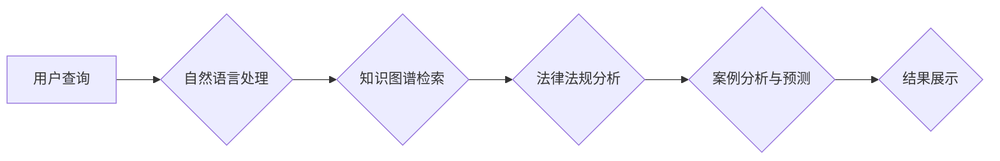

                 

## AI搜索引擎在法律领域的应用前景

> 关键词：人工智能、法律搜索引擎、自然语言处理、机器学习、法律分析、知识图谱、法律法规、案例检索、智能合约

## 1. 背景介绍

法律领域是一个信息密集型领域，海量法律法规、案例判决、条例文件等都需要专业人士进行解读和分析。传统的法律研究方法依赖于人工阅读和检索，效率低下，容易出现遗漏和误判。随着人工智能技术的快速发展，AI搜索引擎逐渐成为法律领域的新兴技术，为法律研究、案件处理、法律服务等方面提供了新的可能性。

AI搜索引擎在法律领域的应用前景广阔，主要体现在以下几个方面：

* **高效精准的法律法规检索:** AI搜索引擎可以利用自然语言处理技术理解用户查询意图，并从海量法律法规数据库中快速准确地检索相关信息，提高法律研究效率。
* **智能案例分析和预测:** AI搜索引擎可以分析大量的案例判决，识别法律规则和判例趋势，为案件处理提供参考和预测，提高案件胜诉率。
* **自动化法律文书生成:** AI搜索引擎可以根据用户需求自动生成法律文书，例如合同、诉状等，节省律师的时间和精力。
* **个性化法律咨询服务:** AI搜索引擎可以根据用户的法律问题提供个性化的法律咨询服务，提高法律服务的普惠性和效率。

## 2. 核心概念与联系

**2.1 核心概念**

* **人工智能 (AI):** 人工智能是指模拟人类智能行为的计算机系统，包括学习、推理、决策、语言理解等能力。
* **自然语言处理 (NLP):** 自然语言处理是指使计算机能够理解、处理和生成人类语言的技术。
* **机器学习 (ML):** 机器学习是人工智能的一个分支，通过算法训练模型，使模型能够从数据中学习并进行预测。
* **知识图谱 (KG):** 知识图谱是一种结构化的知识表示形式，将实体和关系以图的形式表示，可以用于存储和检索法律知识。

**2.2 架构图**



**2.3 联系**

AI搜索引擎在法律领域的应用需要结合以上核心概念，通过自然语言处理技术理解用户查询意图，利用知识图谱检索相关法律法规和案例，并通过机器学习算法进行法律分析和预测，最终为用户提供精准的法律信息和服务。

## 3. 核心算法原理 & 具体操作步骤

**3.1 算法原理概述**

AI搜索引擎的核心算法主要包括：

* **文本预处理:** 对用户查询和法律文本进行清洗、分词、词性标注等处理，以便于后续的分析和检索。
* **关键词提取:** 从文本中提取关键信息，例如法律术语、案件主体、时间地点等，用于构建检索条件。
* **语义理解:** 利用自然语言处理技术理解用户查询的意图和上下文，并将其转换为法律术语和概念。
* **知识图谱构建:** 将法律法规、案例判决等信息构建成知识图谱，以便于知识的存储、检索和推理。
* **机器学习模型训练:** 利用机器学习算法训练模型，例如文本分类、关系抽取、案例预测等，提高法律分析和预测的准确性。

**3.2 算法步骤详解**

1. **用户输入查询:** 用户输入法律问题或查询需求。
2. **文本预处理:** 对用户查询进行分词、词性标注、去除停用词等处理。
3. **关键词提取:** 从预处理后的文本中提取关键信息，构建检索条件。
4. **知识图谱检索:** 根据检索条件从知识图谱中检索相关法律法规、案例判决等信息。
5. **语义理解:** 利用自然语言处理技术理解用户查询的意图和上下文，并对检索结果进行筛选和排序。
6. **法律分析与预测:** 利用机器学习模型对检索结果进行分析，例如案例预测、法律风险评估等。
7. **结果展示:** 将分析结果以可读的方式展示给用户，例如文本摘要、图表分析、法律建议等。

**3.3 算法优缺点**

**优点:**

* **高效精准:** AI搜索引擎可以快速准确地检索法律信息，提高法律研究效率。
* **智能化:** AI搜索引擎可以理解用户查询意图，提供个性化法律服务。
* **自动化:** AI搜索引擎可以自动化法律文书生成、案例分析等任务，节省人力成本。

**缺点:**

* **数据依赖:** AI搜索引擎的性能依赖于训练数据的质量和数量。
* **解释性:** AI模型的决策过程往往难以解释，这可能导致法律专业人士对结果的信任度降低。
* **伦理风险:** AI搜索引擎可能存在偏见和歧视问题，需要进行伦理审查和监管。

**3.4 算法应用领域**

* **法律研究:** 法律学者和研究人员可以使用AI搜索引擎快速检索法律法规、案例判决等信息，进行法律研究和分析。
* **案件处理:** 律师可以使用AI搜索引擎分析案件相关法律法规和案例，为案件处理提供参考和建议。
* **法律咨询:** 法律咨询机构可以使用AI搜索引擎为用户提供个性化的法律咨询服务。
* **法律教育:** 法律院校可以使用AI搜索引擎为学生提供法律知识学习和实践平台。

## 4. 数学模型和公式 & 详细讲解 & 举例说明

**4.1 数学模型构建**

AI搜索引擎的核心算法通常基于机器学习模型，例如文本分类、关系抽取、案例预测等。这些模型可以利用数学公式进行建模和训练。

**4.2 公式推导过程**

例如，文本分类模型可以使用朴素贝叶斯公式进行建模：

$$P(C|D) = \frac{P(D|C)P(C)}{P(D)}$$

其中：

* $P(C|D)$ 是给定文档 $D$ 的条件下类别 $C$ 的概率。
* $P(D|C)$ 是给定类别 $C$ 的条件下文档 $D$ 的概率。
* $P(C)$ 是类别 $C$ 的先验概率。
* $P(D)$ 是文档 $D$ 的概率。

**4.3 案例分析与讲解**

假设我们有一个法律文本分类任务，需要将法律文本分类为“合同”、“诉讼”和“刑事”三种类别。我们可以使用朴素贝叶斯模型进行建模，并根据训练数据计算每个类别对应的先验概率、条件概率等参数。然后，对于新的法律文本，我们可以根据公式计算其属于每个类别的概率，并选择概率最高的类别作为最终分类结果。

## 5. 项目实践：代码实例和详细解释说明

**5.1 开发环境搭建**

AI搜索引擎的开发环境通常包括：

* **操作系统:** Linux、Windows 或 macOS
* **编程语言:** Python、Java 或 C++
* **深度学习框架:** TensorFlow、PyTorch 或 Keras
* **数据库:** MySQL、MongoDB 或 Elasticsearch

**5.2 源代码详细实现**

以下是一个使用 Python 和 TensorFlow 实现简单的法律文本分类模型的代码示例：

```python
import tensorflow as tf

# 定义模型结构
model = tf.keras.models.Sequential([
    tf.keras.layers.Embedding(input_dim=10000, output_dim=128),
    tf.keras.layers.LSTM(units=64),
    tf.keras.layers.Dense(units=3, activation='softmax')
])

# 编译模型
model.compile(optimizer='adam',
              loss='sparse_categorical_crossentropy',
              metrics=['accuracy'])

# 训练模型
model.fit(x_train, y_train, epochs=10)

# 评估模型
loss, accuracy = model.evaluate(x_test, y_test)
print('Loss:', loss)
print('Accuracy:', accuracy)
```

**5.3 代码解读与分析**

这段代码定义了一个简单的深度学习模型，用于法律文本分类。模型结构包括嵌入层、LSTM层和全连接层。嵌入层将单词向量化，LSTM层用于捕捉文本序列中的上下文信息，全连接层用于分类。

**5.4 运行结果展示**

训练完成后，我们可以使用模型对新的法律文本进行分类，并评估模型的准确率。

## 6. 实际应用场景

**6.1 法律研究**

AI搜索引擎可以帮助法律学者快速检索相关法律法规、案例判决等信息，进行法律研究和分析。例如，研究人员可以使用AI搜索引擎分析特定法律领域的案例判决，识别法律规则和判例趋势，为法律理论研究提供支持。

**6.2 案件处理**

AI搜索引擎可以帮助律师分析案件相关法律法规和案例，为案件处理提供参考和建议。例如，律师可以使用AI搜索引擎检索与案件相关的法律法规，了解案件适用法律，并分析类似案件的判决结果，为案件辩护提供依据。

**6.3 法律咨询**

AI搜索引擎可以帮助法律咨询机构为用户提供个性化的法律咨询服务。例如，用户可以通过AI搜索引擎输入法律问题，系统会根据用户的问题检索相关法律法规和案例，并提供相应的法律建议。

**6.4 未来应用展望**

随着人工智能技术的不断发展，AI搜索引擎在法律领域的应用前景更加广阔。未来，AI搜索引擎可能能够：

* 更精准地理解用户查询意图，提供更个性化的法律服务。
* 更深入地分析法律文本，识别更复杂的法律关系和规则。
* 自动生成更复杂的法律文书，例如合同、诉状等。
* 为法律教育提供更丰富的学习资源和实践平台。

## 7. 工具和资源推荐

**7.1 学习资源推荐**

* **书籍:**
    * 《深度学习》 by Ian Goodfellow, Yoshua Bengio, and Aaron Courville
    * 《自然语言处理》 by Jurafsky and Martin
* **在线课程:**
    * Coursera: Natural Language Processing Specialization
    * edX: Artificial Intelligence
* **博客和论坛:**
    * Towards Data Science
    * Reddit: r/MachineLearning

**7.2 开发工具推荐**

* **编程语言:** Python
* **深度学习框架:** TensorFlow, PyTorch
* **自然语言处理库:** NLTK, spaCy
* **数据库:** MySQL, MongoDB

**7.3 相关论文推荐**

* **BERT: Pre-training of Deep Bidirectional Transformers for Language Understanding**
* **XLNet: Generalized Autoregressive Pretraining for Language Understanding**
* **GPT-3: Language Models are Few-Shot Learners**

## 8. 总结：未来发展趋势与挑战

**8.1 研究成果总结**

AI搜索引擎在法律领域的应用取得了显著进展，例如法律文本分类、案例预测、法律风险评估等方面都取得了不错的成果。

**8.2 未来发展趋势**

未来，AI搜索引擎在法律领域的应用将更加智能化、个性化和自动化。例如，AI搜索引擎将能够更深入地理解法律文本，识别更复杂的法律关系和规则；能够根据用户的具体情况提供更个性化的法律建议；能够自动生成更复杂的法律文书，例如合同、诉状等。

**8.3 面临的挑战**

AI搜索引擎在法律领域的应用也面临着一些挑战，例如：

* **数据质量:** AI模型的性能依赖于训练数据的质量和数量。法律领域的数据往往是碎片化、结构化的，需要进行大量的清洗和预处理。
* **解释性:** AI模型的决策过程往往难以解释，这可能导致法律专业人士对结果的信任度降低。
* **伦理风险:** AI搜索引擎可能存在偏见和歧视问题，需要进行伦理审查和监管。

**8.4 研究展望**

未来，需要进一步研究如何提高AI搜索引擎的准确性、解释性和安全性，使其能够更好地服务于法律领域。


## 9. 附录：常见问题与解答

**9.1 如何评估AI搜索引擎的性能？**

AI搜索引擎的性能可以评估指标包括：

* **准确率:** 模型对测试数据的分类准确率。
* **召回率:** 模型能够识别出所有真实阳性的样本的比例。
* **F1-score:** 准确率和召回率的调和平均值。
* **AUC:** 曲线下面积，用于评估模型的区分能力。

**9.2 AI搜索引擎是否会取代律师？**

AI搜索引擎可以帮助律师提高工作效率，但不会完全取代律师。律师需要具备法律专业知识、批判性思维和沟通能力，这些能力是AI无法替代的。

**9.3 如何确保AI搜索引擎的公平性和公正性？**

AI搜索引擎的公平性和公正性需要通过以下方式来确保：

* 使用高质量、无偏见的训练数据。
* 对模型进行公平性评估和测试。
* 建立伦理审查机制，对模型的应用进行监督和监管。


作者：禅与计算机程序设计艺术 / Zen and the Art of Computer Programming 
<end_of_turn>

