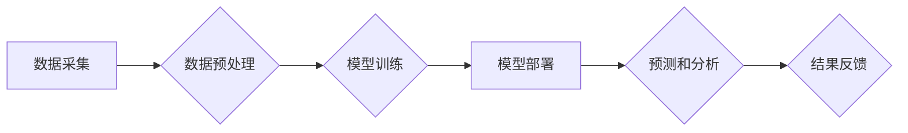

                 

## AI驱动的创新：人类计算在医疗行业的潜力

> 关键词：人工智能、医疗保健、机器学习、深度学习、自然语言处理、计算机视觉、诊断、预测分析

### 1. 背景介绍

医疗保健行业正处于数字化转型和创新浪潮之中。随着医疗数据的爆炸式增长和计算能力的飞速发展，人工智能（AI）技术逐渐成为医疗保健领域不可或缺的力量。AI驱动的创新正在改变医疗保健的各个方面，从疾病诊断和治疗方案推荐到药物研发和患者管理。

传统医疗保健模式面临着诸多挑战，例如：

* **数据处理和分析的瓶颈:** 医疗数据庞大复杂，难以有效处理和分析。
* **诊断和治疗的效率低下:** 医生需要花费大量时间进行诊断和制定治疗方案，效率低下。
* **医疗资源的短缺:** 许多地区医疗资源短缺，难以满足患者需求。
* **医疗成本的不断上升:** 医疗成本不断上升，给患者和社会带来沉重负担。

AI技术能够有效解决这些挑战，为医疗保健行业带来革命性的变革。

### 2. 核心概念与联系

**2.1 人类计算与AI**

人类计算是指人类利用自身的认知能力进行计算和分析。传统医疗保健模式依赖于人类计算，但人类计算存在局限性，例如：

* **主观性:** 人类判断容易受到主观因素的影响。
* **疲劳和错误:** 人类容易疲劳和犯错。
* **效率低下:** 人类处理大量数据效率低下。

AI技术可以弥补人类计算的不足，提供更客观、更准确、更高效的计算和分析能力。

**2.2 AI在医疗保健中的应用**

AI技术在医疗保健领域的应用非常广泛，包括：

* **疾病诊断:** 利用机器学习算法分析患者的医疗影像、基因数据和临床记录，辅助医生进行疾病诊断。
* **治疗方案推荐:** 根据患者的病情和个人特征，推荐最佳的治疗方案。
* **药物研发:** 利用深度学习算法加速药物研发过程，降低研发成本和时间。
* **患者管理:** 利用自然语言处理技术分析患者的医疗记录和沟通记录，提供个性化的患者管理服务。

**2.3 AI技术架构**

AI技术在医疗保健领域的应用通常基于以下架构：



**数据采集:** 收集患者的医疗数据，例如医疗影像、基因数据、临床记录等。

**数据预处理:** 对收集到的数据进行清洗、转换和特征提取，以便于模型训练。

**模型训练:** 利用机器学习算法训练AI模型，使模型能够从数据中学习并进行预测和分析。

**模型部署:** 将训练好的AI模型部署到生产环境中，以便于进行实际应用。

**预测和分析:** 利用部署的AI模型对新的数据进行预测和分析，例如辅助医生进行疾病诊断、推荐最佳治疗方案等。

**结果反馈:** 将AI模型的预测结果反馈给医生和患者，以便于决策和治疗。

### 3. 核心算法原理 & 具体操作步骤

**3.1 算法原理概述**

在医疗保健领域，常用的AI算法包括：

* **机器学习:** 利用算法从数据中学习，发现模式和规律，进行预测和分类。
* **深度学习:** 一种更高级的机器学习算法，利用多层神经网络模拟人类大脑的学习过程，能够处理更复杂的数据。
* **自然语言处理:** 处理和理解人类语言，例如分析患者的医疗记录和沟通记录。
* **计算机视觉:** 处理和理解图像和视频，例如分析医疗影像。

**3.2 算法步骤详解**

以机器学习算法为例，其基本步骤包括：

1. **数据收集和预处理:** 收集相关数据，并进行清洗、转换和特征提取。
2. **模型选择:** 根据具体应用场景选择合适的机器学习算法。
3. **模型训练:** 利用训练数据训练模型，调整模型参数，使模型能够准确预测或分类。
4. **模型评估:** 利用测试数据评估模型的性能，例如准确率、召回率、F1-score等。
5. **模型部署:** 将训练好的模型部署到生产环境中，用于实际应用。

**3.3 算法优缺点**

不同的AI算法具有不同的优缺点，需要根据具体应用场景选择合适的算法。

* **机器学习:** 优点是能够从数据中学习，发现模式和规律，适用于各种类型的预测和分类任务。缺点是需要大量的训练数据，并且模型解释性较差。
* **深度学习:** 优点是能够处理更复杂的数据，例如图像和文本，并且具有更高的预测精度。缺点是需要更多的计算资源和训练时间，并且模型解释性更差。
* **自然语言处理:** 优点是能够理解和处理人类语言，适用于分析患者的医疗记录和沟通记录。缺点是处理复杂语言的难度较大。
* **计算机视觉:** 优点是能够处理和理解图像和视频，适用于分析医疗影像。缺点是需要大量的标注数据，并且算法复杂度较高。

**3.4 算法应用领域**

AI算法在医疗保健领域的应用非常广泛，例如：

* **疾病诊断:** 利用机器学习算法分析患者的医疗影像、基因数据和临床记录，辅助医生进行疾病诊断。
* **治疗方案推荐:** 根据患者的病情和个人特征，推荐最佳的治疗方案。
* **药物研发:** 利用深度学习算法加速药物研发过程，降低研发成本和时间。
* **患者管理:** 利用自然语言处理技术分析患者的医疗记录和沟通记录，提供个性化的患者管理服务。

### 4. 数学模型和公式 & 详细讲解 & 举例说明

**4.1 数学模型构建**

在AI算法中，数学模型是算法的核心，用于描述算法的逻辑和计算过程。常见的数学模型包括：

* **线性回归模型:** 用于预测连续变量，例如患者的年龄、体重等。

$$
y = \beta_0 + \beta_1x_1 + \beta_2x_2 + ... + \beta_nx_n + \epsilon
$$

其中：

* $y$ 是预测变量
* $x_1, x_2, ..., x_n$ 是输入变量
* $\beta_0, \beta_1, \beta_2, ..., \beta_n$ 是模型参数
* $\epsilon$ 是误差项

* **逻辑回归模型:** 用于预测分类变量，例如患者是否患有某种疾病。

$$
P(Y=1|X) = \frac{1}{1 + e^{-( \beta_0 + \beta_1x_1 + \beta_2x_2 + ... + \beta_nx_n)}}
$$

其中：

* $P(Y=1|X)$ 是患者患有某种疾病的概率
* $X$ 是患者的特征向量
* $\beta_0, \beta_1, \beta_2, ..., \beta_n$ 是模型参数

**4.2 公式推导过程**

数学模型的推导过程通常基于统计学和概率论的原理。例如，线性回归模型的推导过程包括：

1. 假设数据满足线性关系
2. 利用最小二乘法估计模型参数
3. 推导出模型的预测公式

**4.3 案例分析与讲解**

以疾病诊断为例，利用机器学习算法分析患者的医疗影像数据，可以预测患者是否患有某种疾病。

假设我们收集了大量患者的医疗影像数据和诊断结果，并使用机器学习算法训练了一个疾病诊断模型。

当新的患者提供医疗影像数据时，模型可以根据训练数据进行预测，并输出患者患有某种疾病的概率。

如果概率超过一定阈值，则医生可以根据模型的预测结果进行诊断。

### 5. 项目实践：代码实例和详细解释说明

**5.1 开发环境搭建**

为了实现AI驱动的医疗保健应用，需要搭建相应的开发环境。

常用的开发环境包括：

* **Python:** 作为AI开发的常用语言，拥有丰富的AI库和工具。
* **TensorFlow:** 开源深度学习框架，用于训练和部署深度学习模型。
* **PyTorch:** 另一个流行的深度学习框架，具有更灵活的模型定义和训练方式。
* **Scikit-learn:** 机器学习库，提供各种机器学习算法和工具。
* **Jupyter Notebook:** 用于代码编写、调试和可视化分析的交互式环境。

**5.2 源代码详细实现**

以下是一个使用Python和Scikit-learn实现疾病诊断模型的简单代码示例：

```python
from sklearn.datasets import load_iris
from sklearn.model_selection import train_test_split
from sklearn.linear_model import LogisticRegression
from sklearn.metrics import accuracy_score

# 加载iris数据集
iris = load_iris()
X = iris.data
y = iris.target

# 将数据划分为训练集和测试集
X_train, X_test, y_train, y_test = train_test_split(X, y, test_size=0.2, random_state=42)

# 创建逻辑回归模型
model = LogisticRegression()

# 训练模型
model.fit(X_train, y_train)

# 对测试集进行预测
y_pred = model.predict(X_test)

# 计算模型准确率
accuracy = accuracy_score(y_test, y_pred)
print(f"模型准确率: {accuracy}")
```

**5.3 代码解读与分析**

这段代码首先加载了iris数据集，这是一个经典的分类数据集。然后，将数据划分为训练集和测试集，用于训练和评估模型。

接下来，创建了一个逻辑回归模型，并使用训练数据进行训练。最后，对测试集进行预测，并计算模型的准确率。

**5.4 运行结果展示**

运行这段代码后，会输出模型的准确率。

例如，如果模型的准确率为0.95，则表示模型在测试集上正确分类了95%的样本。

### 6. 实际应用场景

**6.1 疾病诊断辅助**

AI技术可以辅助医生进行疾病诊断，例如：

* **癌症诊断:** 利用深度学习算法分析患者的医疗影像数据，例如CT扫描、MRI扫描等，辅助医生诊断癌症。
* **心血管疾病诊断:** 利用机器学习算法分析患者的临床记录、心电图等数据，辅助医生诊断心血管疾病。

**6.2 治疗方案推荐**

AI技术可以根据患者的病情和个人特征，推荐最佳的治疗方案，例如：

* **个性化癌症治疗:** 利用机器学习算法分析患者的基因数据、临床记录等，推荐个性化的癌症治疗方案。
* **糖尿病管理:** 利用机器学习算法分析患者的血糖数据、饮食习惯等，推荐个性化的糖尿病管理方案。

**6.3 药物研发加速**

AI技术可以加速药物研发过程，例如：

* **药物靶点发现:** 利用深度学习算法分析大量生物数据，发现新的药物靶点。
* **药物分子设计:** 利用机器学习算法设计新的药物分子，提高药物研发效率。

**6.4 未来应用展望**

AI技术在医疗保健领域的应用前景广阔，未来将有更多创新应用出现，例如：

* **远程医疗:** 利用AI技术实现远程医疗，为更多患者提供医疗服务。
* **医疗机器人:** 利用AI技术开发医疗机器人，辅助医生进行手术和治疗。
* **精准医疗:** 利用AI技术实现精准医疗，为患者提供个性化的医疗服务。

### 7. 工具和资源推荐

**7.1 学习资源推荐**

* **在线课程:** Coursera、edX、Udacity等平台提供丰富的AI课程。
* **书籍:** 《深度学习》、《机器学习实战》等书籍是学习AI的经典教材。
* **博客和论坛:** 许多AI专家和爱好者在博客和论坛上分享他们的经验和知识。

**7.2 开发工具推荐**

* **Python:** 作为AI开发的常用语言，拥有丰富的AI库和工具。
* **TensorFlow:** 开源深度学习框架，用于训练和部署深度学习模型。
* **PyTorch:** 另一个流行的深度学习框架，具有更灵活的模型定义和训练方式。
* **Scikit-learn:** 机器学习库，提供各种机器学习算法和工具。
* **Jupyter Notebook:** 用于代码编写、调试和可视化分析的交互式环境。

**7.3 相关论文推荐**

* **《ImageNet Classification with Deep Convolutional Neural Networks》:** 
介绍了AlexNet模型，标志着深度学习在图像分类领域的突破。
* **《Attention Is All You Need》:** 
介绍了Transformer模型，改变了自然语言处理领域的格局。
* **《BERT: Pre-training of Deep Bidirectional Transformers for Language Understanding》:** 
介绍了BERT模型，在自然语言理解任务上取得了显著的成果。

### 8. 总结：未来发展趋势与挑战

**8.1 研究成果总结**

近年来，AI技术在医疗保健领域的应用取得了显著的成果，例如：

* **疾病诊断:** AI模型能够辅助医生进行疾病诊断，提高诊断准确率。
* **治疗方案推荐:** AI模型能够根据患者的病情和个人特征，推荐最佳的治疗方案。
* **药物研发:** AI技术能够加速药物研发过程，降低研发成本和时间。

**8.2 未来发展趋势**

未来，AI技术在医疗保健领域的应用将更加广泛和深入，例如：

* **精准医疗:** 利用AI技术实现精准医疗，为患者提供个性化的医疗服务。
* **远程医疗:** 利用AI技术实现远程医疗，为更多患者提供医疗服务。
* **医疗机器人:** 利用AI技术开发医疗机器人，辅助医生进行手术和治疗。

**8.3 面临的挑战**

AI技术在医疗保健领域的应用也面临着一些挑战，例如：

* **数据隐私和安全:** 医疗数据非常敏感，需要确保数据的隐私和安全。
* **算法解释性和可信度:** AI模型的决策过程往往难以解释，需要提高算法的解释性和可信度。
* **伦理问题:** AI技术在医疗保健领域的应用可能引发一些伦理问题，需要进行深入的探讨和研究。

**8.4 研究展望**

未来，需要加强AI技术在医疗保健领域的应用研究，解决上述挑战，推动AI技术在医疗保健领域的创新发展。

### 9. 附录：常见问题与解答

**9.1 如何确保AI模型的准确性和可靠性？**

确保AI模型的准确性和可靠性需要进行充分的训练和测试，并使用高质量的数据进行训练。

**9.2 如何解决AI模型的算法解释性和可信度问题？**

可以通过使用可解释的AI算法、进行模型可视化、解释模型决策过程等方式来提高算法的解释性和可信度。

**9.3 如何应对AI技术在医疗保健领域的伦理问题？**

需要制定相应的伦理规范和法律法规，引导AI技术在医疗保健领域的健康发展。


作者：禅与计算机程序设计艺术 / Zen and the Art of Computer Programming<end_of_turn>

