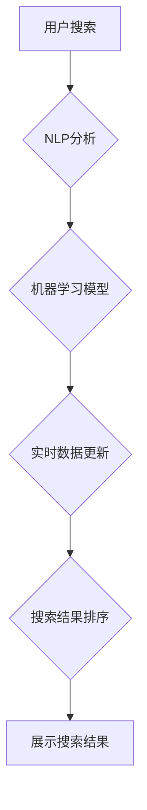

                 

## AI驱动的搜索结果实时更新策略

> 关键词：人工智能、搜索引擎、实时更新、机器学习、自然语言处理、推荐系统、用户体验

## 1. 背景介绍

传统的搜索引擎依赖于预先编制好的索引和静态网页内容，导致搜索结果可能过时，无法反映最新的信息和用户需求。随着互联网信息爆炸式增长和用户对实时信息的渴望，传统的搜索策略已难以满足用户需求。

人工智能（AI）技术的快速发展为搜索引擎实时更新带来了新的机遇。AI算法能够实时分析海量数据，识别用户意图，并根据最新的信息动态调整搜索结果，从而提供更准确、更及时、更个性化的搜索体验。

## 2. 核心概念与联系

### 2.1  实时更新的意义

实时更新是指搜索结果能够根据最新的信息动态变化，用户每次搜索都能获得最新的结果。

**实时更新的优势:**

* **信息新鲜度:** 用户可以获得最新的信息，避免使用过时的结果。
* **用户体验提升:** 提供更准确、更相关的搜索结果，提升用户搜索体验。
* **竞争优势:** 实时更新的搜索引擎能够在信息获取速度和准确性方面领先竞争对手。

### 2.2  AI技术在实时更新中的应用

AI技术在搜索引擎实时更新中扮演着关键角色，主要应用于以下几个方面：

* **自然语言处理（NLP）:**  理解用户搜索意图，识别关键词和语义关系。
* **机器学习（ML）:**  根据用户行为和历史数据，预测用户需求，并动态调整搜索结果排序。
* **推荐系统:**  根据用户兴趣和搜索历史，推荐相关内容，提升用户搜索效率。

**AI驱动的实时更新架构:**



## 3. 核心算法原理 & 具体操作步骤

### 3.1  算法原理概述

AI驱动的实时更新策略主要基于以下核心算法：

* **深度学习:**  用于分析用户搜索意图和网页内容，识别关键词和语义关系。
* **强化学习:**  用于优化搜索结果排序，根据用户反馈不断调整算法参数，提升搜索结果的准确性和相关性。
* **图神经网络:**  用于分析网页之间的关系，识别权威网站和重要信息，提升搜索结果的可靠性。

### 3.2  算法步骤详解

1. **用户搜索:** 用户输入搜索关键词。
2. **NLP分析:** 使用自然语言处理技术分析用户搜索意图，识别关键词和语义关系。
3. **实时数据更新:**  从实时数据源获取最新信息，更新网页内容和相关信息。
4. **机器学习模型:**  使用深度学习、强化学习等模型分析用户搜索意图、网页内容和实时数据，预测用户需求。
5. **搜索结果排序:**  根据机器学习模型的预测结果，对搜索结果进行排序，优先展示最相关、最权威、最新的信息。
6. **展示搜索结果:**  将排序后的搜索结果展示给用户。

### 3.3  算法优缺点

**优点:**

* **信息新鲜度:**  能够提供最新的搜索结果。
* **个性化推荐:**  根据用户行为和历史数据，提供个性化的搜索结果。
* **提升用户体验:**  提供更准确、更相关的搜索结果，提升用户搜索体验。

**缺点:**

* **计算资源消耗:**  实时更新需要大量的计算资源。
* **数据更新延迟:**  实时数据更新存在一定的延迟，无法保证完全实时。
* **算法复杂度:**  AI算法的训练和部署需要专业的技术人员。

### 3.4  算法应用领域

AI驱动的实时更新策略广泛应用于以下领域:

* **新闻搜索:**  提供最新的新闻资讯。
* **股票市场:**  实时更新股票价格和市场动态。
* **天气预报:**  提供最新的天气预报信息。
* **电商搜索:**  推荐最新的商品和优惠活动。

## 4. 数学模型和公式 & 详细讲解 & 举例说明

### 4.1  数学模型构建

**用户搜索意图预测模型:**

假设用户搜索关键词为 $q$, 网页内容为 $d$, 用户搜索意图为 $i$.  可以使用深度学习模型，例如Transformer，构建用户搜索意图预测模型:

$$
P(i|q,d) = f(q,d; \theta)
$$

其中，$f$ 为深度学习模型，$\theta$ 为模型参数。

**搜索结果排序模型:**

可以使用基于排序的机器学习模型，例如RankNet，构建搜索结果排序模型:

$$
Score(d,q) = g(q,d; \phi)
$$

其中，$g$ 为排序模型，$\phi$ 为模型参数。

### 4.2  公式推导过程

**用户搜索意图预测模型的损失函数:**

可以使用交叉熵损失函数来训练用户搜索意图预测模型:

$$
L_{CE} = - \sum_{i} y_i \log P(i|q,d)
$$

其中，$y_i$ 为真实用户搜索意图标签。

**搜索结果排序模型的损失函数:**

可以使用点积损失函数来训练搜索结果排序模型:

$$
L_{Pointwise} = \sum_{i} (Score(d_i,q) - Score(d_{i+1},q))^2
$$

其中，$d_i$ 和 $d_{i+1}$ 为两个排序后的网页。

### 4.3  案例分析与讲解

**案例:**  假设用户搜索关键词为 "苹果手机最新消息"。

**用户搜索意图预测:**  模型可以预测用户搜索意图为 "获取苹果手机最新消息"。

**搜索结果排序:**  模型可以根据网页内容、权威性、更新时间等因素，对搜索结果进行排序，优先展示最新的苹果手机新闻。

## 5. 项目实践：代码实例和详细解释说明

### 5.1  开发环境搭建

* **操作系统:**  Linux/macOS
* **编程语言:**  Python
* **深度学习框架:**  TensorFlow/PyTorch
* **自然语言处理库:**  NLTK/spaCy
* **数据库:**  MongoDB/Elasticsearch

### 5.2  源代码详细实现

```python
# 用户搜索意图预测模型
import tensorflow as tf

# 定义模型结构
model = tf.keras.Sequential([
    tf.keras.layers.Embedding(input_dim=vocab_size, output_dim=embedding_dim),
    tf.keras.layers.LSTM(units=128),
    tf.keras.layers.Dense(units=num_classes, activation='softmax')
])

# 编译模型
model.compile(optimizer='adam', loss='categorical_crossentropy', metrics=['accuracy'])

# 训练模型
model.fit(train_data, train_labels, epochs=10)

# 搜索结果排序模型
import sklearn.linear_model

# 训练排序模型
model = sklearn.linear_model.LogisticRegression()
model.fit(train_features, train_labels)

# 预测排序结果
predictions = model.predict(test_features)
```

### 5.3  代码解读与分析

* **用户搜索意图预测模型:**  使用深度学习模型，例如LSTM，预测用户搜索意图。
* **搜索结果排序模型:**  使用机器学习模型，例如LogisticRegression，对搜索结果进行排序。

### 5.4  运行结果展示

* **用户搜索意图预测:**  模型可以预测用户搜索意图，例如 "获取苹果手机最新消息"。
* **搜索结果排序:**  模型可以对搜索结果进行排序，优先展示最新的苹果手机新闻。

## 6. 实际应用场景

### 6.1  新闻搜索

AI驱动的实时更新策略可以为新闻搜索提供最新的新闻资讯，例如实时更新股票价格、天气预报、政治事件等。

### 6.2  电商搜索

AI驱动的实时更新策略可以为电商搜索提供最新的商品信息和优惠活动，例如实时更新商品价格、库存情况、促销活动等。

### 6.3  社交媒体搜索

AI驱动的实时更新策略可以为社交媒体搜索提供最新的用户动态和话题趋势，例如实时更新用户发布的微博、朋友圈、推特等。

### 6.4  未来应用展望

AI驱动的实时更新策略未来将应用于更多领域，例如：

* **医疗搜索:**  实时更新患者病情、药物信息等。
* **教育搜索:**  实时更新课程内容、考试信息等。
* **金融搜索:**  实时更新市场行情、投资建议等。

## 7. 工具和资源推荐

### 7.1  学习资源推荐

* **书籍:**
    * 《深度学习》
    * 《机器学习》
    * 《自然语言处理》
* **在线课程:**
    * Coursera
    * edX
    * Udacity

### 7.2  开发工具推荐

* **深度学习框架:**
    * TensorFlow
    * PyTorch
* **自然语言处理库:**
    * NLTK
    * spaCy
* **数据库:**
    * MongoDB
    * Elasticsearch

### 7.3  相关论文推荐

* **BERT: Pre-training of Deep Bidirectional Transformers for Language Understanding**
* **Attention Is All You Need**
* **RankNet: Learning to Rank Using Gradient Descent**

## 8. 总结：未来发展趋势与挑战

### 8.1  研究成果总结

AI驱动的实时更新策略为搜索引擎带来了革命性的变化，提升了信息新鲜度、个性化推荐和用户体验。

### 8.2  未来发展趋势

* **更精准的用户意图理解:**  利用更先进的自然语言处理技术，更精准地理解用户搜索意图。
* **更个性化的搜索结果:**  根据用户的兴趣、行为和历史数据，提供更个性化的搜索结果。
* **更智能的搜索结果排序:**  利用强化学习等算法，不断优化搜索结果排序，提升搜索结果的准确性和相关性。
* **多模态搜索:**  融合文本、图像、音频等多模态数据，提供更丰富的搜索体验。

### 8.3  面临的挑战

* **数据更新延迟:**  实时数据更新存在一定的延迟，难以保证完全实时。
* **计算资源消耗:**  实时更新需要大量的计算资源，成本较高。
* **算法复杂度:**  AI算法的训练和部署需要专业的技术人员。

### 8.4  研究展望

未来研究将重点关注以下方面:

* **降低数据更新延迟:**  探索更有效的实时数据更新技术。
* **优化算法效率:**  开发更高效的AI算法，降低计算资源消耗。
* **提升算法鲁棒性:**  提高算法对噪声数据和异常情况的鲁棒性。


## 9. 附录：常见问题与解答

**Q1:  AI驱动的实时更新策略会带来哪些风险？**

**A1:**  AI驱动的实时更新策略可能会带来以下风险:

* **信息误导:**  模型可能无法准确理解用户意图，导致搜索结果误导用户。
* **数据隐私泄露:**  实时更新需要收集和处理大量用户数据，存在数据隐私泄露的风险。
* **算法偏见:**  模型训练数据可能存在偏见，导致搜索结果出现偏见。

**Q2:  如何解决AI驱动的实时更新策略带来的风险？**

**A2:**  可以采取以下措施来解决风险:

* **加强模型评估和测试:**  对模型进行严格的评估和测试，确保模型的准确性和可靠性。
* **保护用户数据隐私:**  采取必要的措施保护用户数据的安全和隐私。
* **减少算法偏见:**  使用多样化的训练数据，并对模型进行公平性评估。


作者：禅与计算机程序设计艺术 / Zen and the Art of Computer Programming 
<end_of_turn>

