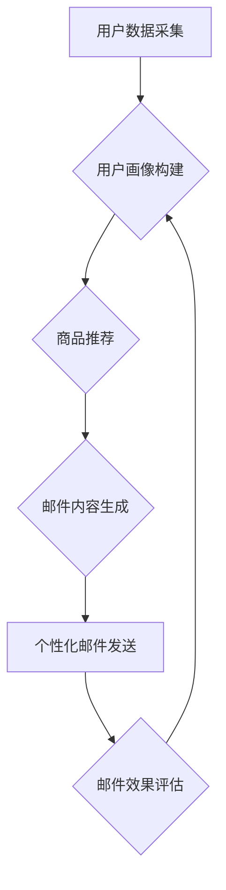

                 

## AI驱动的电商个性化邮件内容生成

> 关键词：电商个性化、邮件营销、自然语言生成、深度学习、Transformer模型、推荐系统

## 1. 背景介绍

在当今数据爆炸的时代，电商平台面临着日益激烈的竞争。如何精准触达目标用户，提升用户体验和转化率，成为电商平台亟需解决的关键问题。个性化邮件营销作为一种有效的营销手段，能够根据用户的行为、偏好和购买历史，发送定制化的邮件内容，从而提高用户参与度和购买意愿。

传统的邮件营销往往采用模板化、批量发送的方式，缺乏针对性和个性化，难以满足用户多样化的需求。而AI驱动的个性化邮件内容生成，则利用人工智能技术，例如自然语言生成（NLG）和推荐系统，能够根据用户的特征和行为数据，自动生成个性化的邮件内容，提升邮件营销的精准度和效果。

## 2. 核心概念与联系

### 2.1  核心概念

* **个性化邮件营销:**  根据用户的个人特征、行为数据和偏好，定制化发送邮件内容，提升用户体验和转化率。
* **自然语言生成 (NLG):**  利用人工智能技术，将数据转换为自然语言文本，例如文章、邮件、对话等。
* **推荐系统:**  根据用户的历史行为、偏好和兴趣，推荐相关商品、内容或服务。
* **深度学习:**  一种机器学习方法，利用多层神经网络学习数据特征，实现更复杂的模式识别和预测。
* **Transformer模型:**  一种新型的深度学习架构，能够有效处理序列数据，在自然语言处理领域取得了突破性进展。

### 2.2  架构流程



## 3. 核心算法原理 & 具体操作步骤

### 3.1  算法原理概述

AI驱动的电商个性化邮件内容生成主要基于以下核心算法：

* **用户画像构建:**  利用用户行为数据、购买历史、浏览记录等信息，构建用户画像，包括用户基本信息、兴趣爱好、消费偏好等。
* **商品推荐:**  根据用户的画像信息，利用推荐算法，推荐与用户兴趣相符的商品。
* **邮件内容生成:**  利用自然语言生成模型，根据推荐的商品信息和用户的画像信息，自动生成个性化的邮件内容，包括邮件主题、邮件正文、产品描述、促销信息等。

### 3.2  算法步骤详解

1. **数据收集:** 收集用户行为数据，包括用户注册信息、浏览记录、购买历史、评价信息、反馈信息等。
2. **数据预处理:** 对收集到的数据进行清洗、转换、格式化等处理，使其适合模型训练。
3. **用户画像构建:** 利用机器学习算法，例如聚类算法、关联规则挖掘算法等，对用户数据进行分析，构建用户画像。
4. **商品推荐:** 利用推荐算法，例如协同过滤算法、内容推荐算法、深度学习推荐算法等，根据用户的画像信息，推荐与用户兴趣相符的商品。
5. **邮件内容生成:** 利用自然语言生成模型，例如Transformer模型、GPT模型等，根据推荐的商品信息和用户的画像信息，自动生成个性化的邮件内容。
6. **邮件发送:** 将生成的个性化邮件发送给目标用户。
7. **邮件效果评估:**  收集用户对邮件的点击率、转化率等数据，评估邮件营销的效果，并根据评估结果进行模型优化和调整。

### 3.3  算法优缺点

**优点:**

* **个性化程度高:**  能够根据用户的特征和行为数据，生成个性化的邮件内容，提升用户体验和转化率。
* **效率提升:**  自动化生成邮件内容，节省人工成本和时间。
* **数据驱动:**  通过数据分析和模型优化，不断提升邮件营销效果。

**缺点:**

* **数据依赖:**  算法效果依赖于数据的质量和数量。
* **模型复杂:**  需要专业的技术人员进行模型训练和维护。
* **伦理问题:**  个性化邮件内容的生成可能涉及用户隐私和数据安全问题。

### 3.4  算法应用领域

* **电商平台:**  个性化推荐商品、发送促销信息、提醒用户订单状态等。
* **金融机构:**  个性化推荐金融产品、发送理财建议、提醒用户还款等。
* **教育机构:**  个性化推荐学习资源、发送学习提醒、评估用户学习进度等。
* **医疗机构:**  个性化推荐健康资讯、发送预约提醒、提醒用户服药等。

## 4. 数学模型和公式 & 详细讲解 & 举例说明

### 4.1  数学模型构建

用户画像构建可以利用聚类算法，例如K-Means算法，将用户数据聚类到不同的用户群体。

**K-Means算法:**

* **目标:** 将n个数据点划分为k个簇，使得每个数据点到其所属簇质心的距离最小。
* **步骤:**
    1. 随机选择k个数据点作为初始质心。
    2. 计算每个数据点到所有质心的距离。
    3. 将每个数据点分配到距离最近的质心所在的簇。
    4. 计算每个簇的新的质心。
    5. 重复步骤2-4，直到质心不再移动或达到最大迭代次数。

**公式:**

* 距离公式:  $d(x, c) = \sqrt{\sum_{i=1}^{n}(x_i - c_i)^2}$

其中:

* $x$ 是数据点
* $c$ 是质心
* $n$ 是特征维度

### 4.2  公式推导过程

K-Means算法的迭代过程可以理解为不断优化质心位置的过程，使得每个数据点到其所属簇质心的距离最小。

**质心更新公式:**

* $c_j = \frac{1}{N_j} \sum_{x_i \in C_j} x_i$

其中:

* $c_j$ 是第j个簇的质心
* $N_j$ 是第j个簇包含的数据点数量
* $x_i$ 是第i个数据点

### 4.3  案例分析与讲解

假设我们有10个用户数据，每个用户有2个特征，例如年龄和收入。我们可以使用K-Means算法将用户数据聚类到2个簇。

通过迭代计算质心位置，最终得到两个簇的质心，以及每个用户所属的簇。

## 5. 项目实践：代码实例和详细解释说明

### 5.1  开发环境搭建

* Python 3.x
* TensorFlow/PyTorch
* NLTK/SpaCy
* scikit-learn

### 5.2  源代码详细实现

```python
# 用户画像构建
from sklearn.cluster import KMeans

# 数据预处理
# ...

# 训练K-Means模型
kmeans = KMeans(n_clusters=2)
kmeans.fit(user_data)

# 获取用户所属簇
user_clusters = kmeans.labels_

# 商品推荐
# ...

# 邮件内容生成
# ...

# 邮件发送
# ...
```

### 5.3  代码解读与分析

* 用户画像构建部分使用K-Means算法将用户数据聚类到不同的用户群体。
* 商品推荐部分可以根据用户的画像信息，利用推荐算法推荐与用户兴趣相符的商品。
* 邮件内容生成部分可以使用自然语言生成模型，例如Transformer模型，根据推荐的商品信息和用户的画像信息，自动生成个性化的邮件内容。

### 5.4  运行结果展示

* 运行代码后，可以得到每个用户的所属簇信息，以及推荐的商品列表。
* 可以根据用户的画像信息和推荐的商品信息，生成个性化的邮件内容，并发送给目标用户。

## 6. 实际应用场景

* **电商平台:**  根据用户的购买历史和浏览记录，推荐个性化的商品，并发送个性化的促销信息。
* **金融机构:**  根据用户的投资偏好和风险承受能力，推荐个性化的金融产品，并发送理财建议。
* **教育机构:**  根据用户的学习进度和兴趣爱好，推荐个性化的学习资源，并发送学习提醒。

### 6.4  未来应用展望

* **更精准的个性化:**  利用更先进的机器学习算法和深度学习模型，实现更精准的个性化推荐和邮件内容生成。
* **多模态个性化:**  结合文本、图像、音频等多模态数据，实现更丰富的个性化体验。
* **跨平台个性化:**  将个性化邮件营销扩展到移动端、社交媒体等其他平台。

## 7. 工具和资源推荐

### 7.1  学习资源推荐

* **书籍:**
    * 《深度学习》
    * 《自然语言处理》
    * 《推荐系统》
* **在线课程:**
    * Coursera
    * edX
    * Udacity

### 7.2  开发工具推荐

* **Python:**  Python是一种流行的编程语言，广泛应用于数据科学、机器学习和人工智能领域。
* **TensorFlow/PyTorch:**  TensorFlow和PyTorch是两种流行的深度学习框架，可以用于训练和部署深度学习模型。
* **NLTK/SpaCy:**  NLTK和SpaCy是两种流行的自然语言处理库，可以用于文本处理、词性标注、命名实体识别等任务。

### 7.3  相关论文推荐

* **BERT: Pre-training of Deep Bidirectional Transformers for Language Understanding**
* **Attention Is All You Need**
* **Recurrent Neural Network for Sequence Learning**

## 8. 总结：未来发展趋势与挑战

### 8.1  研究成果总结

AI驱动的电商个性化邮件内容生成技术取得了显著的进展，能够有效提升邮件营销的精准度和效果。

### 8.2  未来发展趋势

* **更精准的个性化:**  利用更先进的机器学习算法和深度学习模型，实现更精准的个性化推荐和邮件内容生成。
* **多模态个性化:**  结合文本、图像、音频等多模态数据，实现更丰富的个性化体验。
* **跨平台个性化:**  将个性化邮件营销扩展到移动端、社交媒体等其他平台。

### 8.3  面临的挑战

* **数据隐私和安全:**  个性化邮件内容的生成可能涉及用户隐私和数据安全问题，需要采取相应的措施保护用户数据。
* **算法解释性和可解释性:**  深度学习模型的决策过程往往难以解释，需要研究更可解释的算法模型。
* **模型鲁棒性和泛化性:**  模型需要能够应对各种数据变化和异常情况，提高模型的鲁棒性和泛化性。

### 8.4  研究展望

未来，AI驱动的电商个性化邮件内容生成技术将继续发展，并应用于更多领域，为用户提供更个性化、更智能化的服务体验。


## 9. 附录：常见问题与解答

* **Q1:  如何评估邮件营销的效果？**

* **A1:**  可以通过邮件的点击率、转化率、用户反馈等指标来评估邮件营销的效果。

* **Q2:  如何保护用户数据隐私？**

* **A2:**  需要采取相应的技术措施，例如数据加密、匿名化处理等，保护用户数据的隐私安全。

* **Q3:  如何选择合适的深度学习模型？**

* **A3:**  需要根据具体应用场景和数据特点选择合适的深度学习模型。

* **Q4:  如何提高模型的鲁棒性和泛化性？**

* **A4:**  可以通过数据增强、正则化、迁移学习等方法提高模型的鲁棒性和泛化性。


作者：禅与计算机程序设计艺术 / Zen and the Art of Computer Programming 
<end_of_turn>

