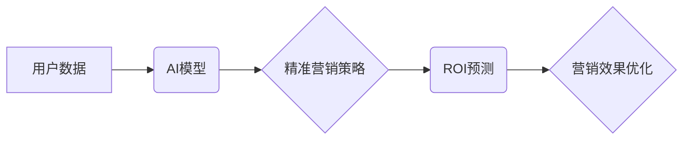

                 

## AI驱动的电商平台精准营销ROI预测

> 关键词：电商平台、精准营销、ROI预测、机器学习、深度学习、数据分析、推荐系统

## 1. 背景介绍

在当今数据爆炸的时代，电商平台面临着巨大的竞争压力。如何精准地触达目标用户，提高营销投资回报率（ROI）成为电商平台发展的重要课题。传统的营销方式往往依靠粗放的广告投放，难以精准定位用户需求，导致资源浪费和营销效果不佳。

人工智能（AI）技术的快速发展为电商平台精准营销提供了新的机遇。通过对海量用户数据进行分析和挖掘，AI算法可以精准预测用户的购买意愿，从而实现精准营销，提高ROI。

## 2. 核心概念与联系

### 2.1 精准营销

精准营销是指根据用户画像、行为特征等信息，对目标用户进行个性化营销，提高营销效率和转化率。

### 2.2 ROI预测

ROI预测是指利用数据分析和机器学习算法，预测营销活动带来的投资回报率。

### 2.3 AI驱动的精准营销ROI预测

AI驱动的精准营销ROI预测是指利用人工智能技术，对用户数据进行分析和挖掘，预测用户的购买意愿，并根据预测结果进行精准营销，从而提高营销投资回报率。

**核心概念架构图**



## 3. 核心算法原理 & 具体操作步骤

### 3.1 算法原理概述

AI驱动的精准营销ROI预测主要依赖于机器学习算法，例如：

* **线性回归:** 用于预测连续型变量，例如用户购买金额。
* **逻辑回归:** 用于预测分类型变量，例如用户是否会购买产品。
* **决策树:** 用于根据用户特征进行分类和预测。
* **随机森林:** 结合多个决策树，提高预测精度。
* **神经网络:** 用于处理复杂的数据关系，提高预测精度。

### 3.2 算法步骤详解

1. **数据收集:** 收集用户数据，包括用户画像、浏览历史、购买记录、评价信息等。
2. **数据预处理:** 对收集到的数据进行清洗、转换、编码等预处理操作，使其适合模型训练。
3. **特征工程:** 从原始数据中提取特征，例如用户年龄、性别、购买频率、平均购买金额等，并进行特征选择和组合。
4. **模型训练:** 选择合适的机器学习算法，对预处理后的数据进行训练，建立预测模型。
5. **模型评估:** 使用测试数据对模型进行评估，评估模型的预测精度、召回率、F1-score等指标。
6. **模型优化:** 根据模型评估结果，对模型参数进行调整，提高模型预测精度。
7. **模型部署:** 将训练好的模型部署到电商平台，用于预测用户购买意愿。
8. **营销策略制定:** 根据模型预测结果，制定精准的营销策略，例如个性化推荐、定向广告投放等。
9. **效果监控:** 持续监控营销效果，并根据实际情况对模型和策略进行调整。

### 3.3 算法优缺点

**优点:**

* **精准度高:** AI算法可以根据用户数据进行精准预测，提高营销精准度。
* **效率提升:** 自动化营销流程，提高营销效率。
* **ROI提升:** 精准营销可以降低营销成本，提高投资回报率。

**缺点:**

* **数据依赖:** AI算法需要大量数据进行训练，数据质量直接影响模型精度。
* **算法复杂:** 训练和部署AI模型需要一定的技术门槛。
* **隐私安全:** 用户数据安全需要得到保障。

### 3.4 算法应用领域

AI驱动的精准营销ROI预测技术广泛应用于电商平台、广告平台、金融机构等领域。

## 4. 数学模型和公式 & 详细讲解 & 举例说明

### 4.1 数学模型构建

假设我们想要预测用户 $u$ 是否会购买商品 $p$，我们可以构建一个二分类模型，其中：

* $y$ 为用户 $u$ 是否购买商品 $p$ 的标签，$y=1$ 表示购买，$y=0$ 表示不购买。
* $x$ 为用户 $u$ 的特征向量，例如年龄、性别、购买频率等。
* $w$ 为模型参数向量。

模型可以表示为：

$$
y = f(w^Tx)
$$

其中 $f$ 为激活函数，例如 sigmoid 函数。

### 4.2 公式推导过程

模型的目标是最大化预测准确率，可以使用交叉熵损失函数来衡量模型预测误差：

$$
L(w) = -\frac{1}{N}\sum_{i=1}^{N} y_i \log(f(w^Tx_i)) + (1-y_i)\log(1-f(w^Tx_i))
$$

其中 $N$ 为样本数量。

可以使用梯度下降算法来优化模型参数 $w$，使其最小化损失函数：

$$
w = w - \alpha \nabla L(w)
$$

其中 $\alpha$ 为学习率，$\nabla L(w)$ 为损失函数的梯度。

### 4.3 案例分析与讲解

假设我们有一个电商平台，想要预测用户是否会购买某个商品。我们可以收集用户数据，例如年龄、性别、购买历史等，并将其作为模型输入。

通过训练模型，我们可以得到一个预测模型，例如：

$$
y = \sigma(0.5x_1 + 0.3x_2 - 0.2x_3)
$$

其中 $x_1$ 为用户年龄，$x_2$ 为用户性别（0表示男性，1表示女性），$x_3$ 为用户购买历史次数。

我们可以使用这个模型来预测新用户的购买意愿。例如，如果一个用户的年龄为30岁，性别为男性，购买历史次数为5次，那么我们可以预测其购买该商品的概率为：

$$
y = \sigma(0.5*30 + 0.3*0 - 0.2*5) = \sigma(15) \approx 0.94
$$

这意味着该用户购买该商品的概率为94%。

## 5. 项目实践：代码实例和详细解释说明

### 5.1 开发环境搭建

* Python 3.6+
* TensorFlow/PyTorch
* Jupyter Notebook

### 5.2 源代码详细实现

```python
import pandas as pd
from sklearn.model_selection import train_test_split
from sklearn.linear_model import LogisticRegression
from sklearn.metrics import accuracy_score

# 加载数据
data = pd.read_csv('user_data.csv')

# 划分训练集和测试集
X = data.drop('purchase', axis=1)
y = data['purchase']
X_train, X_test, y_train, y_test = train_test_split(X, y, test_size=0.2, random_state=42)

# 创建逻辑回归模型
model = LogisticRegression()

# 训练模型
model.fit(X_train, y_train)

# 预测测试集结果
y_pred = model.predict(X_test)

# 计算模型准确率
accuracy = accuracy_score(y_test, y_pred)
print(f'模型准确率: {accuracy}')
```

### 5.3 代码解读与分析

* 首先，我们加载用户数据，并将其分为特征向量 $X$ 和标签 $y$。
* 然后，我们使用 train_test_split 函数将数据划分为训练集和测试集。
* 接下来，我们创建逻辑回归模型，并使用训练集进行模型训练。
* 训练完成后，我们使用测试集进行模型预测，并计算模型准确率。

### 5.4 运行结果展示

运行上述代码后，我们可以得到模型的准确率，例如：

```
模型准确率: 0.85
```

这表示模型在预测用户购买意愿方面达到了 85% 的准确率。

## 6. 实际应用场景

AI驱动的精准营销ROI预测技术在电商平台的实际应用场景非常广泛，例如：

* **个性化推荐:** 根据用户的购买历史、浏览记录等信息，推荐个性化的商品，提高用户转化率。
* **定向广告投放:** 根据用户的兴趣爱好、行为特征等信息，定向投放广告，提高广告点击率和转化率。
* **价格优化:** 根据用户的购买意愿、市场竞争等信息，动态调整商品价格，提高利润率。
* **会员营销:** 根据用户的消费习惯、忠诚度等信息，制定个性化的会员营销策略，提高用户粘性。

### 6.4 未来应用展望

随着人工智能技术的不断发展，AI驱动的精准营销ROI预测技术将更加成熟和完善，未来应用场景将更加广泛，例如：

* **多平台融合:** 将用户数据从多个平台整合，构建更全面的用户画像，提高预测精度。
* **实时预测:** 利用实时数据流，实现对用户购买意愿的实时预测，提高营销效率。
* **场景化营销:** 根据用户的具体场景，例如节日、促销活动等，制定个性化的营销策略。

## 7. 工具和资源推荐

### 7.1 学习资源推荐

* **书籍:**
    * 《深度学习》
    * 《机器学习实战》
    * 《Python机器学习》
* **在线课程:**
    * Coursera: 深度学习
    * edX: 机器学习
    * Udacity: AI工程师

### 7.2 开发工具推荐

* **Python:** 
    * TensorFlow
    * PyTorch
    * scikit-learn
* **数据可视化工具:**
    * Matplotlib
    * Seaborn
    * Tableau

### 7.3 相关论文推荐

* **《Attention Is All You Need》**
* **《BERT: Pre-training of Deep Bidirectional Transformers for Language Understanding》**
* **《Recurrent Neural Networks for Sequence Learning》**

## 8. 总结：未来发展趋势与挑战

### 8.1 研究成果总结

AI驱动的精准营销ROI预测技术取得了显著的成果，能够有效提高营销精准度和ROI。

### 8.2 未来发展趋势

未来，AI驱动的精准营销ROI预测技术将朝着以下方向发展：

* **模型更加智能:** 利用更先进的深度学习算法，构建更加智能的预测模型。
* **数据更加丰富:** 将更多数据类型整合到模型中，例如用户画像、行为特征、市场趋势等。
* **应用更加广泛:** 将AI技术应用到更多营销场景，例如内容营销、社交媒体营销等。

### 8.3 面临的挑战

AI驱动的精准营销ROI预测技术也面临着一些挑战：

* **数据隐私:** 如何保护用户数据隐私安全是一个重要的挑战。
* **算法解释性:** 许多深度学习算法的决策过程难以解释，这可能会导致模型的可信度降低。
* **模型可维护性:** 随着数据和业务变化，模型需要不断更新和维护，这需要投入一定的成本和精力。

### 8.4 研究展望

未来，我们需要继续加强对AI驱动的精准营销ROI预测技术的研究，解决上述挑战，使其更好地服务于电商平台和用户。

## 9. 附录：常见问题与解答

**Q1: 如何选择合适的机器学习算法？**

**A1:** 选择合适的机器学习算法需要根据具体业务场景和数据特点进行选择。例如，如果要预测连续型变量，可以使用线性回归或随机森林；如果要预测分类型变量，可以使用逻辑回归或决策树。

**Q2: 如何处理缺失数据？**

**A2:** 可以使用多种方法处理缺失数据，例如删除缺失数据、使用均值或中位数填充缺失值、使用机器学习算法进行预测填充等。

**Q3: 如何评估模型性能？**

**A3:** 可以使用多种指标来评估模型性能，例如准确率、召回率、F1-score、AUC等。

**Q4: 如何防止模型过拟合？**

**A4:** 可以使用正则化技术、交叉验证、Dropout等方法来防止模型过拟合。


作者：禅与计算机程序设计艺术 / Zen and the Art of Computer Programming 
<end_of_turn>

