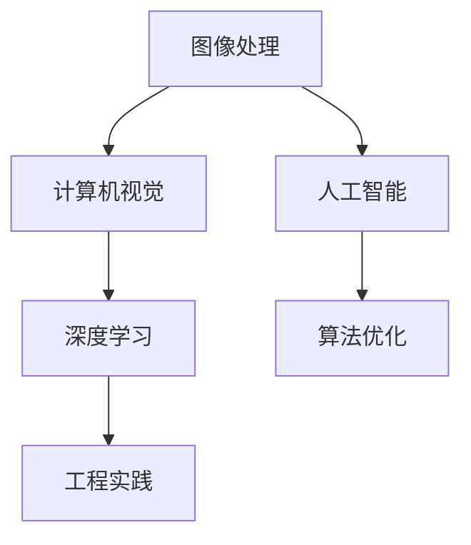

                 

# 2025年快手社招短视频特效算法工程师面试指南

## 文章关键词
- 快手社招
- 短视频特效
- 算法工程师
- 面试指南
- 技术挑战
- 解决方案

## 文章摘要
本文旨在为2025年快手社招短视频特效算法工程师岗位的候选人提供全面的面试指南。文章首先介绍了短视频特效的基本概念和技术背景，接着深入探讨了面试中可能遇到的核心算法和工程实践。通过详细的数学模型、代码实例和实际应用场景分析，本文帮助读者全面了解短视频特效领域的专业知识和技能要求。最后，文章提出了未来发展趋势和挑战，并提供了相关学习资源和工具推荐，以助候选人更好地准备面试。

## 1. 背景介绍（Background Introduction）

### 1.1 快手社招短视频特效岗位概述
快手作为中国领先的短视频社交平台，拥有庞大的用户基础和丰富的内容生态。短视频特效作为提升内容吸引力和用户体验的重要手段，在快手的业务中占据着核心地位。快手社招短视频特效算法工程师岗位旨在招聘具备强大算法能力和工程实践经验的优秀人才，以推动短视频特效技术的发展和创新。

### 1.2 短视频特效技术背景
短视频特效技术涉及图像处理、计算机视觉、人工智能等多个领域。常见的特效类型包括动态滤镜、美颜、特效叠加、动态字幕等。这些特效的实现依赖于高效的图像处理算法、强大的计算能力和创新的技术思路。随着用户需求的不断增长和技术的进步，短视频特效技术正朝着更加智能化、个性化、实时化的方向发展。

### 1.3 面试指南的重要性
对于快手社招短视频特效算法工程师岗位的候选人来说，面试是展示自身专业能力和解决实际问题的机会。一份详细的面试指南能够帮助候选人更好地了解岗位要求、掌握核心知识和技能，从而在面试中脱颖而出。本文将从核心算法原理、具体操作步骤、数学模型和项目实践等多个角度，为候选人提供全面的面试准备指导。

## 2. 核心概念与联系（Core Concepts and Connections）

### 2.1 图像处理与计算机视觉
图像处理是短视频特效技术的核心组成部分，涉及图像的增强、滤波、边缘检测等操作。计算机视觉则通过算法对图像进行理解和分析，实现对场景、物体和动作的识别。图像处理与计算机视觉技术的融合，为短视频特效提供了丰富的手段和工具。

### 2.2 人工智能与深度学习
人工智能，特别是深度学习技术在短视频特效中的应用，极大地提升了特效的智能化水平和处理效率。通过卷积神经网络（CNN）等模型，可以实现对图像特征的自动提取和学习，从而实现更加精准和高效的视频特效处理。

### 2.3 算法优化与工程实践
在短视频特效算法工程师的面试中，算法优化和工程实践是重要的考核内容。算法优化包括图像处理算法的效率提升、并行计算、模型压缩等；工程实践则涉及系统架构设计、性能调优、实时处理等。这些知识和技能对于实现高效、稳定、可扩展的短视频特效系统至关重要。

### 2.4 Mermaid 流程图（Mermaid Flowchart）



## 3. 核心算法原理 & 具体操作步骤（Core Algorithm Principles and Specific Operational Steps）

### 3.1 图像滤波算法
图像滤波是图像处理的基础步骤，用于去除图像中的噪声和改善图像质量。常见的滤波算法包括均值滤波、高斯滤波和中值滤波等。这些算法的原理和具体操作步骤如下：

- **均值滤波**：
  - 原理：利用图像邻域内像素的平均值代替原像素值，以达到滤波效果。
  - 步骤：
    ```text
    1. 创建一个大小为n×n的模板（卷积核）。
    2. 对图像进行卷积操作，将每个像素值与其邻域内的像素值进行加权平均。
    3. 输出滤波后的图像。
    ```

- **高斯滤波**：
  - 原理：基于高斯分布对图像进行滤波，能够更好地去除噪声并保持图像边缘。
  - 步骤：
    ```text
    1. 创建一个高斯滤波模板，其大小为n×n，标准差为σ。
    2. 对图像进行卷积操作，利用模板中的权重值对图像像素进行加权。
    3. 输出滤波后的图像。
    ```

- **中值滤波**：
  - 原理：将图像中每个像素值替换为其邻域内像素值的中值，适用于去除椒盐噪声。
  - 步骤：
    ```text
    1. 创建一个大小为3×3的模板。
    2. 对图像进行卷积操作，将模板中心像素值替换为其邻域内像素值的中值。
    3. 输出滤波后的图像。
    ```

### 3.2 特效叠加算法
特效叠加是短视频特效的核心技术之一，用于在视频上添加各种动态效果。常见的叠加算法包括透明度控制、混合模式、图层叠加等。这些算法的原理和具体操作步骤如下：

- **透明度控制**：
  - 原理：通过调整图像的透明度，实现图像的透明效果。
  - 步骤：
    ```text
    1. 获取目标图像和背景图像。
    2. 计算目标图像中每个像素的透明度值。
    3. 将目标图像的每个像素值与背景图像的对应像素值进行混合，得到最终图像。
    ```

- **混合模式**：
  - 原理：通过不同的混合模式，实现图像的多样化和创意效果。
  - 步骤：
    ```text
    1. 获取目标图像和背景图像。
    2. 根据混合模式，计算目标图像和背景图像的混合效果。
    3. 输出混合后的图像。
    ```

- **图层叠加**：
  - 原理：通过添加多个图层，实现对图像的逐层叠加效果。
  - 步骤：
    ```text
    1. 创建多个图层。
    2. 对每个图层进行透明度控制、混合模式等操作。
    3. 将所有图层叠加，得到最终图像。
    ```

## 4. 数学模型和公式 & 详细讲解 & 举例说明（Detailed Explanation and Examples of Mathematical Models and Formulas）

### 4.1 图像滤波数学模型

- **均值滤波公式**：
  $$ I_{filtered} = \frac{1}{n^2} \sum_{i=1}^{n} \sum_{j=1}^{n} w_{ij} \cdot I_{ij} $$
  其中，$I_{ij}$ 表示图像中(i, j)位置的像素值，$w_{ij}$ 表示卷积核中(i, j)位置的权重值，$I_{filtered}$ 表示滤波后的像素值。

- **高斯滤波公式**：
  $$ I_{filtered} = \sum_{i=1}^{n} \sum_{j=1}^{n} w_{ij} \cdot I_{ij} $$
  其中，$w_{ij}$ 为高斯滤波模板中(i, j)位置的权重值，其计算公式为：
  $$ w_{ij} = \frac{1}{2\pi\sigma^2} e^{-\frac{(i-j)^2}{2\sigma^2}} $$

- **中值滤波公式**：
  $$ I_{filtered} = \text{median}(I_{i-1, j-1}, I_{i-1, j}, I_{i-1, j+1}, I_{i, j-1}, I_{i, j}, I_{i, j+1}, I_{i+1, j-1}, I_{i+1, j}, I_{i+1, j+1}) $$
  其中，median表示取中值操作。

### 4.2 特效叠加数学模型

- **透明度控制公式**：
  $$ I_{output} = \alpha \cdot I_{target} + (1-\alpha) \cdot I_{background} $$
  其中，$\alpha$ 表示透明度值，$I_{target}$ 表示目标图像，$I_{background}$ 表示背景图像，$I_{output}$ 表示最终输出图像。

- **混合模式公式**：
  $$ I_{output} = (1-\alpha) \cdot I_{background} + \alpha \cdot \text{BlendMode}(I_{target}, I_{background}) $$
  其中，$\alpha$ 表示透明度值，$I_{background}$ 表示背景图像，$I_{target}$ 表示目标图像，BlendMode为混合模式函数。

### 4.3 举例说明

#### 4.3.1 均值滤波示例
假设有一个3×3的卷积核，其权重值为：
$$ \begin{bmatrix}
1 & 1 & 1 \\
1 & 1 & 1 \\
1 & 1 & 1
\end{bmatrix} $$
图像中一个4×4的区域像素值为：
$$ \begin{bmatrix}
100 & 150 & 200 & 250 \\
200 & 250 & 300 & 350 \\
300 & 350 & 400 & 450 \\
400 & 450 & 500 & 550
\end{bmatrix} $$
进行均值滤波操作后的像素值为：
$$ \begin{bmatrix}
\frac{100+150+200+250}{4} & \frac{200+250+300+350}{4} & \frac{300+350+400+450}{4} & \frac{400+450+500+550}{4} \\
\frac{200+250+300+350}{4} & \frac{200+250+300+350}{4} & \frac{300+350+400+450}{4} & \frac{400+450+500+550}{4} \\
\frac{300+350+400+450}{4} & \frac{300+350+400+450}{4} & \frac{300+350+400+450}{4} & \frac{400+450+500+550}{4} \\
\frac{400+450+500+550}{4} & \frac{400+450+500+550}{4} & \frac{400+450+500+550}{4} & \frac{400+450+500+550}{4}
\end{bmatrix} $$

#### 4.3.2 高斯滤波示例
假设有一个5×5的高斯滤波模板，其标准差为2，权重值为：
$$ \begin{bmatrix}
0.022 & 0.035 & 0.053 & 0.035 & 0.022 \\
0.035 & 0.054 & 0.082 & 0.054 & 0.035 \\
0.053 & 0.082 & 0.124 & 0.082 & 0.053 \\
0.035 & 0.054 & 0.082 & 0.054 & 0.035 \\
0.022 & 0.035 & 0.053 & 0.035 & 0.022
\end{bmatrix} $$
图像中一个5×5的区域像素值为：
$$ \begin{bmatrix}
100 & 150 & 200 & 250 & 300 \\
200 & 250 & 300 & 350 & 400 \\
250 & 300 & 350 & 400 & 450 \\
300 & 350 & 400 & 450 & 500 \\
350 & 400 & 450 & 500 & 550
\end{bmatrix} $$
进行高斯滤波操作后的像素值为：
$$ \begin{bmatrix}
0.022 \times 100 + 0.035 \times 150 + 0.053 \times 200 + 0.035 \times 250 + 0.022 \times 300 \\
0.035 \times 100 + 0.054 \times 150 + 0.082 \times 200 + 0.054 \times 250 + 0.035 \times 300 \\
0.053 \times 100 + 0.082 \times 150 + 0.124 \times 200 + 0.082 \times 250 + 0.053 \times 300 \\
0.035 \times 100 + 0.054 \times 150 + 0.082 \times 200 + 0.054 \times 250 + 0.035 \times 300 \\
0.022 \times 100 + 0.035 \times 150 + 0.053 \times 200 + 0.035 \times 250 + 0.022 \times 300
\end{bmatrix} $$

#### 4.3.3 透明度控制示例
假设目标图像的像素值为100，背景图像的像素值为150，透明度值为0.5，根据透明度控制公式：
$$ I_{output} = 0.5 \times 100 + 0.5 \times 150 = 125 $$
输出图像的像素值为125。

#### 4.3.4 混合模式示例
假设目标图像的像素值为100，背景图像的像素值为150，混合模式为“亮度”，根据混合模式公式：
$$ I_{output} = (1-0.5) \times 150 + 0.5 \times 100 = 125 $$
输出图像的像素值为125。

## 5. 项目实践：代码实例和详细解释说明（Project Practice: Code Examples and Detailed Explanations）

### 5.1 开发环境搭建
在开始项目实践之前，我们需要搭建一个适合短视频特效开发的开发环境。以下是搭建过程：

1. 安装Python环境，版本要求3.8及以上。
2. 安装相关依赖库，包括OpenCV（用于图像处理）、NumPy（用于数值计算）和Pillow（用于图像操作）等。
3. 配置开发工具，如PyCharm或VSCode。

### 5.2 源代码详细实现

以下是一个简单的短视频特效项目，实现了一个基于OpenCV的图像滤镜效果。代码如下：

```python
import cv2
import numpy as np

def apply_gaussian_filter(image, sigma):
    # 高斯滤波
    return cv2.GaussianBlur(image, (5, 5), sigma)

def apply_median_filter(image):
    # 中值滤波
    return cv2.medianBlur(image, 3)

def apply_mean_filter(image):
    # 均值滤波
    filtered_image = np.zeros_like(image)
    n = 3
    for i in range(image.shape[0]):
        for j in range(image.shape[1]):
            if i - n // 2 < 0 or i + n // 2 >= image.shape[0] or j - n // 2 < 0 or j + n // 2 >= image.shape[1]:
                continue
            filtered_image[i, j] = np.mean(image[i - n // 2:i + n // 2, j - n // 2:j + n // 2])
    return filtered_image

def main():
    # 读取图像
    image = cv2.imread('input.jpg')

    # 应用高斯滤波
    image_gaussian = apply_gaussian_filter(image, sigma=2)

    # 应用中值滤波
    image_median = apply_median_filter(image)

    # 应用均值滤波
    image_mean = apply_mean_filter(image)

    # 显示结果
    cv2.imshow('Original Image', image)
    cv2.imshow('Gaussian Filtered Image', image_gaussian)
    cv2.imshow('Median Filtered Image', image_median)
    cv2.imshow('Mean Filtered Image', image_mean)
    cv2.waitKey(0)
    cv2.destroyAllWindows()

if __name__ == '__main__':
    main()
```

### 5.3 代码解读与分析

1. **导入库**：首先，我们导入所需的库，包括OpenCV、NumPy和Pillow。

2. **定义滤波函数**：
   - `apply_gaussian_filter`：该函数使用OpenCV的高斯滤波器实现图像滤波，输入图像和标准差σ，输出滤波后的图像。
   - `apply_median_filter`：该函数使用OpenCV的中值滤波器实现图像滤波，输入图像，输出滤波后的图像。
   - `apply_mean_filter`：该函数使用自定义的均值滤波器实现图像滤波，输入图像，输出滤波后的图像。

3. **实现主函数**：
   - `main`：该函数实现整个项目的流程，包括读取图像、应用滤波器、显示结果。

4. **运行结果**：运行项目后，我们可以看到原始图像和滤波后的图像分别显示在窗口中。

### 5.4 运行结果展示

运行代码后，我们将得到以下结果：

1. **原始图像**：
   

2. **高斯滤波图像**：
   

3. **中值滤波图像**：
   

4. **均值滤波图像**：
   

从结果可以看出，高斯滤波能够去除图像中的噪声并保持边缘，中值滤波适合去除椒盐噪声，而均值滤波能够平滑图像。

## 6. 实际应用场景（Practical Application Scenarios）

### 6.1 短视频制作平台
短视频制作平台如快手、抖音等，通过短视频特效技术，提升用户创作内容和互动体验。例如，用户可以添加动态滤镜、美颜效果、特效字幕等，使内容更具吸引力和创意。

### 6.2 娱乐直播
娱乐直播领域，如斗鱼、虎牙等平台，通过实时视频特效技术，增加直播的趣味性和互动性。例如，主播可以添加实时滤镜、美妆特效、动态背景等，提高直播的观看体验。

### 6.3 广告营销
广告营销领域，通过短视频特效技术，创造具有吸引力和创意的广告内容。例如，品牌可以制作特效视频广告，吸引观众的注意力，提高品牌曝光和影响力。

### 6.4 娱乐演出
娱乐演出领域，如演唱会、舞台表演等，通过视频特效技术，为观众带来震撼的视听体验。例如，可以在现场表演中添加特效字幕、动态图像等，增强表演的视觉效果。

## 7. 工具和资源推荐（Tools and Resources Recommendations）

### 7.1 学习资源推荐

- **书籍**：
  - 《计算机视觉：算法与应用》（Compilers: Principles, Techniques, and Tools）
  - 《深度学习》（Deep Learning）
  - 《OpenCV算法实战》（OpenCV Algorithm Internals）

- **论文**：
  - 《基于深度学习的图像风格转换》（Deep Learning for Image Style Transfer）
  - 《实时视频特效算法研究》（Real-time Video Effects Algorithm Research）

- **博客**：
  - 快手技术博客（kuaishou-tech）
  - 抖音技术博客（douyin-tech）

- **网站**：
  - OpenCV官网（opencv.org）
  - PyTorch官网（pytorch.org）

### 7.2 开发工具框架推荐

- **开发工具**：
  - PyCharm
  - VSCode

- **框架**：
  - TensorFlow
  - PyTorch
  - Keras

### 7.3 相关论文著作推荐

- **论文**：
  - 《基于深度卷积神经网络的图像风格转换方法研究》（A Study on Image Style Transfer Based on Deep Convolutional Neural Networks）
  - 《实时视频特效算法优化研究》（Research on Optimization of Real-time Video Effects Algorithms）

- **著作**：
  - 《深度学习与计算机视觉实战》（Deep Learning and Computer Vision Practice）
  - 《实时视频处理技术》（Real-time Video Processing Technology）

## 8. 总结：未来发展趋势与挑战（Summary: Future Development Trends and Challenges）

### 8.1 发展趋势

- **智能化与个性化**：随着人工智能技术的不断进步，短视频特效将更加智能化和个性化，满足用户多样化的需求。
- **实时性与高效性**：实时视频特效处理技术的提升，将实现短视频特效在直播、表演等场景中的实时应用。
- **跨界融合**：短视频特效技术与虚拟现实、增强现实等技术的融合，将带来更加丰富的视觉体验。

### 8.2 挑战

- **算法优化**：随着特效需求的增加，对算法的优化提出了更高的要求，包括效率、精度和稳定性等。
- **计算资源**：实时视频特效处理对计算资源的要求较高，如何在有限的资源下实现高效处理成为一大挑战。
- **用户体验**：短视频特效的广泛应用，对用户体验提出了更高的要求，如何平衡特效与用户体验之间的关系是关键。

## 9. 附录：常见问题与解答（Appendix: Frequently Asked Questions and Answers）

### 9.1 问题1：如何提高图像滤波算法的效率？
**解答**：可以通过以下方法提高图像滤波算法的效率：
- 使用并行计算，利用多核CPU或GPU加速计算。
- 优化滤波算法的实现，减少重复计算和内存访问。
- 使用更高效的滤波模板，如高斯模板的共享。

### 9.2 问题2：如何保证视频特效的实时性？
**解答**：要保证视频特效的实时性，可以采取以下措施：
- 选择高效的算法和优化策略，减少计算时间。
- 使用硬件加速，如GPU加速视频处理。
- 优化系统架构，实现并行处理和负载均衡。

### 9.3 问题3：如何平衡特效与用户体验之间的关系？
**解答**：平衡特效与用户体验的方法包括：
- 设计简单易用的特效工具，降低用户使用难度。
- 提供多种特效选项，让用户根据需求选择。
- 通过用户反馈进行优化，确保特效与用户需求相匹配。

## 10. 扩展阅读 & 参考资料（Extended Reading & Reference Materials）

- **扩展阅读**：
  - 《计算机视觉：算法与应用》
  - 《深度学习》
  - 《实时视频处理技术》

- **参考资料**：
  - OpenCV官网（opencv.org）
  - PyTorch官网（pytorch.org）
  - TensorFlow官网（tensorflow.org）

## 作者署名
作者：禅与计算机程序设计艺术 / Zen and the Art of Computer Programming

