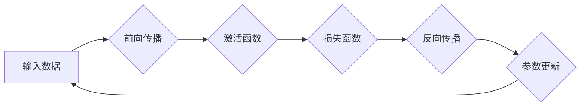

                 

## AutoGrad机制：深度学习框架的核心

> 关键词：自动微分、AutoGrad、深度学习、梯度下降、反向传播、神经网络、机器学习

## 1. 背景介绍

深度学习近年来取得了令人瞩目的成就，在图像识别、自然语言处理、语音识别等领域展现出强大的能力。这些成就离不开深度学习框架的支撑，而自动微分机制（AutoGrad）是深度学习框架的核心之一。

传统的机器学习算法通常依赖于手工计算梯度，这对于复杂的模型来说非常繁琐且容易出错。AutoGrad机制通过自动计算梯度，极大地简化了深度学习模型的训练过程，使其成为深度学习发展的重要驱动力。

## 2. 核心概念与联系

AutoGrad机制的核心思想是利用链式法则自动计算梯度。它将深度学习模型看作一个复杂的函数，并将每个操作（如加法、乘法、激活函数等）视为一个函数的组成部分。通过对每个操作的梯度进行链式求导，最终可以得到整个模型的梯度。

**AutoGrad机制流程图**



**核心概念:**

* **前向传播:** 将输入数据通过模型层层传递，最终得到输出结果。
* **反向传播:** 从输出结果开始，沿着模型的计算路径反向传播，计算每个操作的梯度。
* **链式法则:** 用于计算复合函数的导数，在AutoGrad机制中用于计算每个操作的梯度。
* **梯度下降:** 利用计算出的梯度更新模型参数，使其朝着最小化损失函数的方向调整。

## 3. 核心算法原理 & 具体操作步骤

### 3.1  算法原理概述

AutoGrad机制的核心算法原理是基于链式法则的自动微分。它通过记录每个操作的输入和输出，以及每个操作的梯度信息，实现对整个模型的梯度自动计算。

### 3.2  算法步骤详解

1. **前向传播:** 将输入数据通过模型层层传递，计算每个操作的输出值。
2. **记录梯度信息:** 在每个操作中记录输入值和输出值，以及相应的梯度信息。
3. **反向传播:** 从输出结果开始，沿着模型的计算路径反向传播，利用链式法则计算每个操作的梯度。
4. **参数更新:** 利用计算出的梯度更新模型参数，使其朝着最小化损失函数的方向调整。

### 3.3  算法优缺点

**优点:**

* **自动计算梯度:** 简化了深度学习模型的训练过程，避免了手工计算梯度的繁琐和错误。
* **灵活性:** 可以应用于各种类型的深度学习模型，包括卷积神经网络、循环神经网络等。
* **效率:** 由于利用了硬件加速，AutoGrad机制可以实现高效的梯度计算。

**缺点:**

* **内存消耗:** 记录每个操作的梯度信息需要消耗一定的内存。
* **计算复杂度:** 对于非常深的模型，反向传播过程的计算复杂度可能会很高。

### 3.4  算法应用领域

AutoGrad机制广泛应用于深度学习领域，例如：

* **图像识别:** 用于训练卷积神经网络，识别图像中的物体、场景等。
* **自然语言处理:** 用于训练循环神经网络，进行文本分类、机器翻译、情感分析等任务。
* **语音识别:** 用于训练循环神经网络，识别语音中的单词、句子等。

## 4. 数学模型和公式 & 详细讲解 & 举例说明

### 4.1  数学模型构建

假设我们有一个深度学习模型，其输出为 $y$，输入为 $x$，参数为 $\theta$。我们可以用以下数学模型来表示模型：

$$y = f(x, \theta)$$

其中，$f$ 是模型的函数，它由多个操作组成。

### 4.2  公式推导过程

我们的目标是找到最优的参数 $\theta$，使得模型的输出 $y$ 与真实值 $y^*$ 的误差最小。我们可以使用损失函数 $L(y, y^*)$ 来衡量误差。

为了找到最优参数，我们需要利用梯度下降算法。梯度下降算法的核心思想是沿着梯度方向更新参数，使其朝着最小化损失函数的方向调整。

梯度的计算可以使用链式法则来实现。链式法则指出，复合函数的导数等于各个函数导数的乘积。

在AutoGrad机制中，我们通过记录每个操作的梯度信息，并利用链式法则进行反向传播，最终可以得到整个模型的梯度。

### 4.3  案例分析与讲解

假设我们有一个简单的线性模型，其输出为 $y = wx + b$，其中 $w$ 和 $b$ 是模型的参数。

如果我们使用均方误差损失函数，则损失函数为：

$$L(y, y^*) = \frac{1}{2}(y - y^*)^2$$

根据链式法则，我们可以计算出模型参数 $w$ 和 $b$ 的梯度：

$$\frac{\partial L}{\partial w} = (y - y^*)x$$

$$\frac{\partial L}{\partial b} = (y - y^*)$$

利用这些梯度信息，我们可以使用梯度下降算法更新模型参数：

$$w = w - \alpha \frac{\partial L}{\partial w}$$

$$b = b - \alpha \frac{\partial L}{\partial b}$$

其中，$\alpha$ 是学习率。

## 5. 项目实践：代码实例和详细解释说明

### 5.1  开发环境搭建

为了演示AutoGrad机制，我们可以使用Python语言和TensorFlow框架进行实现。

首先，我们需要安装TensorFlow框架：

```bash
pip install tensorflow
```

### 5.2  源代码详细实现

```python
import tensorflow as tf

# 定义模型
model = tf.keras.Sequential([
    tf.keras.layers.Dense(10, activation='relu', input_shape=(10,)),
    tf.keras.layers.Dense(1)
])

# 定义损失函数和优化器
loss_fn = tf.keras.losses.MeanSquaredError()
optimizer = tf.keras.optimizers.Adam(learning_rate=0.01)

# 定义训练数据
x_train = tf.random.normal((100, 10))
y_train = tf.random.normal((100, 1))

# 训练模型
for epoch in range(10):
    with tf.GradientTape() as tape:
        y_pred = model(x_train)
        loss = loss_fn(y_train, y_pred)
    
    gradients = tape.gradient(loss, model.trainable_variables)
    optimizer.apply_gradients(zip(gradients, model.trainable_variables))

    print(f'Epoch {epoch+1}, Loss: {loss.numpy()}')
```

### 5.3  代码解读与分析

这段代码定义了一个简单的深度学习模型，并使用AutoGrad机制进行训练。

* `tf.keras.Sequential` 用于定义模型的层级结构。
* `tf.keras.layers.Dense` 用于定义全连接层。
* `tf.keras.losses.MeanSquaredError` 用于定义均方误差损失函数。
* `tf.keras.optimizers.Adam` 用于定义Adam优化器。
* `tf.GradientTape` 用于记录梯度信息。
* `tape.gradient` 用于计算梯度。
* `optimizer.apply_gradients` 用于更新模型参数。

### 5.4  运行结果展示

运行这段代码后，会输出每个epoch的损失值，随着训练的进行，损失值会逐渐降低，表明模型正在学习。

## 6. 实际应用场景

AutoGrad机制在深度学习领域有着广泛的应用场景，例如：

* **图像识别:** 用于训练卷积神经网络，识别图像中的物体、场景等。
* **自然语言处理:** 用于训练循环神经网络，进行文本分类、机器翻译、情感分析等任务。
* **语音识别:** 用于训练循环神经网络，识别语音中的单词、句子等。
* **推荐系统:** 用于训练深度学习模型，推荐用户感兴趣的内容。
* **药物发现:** 用于训练深度学习模型，预测药物的活性。

### 6.4  未来应用展望

随着深度学习技术的不断发展，AutoGrad机制的应用场景将会更加广泛。例如，它可以应用于：

* **自动驾驶:** 用于训练深度学习模型，实现自动驾驶功能。
* **医疗诊断:** 用于训练深度学习模型，辅助医生进行诊断。
* **金融预测:** 用于训练深度学习模型，预测金融市场趋势。

## 7. 工具和资源推荐

### 7.1  学习资源推荐

* **深度学习入门书籍:**
    * 《深度学习》 by Ian Goodfellow, Yoshua Bengio, and Aaron Courville
    * 《动手学深度学习》 by Aurélien Géron
* **在线课程:**
    * Coursera: Deep Learning Specialization
    * Udacity: Deep Learning Nanodegree
* **博客和网站:**
    * TensorFlow Blog: https://blog.tensorflow.org/
    * PyTorch Blog: https://pytorch.org/blog/

### 7.2  开发工具推荐

* **TensorFlow:** https://www.tensorflow.org/
* **PyTorch:** https://pytorch.org/
* **Keras:** https://keras.io/

### 7.3  相关论文推荐

* **Autograd: Automatic Differentiation in Python** by J. Bergstra, O. Breuleux, F. Bastien, P. Lamblin, R. Pascanu, G. Desjardins, Y. Bengio
* **On the Importance of Initialization and Momentum in Deep Learning** by K. He, X. Zhang, S. Ren, J. Sun

## 8. 总结：未来发展趋势与挑战

### 8.1  研究成果总结

AutoGrad机制是深度学习框架的核心之一，它极大地简化了深度学习模型的训练过程，推动了深度学习技术的快速发展。

### 8.2  未来发展趋势

未来，AutoGrad机制将会朝着以下方向发展：

* **更高效的计算:** 研究更有效的自动微分算法，降低计算成本。
* **更广泛的应用:** 将AutoGrad机制应用于更多领域，例如自动驾驶、医疗诊断等。
* **更强大的模型:** 支持训练更深、更复杂的深度学习模型。

### 8.3  面临的挑战

AutoGrad机制也面临一些挑战，例如：

* **内存消耗:** 记录每个操作的梯度信息需要消耗一定的内存，对于非常深的模型，内存消耗可能会成为瓶颈。
* **计算复杂度:** 对于非常深的模型，反向传播过程的计算复杂度可能会很高。
* **可解释性:** 深度学习模型的决策过程往往难以解释，如何提高AutoGrad机制的可解释性是一个重要的研究方向。

### 8.4  研究展望

未来，我们需要继续研究AutoGrad机制，使其更加高效、强大、可解释，从而推动深度学习技术的进一步发展。

## 9. 附录：常见问题与解答

**Q1: AutoGrad机制是如何实现的？**

A1: AutoGrad机制通过记录每个操作的输入和输出，以及相应的梯度信息，并利用链式法则进行反向传播，最终可以得到整个模型的梯度。

**Q2: AutoGrad机制有哪些优点？**

A2: AutoGrad机制的优点包括：

* 自动计算梯度，简化了深度学习模型的训练过程。
* 灵活性，可以应用于各种类型的深度学习模型。
* 效率，由于利用了硬件加速，AutoGrad机制可以实现高效的梯度计算。

**Q3: AutoGrad机制有哪些缺点？**

A3: AutoGrad机制的缺点包括：

* 内存消耗，记录每个操作的梯度信息需要消耗一定的内存。
* 计算复杂度，对于非常深的模型，反向传播过程的计算复杂度可能会很高。


作者：禅与计算机程序设计艺术 / Zen and the Art of Computer Programming<end_of_turn>

