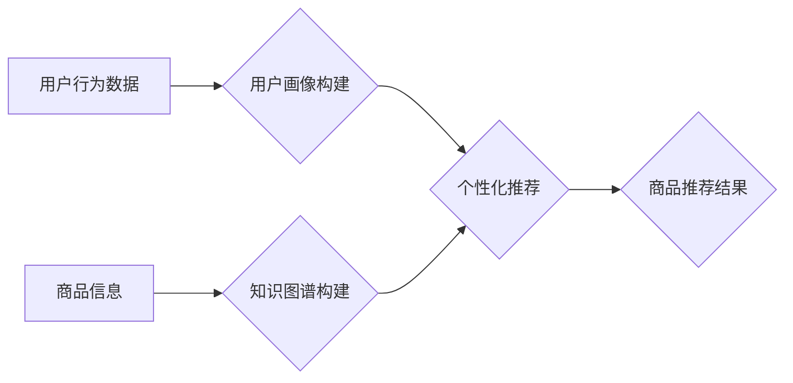

                 

## DayDream：从搜索走向发现的电商新星

> 关键词：电商推荐、深度学习、知识图谱、用户画像、个性化搜索、自然语言处理、多模态融合

### 1. 背景介绍

电子商务行业近年来发展迅速，用户对商品的搜索和发现需求也日益增长。传统的基于关键词的搜索方式已经难以满足用户个性化、多元化的需求。如何从海量商品中精准推荐用户感兴趣的商品，并提供更丰富的商品信息和购物体验，成为电商平台亟需解决的关键问题。

DayDream 应运而生，它旨在通过深度学习、知识图谱、用户画像等技术，实现从搜索走向发现的电商新星。DayDream 不仅仅是简单的商品推荐系统，它更像是一个智能购物助手，能够理解用户的需求，并提供个性化、精准的商品推荐和购物体验。

### 2. 核心概念与联系

DayDream 的核心概念包括：

* **深度学习:** 利用深度神经网络对用户行为、商品特征等进行学习和分析，挖掘潜在的关联性和模式。
* **知识图谱:** 建立商品、品牌、用户等实体之间的关系网络，丰富商品信息，并支持更智能的商品关联和推荐。
* **用户画像:** 通过用户行为数据、偏好信息等，构建用户画像，精准理解用户的需求和兴趣。
* **个性化推荐:** 基于用户画像和商品特征，为每个用户提供个性化的商品推荐。
* **多模态融合:** 结合文本、图片、视频等多种数据源，提供更全面的商品信息和购物体验。

**核心架构流程图:**



### 3. 核心算法原理 & 具体操作步骤

#### 3.1  算法原理概述

DayDream 的核心算法基于深度学习和推荐系统技术，主要包括以下几个方面：

* **协同过滤:** 基于用户历史行为数据，预测用户对商品的喜好。
* **内容过滤:** 基于商品特征和用户偏好，推荐与用户兴趣相符的商品。
* **混合推荐:** 结合协同过滤和内容过滤，提高推荐的准确性和个性化程度。
* **深度学习推荐:** 利用深度神经网络，学习用户行为和商品特征之间的复杂关系，实现更精准的推荐。

#### 3.2  算法步骤详解

1. **数据收集和预处理:** 收集用户行为数据、商品信息等数据，并进行清洗、转换、特征提取等预处理工作。
2. **用户画像构建:** 利用机器学习算法，对用户行为数据进行分析，构建用户画像，包括用户兴趣、偏好、购买习惯等信息。
3. **知识图谱构建:** 建立商品、品牌、用户等实体之间的关系网络，丰富商品信息，并支持更智能的商品关联和推荐。
4. **推荐模型训练:** 利用深度学习算法，训练推荐模型，并根据用户画像和商品特征进行个性化推荐。
5. **推荐结果展示:** 将推荐结果以列表、卡片等形式展示给用户，并提供商品详情、评价等信息。

#### 3.3  算法优缺点

**优点:**

* **精准度高:** 基于深度学习和知识图谱，能够挖掘用户需求和商品特征之间的复杂关系，实现更精准的推荐。
* **个性化强:** 基于用户画像，能够为每个用户提供个性化的商品推荐，提升用户体验。
* **可扩展性强:** 能够灵活扩展新的数据源和推荐算法，适应不断变化的市场需求。

**缺点:**

* **数据依赖性强:** 需要大量的用户行为数据和商品信息才能训练出有效的推荐模型。
* **计算资源消耗大:** 深度学习算法训练需要大量的计算资源，成本较高。
* **冷启动问题:** 对新用户和新商品的推荐效果可能较差。

#### 3.4  算法应用领域

DayDream 的核心算法可以应用于电商平台、社交媒体、内容推荐等多个领域，例如：

* **商品推荐:** 为用户推荐感兴趣的商品，提高转化率。
* **内容推荐:** 为用户推荐相关的内容，提升用户粘性。
* **个性化营销:** 根据用户画像，进行精准的营销推广。
* **用户画像分析:** 挖掘用户行为数据，构建用户画像，了解用户需求。

### 4. 数学模型和公式 & 详细讲解 & 举例说明

#### 4.1  数学模型构建

DayDream 的推荐模型可以基于协同过滤、内容过滤或深度学习等算法构建。

**协同过滤模型:**

协同过滤模型基于用户的历史行为数据，预测用户对商品的喜好。

**用户-商品评分矩阵:**

$$
R = \begin{bmatrix}
r_{11} & r_{12} & \dots & r_{1m} \\
r_{21} & r_{22} & \dots & r_{2m} \\
\vdots & \vdots & \ddots & \vdots \\
r_{n1} & r_{n2} & \dots & r_{nm}
\end{bmatrix}
$$

其中，$r_{ij}$ 表示用户 $i$ 对商品 $j$ 的评分。

**预测评分公式:**

$$
\hat{r}_{ij} = \bar{r}_i + \frac{\sum_{k \in N(i)} (r_{ik} - \bar{r}_i) (r_{jk} - \bar{r}_j)}{\sum_{k \in N(i)} (r_{ik} - \bar{r}_i)^2}
$$

其中，$\bar{r}_i$ 和 $\bar{r}_j$ 分别表示用户 $i$ 和商品 $j$ 的平均评分，$N(i)$ 表示与用户 $i$ 有评分记录的商品集合。

**内容过滤模型:**

内容过滤模型基于商品特征和用户偏好，推荐与用户兴趣相符的商品。

**商品特征向量:**

$$
x_j = \begin{bmatrix}
x_{j1} & x_{j2} & \dots & x_{jd}
\end{bmatrix}
$$

其中，$x_{jd}$ 表示商品 $j$ 的第 $d$ 个特征值。

**用户偏好向量:**

$$
u_i = \begin{bmatrix}
u_{i1} & u_{i2} & \dots & u_{id}
\end{bmatrix}
$$

其中，$u_{id}$ 表示用户 $i$ 对第 $d$ 个特征的偏好值。

**相似度计算公式:**

$$
sim(i, j) = \frac{u_i \cdot x_j}{\|u_i\| \|x_j\|}
$$

其中，$\cdot$ 表示向量点积，$\|u_i\|$ 和 $\|x_j\|$ 分别表示用户 $i$ 和商品 $j$ 的特征向量长度。

#### 4.2  公式推导过程

上述公式的推导过程涉及到线性代数、概率统计等数学知识，具体推导过程可以参考相关机器学习和推荐系统教材。

#### 4.3  案例分析与讲解

**举例说明:**

假设有一个电商平台，用户 $A$ 喜欢购买运动鞋，用户 $B$ 喜欢购买篮球。

* **协同过滤:** 如果用户 $A$ 和用户 $B$ 都购买了同一款篮球鞋，那么协同过滤模型会认为用户 $A$ 也可能喜欢篮球，并推荐篮球相关的商品给用户 $A$。
* **内容过滤:** 如果商品 $X$ 是运动鞋，商品 $Y$ 是篮球，并且商品 $X$ 和商品 $Y$ 都属于“运动用品”类别，那么内容过滤模型会认为用户 $A$ 可能也对商品 $Y$ 感兴趣，并推荐商品 $Y$ 给用户 $A$。

### 5. 项目实践：代码实例和详细解释说明

#### 5.1  开发环境搭建

DayDream 项目可以使用 Python 语言开发，并结合 TensorFlow、PyTorch 等深度学习框架。

**开发环境搭建步骤:**

1. 安装 Python 语言和相关库。
2. 安装 TensorFlow 或 PyTorch 深度学习框架。
3. 设置开发环境变量，配置深度学习框架。

#### 5.2  源代码详细实现

DayDream 的源代码实现涉及到数据预处理、模型训练、推荐结果展示等多个模块。

**代码示例:**

```python
# 数据预处理
# ...

# 模型训练
model = tf.keras.Sequential([
    tf.keras.layers.Embedding(vocab_size, embedding_dim),
    tf.keras.layers.LSTM(units),
    tf.keras.layers.Dense(num_classes, activation='softmax')
])

model.compile(optimizer='adam',
              loss='categorical_crossentropy',
              metrics=['accuracy'])

model.fit(X_train, y_train, epochs=10)

# 推荐结果展示
# ...
```

#### 5.3  代码解读与分析

* 数据预处理模块负责对用户行为数据和商品信息进行清洗、转换、特征提取等操作。
* 模型训练模块使用 TensorFlow 或 PyTorch 框架，构建深度学习模型，并进行模型训练。
* 推荐结果展示模块将训练好的模型应用于新的用户数据，并根据模型预测结果，展示推荐商品给用户。

#### 5.4  运行结果展示

DayDream 的运行结果可以包括推荐商品列表、推荐商品的评分、推荐商品的点击率等指标。

### 6. 实际应用场景

DayDream 可以应用于各种电商平台，例如：

* **服装电商:** 为用户推荐个性化的服装搭配，提高用户购买意愿。
* **美食电商:** 为用户推荐附近的餐厅和菜品，提升用户用餐体验。
* **旅游电商:** 为用户推荐个性化的旅游路线和景点，提升用户旅行体验。

#### 6.4  未来应用展望

DayDream 未来可以进一步发展，例如：

* **多模态融合:** 结合文本、图片、视频等多种数据源，提供更全面的商品信息和购物体验。
* **个性化营销:** 根据用户画像，进行精准的营销推广，提升营销效果。
* **智能客服:** 利用自然语言处理技术，构建智能客服系统，为用户提供更便捷的购物服务。

### 7. 工具和资源推荐

#### 7.1  学习资源推荐

* **书籍:**
    * 《推荐系统实践》
    * 《深度学习》
* **在线课程:**
    * Coursera: Machine Learning
    * Udacity: Deep Learning Nanodegree
* **博客:**
    * Towards Data Science
    * Machine Learning Mastery

#### 7.2  开发工具推荐

* **Python:** 
    * TensorFlow
    * PyTorch
    * Scikit-learn
* **数据库:**
    * MySQL
    * MongoDB

#### 7.3  相关论文推荐

* **Collaborative Filtering for Implicit Feedback Datasets**
* **Deep Learning for Recommender Systems**
* **Knowledge Graph Embedding: A Survey**

### 8. 总结：未来发展趋势与挑战

#### 8.1  研究成果总结

DayDream 的研究成果表明，深度学习、知识图谱和用户画像等技术可以有效提升电商平台的商品推荐效果，并为用户提供更个性化、精准的购物体验。

#### 8.2  未来发展趋势

未来，DayDream 将朝着以下方向发展：

* **多模态融合:** 结合更多数据源，提供更全面的商品信息和购物体验。
* **个性化定制:** 为用户提供更个性化的商品推荐和购物服务。
* **智能化决策:** 利用人工智能技术，辅助用户进行商品选择和购买决策。

#### 8.3  面临的挑战

DayDream 的发展也面临着一些挑战，例如：

* **数据隐私保护:** 如何保护用户隐私数据，是电商平台需要认真考虑的问题。
* **算法公平性:** 如何避免算法产生偏见，确保推荐结果公平公正，也是一个重要的挑战。
* **技术可解释性:** 深度学习模型的决策过程往往难以解释，如何提高算法的可解释性，也是一个需要解决的问题。

#### 8.4  研究展望

未来，我们将继续深入研究 DayDream 的核心技术，并探索其在更多领域的应用，为用户提供更智能、更便捷的购物体验。

### 9. 附录：常见问题与解答

**常见问题:**

* **DayDream 的推荐结果如何保证准确性？**

DayDream 的推荐结果基于深度学习和推荐系统技术，并结合用户画像和商品特征，通过不断学习和优化，提高推荐的准确性和个性化程度。

* **DayDream 如何处理新用户和新商品的推荐问题？**

DayDream 可以利用协同过滤和内容过滤等算法，对新用户和新商品进行推荐，并通过用户反馈不断完善推荐模型。

* **DayDream 如何保证用户数据隐私安全？**

DayDream 严格遵守数据隐私保护政策，并采取相应的技术措施，确保用户数据的安全和隐私。


作者：禅与计算机程序设计艺术 / Zen and the Art of Computer Programming 
<end_of_turn>

