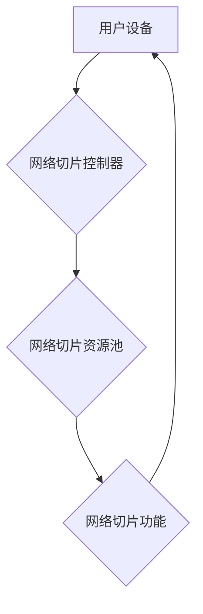

                 

## 5G网络切片：为垂直行业定制网络服务

> 关键词：5G网络切片、网络虚拟化、SDN、NFV、垂直行业、定制化网络、边缘计算、低延迟、高可靠性

## 1. 背景介绍

随着5G技术的快速发展和部署，其高带宽、低延迟、高可靠性等特性为各行各业带来了前所未有的机遇。然而，传统的单一网络架构难以满足不同行业对网络性能、安全性和功能定制化的需求。为了解决这一问题，5G网络切片应运而生。

网络切片技术将物理网络划分为多个逻辑隔离的网络子网，每个子网可以独立配置和管理，满足特定应用场景的需求。这使得5G网络能够更加灵活、高效地服务于不同行业，例如工业自动化、智慧医疗、无人驾驶等。

## 2. 核心概念与联系

### 2.1 网络切片概念

网络切片是指将物理网络资源划分为多个逻辑隔离的网络子网，每个子网称为一个切片。每个切片可以独立配置网络参数，例如带宽、延迟、安全性等，以满足特定应用场景的需求。

### 2.2 网络虚拟化

网络虚拟化是网络切片的基础技术。它通过软件定义网络（SDN）和网络功能虚拟化（NFV）技术，将传统的硬件设备抽象为虚拟资源，从而实现网络资源的灵活配置和管理。

* **SDN（软件定义网络）**：SDN将网络控制平面和数据平面分离，将网络控制逻辑集中到一个中央控制器中，通过软件定义网络流量转发规则，实现网络资源的动态配置和管理。
* **NFV（网络功能虚拟化）**：NFV将传统的硬件网络功能虚拟化成软件应用程序，运行在标准服务器上，从而实现网络功能的灵活部署和扩展。

### 2.3 切片架构

网络切片架构通常由以下几个主要组件组成：

* **网络切片控制器（Slice Controller）**：负责管理和配置网络切片资源，包括网络带宽、延迟、安全性等。
* **网络切片功能（Slice Function）**：负责提供特定应用场景所需的网络功能，例如防火墙、负载均衡、QoS等。
* **网络切片资源池（Slice Resource Pool）**：包含物理网络资源，例如网络设备、服务器、存储等，供切片控制器分配和管理。
* **用户设备（User Equipment）**：连接到网络切片并使用网络服务的终端设备。

**Mermaid 流程图**



## 3. 核心算法原理 & 具体操作步骤

### 3.1 算法原理概述

网络切片的核心算法主要包括资源分配算法、流量调度算法和网络安全算法等。

* **资源分配算法**：负责根据应用需求分配网络资源，例如带宽、延迟、安全性等。常见的资源分配算法包括优先级算法、拍卖算法和协商算法等。
* **流量调度算法**：负责根据应用需求调度网络流量，确保不同应用能够获得所需的网络性能。常见的流量调度算法包括优先级调度、公平调度和最短路径调度等。
* **网络安全算法**：负责保障网络切片的安全性和可靠性，例如身份认证、数据加密和入侵检测等。常见的网络安全算法包括TLS/SSL、IPsec和VPN等。

### 3.2 算法步骤详解

以资源分配算法为例，其具体操作步骤如下：

1. **需求收集**: 收集用户应用对网络资源的需求，例如带宽、延迟、安全性等。
2. **资源评估**: 评估网络资源池中的可用资源，例如带宽、延迟、安全性等。
3. **资源匹配**: 根据用户需求和网络资源评估结果，匹配合适的网络资源。
4. **资源分配**: 将匹配的网络资源分配给用户应用。
5. **资源监控**: 监控分配给用户应用的网络资源使用情况，并根据实际需求进行调整。

### 3.3 算法优缺点

* **优点**: 能够根据应用需求灵活分配网络资源，提高网络资源利用率，满足不同应用场景的需求。
* **缺点**: 算法复杂度较高，需要考虑多个因素，例如网络负载、用户需求、资源可用性等，算法设计和实现难度较大。

### 3.4 算法应用领域

网络切片算法广泛应用于各种行业，例如：

* **工业自动化**: 为工业自动化应用提供低延迟、高可靠性的网络服务。
* **智慧医疗**: 为远程医疗、远程手术等应用提供安全、可靠的网络服务。
* **无人驾驶**: 为无人驾驶汽车提供实时数据传输和控制服务。

## 4. 数学模型和公式 & 详细讲解 & 举例说明

### 4.1 数学模型构建

网络切片资源分配算法可以采用数学模型进行建模，例如线性规划模型、整数规划模型等。

**线性规划模型**

假设网络资源池中有 $m$ 种资源，用户应用有 $n$ 个，每个资源有 $r_i$ 的容量，每个应用对资源 $i$ 的需求为 $d_{ij}$，则资源分配问题可以表示为以下线性规划模型：

$$
\begin{aligned}
\text{目标函数} &: \text{最大化} \sum_{j=1}^{n} \text{满足需求的应用数} \\
\text{约束条件} &: \\
& \sum_{j=1}^{n} d_{ij} \leq r_i, \quad i = 1, 2, ..., m \\
& x_{ij} \in \{0, 1\}, \quad j = 1, 2, ..., n, i = 1, 2, ..., m
\end{aligned}
$$

其中，$x_{ij}$ 为二元变量，表示应用 $j$ 是否使用资源 $i$。

### 4.2 公式推导过程

线性规划模型的目标函数是最大化满足需求的应用数，约束条件是每个资源的利用率不能超过其容量。

### 4.3 案例分析与讲解

假设网络资源池中有两种资源，带宽和延迟，分别有 10Gbps 和 1ms 的容量。有两个应用，应用 A 需要 5Gbps 的带宽和 0.5ms 的延迟，应用 B 需要 3Gbps 的带宽和 0.8ms 的延迟。

根据线性规划模型，可以求解出满足应用需求的资源分配方案。

## 5. 项目实践：代码实例和详细解释说明

### 5.1 开发环境搭建

* 操作系统：Ubuntu 20.04
* 虚拟机软件：VirtualBox
* 网络虚拟化软件：Open vSwitch
* SDN控制器：OpenDaylight

### 5.2 源代码详细实现

```python
# 资源分配算法示例代码

class ResourceAllocator:
    def __init__(self, resources, demands):
        self.resources = resources
        self.demands = demands

    def allocate_resources(self):
        # 算法实现
        pass

# 资源池示例
resources = {
    "bandwidth": 10,
    "latency": 1
}

# 应用需求示例
demands = [
    {"bandwidth": 5, "latency": 0.5},
    {"bandwidth": 3, "latency": 0.8}
]

# 资源分配器实例
allocator = ResourceAllocator(resources, demands)

# 分配资源
allocated_resources = allocator.allocate_resources()

# 打印分配结果
print(allocated_resources)
```

### 5.3 代码解读与分析

* `ResourceAllocator` 类负责资源分配算法的实现。
* `resources` 和 `demands` 属性分别存储网络资源池和应用需求。
* `allocate_resources()` 方法实现资源分配算法，根据应用需求和网络资源评估结果，分配合适的网络资源。

### 5.4 运行结果展示

运行上述代码，可以得到分配给每个应用的资源信息。

## 6. 实际应用场景

### 6.1 工业自动化

在工业自动化场景中，网络切片可以为工业控制系统提供低延迟、高可靠性的网络服务，确保生产过程的稳定性和安全性。例如，可以为机器人控制系统、传感器网络和工业物联网设备提供独立的网络切片，满足其对实时性和可靠性的需求。

### 6.2 智慧医疗

在智慧医疗场景中，网络切片可以为远程医疗、远程手术等应用提供安全、可靠的网络服务，保障患者的健康安全。例如，可以为远程医疗平台提供一个隔离的网络切片，确保患者数据的安全传输和隐私保护。

### 6.3 无人驾驶

在无人驾驶场景中，网络切片可以为无人驾驶汽车提供实时数据传输和控制服务，确保车辆的安全性。例如，可以为无人驾驶汽车的感知系统、决策系统和控制系统提供独立的网络切片，满足其对低延迟和高可靠性的需求。

### 6.4 未来应用展望

随着5G技术的不断发展和应用场景的不断拓展，网络切片技术将有更广泛的应用前景，例如：

* **边缘计算**: 为边缘计算应用提供定制化的网络服务，降低数据传输延迟，提高应用性能。
* **虚拟现实/增强现实**: 为虚拟现实和增强现实应用提供低延迟、高带宽的网络服务，提升用户体验。
* **工业互联网**: 为工业互联网应用提供安全、可靠、可扩展的网络服务，推动工业数字化转型。

## 7. 工具和资源推荐

### 7.1 学习资源推荐

* **书籍**:
    * 《5G网络切片技术》
    * 《SDN与NFV》
* **在线课程**:
    * Coursera: SDN and NFV
    * Udemy: 5G Network Slicing

### 7.2 开发工具推荐

* **OpenDaylight**: 开源SDN控制器
* **Open vSwitch**: 开源网络虚拟化软件
* **Kubernetes**: 开源容器编排平台

### 7.3 相关论文推荐

* **Network Slicing: A Key Technology for 5G and Beyond**
* **A Survey on Network Slicing for 5G and Beyond**

## 8. 总结：未来发展趋势与挑战

### 8.1 研究成果总结

网络切片技术是5G网络的重要组成部分，能够满足不同行业对网络性能、安全性和功能定制化的需求。

### 8.2 未来发展趋势

未来网络切片技术将朝着以下几个方向发展：

* **自动化**: 实现网络切片配置和管理的自动化，提高效率和灵活性。
* **智能化**: 利用人工智能技术，实现网络切片资源的智能分配和优化。
* **边缘化**: 将网络切片部署到边缘网络，降低数据传输延迟，提高应用性能。

### 8.3 面临的挑战

网络切片技术还面临一些挑战，例如：

* **标准化**: 缺乏统一的网络切片标准，导致不同厂商产品互不兼容。
* **安全**: 网络切片技术需要保障不同切片之间的安全隔离，防止数据泄露和攻击。
* **管理**: 网络切片管理复杂，需要高效的管理工具和平台。

### 8.4 研究展望

未来，我们需要继续研究和探索网络切片技术，解决其面临的挑战，推动其在各行各业的广泛应用。

## 9. 附录：常见问题与解答

* **什么是网络切片？**

网络切片是指将物理网络资源划分为多个逻辑隔离的网络子网，每个子网称为一个切片。每个切片可以独立配置和管理，以满足特定应用场景的需求。

* **网络切片有哪些优势？**

网络切片能够满足不同应用对网络性能、安全性和功能定制化的需求，提高网络资源利用率，降低运营成本。

* **网络切片有哪些应用场景？**

网络切片广泛应用于工业自动化、智慧医疗、无人驾驶等行业。

* **网络切片技术有哪些挑战？**

网络切片技术面临标准化、安全和管理等挑战。


作者：禅与计算机程序设计艺术 / Zen and the Art of Computer Programming 
<end_of_turn>

