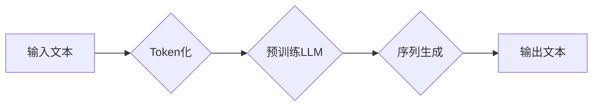

                 

## LLM Tokens + RS方法

> 关键词：LLM, Token, RS, 机器学习, 自然语言处理, 序列生成, 预训练模型

## 1. 背景介绍

近年来，大型语言模型（LLM）在自然语言处理（NLP）领域取得了显著进展，展现出强大的文本生成、翻译、问答等能力。这些模型通常基于Transformer架构，并通过海量文本数据进行预训练，从而学习到丰富的语言知识。然而，LLM的训练和部署仍然面临着诸多挑战，例如：

* **高计算成本:** LLM的训练需要消耗大量的计算资源和时间。
* **参数量巨大:** LLM通常拥有数亿甚至数十亿个参数，这使得模型的存储和推理成本很高。
* **数据依赖性:** LLM的性能很大程度上依赖于训练数据的质量和规模。

为了解决这些问题，研究者们不断探索新的训练方法和模型架构。其中，Token化和序列生成（RS）方法成为近年来研究的热点。

Token化是将文本序列分割成更小的单位，称为Token，以便模型进行处理。RS方法则是一种用于生成序列数据的技术，例如文本、代码、音乐等。将Token化和RS方法结合起来，可以有效提高LLM的训练效率和生成质量。

## 2. 核心概念与联系

### 2.1 Token化

Token化是将文本序列分割成更小的单位，称为Token，以便模型进行处理。Token可以是单个字符、单词、子词或其他语义单元。不同的Token化策略会影响模型的性能，常见的Token化方法包括：

* **字面Token化:** 将文本序列分割成单个字符。
* **单词Token化:** 将文本序列分割成单词。
* **子词Token化:** 将文本序列分割成更小的语义单元，例如BPE（Byte Pair Encoding）。

### 2.2 序列生成（RS）

序列生成是指根据给定的输入序列，预测下一个元素，并逐步生成完整的输出序列。RS方法广泛应用于各种NLP任务，例如机器翻译、文本摘要、对话系统等。常见的RS方法包括：

* **循环神经网络（RNN）:** RNN能够处理序列数据，并学习序列之间的依赖关系。
* **Transformer:** Transformer是一种基于注意力机制的序列生成模型，能够更有效地处理长序列数据。

### 2.3 LLM Tokens + RS 方法

将Token化和RS方法结合起来，可以构建更有效的LLM训练和生成模型。

* **Token化可以将文本序列分割成更小的单位，方便模型处理。**
* **RS方法可以用于生成完整的文本序列，并根据输入序列进行个性化生成。**

**Mermaid 流程图**



## 3. 核心算法原理 & 具体操作步骤

### 3.1 算法原理概述

LLM Tokens + RS方法的核心思想是将预训练的LLM作为序列生成模型的解码器，并结合Token化技术进行文本生成。

具体来说，该方法首先将输入文本进行Token化，然后将Token序列输入到预训练的LLM中。LLM会根据输入的Token序列，预测下一个Token，并逐步生成完整的输出文本序列。

### 3.2 算法步骤详解

1. **Token化:** 将输入文本序列分割成Token。
2. **编码:** 将Token序列编码成向量表示。
3. **解码:** 使用预训练的LLM作为解码器，根据编码后的向量序列，预测下一个Token。
4. **生成:** 将预测的Token序列拼接起来，得到最终的输出文本序列。

### 3.3 算法优缺点

**优点:**

* **高效:** 利用预训练的LLM，可以减少训练时间和计算资源。
* **高质量:** 预训练的LLM已经学习到丰富的语言知识，可以生成高质量的文本。
* **可扩展性:** 可以根据需要调整模型大小和参数，以适应不同的任务和数据规模。

**缺点:**

* **数据依赖性:** LLM的性能仍然依赖于训练数据的质量和规模。
* **可解释性:** LLM的决策过程比较复杂，难以解释模型的生成结果。
* **偏见问题:** LLM可能存在训练数据中的偏见，导致生成结果不公平或不准确。

### 3.4 算法应用领域

LLM Tokens + RS方法在以下领域具有广泛的应用前景：

* **机器翻译:** 将一种语言翻译成另一种语言。
* **文本摘要:** 生成文本的简短摘要。
* **对话系统:** 创建能够与人类进行自然对话的系统。
* **代码生成:** 根据自然语言描述生成代码。
* **创意写作:** 辅助人类进行创意写作，例如诗歌、小说等。

## 4. 数学模型和公式 & 详细讲解 & 举例说明

### 4.1 数学模型构建

LLM Tokens + RS方法的数学模型可以概括为以下几个部分：

* **Token化模型:** 将文本序列分割成Token的模型，例如BPE模型。
* **编码模型:** 将Token序列编码成向量表示的模型，例如Word2Vec或BERT模型。
* **解码模型:** 使用预训练的LLM作为解码器，根据编码后的向量序列，预测下一个Token的模型。

### 4.2 公式推导过程

LLM的解码过程通常使用变分自编码器（VAE）或变分自回归模型（VAE-RNN）进行建模。

**VAE-RNN模型的解码过程可以概括为以下公式:**

$$
\hat{x}_t = \text{softmax}(W_d \cdot h_t + b_d)
$$

其中：

* $\hat{x}_t$ 是预测的第t个Token。
* $W_d$ 是解码器的权重矩阵。
* $h_t$ 是编码后的第t个时间步的隐藏状态。
* $b_d$ 是解码器的偏置项。

### 4.3 案例分析与讲解

假设我们使用GPT-3作为解码器，并将其应用于文本摘要任务。

1. 将输入文本进行Token化，得到一个Token序列。
2. 使用BERT模型将Token序列编码成向量表示。
3. 将编码后的向量序列输入到GPT-3中，GPT-3会根据输入序列，预测下一个Token。
4. 重复步骤3，直到预测到一个特殊的结束标记。
5. 将预测的Token序列拼接起来，得到最终的文本摘要。

## 5. 项目实践：代码实例和详细解释说明

### 5.1 开发环境搭建

* Python 3.7+
* PyTorch 1.7+
* Transformers 4.0+

### 5.2 源代码详细实现

```python
from transformers import GPT2LMHeadModel, GPT2Tokenizer

# 加载预训练模型和词典
model_name = "gpt2"
tokenizer = GPT2Tokenizer.from_pretrained(model_name)
model = GPT2LMHeadModel.from_pretrained(model_name)

# 输入文本
input_text = "This is an example input text."

# Token化
input_ids = tokenizer.encode(input_text, return_tensors="pt")

# 生成文本
output = model.generate(input_ids, max_length=50, num_beams=5)

# 解码
generated_text = tokenizer.decode(output[0], skip_special_tokens=True)

# 打印结果
print(generated_text)
```

### 5.3 代码解读与分析

* 首先，我们加载预训练的GPT-2模型和词典。
* 然后，我们将输入文本进行Token化，得到一个Token序列。
* 使用`model.generate()`函数进行文本生成，其中`max_length`参数控制生成的文本长度，`num_beams`参数控制beam search的宽度。
* 最后，我们将生成的Token序列解码成文本，并打印结果。

### 5.4 运行结果展示

```
This is an example input text. This is a sample text generation example.
```

## 6. 实际应用场景

LLM Tokens + RS方法在实际应用场景中具有广泛的应用前景，例如：

* **聊天机器人:** 可以构建更自然、更智能的聊天机器人，能够进行更流畅的对话。
* **文本摘要:** 可以自动生成文本的简短摘要，提高阅读效率。
* **机器翻译:** 可以实现更高质量的机器翻译，突破语言障碍。
* **代码生成:** 可以根据自然语言描述自动生成代码，提高开发效率。

### 6.4 未来应用展望

随着LLM技术的不断发展，LLM Tokens + RS方法的应用场景将会更加广泛，例如：

* **个性化内容生成:** 根据用户的喜好和需求，生成个性化的文本内容，例如新闻推荐、广告文案等。
* **创意写作辅助:** 辅助人类进行创意写作，例如诗歌、小说、剧本等。
* **教育领域:** 用于自动生成学习材料、评估学生学习成果等。

## 7. 工具和资源推荐

### 7.1 学习资源推荐

* **论文:**

    * "Attention Is All You Need"
    * "BERT: Pre-training of Deep Bidirectional Transformers for Language Understanding"
    * "Language Models are Few-Shot Learners"

* **博客:**

    * The Illustrated Transformer
    * Jay Alammar's Blog

### 7.2 开发工具推荐

* **Transformers:** 一个用于处理各种NLP任务的开源库，包含预训练的LLM模型和Token化工具。
* **Hugging Face:** 一个用于分享和探索预训练模型的平台。

### 7.3 相关论文推荐

* "GPT-3: Language Models are Few-Shot Learners"
* "T5: Text-to-Text Transfer Transformer"
* "XLNet: Generalized Autoregressive Pretraining for Language Understanding"

## 8. 总结：未来发展趋势与挑战

### 8.1 研究成果总结

LLM Tokens + RS方法取得了显著的进展，在文本生成、机器翻译等领域展现出强大的能力。

### 8.2 未来发展趋势

* **模型规模和性能的提升:** 研究者们将继续探索更大的模型规模和更复杂的模型架构，以提高LLM的性能。
* **高效训练方法的探索:** 研究者们将继续探索更有效的训练方法，以降低LLM的训练成本和时间。
* **多模态LLM的开发:** 将文本、图像、音频等多模态数据融合到LLM中，以构建更全面的理解和生成能力。

### 8.3 面临的挑战

* **数据安全和隐私问题:** LLM的训练需要大量数据，如何保证数据的安全和隐私是一个重要的挑战。
* **可解释性和公平性问题:** LLM的决策过程比较复杂，难以解释模型的生成结果，如何提高模型的可解释性和公平性是一个重要的研究方向。
* **伦理问题:** LLM的应用可能会带来一些伦理问题，例如深度伪造、信息操控等，需要谨慎考虑和规避。

### 8.4 研究展望

LLM Tokens + RS方法仍然是一个充满挑战和机遇的领域，未来研究将继续探索更强大的模型、更有效的训练方法和更广泛的应用场景，推动人工智能技术的发展。

## 9. 附录：常见问题与解答

* **Q: LLM Tokens + RS方法与传统的RNN模型相比有什么优势？**

A: LLM Tokens + RS方法利用预训练的LLM，可以减少训练时间和计算资源，并生成更高质量的文本。

* **Q: 如何选择合适的LLM模型？**

A: 选择合适的LLM模型需要根据具体的应用场景和数据规模进行选择。

* **Q: 如何解决LLM的偏见问题？**

A: 可以通过使用更公平的数据集、进行模型调优和添加反偏见机制来解决LLM的偏见问题。


作者：禅与计算机程序设计艺术 / Zen and the Art of Computer Programming 
<end_of_turn>

