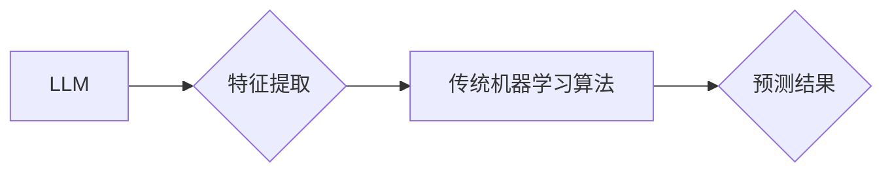

                 

## LLM与传统机器学习算法的结合：AI技术新高峰

> 关键词：大型语言模型 (LLM)、传统机器学习、算法融合、AI应用、深度学习、自然语言处理 (NLP)

## 1. 背景介绍

近年来，人工智能 (AI) 技术取得了飞速发展，其中大型语言模型 (LLM) 的出现可谓是里程碑式的进步。LLM 凭借其强大的文本生成、理解和翻译能力，在自然语言处理 (NLP) 领域展现出令人瞩目的潜力。然而，LLM 训练成本高、数据依赖性强等问题也限制了其更广泛的应用。

与此同时，传统机器学习算法在各个领域已经取得了成功，其成熟的理论基础和高效的训练方法为 AI 技术提供了坚实支撑。将 LLM 与传统机器学习算法相结合，可以弥补各自的不足，从而实现 AI 技术的更深层次发展。

## 2. 核心概念与联系

### 2.1  LLM 简介

大型语言模型 (LLM) 是近年来深度学习领域取得的重大突破之一。它是一种基于 Transformer 架构的深度神经网络，通过训练海量文本数据，学习语言的语法、语义和上下文关系。LLM 能够执行多种自然语言任务，例如文本生成、翻译、问答、摘要等。

### 2.2  传统机器学习算法简介

传统机器学习算法是指在明确定义的特征空间下，通过训练数据学习模型并进行预测的算法。常见的传统机器学习算法包括线性回归、逻辑回归、支持向量机 (SVM)、决策树、随机森林等。这些算法在数据量较小、特征空间相对简单的情况下表现出色。

### 2.3  融合策略

将 LLM 与传统机器学习算法相结合，主要有以下几种策略：

* **特征工程:** 使用 LLM 生成文本特征，作为传统机器学习算法的输入。
* **模型融合:** 将 LLM 和传统机器学习算法的预测结果进行融合，提高整体预测精度。
* **端到端学习:** 将 LLM 和传统机器学习算法集成到一个统一的模型中，实现端到端的训练和预测。

**Mermaid 流程图**



## 3. 核心算法原理 & 具体操作步骤

### 3.1  算法原理概述

本文将以 LLM 生成的文本特征作为传统机器学习算法的输入为例，详细介绍算法原理和操作步骤。

LLM 可以通过编码文本数据，生成每个单词的向量表示，这些向量表示可以捕捉单词的语义和上下文信息。将这些向量表示作为传统机器学习算法的特征输入，可以有效提升算法的性能。

### 3.2  算法步骤详解

1. **数据预处理:** 对文本数据进行清洗、分词、去停用词等预处理操作。
2. **LLM 文本编码:** 使用预训练好的 LLM 对文本数据进行编码，生成每个单词的向量表示。
3. **特征选择:** 从 LLM 生成的向量表示中选择合适的特征作为传统机器学习算法的输入。
4. **传统机器学习模型训练:** 使用选择的特征训练传统机器学习模型，例如逻辑回归、SVM 等。
5. **模型评估:** 使用测试数据评估模型的性能，并进行调参优化。
6. **预测:** 将新文本数据输入模型，进行预测。

### 3.3  算法优缺点

**优点:**

* 能够利用 LLM 的强大的文本理解能力，提取更丰富的文本特征。
* 可以提升传统机器学习算法的性能，特别是对于文本数据分类、情感分析等任务。

**缺点:**

* LLM 训练成本高，需要大量的计算资源和数据。
* LLM 生成的特征维度较高，可能会增加模型训练的复杂度。

### 3.4  算法应用领域

* **文本分类:** 邮件过滤、垃圾邮件识别、新闻分类等。
* **情感分析:** 产品评论分析、社交媒体情绪监测等。
* **问答系统:** 自动客服、知识问答系统等。
* **文本摘要:** 文档摘要、会议纪要生成等。

## 4. 数学模型和公式 & 详细讲解 & 举例说明

### 4.1  数学模型构建

LLM 的核心是 Transformer 架构，其主要组件包括编码器和解码器。编码器用于将输入文本序列编码为隐藏状态，解码器则根据隐藏状态生成输出文本序列。

**编码器:**

编码器由多个 Transformer 块组成，每个 Transformer 块包含多头自注意力机制和前馈神经网络。

**解码器:**

解码器也由多个 Transformer 块组成，并包含掩码机制，防止模型在生成输出序列时看到未来的信息。

### 4.2  公式推导过程

Transformer 块中的多头自注意力机制的计算公式如下:

$$
Attention(Q, K, V) = softmax(\frac{QK^T}{\sqrt{d_k}})V
$$

其中:

* $Q$, $K$, $V$ 分别代表查询矩阵、键矩阵和值矩阵。
* $d_k$ 代表键向量的维度。

### 4.3  案例分析与讲解

假设我们使用 LLM 对一段文本进行编码，得到每个单词的向量表示。我们可以将这些向量表示作为传统机器学习算法的输入，例如逻辑回归模型。

逻辑回归模型的输出是一个概率值，表示文本属于某个类别（例如正类或负类）的可能性。

## 5. 项目实践：代码实例和详细解释说明

### 5.1  开发环境搭建

* Python 3.7+
* TensorFlow 2.x 或 PyTorch 1.x
* HuggingFace Transformers 库

### 5.2  源代码详细实现

```python
from transformers import AutoTokenizer, AutoModel
import pandas as pd
from sklearn.linear_model import LogisticRegression

# 加载预训练模型和词典
model_name = "bert-base-uncased"
tokenizer = AutoTokenizer.from_pretrained(model_name)
model = AutoModel.from_pretrained(model_name)

# 数据预处理
data = pd.read_csv("data.csv")
text_data = data["text"].values

# 使用 LLM 生成文本特征
encoded_data = tokenizer(text_data, padding=True, truncation=True, return_tensors="pt")
outputs = model(**encoded_data)
hidden_states = outputs.last_hidden_state

# 选择合适的特征
features = hidden_states[:, 0, :]

# 训练逻辑回归模型
model = LogisticRegression()
model.fit(features, data["label"])

# 预测
new_text = "这是一个新的文本"
encoded_new_text = tokenizer(new_text, padding=True, truncation=True, return_tensors="pt")
new_features = model(**encoded_new_text).last_hidden_state[:, 0, :]
prediction = model.predict(new_features)
```

### 5.3  代码解读与分析

* 代码首先加载预训练的 BERT 模型和词典。
* 然后对文本数据进行预处理，并使用 BERT 模型生成每个单词的向量表示。
* 选择第一个单词的隐藏状态作为特征输入到逻辑回归模型中。
* 最后训练逻辑回归模型，并使用模型对新文本进行预测。

### 5.4  运行结果展示

运行结果将显示模型对新文本的预测类别。

## 6. 实际应用场景

### 6.1  医疗领域

* **疾病诊断:** 将患者的病历信息作为输入，使用 LLM 生成的文本特征进行疾病诊断。
* **药物研发:** 利用 LLM 分析医学文献，发现潜在的药物靶点和治疗方案。

### 6.2  金融领域

* **欺诈检测:** 使用 LLM 分析交易记录，识别潜在的欺诈行为。
* **风险评估:** 利用 LLM 分析客户的信用记录，评估其贷款风险。

### 6.3  教育领域

* **智能辅导:** 使用 LLM 构建智能辅导系统，为学生提供个性化的学习指导。
* **自动批改:** 利用 LLM 自动批改学生的作业，提高教学效率。

### 6.4  未来应用展望

随着 LLM 技术的不断发展，其与传统机器学习算法的结合将应用于更多领域，例如智能制造、自动驾驶、人机交互等。

## 7. 工具和资源推荐

### 7.1  学习资源推荐

* **HuggingFace Transformers:** https://huggingface.co/docs/transformers/index
* **OpenAI API:** https://beta.openai.com/docs/api-reference/introduction

### 7.2  开发工具推荐

* **TensorFlow:** https://www.tensorflow.org/
* **PyTorch:** https://pytorch.org/

### 7.3  相关论文推荐

* **BERT: Pre-training of Deep Bidirectional Transformers for Language Understanding:** https://arxiv.org/abs/1810.04805
* **GPT-3: Language Models are Few-Shot Learners:** https://arxiv.org/abs/2005.14165

## 8. 总结：未来发展趋势与挑战

### 8.1  研究成果总结

LLM 与传统机器学习算法的结合，为 AI 技术的发展带来了新的机遇。这种融合能够弥补各自的不足，实现更强大的 AI 应用。

### 8.2  未来发展趋势

* **模型效率提升:** 研究更轻量级的 LLM 模型，降低训练和推理成本。
* **多模态融合:** 将 LLM 与其他模态数据（例如图像、音频）融合，构建更全面的 AI 模型。
* **可解释性增强:** 研究 LLM 的决策机制，提高模型的可解释性和可信度。

### 8.3  面临的挑战

* **数据安全和隐私:** LLM 训练需要大量数据，如何保证数据安全和隐私是一个重要挑战。
* **模型偏见:** LLM 可能会继承训练数据中的偏见，如何解决模型偏见是一个需要持续关注的问题。
* **伦理问题:** LLM 的应用可能会带来一些伦理问题，例如深度伪造、信息操控等，需要谨慎对待。

### 8.4  研究展望

未来，LLM 与传统机器学习算法的结合将继续深入发展，为人类社会带来更多福祉。我们需要加强基础研究，探索更有效的融合策略，并积极应对相关挑战，推动 AI 技术的健康发展。

## 9. 附录：常见问题与解答

**Q1: LLM 与传统机器学习算法相比，哪个更好？**

A1: 没有绝对的好坏之分，两者各有优缺点。LLM 在文本理解方面表现出色，但训练成本高；传统机器学习算法成熟稳定，但对文本特征依赖性强。

**Q2: 如何选择合适的 LLM 模型？**

A2: 需要根据具体任务和数据特点选择合适的 LLM 模型。例如，对于情感分析任务，可以使用 BERT 等预训练的文本分类模型；对于文本生成任务，可以使用 GPT-3 等生成式模型。

**Q3: 如何解决 LLM 模型的偏见问题？**

A3: 可以通过以下方法解决 LLM 模型的偏见问题：

* 使用更公平、更代表性的训练数据。
* 在训练过程中加入对抗训练，降低模型对特定特征的敏感度。
* 开发可解释性更强的 LLM 模型，以便更好地理解模型的决策机制。


作者：禅与计算机程序设计艺术 / Zen and the Art of Computer Programming 
<end_of_turn>

