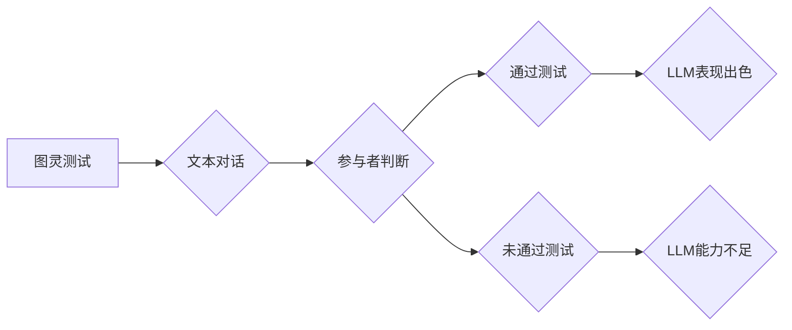

                 

## LLM与图灵测试：重新审视人工智能的标准

> 关键词：LLM, 图灵测试, 人工智能, 自然语言处理, 认知能力, 评估标准, 伦理问题

## 1. 背景介绍

人工智能（AI）的发展日新月异，特别是近年来深度学习技术的突破，使得大型语言模型（LLM）的出现和发展成为人工智能领域最令人瞩目的现象之一。这些模型展现出惊人的文本生成、翻译、问答和代码编写能力，甚至能够创作诗歌、剧本和小说，让人们对人工智能的未来充满了期待。然而，如何准确地评估和衡量 LLMs 的能力，以及它们是否真正达到了“智能”的水平，仍然是一个备受争议的话题。

传统的图灵测试被广泛认为是衡量人工智能是否具有人类智能的标准。该测试由英国数学家艾伦·图灵于1950年提出，其核心思想是：如果一个机器能够与人类进行自然流畅的对话，并让人无法区分其是人还是机器，那么它就可以被认为具有某种程度的人工智能。然而，随着 LLMs 的出现，图灵测试的局限性也逐渐显现。

## 2. 核心概念与联系

### 2.1 图灵测试

图灵测试是一种行为主义的评估标准，它侧重于观察机器与人类的交互行为，而不是机器内部的认知机制。测试的流程如下：

1. 参与者与一个隐藏的实体进行文本对话。
2. 参与者不知道对话的实体是人还是机器。
3. 如果参与者无法确定对话的实体是人还是机器，则该实体被认为通过了图灵测试。

### 2.2 大型语言模型（LLM）

LLM 是指训练数据量巨大、参数数量庞大的深度学习模型。它们通过学习海量文本数据，掌握了语言的语法、语义和上下文关系，从而能够生成流畅、连贯的文本，并执行各种自然语言处理任务。

### 2.3 核心概念联系

图灵测试和 LLMs 关系密切：

* LLMs 的强大文本生成能力使得它们在图灵测试中表现出色。
* 图灵测试可以作为衡量 LLMs 语言理解和生成能力的指标之一。

**Mermaid 流程图**



## 3. 核心算法原理 & 具体操作步骤

### 3.1 算法原理概述

LLMs 通常基于 Transformer 架构，其核心是自注意力机制。自注意力机制能够捕捉文本序列中不同词语之间的关系，从而更好地理解上下文信息。

### 3.2 算法步骤详解

1. **数据预处理:** 将文本数据进行清洗、分词、标记等预处理操作，使其能够被模型理解。
2. **模型训练:** 使用大量的文本数据训练 Transformer 模型，通过反向传播算法不断调整模型参数，使其能够生成更准确、更流畅的文本。
3. **文本生成:** 在训练完成后，将新的文本输入到模型中，模型会根据其训练得到的知识和经验，生成相应的文本输出。

### 3.3 算法优缺点

**优点:**

* 能够生成高质量、流畅的文本。
* 能够理解和处理复杂的语言结构。
* 能够执行多种自然语言处理任务。

**缺点:**

* 训练成本高，需要大量的计算资源和数据。
* 容易受到训练数据的影响，可能生成带有偏见或错误的信息。
* 缺乏真正的理解能力，只是对语言模式进行模仿。

### 3.4 算法应用领域

* **聊天机器人:** 与用户进行自然对话，提供信息和服务。
* **文本摘要:** 自动生成文本的简短摘要。
* **机器翻译:** 将文本从一种语言翻译成另一种语言。
* **代码生成:** 自动生成代码。
* **创意写作:** 创作诗歌、剧本和小说等。

## 4. 数学模型和公式 & 详细讲解 & 举例说明

### 4.1 数学模型构建

LLMs 的核心是 Transformer 架构，其数学模型基于以下几个关键组件：

* **嵌入层:** 将单词映射到向量空间，每个单词都有一个唯一的向量表示。
* **多头自注意力层:** 捕捉文本序列中不同词语之间的关系，计算每个词语与其他词语之间的注意力权重。
* **前馈神经网络层:** 对每个词语的嵌入向量进行非线性变换，提取更深层的语义信息。
* **位置编码:** 由于 Transformer 模型没有循环结构，无法捕捉词语的顺序信息，因此需要使用位置编码来表示每个词语在序列中的位置。

### 4.2 公式推导过程

自注意力机制的核心公式如下：

$$
Attention(Q, K, V) = softmax(\frac{QK^T}{\sqrt{d_k}})V
$$

其中：

* $Q$：查询矩阵
* $K$：键矩阵
* $V$：值矩阵
* $d_k$：键向量的维度
* $softmax$：softmax 函数

该公式计算每个词语与其他词语之间的注意力权重，然后根据这些权重对值矩阵进行加权求和，得到最终的输出向量。

### 4.3 案例分析与讲解

假设我们有一个句子：“我爱学习编程”。

* $Q$、$K$ 和 $V$ 分别对应句子中每个词语的嵌入向量。
* 通过计算 $QK^T$，我们可以得到每个词语与其他词语之间的相似度得分。
* 使用 softmax 函数将得分标准化，得到每个词语与其他词语之间的注意力权重。
* 最后，根据这些权重对值矩阵进行加权求和，得到每个词语的最终输出向量，这些向量包含了该词语与其他词语之间的语义关系。

## 5. 项目实践：代码实例和详细解释说明

### 5.1 开发环境搭建

* Python 3.7+
* PyTorch 或 TensorFlow
* CUDA 和 cuDNN (可选，用于 GPU 加速)

### 5.2 源代码详细实现

由于篇幅限制，这里只提供一个简单的文本生成示例代码：

```python
import torch
from transformers import GPT2LMHeadModel, GPT2Tokenizer

# 加载预训练模型和词典
model_name = "gpt2"
tokenizer = GPT2Tokenizer.from_pretrained(model_name)
model = GPT2LMHeadModel.from_pretrained(model_name)

# 输入文本
input_text = "我爱"

# Token化输入文本
input_ids = tokenizer.encode(input_text, return_tensors="pt")

# 生成文本
output = model.generate(input_ids, max_length=50)

# 解码输出文本
generated_text = tokenizer.decode(output[0], skip_special_tokens=True)

# 打印输出文本
print(generated_text)
```

### 5.3 代码解读与分析

* 该代码首先加载预训练的 GPT-2 模型和词典。
* 然后，将输入文本 token 化，即将其转换为模型可以理解的数字表示。
* 使用 `model.generate()` 函数生成文本，`max_length` 参数控制生成的文本长度。
* 最后，将生成的数字表示解码回文本，并打印输出。

### 5.4 运行结果展示

运行该代码后，可能会输出类似于以下的文本：

```
我爱学习编程
```

## 6. 实际应用场景

LLMs 在各个领域都有着广泛的应用场景：

* **客服机器人:** 自动回复用户咨询，提供24小时服务。
* **内容创作:** 自动生成文章、广告文案、诗歌等。
* **教育辅助:** 提供个性化学习辅导，自动批改作业。
* **翻译:** 实现实时语音和文本翻译。
* **代码生成:** 帮助程序员快速编写代码。

### 6.4 未来应用展望

随着 LLMs 的不断发展，其应用场景将会更加广泛，例如：

* **个性化推荐:** 根据用户的喜好和行为，推荐个性化的商品、服务和内容。
* **医疗诊断:** 辅助医生进行疾病诊断，提高诊断准确率。
* **科学研究:** 自动分析实验数据，加速科研进展。

## 7. 工具和资源推荐

### 7.1 学习资源推荐

* **书籍:**
    * 《深度学习》
    * 《自然语言处理》
* **在线课程:**
    * Coursera: 自然语言处理
    * edX: 深度学习
* **博客和网站:**
    * The Gradient
    * Towards Data Science

### 7.2 开发工具推荐

* **PyTorch:** 开源深度学习框架
* **TensorFlow:** 开源深度学习框架
* **Hugging Face Transformers:** 提供预训练 LLMs 和相关工具

### 7.3 相关论文推荐

* **Attention Is All You Need:** https://arxiv.org/abs/1706.03762
* **BERT: Pre-training of Deep Bidirectional Transformers for Language Understanding:** https://arxiv.org/abs/1810.04805

## 8. 总结：未来发展趋势与挑战

### 8.1 研究成果总结

LLMs 在文本生成、理解和翻译等方面取得了显著的进展，为人工智能的未来发展提供了新的可能性。

### 8.2 未来发展趋势

* **模型规模和能力的进一步提升:** 预计 LLMs 的参数量和训练数据量将会继续增加，从而提升其语言理解和生成能力。
* **多模态 LLMs 的发展:** 将文本与其他模态（如图像、音频、视频）相结合，构建更全面的认知模型。
* **可解释性和安全性:** 研究 LLMs 的决策机制，提高其可解释性和安全性。

### 8.3 面临的挑战

* **数据偏见和公平性:** LLMs 的训练数据可能存在偏见，导致模型生成带有偏见或歧视性的文本。
* **计算资源消耗:** 训练大型 LLMs 需要大量的计算资源，这对于资源有限的机构或个人来说是一个挑战。
* **伦理问题:** LLMs 的强大能力可能被用于恶意目的，例如生成虚假信息或进行网络攻击，因此需要认真考虑其伦理问题。

### 8.4 研究展望

未来，LLMs 将继续朝着更强大、更安全、更可解释的方向发展，并将在更多领域发挥重要作用。我们需要加强对 LLMs 的研究和开发，并制定相应的伦理规范，确保其安全、负责任地应用于社会。

## 9. 附录：常见问题与解答

* **什么是图灵测试？**

图灵测试是一种行为主义的评估标准，用于衡量机器是否具有人类智能。

* **LLMs 和 Transformer 架构有什么关系？**

LLMs 通常基于 Transformer 架构，其核心是自注意力机制。

* **LLMs 的应用场景有哪些？**

LLMs 在客服机器人、内容创作、教育辅助、翻译和代码生成等领域都有广泛的应用场景。

* **LLMs 的未来发展趋势是什么？**

LLMs 的未来发展趋势包括模型规模和能力的提升、多模态 LLMs 的发展以及可解释性和安全性的提高。


作者：禅与计算机程序设计艺术 / Zen and the Art of Computer Programming 
<end_of_turn>

