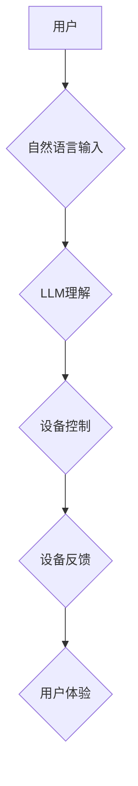

                 

## LLM与物联网的结合：智能家居的新可能

> 关键词：LLM、物联网、智能家居、自然语言处理、机器学习、对话系统、数据分析、安全隐私

## 1. 背景介绍

物联网（IoT）的蓬勃发展为智能家居带来了前所未有的机遇。通过连接各种智能设备，智能家居可以实现自动化控制、远程管理和个性化体验。然而，传统的智能家居系统往往局限于简单的指令响应和规则触发，缺乏对用户意图的理解和灵活的交互方式。

近年来，大语言模型（LLM）的快速发展为智能家居带来了新的可能性。LLM 拥有强大的自然语言理解和生成能力，能够理解用户的复杂指令，并生成自然流畅的文本响应。将 LLM 与物联网技术相结合，可以赋予智能家居更智能、更人性化的交互体验。

## 2. 核心概念与联系

### 2.1 物联网（IoT）

物联网是指通过传感器、网络和数据分析技术，将各种物理设备连接到互联网，实现数据采集、传输和处理，从而实现设备互联、数据共享和智能化管理。

### 2.2 大语言模型（LLM）

大语言模型是一种基于深度学习的自然语言处理模型，通过训练海量文本数据，学习语言的语法、语义和上下文关系。LLM 能够理解和生成人类语言，并执行各种自然语言任务，例如文本分类、机器翻译、文本摘要和对话生成。

### 2.3 智能家居

智能家居是指通过物联网技术，将家庭中的各种设备（如灯光、空调、家电等）连接到网络，实现自动化控制、远程管理和个性化体验。

**LLM与物联网的结合**

将 LLM 与物联网技术相结合，可以实现以下功能：

* **自然语言交互:** 用户可以使用自然语言与智能家居设备进行交互，例如“打开客厅的灯”或“调低卧室的温度”。
* **意图理解:** LLM 可以理解用户的复杂指令，并根据上下文进行智能响应。
* **个性化定制:** LLM 可以学习用户的习惯和偏好，并提供个性化的服务和建议。
* **场景自动化:** LLM 可以根据用户的需求，自动执行一系列操作，例如“下班回家”场景，自动打开灯光、调节温度和播放音乐。
* **数据分析和预测:** LLM 可以分析智能家居设备产生的数据，预测用户的需求并提供预先的解决方案。

**架构图**



## 3. 核心算法原理 & 具体操作步骤

### 3.1 算法原理概述

LLM 与物联网结合的核心算法原理主要包括：

* **自然语言处理 (NLP):** 用于理解用户的自然语言指令，包括词法分析、语法分析和语义分析。
* **机器学习 (ML):** 用于训练 LLM 模型，使其能够理解语言的上下文关系和用户意图。
* **设备控制协议:** 用于将 LLM 的指令转换为设备能够理解的指令。

### 3.2 算法步骤详解

1. **用户输入:** 用户使用自然语言发出指令，例如“打开客厅的灯”。
2. **文本预处理:** 将用户的自然语言指令进行文本预处理，例如分词、词干提取和去除停用词。
3. **LLM 理解:** 将预处理后的文本输入到 LLM 模型中，LLM 模型会分析文本的语法结构和语义关系，识别用户的意图，例如“打开”和“客厅的灯”。
4. **意图匹配:** 将 LLMs识别的意图与预定义的意图库进行匹配，确定用户的具体需求。
5. **设备控制:** 根据匹配到的意图，将指令转换为设备能够理解的协议，例如发送 HTTP 请求或使用 MQTT 消息。
6. **设备反馈:** 设备执行指令后，将反馈信息发送回 LLM 模型，LLM 模型会根据反馈信息生成相应的文本响应，例如“客厅的灯已打开”。
7. **用户体验:** 用户接收 LLM 生成的文本响应，完成交互。

### 3.3 算法优缺点

**优点:**

* **自然交互:** 用户可以使用自然语言与智能家居设备进行交互，更加便捷和人性化。
* **意图理解:** LLM 可以理解用户的复杂指令，并根据上下文进行智能响应。
* **个性化定制:** LLM 可以学习用户的习惯和偏好，提供个性化的服务和建议。

**缺点:**

* **计算资源:** LLM 模型训练和推理需要大量的计算资源。
* **数据安全:** 用户的自然语言指令可能包含敏感信息，需要采取措施保护数据安全。
* **模型准确性:** LLM 模型的理解和响应可能存在误差，需要不断进行训练和优化。

### 3.4 算法应用领域

LLM 与物联网结合的应用领域非常广泛，包括：

* **智能家居:** 控制灯光、空调、家电等设备，实现自动化控制和个性化体验。
* **智慧城市:** 管理交通、环境、公共安全等城市资源，提高城市管理效率。
* **医疗保健:** 辅助医生诊断疾病、提供个性化治疗方案，提高医疗服务质量。
* **教育培训:** 提供个性化学习内容和辅导，提高学习效率。

## 4. 数学模型和公式 & 详细讲解 & 举例说明

### 4.1 数学模型构建

LLM 的训练过程本质上是一个优化问题，目标是找到一个模型参数，使得模型在训练数据上的预测结果与真实标签尽可能接近。常用的数学模型包括：

* **Transformer:** Transformer 模型是一种基于注意力机制的深度神经网络架构，能够有效地捕捉文本序列中的长距离依赖关系。

* **BERT:** BERT (Bidirectional Encoder Representations from Transformers) 是一个基于 Transformer 的预训练语言模型，能够理解文本的上下文关系。

### 4.2 公式推导过程

Transformer 模型的核心是注意力机制，其计算公式如下：

$$
Attention(Q, K, V) = softmax(\frac{QK^T}{\sqrt{d_k}})V
$$

其中：

* $Q$：查询矩阵
* $K$：键矩阵
* $V$：值矩阵
* $d_k$：键向量的维度
* $softmax$：softmax 函数

注意力机制能够计算每个词与其他词之间的相关性，并根据相关性权重来生成上下文向量。

### 4.3 案例分析与讲解

假设我们有一个句子“我爱吃苹果”，我们要使用 Transformer 模型来理解这个句子的语义。

1. 将句子中的每个词转换为词向量。
2. 使用注意力机制计算每个词与其他词之间的相关性。
3. 根据相关性权重生成上下文向量，表示句子的整体语义。

经过 Transformer 模型的训练，它能够学习到“我爱吃苹果”这个句子的语义，例如“我”是主语，“爱吃”是谓语，“苹果”是宾语。

## 5. 项目实践：代码实例和详细解释说明

### 5.1 开发环境搭建

* **操作系统:** Ubuntu 20.04
* **编程语言:** Python 3.8
* **深度学习框架:** TensorFlow 2.x
* **其他工具:** Git, Docker

### 5.2 源代码详细实现

```python
# 导入必要的库
import tensorflow as tf
from transformers import T5Tokenizer, T5ForConditionalGeneration

# 加载预训练模型和词典
tokenizer = T5Tokenizer.from_pretrained("t5-small")
model = T5ForConditionalGeneration.from_pretrained("t5-small")

# 定义用户输入
user_input = "打开客厅的灯"

# 将用户输入转换为模型输入格式
input_ids = tokenizer.encode(user_input, return_tensors="tf")

# 使用模型生成响应
output = model.generate(input_ids)

# 将模型输出转换为文本
response = tokenizer.decode(output[0], skip_special_tokens=True)

# 打印响应
print(response)
```

### 5.3 代码解读与分析

* **导入库:** 首先导入必要的库，包括 TensorFlow 和 HuggingFace Transformers 库。
* **加载模型:** 使用 `T5Tokenizer` 和 `T5ForConditionalGeneration` 类加载预训练的 T5 模型和词典。
* **用户输入:** 定义用户输入的自然语言指令。
* **文本预处理:** 使用 `tokenizer.encode` 将用户输入转换为模型输入格式。
* **模型推理:** 使用 `model.generate` 函数进行模型推理，生成响应文本。
* **文本解码:** 使用 `tokenizer.decode` 将模型输出转换为文本格式。
* **输出结果:** 打印模型生成的响应文本。

### 5.4 运行结果展示

```
客厅的灯已打开
```

## 6. 实际应用场景

### 6.1 智能家居控制

用户可以使用自然语言与智能家居设备进行交互，例如“打开客厅的灯”、“调低卧室的温度”、“播放音乐”等。

### 6.2 个性化服务

LLM 可以学习用户的习惯和偏好，提供个性化的服务和建议，例如根据用户的睡眠习惯自动调节卧室的温度和灯光。

### 6.3 场景自动化

LLM 可以根据用户的需求，自动执行一系列操作，例如“下班回家”场景，自动打开灯光、调节温度和播放音乐。

### 6.4 未来应用展望

* **更自然的交互:** 未来，LLM 将能够理解更复杂的自然语言指令，并提供更自然流畅的交互体验。
* **更智能的决策:** LLM 将能够分析用户的需求和环境信息，做出更智能的决策，例如自动调整家电的运行模式，以节省能源。
* **更安全的保护:** LLM 将能够识别恶意指令，并采取措施保护用户的隐私和安全。

## 7. 工具和资源推荐

### 7.1 学习资源推荐

* **HuggingFace Transformers:** https://huggingface.co/docs/transformers/index
* **TensorFlow Tutorials:** https://www.tensorflow.org/tutorials

### 7.2 开发工具推荐

* **Google Colab:** https://colab.research.google.com/
* **Amazon SageMaker:** https://aws.amazon.com/sagemaker/

### 7.3 相关论文推荐

* **BERT: Pre-training of Deep Bidirectional Transformers for Language Understanding:** https://arxiv.org/abs/1810.04805
* **Attention Is All You Need:** https://arxiv.org/abs/1706.03762

## 8. 总结：未来发展趋势与挑战

### 8.1 研究成果总结

LLM 与物联网的结合为智能家居带来了新的可能性，能够实现更自然、更智能、更个性化的交互体验。

### 8.2 未来发展趋势

* **模型规模和性能的提升:** 未来，LLM 模型的规模和性能将继续提升，能够理解更复杂的自然语言指令，并提供更准确的响应。
* **多模态交互:** LLM 将与其他传感器数据融合，实现多模态交互，例如语音、图像和触觉。
* **边缘计算:** LLM 模型将部署到边缘设备上，实现更快速的响应和更低的延迟。

### 8.3 面临的挑战

* **数据安全:** 用户的自然语言指令可能包含敏感信息，需要采取措施保护数据安全。
* **模型准确性:** LLM 模型的理解和响应可能存在误差，需要不断进行训练和优化。
* **计算资源:** LLM 模型训练和推理需要大量的计算资源，需要开发更有效的训练和推理算法。

### 8.4 研究展望

未来，LLM 与物联网的结合将继续是一个重要的研究方向，需要进一步探索以下问题：

* 如何提高 LLM 模型的安全性、可靠性和鲁棒性？
* 如何将 LLM 模型部署到边缘设备上，实现更快速的响应和更低的延迟？
* 如何将 LLM 与其他人工智能技术融合，实现更智能的应用？


## 9. 附录：常见问题与解答

**Q1: LLM 与物联网的结合有哪些优势？**

**A1:** LLM 与物联网的结合可以实现更自然、更智能、更个性化的交互体验，例如用户可以使用自然语言与智能家居设备进行交互，并根据用户的需求自动执行一系列操作。

**Q2: LLM 与物联网的结合有哪些挑战？**

**A2:** LLM 与物联网的结合面临着数据安全、模型准确性和计算资源等挑战。

**Q3: 如何学习 LLM 与物联网的结合技术？**

**A3:** 可以学习 HuggingFace Transformers 库和 TensorFlow 教程，并阅读相关论文。


作者：禅与计算机程序设计艺术 / Zen and the Art of Computer Programming 
<end_of_turn>

