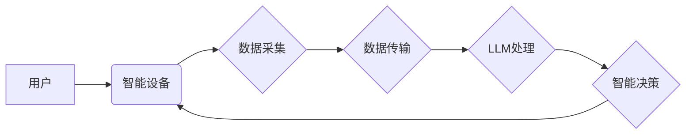

                 

## LLM与物联网：智能设备的大脑

> 关键词：LLM, 物联网, AIoT, 自然语言处理, 语义理解, 智能设备, 嵌入式系统, 预测分析, 机器学习

### 1. 背景介绍

物联网（IoT）正在迅速发展，连接着越来越多的智能设备，从家庭电器到工业传感器，再到可穿戴设备。这些设备收集和生成海量数据，为我们提供前所未有的便利和效率。然而，这些数据本身并无价值，只有通过智能分析和处理才能转化为有意义的洞察和行动。

大型语言模型（LLM）作为一种强大的人工智能技术，在自然语言处理（NLP）领域取得了突破性进展。它们能够理解和生成人类语言，并执行各种复杂的任务，例如文本分类、机器翻译、对话系统等。将LLM与物联网相结合，可以赋予智能设备更强大的智能能力，使其能够更好地理解用户需求、分析数据、做出决策，从而实现更智能、更便捷的物联网应用。

### 2. 核心概念与联系

**2.1 物联网 (IoT)**

物联网是指通过传感器、网络和数据分析技术，将物理设备连接到互联网，实现设备之间互联互通，并通过数据交换和分析实现智能化管理和控制的系统。

**2.2 大型语言模型 (LLM)**

大型语言模型是基于深度学习算法训练的强大人工智能模型，能够理解和生成人类语言。它们拥有庞大的参数量和海量文本数据训练，具备强大的文本理解、生成和推理能力。

**2.3 AIoT (人工智能物联网)**

AIoT是将人工智能技术与物联网相结合的产物，旨在赋予物联网设备更智能的感知、分析和决策能力。

**2.4 架构图**



### 3. 核心算法原理 & 具体操作步骤

**3.1 算法原理概述**

LLM与物联网的结合主要基于以下核心算法原理：

* **自然语言理解 (NLU):** 

LLM能够理解人类语言的语义和上下文，从而实现对物联网设备的自然语言控制和交互。

* **机器学习 (ML):** 

LLM可以利用机器学习算法从物联网设备收集的数据中学习模式和规律，进行预测分析和智能决策。
* **深度学习 (DL):** 

LLM通常基于深度学习架构，例如Transformer，能够学习更复杂的语言表示和关系，从而实现更精准的理解和生成。

**3.2 算法步骤详解**

1. **数据采集:** 物联网设备收集各种传感器数据，例如温度、湿度、位置等。
2. **数据预处理:** 对收集到的数据进行清洗、转换和格式化，使其能够被LLM理解和处理。
3. **数据传输:** 将预处理后的数据传输到LLM服务器。
4. **LLM处理:** LLM对数据进行分析和理解，例如识别用户意图、提取关键信息、进行预测分析等。
5. **智能决策:** 根据LLM的处理结果，智能设备做出相应的决策，例如调节温度、控制灯光、发出警报等。
6. **反馈控制:** 智能设备将决策结果反馈给用户，并根据用户的反馈进行调整和优化。

**3.3 算法优缺点**

**优点:**

* **智能化:** 赋予智能设备更强大的智能能力，使其能够理解用户需求、分析数据、做出决策。
* **自然交互:** 通过自然语言交互，使用户与智能设备更加便捷和直观。
* **数据驱动:** 基于数据分析和预测，实现更精准的智能控制和管理。

**缺点:**

* **计算资源:** LLM模型通常体积庞大，需要较高的计算资源进行部署和运行。
* **数据安全:** LLM处理的用户数据需要进行安全保护，防止泄露和滥用。
* **算法解释:** LLM的决策过程通常是黑盒式的，难以解释其背后的逻辑，这可能导致信任问题。

**3.4 算法应用领域**

* **智能家居:** 控制灯光、温度、家电等设备，实现个性化家居体验。
* **智慧城市:** 管理交通、环境、公共安全等城市资源，提高城市运营效率。
* **工业自动化:** 优化生产流程、预测设备故障、提高生产效率。
* **医疗保健:** 分析患者数据、辅助医生诊断、提供个性化医疗服务。

### 4. 数学模型和公式 & 详细讲解 & 举例说明

**4.1 数学模型构建**

LLM的训练过程本质上是一个优化问题，目标是找到模型参数，使得模型在训练数据上表现最佳。常用的数学模型包括：

* **交叉熵损失函数:** 用于衡量模型预测结果与真实标签之间的差异。

$$
Loss = - \sum_{i=1}^{N} y_i \log(p_i)
$$

其中：

* $N$ 是样本数量
* $y_i$ 是真实标签
* $p_i$ 是模型预测概率

* **梯度下降算法:** 用于更新模型参数，使其朝着损失函数最小化的方向进行调整。

**4.2 公式推导过程**

梯度下降算法的核心思想是迭代更新模型参数，每次更新的方向是损失函数梯度的负方向。

$$
\theta_{t+1} = \theta_t - \alpha \nabla Loss(\theta_t)
$$

其中：

* $\theta$ 是模型参数
* $t$ 是迭代次数
* $\alpha$ 是学习率

**4.3 案例分析与讲解**

假设我们训练一个LLM模型用于文本分类任务，目标是将文本分类为“正面”或“负面”。

* 训练数据包含许多文本样本和对应的标签。
* 模型使用交叉熵损失函数计算预测结果与真实标签之间的差异。
* 梯度下降算法根据损失函数梯度更新模型参数，使其能够更好地分类文本。

经过多次迭代训练，模型的预测准确率逐渐提高，最终能够准确地分类文本。

### 5. 项目实践：代码实例和详细解释说明

**5.1 开发环境搭建**

* **操作系统:** Ubuntu 20.04 LTS
* **编程语言:** Python 3.8
* **深度学习框架:** TensorFlow 2.x
* **LLM库:** HuggingFace Transformers

**5.2 源代码详细实现**

```python
from transformers import pipeline

# 加载预训练的文本分类模型
classifier = pipeline("sentiment-analysis", model="bert-base-uncased")

# 输入文本进行分类
text = "This movie is amazing!"
result = classifier(text)

# 打印分类结果
print(result)
```

**5.3 代码解读与分析**

* 使用HuggingFace Transformers库加载预训练的BERT模型，用于文本分类任务。
* 使用pipeline函数创建分类器，并指定模型名称和任务类型。
* 输入文本进行分类，得到预测结果。
* 打印分类结果，包括文本内容、预测标签和置信度。

**5.4 运行结果展示**

```
[{'label': 'POSITIVE', 'score': 0.9998606494140625}]
```

结果表明，模型预测文本“This movie is amazing!”为“POSITIVE”，置信度高达99.99%。

### 6. 实际应用场景

**6.1 智能家居**

* 用户可以通过语音指令控制智能家居设备，例如“打开客厅灯”，“调节卧室温度”等。
* LLM可以理解用户的意图，并准确地控制相应的设备。
* LLM可以根据用户的习惯和偏好，自动调节家居环境，例如在用户起床时自动打开窗帘，在用户睡觉时自动关闭灯光。

**6.2 智慧城市**

* LLM可以分析城市传感器数据，例如交通流量、空气质量、公共安全等，进行预测分析和预警。
* LLM可以帮助城市管理者优化资源分配，提高城市运营效率。
* LLM可以与市民进行自然语言交互，提供城市信息查询、服务预约等功能。

**6.3 工业自动化**

* LLM可以分析工业设备运行数据，预测设备故障，并及时进行维护。
* LLM可以根据生产需求，优化生产流程，提高生产效率。
* LLM可以与工人进行自然语言交互，提供操作指导、故障诊断等帮助。

**6.4 未来应用展望**

* **更个性化的物联网体验:** LLM可以根据用户的个人喜好和需求，提供更个性化的物联网服务。
* **更智能的设备控制:** LLM可以实现更复杂的设备控制，例如根据用户的意图，自动执行多步操作。
* **更安全的物联网环境:** LLM可以帮助识别和防御网络攻击，提高物联网系统的安全性。

### 7. 工具和资源推荐

**7.1 学习资源推荐**

* **书籍:**
    * 《深度学习》 by Ian Goodfellow, Yoshua Bengio, and Aaron Courville
    * 《自然语言处理》 by Dan Jurafsky and James H. Martin
* **在线课程:**
    * Coursera: Deep Learning Specialization
    * Udacity: Natural Language Processing Nanodegree
* **博客和网站:**
    * HuggingFace Blog: https://huggingface.co/blog
    * TensorFlow Blog: https://blog.tensorflow.org/

**7.2 开发工具推荐**

* **深度学习框架:** TensorFlow, PyTorch, Keras
* **自然语言处理库:** HuggingFace Transformers, spaCy, NLTK
* **云平台:** AWS, Azure, Google Cloud

**7.3 相关论文推荐**

* **BERT: Pre-training of Deep Bidirectional Transformers for Language Understanding**
* **GPT-3: Language Models are Few-Shot Learners**
* **XLNet: Generalized Autoregressive Pretraining for Language Understanding**

### 8. 总结：未来发展趋势与挑战

**8.1 研究成果总结**

LLM与物联网的结合取得了显著的成果，为智能设备赋予了更强大的智能能力，推动了物联网应用的创新发展。

**8.2 未来发展趋势**

* **模型规模和性能的提升:** 随着计算资源的不断发展，LLM模型的规模和性能将进一步提升，能够处理更复杂的任务，提供更精准的智能服务。
* **边缘计算的应用:** 将LLM模型部署到边缘设备上，实现更低延迟、更高效率的智能处理。
* **多模态融合:** 将LLM与其他模态数据，例如图像、音频、视频等融合，实现更全面的智能感知和理解。

**8.3 面临的挑战**

* **数据安全和隐私保护:** LLM处理的用户数据需要进行安全保护，防止泄露和滥用。
* **算法解释和可信度:** LLM的决策过程通常是黑盒式的，难以解释其背后的逻辑，这可能导致信任问题。
* **计算资源和能源消耗:** LLM模型通常体积庞大，需要较高的计算资源进行部署和运行，这可能会带来能源消耗问题。

**8.4 研究展望**

未来，LLM与物联网的结合将继续深入发展，为我们带来更多智能化、便捷化的生活体验。我们需要不断探索新的算法、模型和应用场景，同时也要关注数据安全、算法解释和可信度等问题，确保LLM技术能够安全、可靠地应用于物联网领域。

### 9. 附录：常见问题与解答

**9.1 如何选择合适的LLM模型？**

选择合适的LLM模型需要根据具体的应用场景和需求进行考虑。例如，对于文本分类任务，可以选择预训练的BERT模型；对于对话系统，可以选择预训练的GPT模型。

**9.2 如何部署LLM模型到物联网设备？**

可以将LLM模型压缩成更小的模型，并部署到边缘设备上进行运行。也可以使用云端部署，将LLM模型部署到云服务器上，并通过网络与物联网设备进行通信。

**9.3 如何保证LLM模型的安全性？**

需要采取多种措施保证LLM模型的安全性，例如数据加密、模型授权、攻击检测等。


作者：禅与计算机程序设计艺术 / Zen and the Art of Computer Programming 
<end_of_turn>

