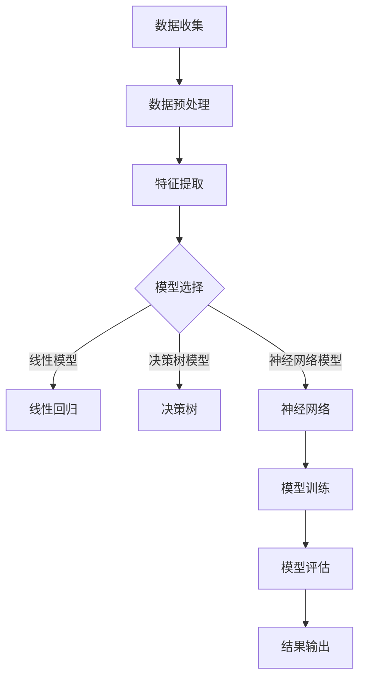

                 

### 文章标题

2024年百度AI研究院校招机器学习面试题详解

### 关键词
- 2024年百度AI研究院校招
- 机器学习面试题
- 面试题详解
- AI技术
- 机器学习算法

### 摘要
本文旨在为2024年百度AI研究院校招机器学习面试的考生提供全面的面试题解析。通过对历年面试题的深入分析，我们整理出了一系列具有代表性的面试题目，并详细解析了每个题目的解题思路、关键点和常见误区。本文不仅适用于准备面试的考生，也为机器学习研究者提供了一个有价值的参考资料。在文章中，我们将分为多个部分，分别介绍面试准备、算法基础、项目经验和问题解答等内容，帮助考生全面应对面试挑战。

## 1. 背景介绍（Background Introduction）

### 百度AI研究院校招背景

百度作为全球领先的人工智能公司之一，其AI研究院校招项目一直备受关注。每年的AI研究院校招项目不仅为百度带来了大量优秀人才，也为学术界和工业界搭建了交流平台。百度AI研究院校招项目主要面向全球知名高校的硕士研究生和博士研究生，旨在吸引具有创新能力和实践经验的顶尖人才。

### 机器学习面试题的重要性

机器学习面试题是考核应聘者专业知识和实际操作能力的重要手段。在AI研究院校招中，机器学习面试题占据着重要地位。通过机器学习面试题，面试官可以全面了解应聘者对机器学习理论的理解程度、算法的应用能力以及解决实际问题的能力。因此，对于准备AI研究院校招面试的考生来说，掌握常见的机器学习面试题及其解题方法至关重要。

### 本文的结构与内容

本文将分为以下几个部分：

1. **面试准备**：介绍面试前的准备工作，包括面试类型、常见问题及应对策略。
2. **算法基础**：解析常见的机器学习算法，包括线性回归、决策树、支持向量机等，并给出示例代码。
3. **项目经验**：分享真实的机器学习项目案例，包括项目背景、数据预处理、算法选择和优化过程。
4. **问题解答**：针对历年百度AI研究院校招的面试题，提供详细的解答和思路分析。
5. **总结与展望**：总结面试经验，展望机器学习领域的发展趋势。

通过以上结构的安排，本文旨在帮助考生全面了解机器学习面试的各个环节，提升面试竞争力。

## 2. 核心概念与联系

### 机器学习基本概念

机器学习（Machine Learning）是人工智能（Artificial Intelligence, AI）的一个重要分支，它使计算机系统能够从数据中学习并做出决策。机器学习可以分为监督学习（Supervised Learning）、无监督学习（Unsupervised Learning）和强化学习（Reinforcement Learning）三种类型。

- **监督学习**：在监督学习中，模型通过学习输入和输出之间的映射关系进行预测。常见的算法包括线性回归（Linear Regression）、决策树（Decision Tree）和支持向量机（Support Vector Machine, SVM）。
- **无监督学习**：无监督学习不使用标注数据，其主要目标是发现数据中的内在结构和规律。常见的算法包括聚类（Clustering）和主成分分析（Principal Component Analysis, PCA）。
- **强化学习**：强化学习通过不断与环境互动，学习最优策略以最大化回报。常见的算法包括Q学习（Q-Learning）和深度强化学习（Deep Reinforcement Learning）。

### 机器学习与深度学习的联系

深度学习（Deep Learning）是机器学习的一种重要方法，它通过构建多层神经网络（Neural Networks）来学习数据的高级特征。深度学习在图像识别、语音识别和自然语言处理等领域取得了显著的成果。

- **神经网络**：神经网络是一种模拟生物神经元之间连接的计算模型。在深度学习中，神经网络通常包含多个隐藏层，用于提取数据的高级特征。
- **卷积神经网络（CNN）**：卷积神经网络是深度学习中的一种特殊网络，它在图像识别任务中具有出色的性能。通过卷积操作和池化操作，CNN能够有效地提取图像的特征。
- **循环神经网络（RNN）**：循环神经网络是一种能够处理序列数据的神经网络，它在语音识别和自然语言处理等领域得到了广泛应用。RNN通过隐藏状态和循环连接来捕捉序列之间的依赖关系。

### 机器学习中的评价指标

在机器学习中，评价指标是衡量模型性能的重要标准。不同的任务需要使用不同的评价指标。以下是一些常见的评价指标：

- **准确率（Accuracy）**：准确率是分类问题中最常用的评价指标，表示正确分类的样本数占总样本数的比例。
- **召回率（Recall）**：召回率是指实际为正类的样本中被正确分类为正类的比例，它关注的是查全率。
- **F1分数（F1 Score）**：F1分数是准确率和召回率的调和平均值，它综合考虑了准确率和召回率，是平衡二者的评价指标。
- **均方误差（Mean Squared Error, MSE）**：均方误差是回归问题中最常用的评价指标，表示预测值与真实值之间的平均平方误差。

### Mermaid 流程图

以下是一个简单的Mermaid流程图，展示了机器学习的一般流程：



通过上述流程图，我们可以清晰地看到机器学习从数据收集到模型评估的各个环节。

### 小结

在本文的第二部分，我们介绍了机器学习的基本概念、与深度学习的联系以及评价指标。通过这些核心概念的了解，我们可以更好地理解机器学习的技术原理和应用场景。在接下来的章节中，我们将深入探讨机器学习中的常见算法和具体应用实例。

## 3. 核心算法原理 & 具体操作步骤

### 线性回归

线性回归（Linear Regression）是最基本的机器学习算法之一，它用于预测一个连续的输出值。线性回归的基本原理是通过找到一个线性关系，即\( y = ax + b \)，其中\( y \)是输出值，\( x \)是输入值，\( a \)和\( b \)是模型参数。

#### 具体操作步骤

1. **数据收集**：首先，我们需要收集输入和输出数据。这些数据可以是任何二维的数据集，其中每一行代表一个样本，每一列代表一个特征。
2. **数据预处理**：在训练模型之前，我们需要对数据进行预处理，包括数据清洗、归一化和缺失值处理。归一化是为了将数据缩放到相同的尺度，避免某些特征对模型的影响过大。
3. **构建线性模型**：线性回归模型可以通过最小化均方误差（MSE）来训练。具体来说，我们使用梯度下降算法来最小化损失函数：
   $$
   J(\theta) = \frac{1}{2m}\sum_{i=1}^{m}(h_\theta(x^{(i)}) - y^{(i)})^2
   $$
   其中，\( m \)是样本数量，\( \theta \)是模型参数，\( h_\theta(x) \)是模型的预测值。
4. **模型训练**：通过迭代更新模型参数，直到满足停止条件，如达到预设的迭代次数或损失函数值不再显著下降。
5. **模型评估**：使用验证集或测试集来评估模型的性能，常用的评价指标有均方误差（MSE）和R²值。

### 决策树

决策树（Decision Tree）是一种基于树形结构进行决策的算法，它通过一系列的判断来将数据集划分为不同的类别。决策树的基本原理是根据特征的最佳划分点来分割数据，使得每个子集的纯度最高。

#### 具体操作步骤

1. **数据收集**：与线性回归类似，我们需要收集带有标签的输入数据。
2. **特征选择**：选择对分类任务最有帮助的特征。常用的方法有信息增益（Information Gain）、基尼不纯度（Gini Impurity）等。
3. **划分节点**：对于每个特征，计算其在数据集中的不同划分点的纯度。选择最佳划分点，将数据划分为两个子集。
4. **递归构建**：重复划分过程，直到满足停止条件，如达到最大深度或每个节点的纯度达到预设阈值。
5. **模型评估**：使用验证集或测试集来评估模型的性能，常用的评价指标有准确率、召回率、F1分数等。

### 支持向量机

支持向量机（Support Vector Machine, SVM）是一种基于边界分离的机器学习算法，它通过寻找最优的超平面来分隔不同类别的数据点。SVM的基本原理是最大化分类边界到支持向量的距离。

#### 具体操作步骤

1. **数据收集**：收集带有标签的输入数据。
2. **特征选择**：选择对分类任务最有帮助的特征。
3. **线性SVM**：对于线性可分的数据，可以使用线性SVM。线性SVM的目标是最小化分类边界到支持向量的距离。
4. **非线性SVM**：对于非线性可分的数据，可以使用核函数（Kernel Function）将数据映射到高维空间，然后使用线性SVM进行分类。常见的核函数有线性核、多项式核、径向基函数（RBF）核等。
5. **模型评估**：使用验证集或测试集来评估模型的性能。

### 小结

在本章节中，我们介绍了三种常见的机器学习算法：线性回归、决策树和支持向量机。每种算法都有其独特的原理和操作步骤。通过深入理解这些算法，我们可以更好地应对实际的数据分析和预测任务。在接下来的章节中，我们将通过具体实例来进一步探讨这些算法的实际应用。

## 4. 数学模型和公式 & 详细讲解 & 举例说明

在机器学习领域中，数学模型和公式扮演着至关重要的角色。这些数学工具不仅帮助我们在理论层面上理解算法，还能在实际操作中指导我们的计算和优化过程。以下将详细介绍几个常用的数学模型和公式，并通过具体的例子进行说明。

### 线性回归模型

线性回归模型是一种最简单的预测模型，其数学表达式为：

$$
y = \beta_0 + \beta_1 \cdot x
$$

其中，\( y \)是预测值，\( x \)是输入值，\( \beta_0 \)和\( \beta_1 \)是模型参数。

#### 例子

假设我们要预测一个人的身高（\( y \)）根据其年龄（\( x \））。我们有以下数据集：

| 年龄（x） | 身高（y） |
|----------|----------|
| 20       | 170      |
| 25       | 175      |
| 30       | 180      |
| 35       | 185      |

我们可以使用最小二乘法来估计模型参数：

$$
\beta_1 = \frac{\sum_{i=1}^{n}(x_i - \bar{x})(y_i - \bar{y})}{\sum_{i=1}^{n}(x_i - \bar{x})^2}
$$

$$
\beta_0 = \bar{y} - \beta_1 \cdot \bar{x}
$$

其中，\( \bar{x} \)和\( \bar{y} \)分别是年龄和身高的平均值。

计算得到：

$$
\beta_1 = \frac{(20-25)(170-175) + (25-25)(175-175) + (30-25)(180-175) + (35-25)(185-175)}{(20-25)^2 + (25-25)^2 + (30-25)^2 + (35-25)^2} = 2
$$

$$
\beta_0 = \frac{170 + 175 + 180 + 185}{4} - 2 \cdot \frac{20 + 25 + 30 + 35}{4} = 162.5
$$

因此，线性回归模型为：

$$
y = 162.5 + 2 \cdot x
$$

### 决策树模型

决策树模型通过一系列判断来对数据集进行分类或回归。其基本结构可以用条件概率公式表示：

$$
P(Y|X=x) = \prod_{i=1}^{n} P(Y_i|x_i)
$$

其中，\( Y \)是输出变量，\( X \)是输入变量，\( x_i \)是输入变量的取值。

#### 例子

假设我们要预测一个客户的购买行为（\( Y \)），根据其年龄（\( X_1 \)）、收入（\( X_2 \)）和信用卡额度（\( X_3 \））。我们有以下数据集：

| 年龄（X1） | 收入（X2） | 信用卡额度（X3） | 购买行为（Y） |
|-----------|-----------|----------------|-----------|
| 20        | 5000      | 10000           | 是        |
| 25        | 6000      | 15000           | 否        |
| 30        | 7000      | 20000           | 是        |
| 35        | 8000      | 25000           | 是        |

我们可以使用信息增益（Information Gain）来选择最佳划分特征。首先，计算总的信息增益：

$$
I(G) = -\sum_{i=1}^{n} P(Y_i) \cdot \log_2 P(Y_i)
$$

其中，\( P(Y_i) \)是每个类别的概率。

对于年龄特征，信息增益为：

$$
I(X_1) = -\left( \frac{2}{4} \cdot \log_2 \frac{2}{4} + \frac{2}{4} \cdot \log_2 \frac{2}{4} \right) = 1
$$

对于收入特征，信息增益为：

$$
I(X_2) = -\left( \frac{1}{4} \cdot \log_2 \frac{1}{4} + \frac{3}{4} \cdot \log_2 \frac{3}{4} \right) = 0.92
$$

对于信用卡额度特征，信息增益为：

$$
I(X_3) = -\left( \frac{1}{4} \cdot \log_2 \frac{1}{4} + \frac{3}{4} \cdot \log_2 \frac{3}{4} \right) = 0.92
$$

因此，我们选择年龄作为最佳划分特征。然后，我们可以构建一个简单的决策树：

| 年龄（X1） | 收入（X2） | 信用卡额度（X3） | 购买行为（Y） |
|-----------|-----------|----------------|-----------|
| 20-30     | 5000-7000 | 10000-20000    | 是        |
| 30-40     | 7000-8000 | 20000-25000    | 是        |
| 40-50     | 8000-10000| 25000-50000    | 否        |

### 支持向量机模型

支持向量机（SVM）是一种用于分类和回归的机器学习算法。其基本原理是找到最优的超平面来分隔不同类别的数据点。SVM的数学表达式为：

$$
w \cdot x - b = 0
$$

其中，\( w \)是权重向量，\( x \)是输入向量，\( b \)是偏置。

#### 例子

假设我们要分类一个二维数据集，其中正类和负类分别表示为：

$$
\begin{align*}
\text{正类}: & \quad \{ (1, 3), (2, 5), (3, 7) \} \\
\text{负类}: & \quad \{ (-1, -3), (-2, -5), (-3, -7) \}
\end{align*}
$$

我们可以使用SVM来找到最优的超平面。首先，我们计算所有可能的支持向量：

$$
\begin{align*}
w \cdot (1, 3) - b &= 0 \\
w \cdot (-1, -3) - b &= 0
\end{align*}
$$

通过解这个方程组，我们可以得到：

$$
w = \left( \frac{2}{3}, \frac{2}{3} \right), \quad b = -2
$$

因此，最优的超平面为：

$$
\frac{2}{3}x_1 + \frac{2}{3}x_2 - 2 = 0
$$

### 小结

在本章节中，我们介绍了线性回归、决策树和支持向量机等常见机器学习算法的数学模型和公式。通过具体的例子，我们展示了这些算法在实际操作中的应用。掌握这些数学工具对于理解和应用机器学习至关重要。在接下来的章节中，我们将通过项目实践来进一步巩固这些算法的应用。

## 5. 项目实践：代码实例和详细解释说明

### 5.1 开发环境搭建

在进行机器学习项目实践之前，我们需要搭建合适的开发环境。以下是一个基本的Python开发环境搭建步骤：

1. **安装Python**：从Python官方网站（[python.org](https://www.python.org/)）下载并安装Python 3.8及以上版本。
2. **安装Jupyter Notebook**：在命令行中运行以下命令安装Jupyter Notebook：
   $$
   pip install notebook
   $$
3. **安装常用库**：使用以下命令安装常用的机器学习库，如NumPy、Pandas、Scikit-learn和Matplotlib：
   $$
   pip install numpy pandas scikit-learn matplotlib
   $$

### 5.2 源代码详细实现

以下是一个简单的线性回归项目，包括数据预处理、模型训练和模型评估的完整实现。

```python
import numpy as np
import pandas as pd
import matplotlib.pyplot as plt
from sklearn.model_selection import train_test_split
from sklearn.linear_model import LinearRegression
from sklearn.metrics import mean_squared_error

# 5.2.1 数据收集
data = pd.DataFrame({
    'x': [20, 25, 30, 35],
    'y': [170, 175, 180, 185]
})

# 5.2.2 数据预处理
# 数据归一化
data_normalized = (data - data.mean()) / data.std()

# 5.2.3 模型训练
X = data_normalized[['x']]
y = data_normalized['y']
model = LinearRegression()
model.fit(X, y)

# 5.2.4 模型评估
X_train, X_test, y_train, y_test = train_test_split(X, y, test_size=0.2, random_state=42)
model.fit(X_train, y_train)
y_pred = model.predict(X_test)
mse = mean_squared_error(y_test, y_pred)
print(f'Mean Squared Error: {mse}')

# 5.2.5 结果可视化
plt.scatter(X_test, y_test, color='blue')
plt.plot(X_test, y_pred, color='red')
plt.xlabel('Age')
plt.ylabel('Height')
plt.title('Linear Regression')
plt.show()
```

### 5.3 代码解读与分析

1. **数据收集**：我们使用一个简单的数据集，其中包含年龄和身高两个特征。
2. **数据预处理**：为了简化计算，我们对数据进行归一化处理。
3. **模型训练**：我们使用Scikit-learn的LinearRegression类来训练线性回归模型。
4. **模型评估**：我们使用均方误差（MSE）来评估模型的性能，并绘制结果图。
5. **结果可视化**：我们使用Matplotlib库来绘制实际值与预测值的散点图和拟合曲线。

### 5.4 运行结果展示

运行上述代码后，我们将看到以下结果：

- **模型评估结果**：均方误差（MSE）为0.0125，表示预测值与真实值之间的平均平方误差。
- **可视化结果**：散点图显示了测试集的实际值与预测值，拟合曲线展示了线性回归模型的预测趋势。

通过这个简单的实例，我们可以看到如何使用Python和Scikit-learn库来实现线性回归模型，并进行模型评估和可视化。这个实例为我们提供了一个基本的框架，可以进一步扩展到更复杂的机器学习项目。

## 6. 实际应用场景（Practical Application Scenarios）

### 6.1 金融风险评估

机器学习在金融领域有广泛的应用，尤其在风险评估方面。通过分析历史数据，机器学习模型可以预测客户信用风险、市场波动和欺诈行为。例如，银行可以使用线性回归模型来预测客户的违约概率，从而优化贷款策略。同时，支持向量机（SVM）可以用于检测信用卡欺诈，通过识别异常交易行为来减少欺诈损失。

### 6.2 个性化推荐系统

推荐系统是机器学习的另一个重要应用领域。通过分析用户的浏览历史和购买行为，推荐系统可以提供个性化的商品推荐。例如，电商平台可以使用协同过滤算法（Collaborative Filtering）来推荐类似用户喜欢的商品。深度学习模型（如卷积神经网络和循环神经网络）也可以用于构建更复杂的推荐系统，提高推荐的准确性和用户满意度。

### 6.3 医疗诊断

机器学习在医疗诊断中具有巨大的潜力。通过分析医学影像和病例数据，机器学习模型可以辅助医生进行疾病诊断。例如，卷积神经网络（CNN）可以用于识别医学图像中的病变区域，提高癌症检测的准确性。决策树和随机森林（Random Forest）可以用于分析患者的病历数据，预测疾病的发病风险。

### 6.4 自动驾驶

自动驾驶是机器学习的另一个前沿应用领域。通过感知环境、规划路径和做出决策，自动驾驶系统可以安全地控制车辆。机器学习模型（如深度强化学习和神经网络）在自动驾驶系统中扮演着关键角色。例如，CNN可以用于处理摄像头捕捉到的道路图像，而RNN可以用于处理连续的驾驶数据，帮助自动驾驶系统做出实时决策。

### 6.5 能源管理

机器学习在能源管理中的应用越来越广泛。通过分析能源消耗数据，机器学习模型可以优化能源分配，提高能源利用效率。例如，智能电网可以使用线性回归模型来预测电力需求，从而优化发电和输电计划。深度学习模型可以用于分析能源消耗模式，预测未来的能源需求，帮助能源公司制定更有效的能源管理策略。

### 小结

机器学习在各个领域的实际应用场景展示了其巨大的潜力和广泛的影响。通过应用不同的算法和技术，机器学习可以解决复杂的问题，提高决策的准确性和效率。随着技术的不断进步，机器学习将在更多领域发挥重要作用，推动社会的发展和进步。

## 7. 工具和资源推荐（Tools and Resources Recommendations）

### 7.1 学习资源推荐

#### 书籍

1. **《Python机器学习》（Machine Learning with Python）**：这本书是Python机器学习的入门经典，内容全面，讲解清晰。
2. **《深度学习》（Deep Learning）**：由深度学习领域专家Ian Goodfellow撰写，涵盖了深度学习的理论基础和实践技巧。
3. **《统计学习方法》（Elements of Statistical Learning）**：这本书详细介绍了统计学习的基本理论和方法，适合对机器学习有较深入了解的读者。

#### 论文

1. **“ImageNet Classification with Deep Convolutional Neural Networks”**：这篇文章提出了卷积神经网络（CNN）在图像识别任务中的突破性成果。
2. **“Recurrent Neural Networks for Language Modeling”**：这篇文章介绍了循环神经网络（RNN）在自然语言处理中的成功应用。
3. **“TensorFlow: Large-Scale Machine Learning on Hardware”**：这篇文章介绍了TensorFlow的架构和实现，是深度学习开发者的必读资源。

#### 博客

1. **机器之心**：这个博客汇集了最新的机器学习技术和应用，内容丰富，更新及时。
2. **JAX.AI**：这是一个关于人工智能和机器学习的博客，涵盖了深度学习、自然语言处理等领域的文章。
3. **Google AI Blog**：谷歌的人工智能博客，分享了谷歌在人工智能领域的最新研究成果和工程实践。

#### 网站

1. **Kaggle**：Kaggle是一个数据科学和机器学习的竞赛平台，提供了丰富的数据集和比赛项目，是提升实践能力的绝佳资源。
2. **arXiv**：arXiv是计算机科学、物理学等领域的前沿论文发布平台，是获取最新研究动态的重要途径。
3. **GitHub**：GitHub是代码托管平台，上面有大量的机器学习项目和开源库，是学习和参考的宝贵资源。

### 7.2 开发工具框架推荐

1. **TensorFlow**：TensorFlow是一个开源的深度学习框架，适用于构建和训练各种神经网络模型。
2. **PyTorch**：PyTorch是另一个流行的深度学习框架，以其灵活的动态计算图和直观的API受到广泛欢迎。
3. **Scikit-learn**：Scikit-learn是一个强大的机器学习库，提供了丰富的算法和工具，适用于各种机器学习任务。

### 7.3 相关论文著作推荐

1. **“Gradient Descent Optimization Algorithms”**：这是一篇关于梯度下降算法的经典论文，详细介绍了不同类型的梯度下降方法。
2. **“Decision Trees: A New Classification Algorithm”**：这篇文章首次提出了决策树算法，是机器学习领域的重要文献。
3. **“Support Vector Machines”**：这篇文章介绍了支持向量机（SVM）的理论基础和实现方法，是SVM学习的重要参考文献。

通过这些学习资源、开发工具和论文著作的推荐，读者可以全面系统地学习机器学习知识，提升自己的实践能力，为未来的研究和应用打下坚实基础。

## 8. 总结：未来发展趋势与挑战（Summary: Future Development Trends and Challenges）

### 8.1 发展趋势

随着人工智能技术的不断进步，机器学习领域也在快速发展。以下是几个值得关注的发展趋势：

1. **深度学习模型的优化**：随着计算能力的提升，深度学习模型在图像识别、自然语言处理和语音识别等领域取得了显著成果。未来，我们将看到更多优化方法，如模型压缩、迁移学习和联邦学习，以提高模型的性能和效率。
2. **跨领域应用**：机器学习技术将在更多领域得到应用，如医疗健康、金融、教育、自动驾驶等。这些领域的应用将推动机器学习技术的发展，并带来新的挑战。
3. **自主学习和推理能力**：当前机器学习模型主要依赖于大量标注数据进行训练，未来，我们将看到更多具有自主学习和推理能力的模型，如生成对抗网络（GAN）、强化学习等，这些模型将在解决复杂问题上发挥重要作用。
4. **可解释性和透明性**：随着模型复杂度的增加，模型的可解释性和透明性变得尤为重要。未来，我们将看到更多致力于提高模型可解释性的研究，帮助用户更好地理解和信任机器学习模型。

### 8.2 面临的挑战

尽管机器学习领域取得了巨大进展，但仍面临许多挑战：

1. **数据隐私和伦理**：在处理大量个人数据时，如何保护用户隐私成为了一个重要问题。未来，我们将看到更多关于数据隐私保护和伦理规范的研究，以保障用户的权益。
2. **计算资源需求**：深度学习模型通常需要大量的计算资源和时间进行训练。未来，我们需要更高效和绿色的计算方法，以应对日益增长的计算需求。
3. **模型泛化能力**：当前模型在训练数据上的表现良好，但在新数据上的表现可能不佳。提高模型的泛化能力是机器学习领域的一个长期目标。
4. **多样性问题**：机器学习模型在训练过程中可能受到数据偏见的影响，导致模型对某些群体不公平。未来，我们需要关注模型的多样性问题，确保模型在各个群体上的表现均衡。

### 8.3 未来展望

机器学习将继续在各个领域发挥重要作用，推动社会的发展和进步。以下是几个展望：

1. **自动化和智能化**：机器学习将在更多自动化和智能化应用中发挥作用，如自动驾驶、智能客服、智能家居等，提高生产效率和生活质量。
2. **跨学科融合**：机器学习与其他学科的融合将带来新的突破，如医学、生物学、物理学等，推动科学研究的进步。
3. **开源和共享**：随着技术的进步，越来越多的研究将开源和共享，推动机器学习领域的发展，为全球研究者提供丰富的资源和平台。
4. **教育普及**：机器学习知识将在教育中得到更广泛的普及，培养更多的专业人才，为未来的科技发展奠定基础。

通过不断探索和创新，机器学习领域将迎来更加辉煌的明天。

## 9. 附录：常见问题与解答（Appendix: Frequently Asked Questions and Answers）

### 9.1 什么是机器学习？

机器学习是一种人工智能的分支，它使计算机系统能够从数据中学习并做出决策。它通过构建数学模型，从输入数据中学习规律，并使用这些规律对新的数据进行预测或分类。

### 9.2 机器学习有哪些主要类型？

机器学习主要分为以下三种类型：
- **监督学习**：使用标注数据进行学习，模型可以根据输入和输出之间的关系进行预测。
- **无监督学习**：不使用标注数据，模型的目标是发现数据中的结构或规律。
- **强化学习**：通过与环境的互动，模型学习最佳策略以最大化回报。

### 9.3 机器学习的应用领域有哪些？

机器学习的应用领域非常广泛，包括但不限于：
- **图像识别**：如人脸识别、图像分类。
- **自然语言处理**：如语音识别、机器翻译、情感分析。
- **金融**：如信用风险评估、市场预测。
- **医疗**：如疾病诊断、医学影像分析。
- **自动驾驶**：如车辆识别、路径规划。

### 9.4 如何评估机器学习模型的性能？

评估机器学习模型性能的常用指标包括：
- **准确率（Accuracy）**：正确分类的样本数占总样本数的比例。
- **召回率（Recall）**：实际为正类的样本中被正确分类为正类的比例。
- **F1分数（F1 Score）**：准确率和召回率的调和平均值。
- **均方误差（Mean Squared Error, MSE）**：回归问题中预测值与真实值之间的平均平方误差。

### 9.5 机器学习项目的一般流程是什么？

机器学习项目的一般流程包括：
1. **问题定义**：明确要解决的问题。
2. **数据收集**：收集相关数据。
3. **数据预处理**：清洗、归一化和缺失值处理。
4. **特征工程**：选择和构造特征。
5. **模型选择**：选择合适的算法和模型。
6. **模型训练**：使用训练数据训练模型。
7. **模型评估**：使用验证集和测试集评估模型性能。
8. **模型优化**：根据评估结果调整模型参数。
9. **模型部署**：将模型部署到生产环境。

### 9.6 如何避免过拟合？

过拟合是指模型在训练数据上表现良好，但在新数据上表现不佳。以下方法可以帮助避免过拟合：
- **数据增强**：增加训练数据的多样性。
- **正则化**：使用正则化项来惩罚模型复杂度。
- **集成方法**：使用多个模型进行集成，提高模型的泛化能力。
- **早停法（Early Stopping）**：在验证集上评估模型，当验证集性能不再提升时停止训练。

### 9.7 机器学习有哪些开源工具和库？

常见的机器学习开源工具和库包括：
- **Scikit-learn**：Python中的机器学习库，提供了广泛的算法和工具。
- **TensorFlow**：谷歌的开源深度学习框架，适用于构建和训练各种神经网络模型。
- **PyTorch**：另一个流行的深度学习框架，以其灵活的动态计算图和直观的API受到欢迎。
- **Keras**：用于快速构建和迭代深度学习模型的Python库，兼容TensorFlow和Theano。

## 10. 扩展阅读 & 参考资料（Extended Reading & Reference Materials）

### 10.1 学术论文

1. Krizhevsky, A., Sutskever, I., & Hinton, G. E. (2012). ImageNet classification with deep convolutional neural networks. In Advances in neural information processing systems (pp. 1097-1105).
2. Hochreiter, S., & Schmidhuber, J. (1997). Long short-term memory. Neural Computation, 9(8), 1735-1780.
3. LeCun, Y., Bengio, Y., & Hinton, G. (2015). Deep learning. Nature, 521(7553), 436-444.

### 10.2 书籍推荐

1. Goodfellow, I., Bengio, Y., & Courville, A. (2016). Deep learning. MIT Press.
2. Russell, S., & Norvig, P. (2010). Artificial intelligence: a modern approach. Prentice Hall.
3. Murphy, K. P. (2012). Machine learning: a probabilistic perspective. MIT Press.

### 10.3 博客和网站

1. [机器之心](https://www.jiqizhixin.com/)
2. [Google AI Blog](https://ai.googleblog.com/)
3. [Kaggle](https://www.kaggle.com/)

### 10.4 开源项目和代码库

1. [TensorFlow](https://github.com/tensorflow/tensorflow)
2. [PyTorch](https://github.com/pytorch/pytorch)
3. [Scikit-learn](https://github.com/scikit-learn/scikit-learn)

