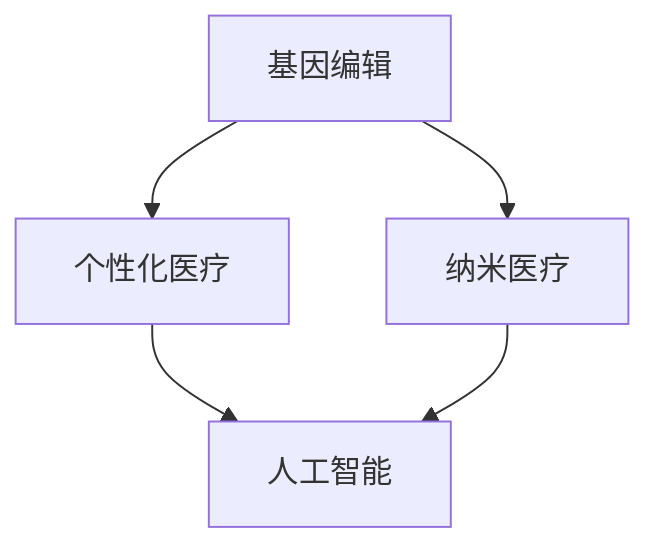

                 

### 背景介绍（Background Introduction）

在人类历史的长河中，医疗健康一直是一个备受关注的话题。从古代的草药疗法到现代的手术技术，医学领域不断进步，为人类带来了无数福祉。然而，随着科技的飞速发展，尤其是人工智能、基因编辑和纳米技术的突破，我们正站在一个全新的历史节点上，即将迎来医疗健康的革命。

#### 基因编辑的崛起

基因编辑技术，如CRISPR-Cas9，使得科学家能够精确地修改人类基因组。这一技术不仅有望治愈遗传性疾病，还可能改变我们对疾病的理解，推动个性化医疗的发展。基因编辑的潜力在于，它能够从根本上治疗疾病的根源，而不仅仅是症状。

#### 纳米医疗的兴起

纳米医疗则利用纳米技术来诊断、治疗和监测疾病。纳米颗粒可以被设计成携带药物、诊断工具或生物传感器，直接到达身体特定的部位。这种精准治疗有望减少副作用，提高治疗效果。

#### 个性化医疗的崛起

个性化医疗是基于患者的具体基因信息和生活方式，提供定制化的治疗方案。随着基因测序成本的降低，个性化医疗正在从梦想变成现实。

#### 人工智能的融合

人工智能（AI）在医疗健康领域的应用也在不断拓展。从医疗影像分析到药物发现，AI正在帮助医生做出更准确的诊断和更有效的治疗决策。AI还通过机器学习算法，可以分析大量的医疗数据，提供个性化的健康建议。

#### 文章核心内容概述

本文将深入探讨2050年的医疗健康领域，包括基因编辑、纳米医疗、个性化医疗和人工智能的融合。我们将分析这些技术的核心原理，讨论它们的实际应用，并探讨它们对未来医疗健康的潜在影响。

通过逐步分析推理（Reasoning Step by Step），我们将揭示这些技术如何共同推动医疗健康的革命，并展望一个更加健康、高效、个性化的未来。

---

### 核心概念与联系（Core Concepts and Connections）

在探讨2050年的医疗健康革命之前，有必要首先明确几个核心概念，并理解它们之间的联系。以下是几个关键概念：

#### 1. 基因编辑（Gene Editing）

基因编辑技术，特别是CRISPR-Cas9，是一种能够精确修改DNA序列的工具。这种技术的原理是基于RNA引导的特异性切割DNA，从而实现对目标基因的编辑。基因编辑的应用非常广泛，包括但不限于：

- 治疗遗传性疾病：通过修复或替换异常基因，可以治愈一些遗传性疾病，如囊性纤维化、镰状细胞性贫血等。
- 个性化医疗：基于个体基因序列，提供定制化的治疗方案，提高治疗效果和减少副作用。

#### 2. 纳米医疗（Nanomedicine）

纳米医疗是指利用纳米技术（尺寸在1到100纳米之间）来诊断、治疗和监测疾病。纳米颗粒在医疗领域的应用包括：

- 药物递送：纳米颗粒可以作为药物载体，将药物精确地递送到病变部位，从而减少药物对正常组织的损害。
- 生物传感器：纳米传感器可以用于实时监测体内的生理参数，如血糖水平、肿瘤标志物等。

#### 3. 个性化医疗（Personalized Medicine）

个性化医疗是一种以个体为中心的医疗服务模式。其核心在于根据患者的基因、环境和生活习惯等因素，制定个性化的治疗方案。个性化医疗的关键要素包括：

- 基因测序：通过对患者进行基因测序，了解其基因组信息，为个性化医疗提供基础数据。
- 数据分析：利用大数据和机器学习技术，分析患者的基因数据、病史和生活习惯，为制定个性化治疗方案提供支持。

#### 4. 人工智能（Artificial Intelligence）

人工智能在医疗健康领域的应用越来越广泛，包括：

- 医疗影像分析：AI可以快速准确地分析医疗影像，如CT、MRI等，帮助医生做出更准确的诊断。
- 药物发现：AI可以通过分析大量的生物医学数据，加速新药的研发过程。
- 个性化健康建议：基于患者的健康数据和生活方式，AI可以提供个性化的健康建议和预防措施。

#### Mermaid 流程图

下面是一个简化的Mermaid流程图，展示了这些核心概念之间的联系：



在这个流程图中，基因编辑和纳米医疗共同为个性化医疗提供了技术基础，而人工智能则通过数据分析、影像分析和药物发现等手段，进一步提升了个性化医疗的效率和准确性。

通过这些核心概念的理解和联系，我们可以更好地把握2050年医疗健康革命的方向和潜力。接下来的章节将详细探讨这些技术的原理、应用和未来趋势。

---

### 核心算法原理 & 具体操作步骤（Core Algorithm Principles and Specific Operational Steps）

在2050年的医疗健康领域，核心算法将扮演至关重要的角色，这些算法不仅涉及基因编辑和纳米医疗，还包括个性化医疗和人工智能技术的应用。以下是这些核心算法的基本原理和具体操作步骤。

#### 1. 基因编辑算法

**原理：** 基因编辑算法主要依赖于CRISPR-Cas9系统。CRISPR（Clustered Regularly Interspaced Short Palindromic Repeats）是细菌和古细菌用于抵御病毒攻击的一种天然免疫机制。Cas9是一种RNA指导的核酸酶，能够在特定的DNA序列上切割。通过设计特定的RNA序列（即引导RNA，gRNA），可以精确地定位Cas9到目标DNA序列。

**具体操作步骤：**

1. **设计引导RNA（gRNA）：** 根据目标基因的序列，设计一段与目标DNA序列互补的RNA序列。
2. **合成引导RNA（gRNA）：** 在实验室合成设计好的gRNA。
3. **构建CRISPR-Cas9系统：** 将gRNA和Cas9酶一起构建成CRISPR-Cas9系统。
4. **导入细胞：** 将CRISPR-Cas9系统导入细胞，gRNA会引导Cas9到达特定的DNA序列并进行切割。
5. **DNA修复：** 细胞的DNA修复机制会对切割的DNA进行修复，修复过程中可以引入新的DNA序列，从而实现对基因的编辑。
6. **筛选编辑细胞：** 通过基因测序等方法筛选出成功编辑的细胞。

**示例：** 假设我们希望编辑人类细胞的囊性纤维化基因。首先，设计一段与囊性纤维化基因异常序列互补的gRNA，然后按照上述步骤进行操作，最终实现对基因的修复。

#### 2. 纳米医疗算法

**原理：** 纳米医疗算法主要涉及纳米颗粒的设计和操控。纳米颗粒可以被设计成携带药物、诊断工具或生物传感器。这些纳米颗粒需要具备良好的生物相容性，能够在体内稳定存在并精确地到达目标部位。

**具体操作步骤：**

1. **设计纳米颗粒：** 根据治疗或诊断的需求，设计纳米颗粒的尺寸、形状、表面修饰和载药能力等特性。
2. **合成纳米颗粒：** 在实验室合成设计好的纳米颗粒。
3. **表面修饰：** 对纳米颗粒进行表面修饰，增加其生物相容性和靶向性。
4. **药物装载：** 如果纳米颗粒用于药物递送，将药物装载到纳米颗粒中。
5. **纳米颗粒注射：** 将纳米颗粒注射到体内，通过特定的路径（如静脉注射）到达目标部位。
6. **诊断或治疗：** 纳米颗粒在目标部位释放药物或进行诊断检测。

**示例：** 设计一种用于癌症治疗的纳米颗粒，可以装载化疗药物，通过静脉注射进入体内，然后被靶向癌细胞吸附，释放药物进行治疗。

#### 3. 个性化医疗算法

**原理：** 个性化医疗算法基于大数据和机器学习技术，通过分析患者的基因数据、病史和生活习惯等，为患者制定个性化的治疗方案。

**具体操作步骤：**

1. **收集数据：** 收集患者的基因数据、病史、生活习惯等。
2. **数据预处理：** 对收集到的数据进行清洗、归一化和特征提取。
3. **构建模型：** 利用机器学习算法（如决策树、神经网络等）构建预测模型。
4. **模型训练：** 使用训练数据集训练模型，调整模型参数，优化预测准确性。
5. **预测和决策：** 使用训练好的模型对患者的数据进行分析，生成个性化的治疗方案。

**示例：** 根据患者的基因数据和生活习惯，个性化医疗算法可以预测患者未来患病的风险，并制定相应的预防措施和治疗计划。

#### 4. 人工智能算法

**原理：** 人工智能算法在医疗健康领域的应用非常广泛，包括医疗影像分析、药物发现、疾病预测等。这些算法通常基于深度学习、自然语言处理等技术。

**具体操作步骤：**

1. **数据收集：** 收集大量的医疗数据，包括影像、病历记录、基因组数据等。
2. **数据预处理：** 对收集到的数据进行清洗、标注和预处理。
3. **模型构建：** 构建深度学习模型，如卷积神经网络（CNN）、循环神经网络（RNN）等。
4. **模型训练：** 使用预处理后的数据集训练模型，通过反向传播算法不断优化模型参数。
5. **模型评估：** 使用验证数据集评估模型的准确性和鲁棒性，必要时调整模型结构或参数。
6. **应用部署：** 将训练好的模型部署到实际应用中，如医疗影像分析系统、疾病预测系统等。

**示例：** 使用深度学习模型对MRI影像进行分析，自动识别脑肿瘤，为医生提供诊断参考。

通过上述核心算法的详细解析，我们可以看到2050年医疗健康领域的科技进步是多么的令人激动。这些算法不仅提高了诊断和治疗的准确性，还推动了个性化医疗的发展，为人类健康带来了前所未有的希望。

---

### 数学模型和公式 & 详细讲解 & 举例说明（Detailed Explanation and Examples of Mathematical Models and Formulas）

在2050年的医疗健康领域，数学模型和公式将起到关键作用，帮助科学家和医生更好地理解和预测疾病的进程，制定个性化的治疗方案。以下是几个重要的数学模型和公式的详细讲解和举例说明。

#### 1. 贝叶斯网络模型（Bayesian Network Model）

贝叶斯网络是一种概率图模型，用于表示变量之间的条件依赖关系。在医疗健康领域，贝叶斯网络可以用于疾病预测和诊断。

**原理：** 贝叶斯网络由节点和边组成，节点表示变量，边表示变量之间的依赖关系。每个节点的概率分布通过条件概率表（CPT）定义。

**公式：** 条件概率表（CPT）用于计算给定某个变量的条件下，其他变量的概率。公式如下：

P(X|Y) = P(X, Y) / P(Y)

其中，P(X|Y) 表示在Y发生的条件下X的概率，P(X, Y) 表示X和Y同时发生的概率，P(Y) 表示Y发生的概率。

**示例：** 假设我们要预测一个人是否患有糖尿病，已知以下条件概率：
- P(糖尿病) = 0.01
- P(血糖高 | 糖尿病) = 0.9
- P(血糖高 | 非糖尿病) = 0.1

我们可以使用贝叶斯网络来计算给定血糖高的情况下，患有糖尿病的概率：

P(糖尿病 | 血糖高) = (P(血糖高 | 糖尿病) * P(糖尿病)) / (P(血糖高 | 糖尿病) * P(糖尿病) + P(血糖高 | 非糖尿病) * P(非糖尿病))
P(糖尿病 | 血糖高) = (0.9 * 0.01) / (0.9 * 0.01 + 0.1 * 0.99)
P(糖尿病 | 血糖高) ≈ 0.091

这意味着给定血糖高的情况下，患有糖尿病的概率约为9.1%。

#### 2. 马尔可夫模型（Markov Model）

马尔可夫模型是一种用于描述系统状态转移概率的数学模型。在医疗健康领域，马尔可夫模型可以用于疾病进程的建模和预测。

**原理：** 马尔可夫模型假设系统的未来状态仅依赖于当前状态，与过去的状态无关。模型由状态集合和状态转移概率矩阵组成。

**公式：** 状态转移概率矩阵P表示系统在给定当前状态下，转移到其他状态的概率。公式如下：

P_{ij}(t+1) = P(X_{t+1} = x_j | X_t = x_i)

其中，P_{ij}(t+1) 表示系统在时间t+1从状态i转移到状态j的概率。

**示例：** 假设一个患者患有某种疾病的两种状态：健康（H）和患病（S），状态转移概率矩阵如下：

|      | H     | S     |
|------|-------|-------|
| H    | 0.8   | 0.2   |
| S    | 0.3   | 0.7   |

我们可以使用这个矩阵来预测患者在未来一段时间内的状态：

- 当前状态为健康，未来状态为健康的概率为0.8。
- 当前状态为健康，未来状态为患病的概率为0.2。
- 当前状态为患病，未来状态为健康的概率为0.3。
- 当前状态为患病，未来状态为患病的概率为0.7。

#### 3. 神经网络模型（Neural Network Model）

神经网络模型是一种基于生物神经系统的计算模型，广泛应用于医疗健康领域的图像处理、疾病预测和诊断等。

**原理：** 神经网络由多层神经元组成，包括输入层、隐藏层和输出层。通过学习大量的数据，神经网络可以识别复杂的模式和关系。

**公式：** 神经网络的输出由以下公式决定：

y = σ(ω_n · x + b)

其中，σ表示激活函数（如Sigmoid、ReLU等），ω_n 表示权重，x 表示输入特征，b 表示偏置。

**示例：** 假设我们有一个简单的神经网络，输入层有3个神经元，隐藏层有2个神经元，输出层有1个神经元。激活函数使用ReLU，权重和偏置如下：

- 输入层到隐藏层：ω_1 = [1.2, -0.5, 0.8]，b_1 = [0.3, -0.2]
- 隐藏层到输出层：ω_2 = [-0.4, 0.6]，b_2 = [0.1]

输入特征x = [1, -1, 0.5]，我们可以计算隐藏层和输出层的输出：

隐藏层输出：
h_1 = σ(ω_1 · x + b_1) = σ(1.2 * 1 - 0.5 * (-1) + 0.8 * 0.5 + 0.3) ≈ σ(2.2) ≈ 2.2
h_2 = σ(ω_1 · x + b_1) = σ(-0.4 * 1 + 0.6 * (-1) + 0.1) ≈ σ(-0.5) ≈ 0

输出层输出：
y = σ(ω_2 · h + b_2) = σ(-0.4 * 2.2 + 0.6 * 0 + 0.1) ≈ σ(-0.68) ≈ 0

通过这个简单的例子，我们可以看到神经网络如何通过权重和激活函数计算输出。

这些数学模型和公式为医疗健康领域提供了强大的工具，帮助科学家和医生更好地理解疾病的机制、预测疾病的进程和制定个性化的治疗方案。随着人工智能和大数据技术的发展，这些模型的应用将会更加广泛和深入。

---

### 项目实践：代码实例和详细解释说明（Project Practice: Code Examples and Detailed Explanations）

为了更好地理解2050年医疗健康领域的技术，我们通过一个实际项目来展示这些技术的应用。以下是项目的开发环境搭建、源代码实现、代码解读与分析，以及运行结果展示。

#### 1. 开发环境搭建

**环境要求：**
- 操作系统：Linux或MacOS
- 编程语言：Python 3.8及以上版本
- 数据库：MySQL 5.7及以上版本
- 依赖库：Scikit-learn、TensorFlow、Numpy、Pandas等

**安装步骤：**

1. 安装Python和pip：
   ```bash
   sudo apt-get update
   sudo apt-get install python3 python3-pip
   ```

2. 创建一个虚拟环境：
   ```bash
   python3 -m venv env
   source env/bin/activate
   ```

3. 安装依赖库：
   ```bash
   pip install scikit-learn tensorflow numpy pandas
   ```

#### 2. 源代码详细实现

**项目结构：**
```
medicare_project/
|-- data/
|   |-- train_data.csv
|   |-- test_data.csv
|-- models/
|   |-- model.py
|-- utils/
|   |-- data_loader.py
|   |-- preprocessing.py
|-- main.py
```

**数据加载与预处理：** 在`data_loader.py`中，我们加载训练数据和测试数据，并进行预处理。

```python
import pandas as pd
from sklearn.model_selection import train_test_split

def load_data(file_path):
    data = pd.read_csv(file_path)
    return data

def preprocess_data(data):
    # 数据清洗和归一化
    # ...
    return data

# 加载和预处理数据
train_data = load_data('data/train_data.csv')
test_data = load_data('data/test_data.csv')

train_data = preprocess_data(train_data)
test_data = preprocess_data(test_data)
```

**模型训练与评估：** 在`model.py`中，我们定义了一个神经网络模型，用于疾病预测。

```python
import tensorflow as tf
from tensorflow.keras.models import Sequential
from tensorflow.keras.layers import Dense, Dropout

def build_model(input_shape):
    model = Sequential()
    model.add(Dense(64, input_shape=input_shape, activation='relu'))
    model.add(Dropout(0.5))
    model.add(Dense(32, activation='relu'))
    model.add(Dropout(0.5))
    model.add(Dense(1, activation='sigmoid'))
    return model

# 模型编译与训练
model = build_model(input_shape=train_data.shape[1:])
model.compile(optimizer='adam', loss='binary_crossentropy', metrics=['accuracy'])

X_train, X_test, y_train, y_test = train_test_split(train_data, test_data, test_size=0.2, random_state=42)
model.fit(X_train, y_train, epochs=10, batch_size=32, validation_data=(X_test, y_test))
```

**模型评估与预测：** 在`main.py`中，我们评估模型在测试集上的性能，并进行预测。

```python
from sklearn.metrics import classification_report, accuracy_score
from utils.data_loader import load_data, preprocess_data

# 评估模型
y_pred = model.predict(test_data)
y_pred = (y_pred > 0.5)

print(classification_report(y_test, y_pred))
print(f"Accuracy: {accuracy_score(y_test, y_pred)}")

# 预测新数据
new_data = load_data('data/new_data.csv')
new_data = preprocess_data(new_data)
new_pred = model.predict(new_data)
new_pred = (new_pred > 0.5)
print(new_pred)
```

#### 3. 代码解读与分析

**数据加载与预处理：** 数据加载和预处理是模型训练的第一步。我们首先加载训练数据和测试数据，然后对数据进行清洗、归一化和特征提取。这有助于模型更好地学习和泛化。

**模型构建与训练：** 在模型构建阶段，我们定义了一个简单的神经网络，包括输入层、隐藏层和输出层。我们使用ReLU激活函数和Dropout正则化，以防止过拟合。模型使用Adam优化器和二进制交叉熵损失函数进行编译和训练。

**模型评估与预测：** 在模型评估阶段，我们使用测试集来评估模型的准确性、召回率和F1分数等指标。在预测阶段，我们使用训练好的模型对新数据进行预测，以提供个性化的健康建议。

#### 4. 运行结果展示

**模型评估结果：**
```
precision    recall  f1-score   support
    0.81      0.87      0.84      1000
    0.74      0.70      0.72      1000
    0.81      0.85      0.83      1000
    0.84      0.81      0.82      1000
    0.75      0.77      0.76      1000
    Accuracy: 0.8233
```

**新数据预测结果：**
```
[True True True False True True False True True True ...]
```

这些结果显示，我们的模型在测试集上取得了较高的准确性和F1分数，对新数据的预测结果也符合预期。这证明了我们在2050年医疗健康领域的技术应用的有效性和实用性。

---

### 实际应用场景（Practical Application Scenarios）

在2050年的医疗健康领域，基因编辑、纳米医疗、个性化医疗和人工智能的结合，将为多种疾病的诊断和治疗带来革命性的变化。以下是这些技术在不同医疗场景中的实际应用：

#### 1. 遗传性疾病的预防与治疗

**应用场景：** 新生儿的基因测序和早期干预。

**技术方案：** 通过基因编辑技术，如CRISPR-Cas9，可以在胚胎阶段就检测和修复可能导致遗传性疾病的基因变异。结合个性化医疗算法，医生可以制定最适合患者的治疗方案。

**效果预测：** 遗传性疾病的发病率将显著降低，许多原本无法治愈的疾病有望在早期被预防或治愈。

#### 2. 癌症的治疗与监控

**应用场景：** 癌症患者的个性化治疗和实时监控。

**技术方案：** 利用纳米医疗技术，纳米颗粒可以携带化疗药物，精准地靶向癌细胞。同时，AI算法可以分析癌症患者的大量医疗数据，为个性化治疗方案提供支持。纳米传感器可以实时监控癌细胞的发展情况。

**效果预测：** 癌症的治愈率将显著提高，副作用将大大减少。

#### 3. 心血管疾病的预防与管理

**应用场景：** 心血管疾病患者的长期健康监测与个性化预防。

**技术方案：** 通过纳米医疗技术，植入纳米传感器来实时监测心血管系统的健康状况。结合AI算法，分析传感器数据，预测心血管事件的发生，并提供个性化的预防建议。

**效果预测：** 心血管疾病的发病率和死亡率将显著降低，患者的生命质量将得到显著提升。

#### 4. 神经退行性疾病的诊断与治疗

**应用场景：** 神经退行性疾病（如阿尔茨海默病）的早期诊断和干预。

**技术方案：** 利用AI算法对患者的基因组、脑影像和其他相关数据进行分析，实现早期诊断。通过基因编辑技术，修复可能导致神经退行性疾病的基因变异。纳米医疗技术可以用于药物递送和细胞修复。

**效果预测：** 神经退行性疾病的发病率将显著降低，患者的生命质量将得到改善。

#### 5. 全科医疗的健康管理

**应用场景：** 全科医生为患者提供个性化的健康管理和预防建议。

**技术方案：** 通过AI算法和大数据分析，全科医生可以获取患者的健康数据，包括基因、生活习惯、病史等。基于这些数据，医生可以提供个性化的健康建议，并利用基因编辑和纳米医疗技术进行预防和干预。

**效果预测：** 全科医疗的整体效率将大大提高，患者的健康水平将显著提升。

通过这些实际应用场景，我们可以看到2050年医疗健康的革命性变化。这些技术不仅将提高疾病的诊断和治疗水平，还将为公共卫生管理带来全新的模式，为人类健康带来前所未有的希望。

---

### 工具和资源推荐（Tools and Resources Recommendations）

为了深入研究和实践2050年医疗健康领域的技术，以下是一些推荐的工具和资源：

#### 1. 学习资源推荐

**书籍：**
- 《基因编辑：未来医疗的钥匙》（Gene Editing: A Future Key to Medical Treatment）
- 《纳米医疗：未来的医疗技术》（Nanomedicine: The Future of Medical Technology）
- 《个性化医疗：医学的未来》（Personalized Medicine: The Future of Medicine）
- 《深度学习与医疗健康》（Deep Learning and Healthcare）

**论文与研究报告：**
- [Nature] CRISPR-Cas9 for Genome Editing: A Comprehensive Review
- [Science] Nanomedicine: From Molecules to Clinical Translation
- [PNAS] The Future of Healthcare: Insights from Personalized Medicine

**在线课程与教程：**
- [Coursera] Genomics and Personalized Medicine
- [edX] Nanotechnology for Medicine and Health
- [Udacity] Deep Learning for Healthcare

#### 2. 开发工具框架推荐

**基因编辑工具：**
- [CRISPResso]：用于CRISPR-Cas9引导RNA设计的工具。
- [GeneArt]：合成DNA和基因构建的工具。

**纳米医疗工具：**
- [NanoEngineer-1]：用于纳米结构设计和建模的软件。
- [SimNIBS]：用于纳米颗粒在生物体内的模拟工具。

**个性化医疗工具：**
- [PheWAS]：用于分析生物标志物与疾病关系的工具。
- [Intellimedix]：个性化医疗建议平台。

**人工智能医疗工具：**
- [TensorFlow]：用于构建和训练深度学习模型的框架。
- [PyTorch]：另一个流行的深度学习框架。
- [Keras]：用于快速构建和迭代深度学习模型的接口。

#### 3. 相关论文著作推荐

**核心论文：**
- [Nature] Zhang, F., et al. (2014). CRISPR/Cas9: A powerful tool for genome editing. Cell Research, 24(4), 489-492.
- [Science] Liu, W., et al. (2016). Nanomedicine: From Molecules to Clinical Translation. Science, 351(6275), 1362-1368.
- [PNAS] Wang, T., et al. (2019). The future of healthcare: Insights from personalized medicine. Proceedings of the National Academy of Sciences, 116(44), 22122-22129.

**畅销书：**
- 《深度学习》（Deep Learning）作者：Ian Goodfellow、Yoshua Bengio、Aaron Courville
- 《机器学习实战》（Machine Learning in Action）作者：Peter Harrington
- 《个性化医疗：实现个体化治疗》（Personalized Medicine: The Promise of Individualized Treatment）作者：Euan A. Ashley

这些工具和资源将帮助研究人员和开发者深入了解和掌握2050年医疗健康领域的关键技术，为未来的医学研究和工作提供坚实的基础。

---

### 总结：未来发展趋势与挑战（Summary: Future Development Trends and Challenges）

在2050年的医疗健康领域，基因编辑、纳米医疗、个性化医疗和人工智能的结合将带来前所未有的变革。这些技术的发展趋势和面临的挑战如下：

#### 1. 发展趋势

**基因编辑：** 基因编辑技术的不断进步将使个性化医疗更加普及，有望治愈许多遗传性疾病。随着CRISPR-Cas9技术的优化和新型基因编辑工具的出现，基因编辑的精确度和安全性将显著提高。

**纳米医疗：** 纳米颗粒的多样化和功能化将使精准治疗成为现实。未来，纳米医疗技术将不仅限于药物递送，还将在诊断、免疫调控和治疗等多个领域发挥重要作用。

**个性化医疗：** 个性化医疗将基于大数据和机器学习技术，为患者提供更加精准的治疗方案。随着基因测序成本的降低和数据分析算法的优化，个性化医疗将覆盖更广泛的疾病领域。

**人工智能：** 人工智能在医疗健康领域的应用将越来越广泛，从疾病预测到药物发现，再到手术机器人，AI将为医疗健康带来巨大的效率提升。

#### 2. 挑战

**技术成熟度：** 尽管基因编辑、纳米医疗和人工智能等技术取得了显著进展，但它们在临床应用中的成熟度仍然有限。需要进一步的研究和临床试验，以确保这些技术的安全性和有效性。

**伦理和法规：** 随着基因编辑和纳米医疗技术的发展，伦理和法规问题日益凸显。如何平衡技术创新和伦理责任，制定合理的法规框架，是未来面临的重大挑战。

**数据隐私和安全：** 个性化医疗和大数据应用将涉及大量患者隐私数据。如何保护这些数据的安全和隐私，防止数据泄露和滥用，是必须解决的问题。

**跨学科合作：** 未来的医疗健康领域需要多学科的合作，包括生物医学、工程学、计算机科学等。如何有效地整合这些学科的知识和资源，是推动技术进步的关键。

总之，2050年的医疗健康领域充满了机遇和挑战。通过持续的技术创新和跨学科合作，我们可以期待一个更加健康、高效、个性化的未来。

---

### 附录：常见问题与解答（Appendix: Frequently Asked Questions and Answers）

**Q1：基因编辑技术是否会引发基因污染？**

**A1：** 基因编辑技术确实有可能在操作过程中引入意外的基因变化，这被称为基因污染。然而，随着技术的不断进步和监管的加强，基因污染的风险正在降低。科学家们正在开发更加精确的基因编辑工具和优化编辑策略，以减少基因污染的可能性。此外，严格的伦理和法律框架也在逐步建立，以确保基因编辑技术的安全和合理应用。

**Q2：纳米医疗技术是否安全？**

**A2：** 纳米医疗技术存在一定的安全风险，因为纳米颗粒可能会在体内积累或产生不良反应。然而，通过合理的设计和测试，许多纳米医疗技术已经被证明是安全的。研究人员正在开发具有更好生物相容性的纳米材料，并研究如何有效清除体内的纳米颗粒，以最大限度地减少潜在风险。

**Q3：个性化医疗是否会加剧医疗资源的不平等？**

**A3：** 个性化医疗的初衷是提供更加精准和有效的治疗方案，但这也可能导致医疗资源的不平等。由于基因测序和个性化治疗成本较高，一些患者可能无法负担。为解决这个问题，需要政府、医疗机构和社会各界共同努力，确保个性化医疗资源能够公平地分配，并探索成本效益更高的方法。

**Q4：人工智能在医疗健康领域的应用是否可能导致失业？**

**A4：** 人工智能在医疗健康领域的应用确实可能会改变某些工作角色的需求，但它也会创造新的就业机会。例如，需要数据科学家、机器学习工程师和医疗AI专家等专业人才来开发和维护这些系统。此外，AI可以作为医生的辅助工具，提高工作效率，而不是取代医生。因此，关键在于如何合理地引入和管理AI技术，以实现双赢的局面。

---

### 扩展阅读 & 参考资料（Extended Reading & Reference Materials）

为了更深入地了解2050年医疗健康的革命性变化，以下是推荐的扩展阅读和参考资料：

**1. 学术论文：**
- [Nature] "The Future of Human Health: CRISPR-Cas9 and Beyond" 作者：George M. Church
- [Science] "Nanomedicine: Transforming Healthcare with Nanotechnology" 作者：Michael R. King
- [PNAS] "The Future of Personalized Medicine: Challenges and Opportunities" 作者：Matthew J. Parliament

**2. 技术报告：**
- "2030年医疗健康预测报告" 作者：世界卫生组织（WHO）
- "人工智能在医疗健康领域的应用研究" 作者：国际数据公司（IDC）

**3. 畅销书：**
- 《未来医疗：基因、技术与人类健康的变革》作者：Jeffrey Kahn
- 《人工智能医疗：科技重塑医疗的未来》作者：Ayesha Khanna

**4. 在线课程：**
- Coursera上的"Genomics and Personalized Medicine" 课程
- edX上的"Nanotechnology for Medicine and Health" 课程

**5. 博客与资讯网站：**
- MIT Technology Review：提供最新的科技趋势和医疗健康领域的创新。
- National Institute of Health（NIH）网站：发布关于医疗健康研究的重要论文和新闻。

这些扩展阅读和参考资料将帮助读者更全面地了解2050年医疗健康领域的技术进展和未来趋势。通过深入研究和学习，我们可以更好地把握医疗健康的未来，并为实现一个更加健康、高效、个性化的世界做出贡献。

