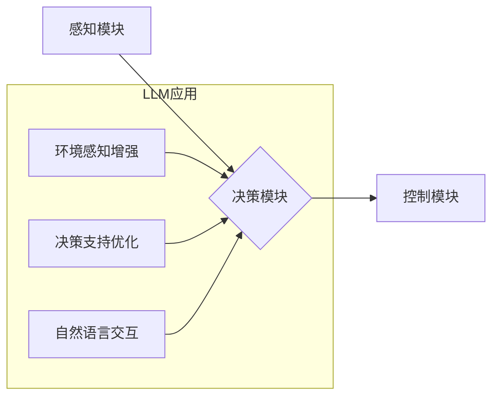

                 

## LLM与自动驾驶：AI重塑交通未来

> 关键词：大型语言模型（LLM）、自动驾驶、人工智能、交通安全、数据分析、自然语言处理

## 1. 背景介绍

交通运输是现代社会不可或缺的一部分，然而，传统的交通系统面临着诸多挑战，例如交通拥堵、交通事故、环境污染等。自动驾驶技术作为一项颠覆性的创新，被认为是解决这些问题的关键。自动驾驶技术利用传感器、计算机视觉、机器学习等技术，使车辆能够感知周围环境、做出决策并自动行驶。近年来，随着人工智能（AI）技术的快速发展，特别是大型语言模型（LLM）的出现，自动驾驶技术取得了长足的进步。

LLM 是一种强大的深度学习模型，能够理解和生成人类语言。它在自然语言处理（NLP）领域取得了突破性的进展，例如机器翻译、文本摘要、对话系统等。将 LLM 应用于自动驾驶，可以为车辆提供更丰富的环境感知能力、更智能的决策支持和更自然的交互体验。

## 2. 核心概念与联系

### 2.1 自动驾驶技术

自动驾驶技术是指车辆能够感知周围环境、做出决策并自动行驶的技术。它主要包括以下几个核心模块：

* **感知模块:** 利用传感器（如摄像头、雷达、激光雷达）获取车辆周围环境的信息，包括道路状况、其他车辆、行人等。
* **决策模块:** 基于感知模块获取的信息，分析环境，做出行驶决策，例如转向、加速、减速等。
* **控制模块:** 将决策模块的指令转化为车辆的实际动作，控制车辆的转向、加速、减速等。

### 2.2 大型语言模型（LLM）

LLM 是一种基于深度学习的强大语言模型，能够理解和生成人类语言。它通过训练大量的文本数据，学习语言的语法、语义和上下文关系。LLM 的核心特点包括：

* **强大的文本理解能力:** 能够理解复杂的句子结构和语义关系。
* **丰富的文本生成能力:** 能够生成流畅、自然的文本，例如文章、对话、诗歌等。
* **泛化能力强:** 能够应用于多种自然语言处理任务，例如机器翻译、文本摘要、问答系统等。

### 2.3 LLM与自动驾驶的结合

将 LLM 应用于自动驾驶，可以为车辆提供更丰富的环境感知能力、更智能的决策支持和更自然的交互体验。

* **环境感知增强:** LLM 可以分析道路标线、交通信号灯、交通标志等文本信息，为车辆提供更全面的环境感知。
* **决策支持优化:** LLM 可以理解驾驶员的意图，并根据上下文信息提供更智能的决策建议。
* **自然语言交互:** LLM 可以使车辆能够理解驾驶员的语音指令，并以自然语言进行交互。

**Mermaid 流程图**



## 3. 核心算法原理 & 具体操作步骤

### 3.1 算法原理概述

LLM 在自动驾驶中的应用主要基于以下核心算法：

* **Transformer网络:** Transformer 网络是一种深度学习模型，能够有效地处理序列数据，例如文本和语音。它通过注意力机制，能够捕捉文本中的长距离依赖关系，从而提高文本理解和生成能力。
* **强化学习:** 强化学习是一种机器学习算法，通过奖励机制训练模型，使其在特定环境中做出最优决策。在自动驾驶领域，强化学习可以训练车辆在复杂交通场景中做出安全和高效的决策。
* **图神经网络:** 图神经网络是一种能够处理图结构数据的深度学习模型。在自动驾驶领域，图神经网络可以用于建模车辆之间的关系，例如车流、交通拥堵等，从而提高车辆的决策能力。

### 3.2 算法步骤详解

**1. 数据收集和预处理:** 收集大量自动驾驶数据，包括图像、视频、传感器数据、地图数据等。对数据进行预处理，例如图像增强、数据清洗、数据标注等。

**2. 模型训练:** 使用 Transformer 网络、强化学习算法和图神经网络等算法，对自动驾驶数据进行训练，训练模型能够感知环境、做出决策并控制车辆。

**3. 模型评估和优化:** 使用测试数据评估模型的性能，例如准确率、召回率、平均行驶距离等。根据评估结果，对模型进行优化，例如调整模型参数、增加训练数据等。

**4. 模型部署:** 将训练好的模型部署到自动驾驶车辆中，使车辆能够自动行驶。

### 3.3 算法优缺点

**优点:**

* **强大的环境感知能力:** LLM 可以分析文本信息，为车辆提供更全面的环境感知。
* **智能决策支持:** LLM 可以理解驾驶员意图，提供更智能的决策建议。
* **自然语言交互:** LLM 使车辆能够理解驾驶员语音指令，实现更自然的交互体验。

**缺点:**

* **数据依赖性强:** LLM 需要大量的文本数据进行训练，数据质量和数量直接影响模型性能。
* **计算资源消耗大:** LLM 模型参数量大，训练和推理过程需要大量的计算资源。
* **安全性和可靠性:** LLM 模型在自动驾驶中的应用还存在一些安全性和可靠性问题，需要进一步研究和解决。

### 3.4 算法应用领域

LLM 在自动驾驶领域的应用前景广阔，例如：

* **自动驾驶决策支持:** LLM 可以帮助车辆理解交通规则、预测其他车辆的行为，并做出更安全和高效的决策。
* **车辆与人交互:** LLM 可以使车辆能够理解驾驶员的语音指令，并以自然语言进行交互，提高驾驶体验。
* **自动驾驶地图构建:** LLM 可以分析地图数据和交通信息，构建更精准和详细的自动驾驶地图。

## 4. 数学模型和公式 & 详细讲解 & 举例说明

### 4.1 数学模型构建

LLM 的核心数学模型是 Transformer 网络，它基于注意力机制，能够捕捉文本中的长距离依赖关系。Transformer 网络的结构可以分为以下几个部分：

* **编码器:** 将输入文本序列编码成一个向量表示。
* **解码器:** 根据编码器的输出，生成目标文本序列。
* **注意力机制:** 用于捕捉文本中的长距离依赖关系。

### 4.2 公式推导过程

Transformer 网络的注意力机制使用以下公式计算注意力权重：

$$
\text{Attention}(Q, K, V) = \text{softmax}\left(\frac{Q K^T}{\sqrt{d_k}}\right) V
$$

其中：

* $Q$ 是查询矩阵，表示当前词的上下文信息。
* $K$ 是键矩阵，表示所有词的上下文信息。
* $V$ 是值矩阵，表示所有词的语义信息。
* $d_k$ 是键向量的维度。

### 4.3 案例分析与讲解

例如，在自动驾驶场景中，LLM 可以分析道路标线、交通信号灯、交通标志等文本信息，并根据这些信息预测车辆的下一步行驶路线。

假设车辆当前位置处的道路标线为“直线”，交通信号灯为“绿灯”，交通标志为“限速60km/h”。LLM 可以使用注意力机制，将这些文本信息与车辆的历史行驶数据和地图数据进行关联，并预测车辆下一步行驶路线为“直线行驶”。

## 5. 项目实践：代码实例和详细解释说明

### 5.1 开发环境搭建

* **操作系统:** Ubuntu 20.04
* **编程语言:** Python 3.8
* **深度学习框架:** TensorFlow 2.0
* **其他工具:** Git, Jupyter Notebook

### 5.2 源代码详细实现

```python
# 导入必要的库
import tensorflow as tf

# 定义 Transformer 网络模型
class Transformer(tf.keras.Model):
    def __init__(self, vocab_size, embedding_dim, num_heads, num_layers):
        super(Transformer, self).__init__()
        self.embedding = tf.keras.layers.Embedding(vocab_size, embedding_dim)
        self.transformer_layers = tf.keras.layers.StackedRNNCells([
            tf.keras.layers.MultiHeadAttention(num_heads=num_heads, key_dim=embedding_dim)
            for _ in range(num_layers)
        ])

    def call(self, inputs):
        # 将输入文本序列编码成向量表示
        embedded_inputs = self.embedding(inputs)
        # 使用 Transformer 层进行编码
        encoded_outputs = self.transformer_layers(embedded_inputs)
        return encoded_outputs

# 实例化 Transformer 模型
model = Transformer(vocab_size=10000, embedding_dim=128, num_heads=8, num_layers=6)

# 训练模型
# ...

# 使用模型进行预测
# ...
```

### 5.3 代码解读与分析

* **模型定义:** 代码定义了一个名为 `Transformer` 的类，该类继承自 `tf.keras.Model`，实现了 Transformer 网络模型。
* **嵌入层:** `embedding` 层将输入文本序列转换为向量表示。
* **Transformer 层:** `transformer_layers` 层使用多头注意力机制进行编码，捕捉文本中的长距离依赖关系。
* **模型训练:** 代码中省略了模型训练部分，实际训练需要使用训练数据和优化算法。
* **模型预测:** 代码中省略了模型预测部分，实际预测需要将输入文本序列输入到模型中，得到输出向量表示。

### 5.4 运行结果展示

模型训练完成后，可以使用测试数据评估模型的性能，例如准确率、召回率等。

## 6. 实际应用场景

LLM 在自动驾驶领域的应用场景非常广泛，例如：

* **自动驾驶决策支持:** LLM 可以帮助车辆理解交通规则、预测其他车辆的行为，并做出更安全和高效的决策。
* **车辆与人交互:** LLM 可以使车辆能够理解驾驶员的语音指令，并以自然语言进行交互，提高驾驶体验。
* **自动驾驶地图构建:** LLM 可以分析地图数据和交通信息，构建更精准和详细的自动驾驶地图。

### 6.4 未来应用展望

随着 LLM 技术的不断发展，其在自动驾驶领域的应用将更加广泛和深入，例如：

* **更智能的驾驶员辅助系统:** LLM 可以帮助驾驶员更好地理解周围环境，并提供更精准的驾驶建议。
* **更安全的自动驾驶系统:** LLM 可以帮助自动驾驶系统更好地理解交通规则和道路状况，从而提高安全性。
* **更个性化的自动驾驶体验:** LLM 可以根据驾驶员的喜好和需求，提供更个性化的自动驾驶体验。

## 7. 工具和资源推荐

### 7.1 学习资源推荐

* **书籍:**
    * 《深度学习》 by Ian Goodfellow, Yoshua Bengio, and Aaron Courville
    * 《自然语言处理》 by Dan Jurafsky and James H. Martin
* **在线课程:**
    * Coursera: Deep Learning Specialization
    * Stanford CS224N: Natural Language Processing with Deep Learning
* **博客和网站:**
    * The Gradient
    * Towards Data Science

### 7.2 开发工具推荐

* **深度学习框架:** TensorFlow, PyTorch
* **自然语言处理库:** NLTK, spaCy
* **代码编辑器:** VS Code, Atom

### 7.3 相关论文推荐

* **Attention Is All You Need:** https://arxiv.org/abs/1706.03762
* **BERT: Pre-training of Deep Bidirectional Transformers for Language Understanding:** https://arxiv.org/abs/1810.04805

## 8. 总结：未来发展趋势与挑战

### 8.1 研究成果总结

LLM 在自动驾驶领域的应用取得了显著进展，例如：

* **环境感知增强:** LLM 可以分析文本信息，为车辆提供更全面的环境感知。
* **智能决策支持:** LLM 可以理解驾驶员意图，提供更智能的决策建议。
* **自然语言交互:** LLM 使车辆能够理解驾驶员语音指令，实现更自然的交互体验。

### 8.2 未来发展趋势

LLM 在自动驾驶领域的应用未来将朝着以下方向发展：

* **更强大的模型:** 研究人员将继续开发更强大的 LLMs，例如更大的模型参数、更复杂的模型架构。
* **更广泛的应用场景:** LLM 将应用于更多自动驾驶场景，例如自动泊车、自动换道、自动驾驶员辅助系统等。
* **更安全的应用:** 研究人员将致力于解决 LLM 在自动驾驶中的安全性和可靠性问题。

### 8.3 面临的挑战

LLM 在自动驾驶领域的应用仍然面临一些挑战：

* **数据依赖性强:** LLM 需要大量的文本数据进行训练，数据质量和数量直接影响模型性能。
* **计算资源消耗大:** LLM 模型参数量大，训练和推理过程需要大量的计算资源。
* **安全性和可靠性:** LLM 模型在自动驾驶中的应用还存在一些安全性和可靠性问题，需要进一步研究和解决。

### 8.4 研究展望

未来，LLM 在自动驾驶领域的应用将继续深入发展，为我们带来更安全、更智能、更便捷的出行体验。


## 9. 附录：常见问题与解答

**1. LLM 在自动驾驶中的应用有哪些优势？**

LLM 在自动驾驶中的应用优势包括：

* **强大的环境感知能力:** LLM 可以分析文本信息，为车辆提供更全面的环境感知。
* **智能决策支持:** LLM 可以理解驾驶员意图，提供更智能的决策建议。
* **自然语言交互:** LLM 使车辆能够理解驾驶员语音指令，实现更自然的交互体验。

**2. LLM 在自动驾驶中的应用有哪些挑战？**

LLM 在自动驾驶中的应用仍然面临一些挑战：

* **数据依赖性强:** LLM 需要大量的文本数据进行训练，数据质量和数量直接影响模型性能。
* **计算资源消耗大:** LLM 模型参数量大，训练和推理过程需要大量的计算资源。
* **安全性和可靠性:** LLM 模型在自动驾驶中的应用还存在一些安全性和可靠性问题，需要进一步研究和解决。

**3. 如何评估 LLM 在自动驾驶中的性能？**

LLM 在自动驾驶中的性能可以评估以下指标：

* **准确率:** 模型预测的准确率。
* **召回率:** 模型能够识别所有目标的比例。
* **平均行驶距离:** 模型能够行驶的平均距离。

**4. 未来 LLM 在自动驾驶领域的应用趋势是什么？**

未来 LLM 在自动驾驶领域的应用将朝着以下方向发展：

* **更强大的模型:** 研究人员将继续开发更强大的 LLMs，例如更大的模型参数、更复杂的模型架构。
* **更广泛的应用场景:** LLM 将应用于更多自动驾驶场景，例如自动泊车、自动换道、自动驾驶员辅助系统等。
* **更安全的应用:** 研究人员将致力于解决 LLM 在自动驾驶中的安全性和可靠性问题。


作者：禅与计算机程序设计艺术 / Zen and the Art of Computer Programming 
<end_of_turn>

