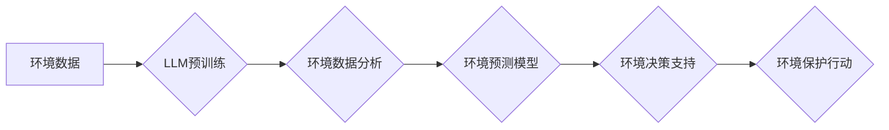

                 

## LLM在环境保护中的应用：数据分析与预测

> 关键词：LLM、环境保护、数据分析、预测模型、气候变化、可持续发展、机器学习、自然语言处理

## 1. 背景介绍

全球环境问题日益严峻，气候变化、资源枯竭、污染加剧等挑战对人类社会和生态系统构成重大威胁。传统环境监测和管理方法面临着数据获取困难、分析效率低、预测精度不足等问题。近年来，随着深度学习和自然语言处理技术的飞速发展，大型语言模型（LLM）应运而生，展现出强大的数据处理和模式识别能力，为环境保护领域提供了新的解决方案。

LLM 是一种基于 Transformer 架构的深度神经网络，能够理解和生成人类语言，并具备强大的文本处理能力。其在自然语言理解、文本生成、机器翻译等领域取得了突破性进展，也为环境保护领域带来了新的机遇。

## 2. 核心概念与联系

### 2.1  LLM 的核心概念

LLM 是一种基于 Transformer 架构的深度神经网络，其核心概念包括：

* **Transformer 架构:** Transformer 架构是一种新型的神经网络架构，能够有效处理序列数据，例如文本。其核心组件是注意力机制，能够捕捉文本中不同词语之间的关系，从而更好地理解文本语义。
* **自回归语言模型:** LLM 通常采用自回归语言模型的方式进行训练，即根据输入序列预测下一个词语。通过大量的文本数据训练，LLM 可以学习到语言的语法规则、语义关系和知识结构。
* **预训练和微调:** LLM 通常采用预训练和微调的方式进行训练。预训练阶段，LLM 在大量的文本数据上进行训练，学习到通用的语言表示。微调阶段，LLM 在特定任务的数据上进行训练，例如环境监测、预测模型等。

### 2.2  LLM 与环境保护的联系

LLM 在环境保护领域具有广泛的应用前景，主要体现在以下几个方面：

* **环境数据分析:** LLM 可以处理海量环境数据，例如气象数据、水质数据、土壤数据等，并从中提取有价值的信息，例如环境污染趋势、气候变化模式等。
* **环境预测模型:** LLM 可以构建环境预测模型，例如预测空气污染、水资源枯竭、森林火灾等事件的发生概率和影响范围。
* **环境政策制定:** LLM 可以帮助政府和相关机构制定环境政策，例如制定污染控制措施、制定资源管理计划等。
* **公众环境意识提升:** LLM 可以用于开发环境教育软件、环境宣传平台等，提高公众的环境意识和参与度。

### 2.3  LLM 应用架构

## 3. 核心算法原理 & 具体操作步骤

### 3.1  算法原理概述

LLM 的核心算法原理是基于 Transformer 架构的深度学习模型，其主要包括以下几个方面：

* **注意力机制:** 注意力机制能够捕捉文本中不同词语之间的关系，从而更好地理解文本语义。
* **多头注意力:** 多头注意力机制能够从多个角度捕捉文本信息，提高模型的理解能力。
* **位置编码:** 位置编码能够为文本中的每个词语赋予位置信息，帮助模型理解词语在句子中的顺序关系。
* **前馈神经网络:** 前馈神经网络能够对文本信息进行非线性变换，提取更深层次的特征。

### 3.2  算法步骤详解

LLM 的训练过程主要包括以下几个步骤：

1. **数据预处理:** 将环境数据进行清洗、格式化和编码，使其能够被模型理解。
2. **模型构建:** 根据 Transformer 架构构建 LLM 模型，并设置模型参数。
3. **预训练:** 在大量的环境文本数据上进行预训练，学习到通用的语言表示。
4. **微调:** 在特定环境任务的数据上进行微调，例如环境预测、环境分类等。
5. **模型评估:** 使用测试数据评估模型的性能，例如准确率、召回率、F1-score 等。

### 3.3  算法优缺点

**优点:**

* 强大的文本处理能力，能够理解和生成人类语言。
* 能够处理海量数据，并从中提取有价值的信息。
* 能够构建准确的预测模型，预测环境事件的发生概率和影响范围。

**缺点:**

* 训练成本高，需要大量的计算资源和数据。
* 模型解释性差，难以理解模型的决策过程。
* 对数据质量要求高，模型性能受数据质量影响较大。

### 3.4  算法应用领域

LLM 在环境保护领域具有广泛的应用前景，例如：

* **环境监测:** 预测空气污染、水质污染、土壤污染等事件的发生概率和影响范围。
* **气候变化研究:** 分析气候变化数据，预测未来气候变化趋势。
* **资源管理:** 预测资源枯竭风险，制定资源管理计划。
* **生物多样性保护:** 分析生物多样性数据，识别濒危物种和保护区。

## 4. 数学模型和公式 & 详细讲解 & 举例说明

### 4.1  数学模型构建

LLM 的训练过程可以看作是一个优化问题，目标是找到模型参数，使得模型在训练数据上的损失函数最小。损失函数通常采用交叉熵损失函数，用于衡量模型预测结果与真实标签之间的差异。

### 4.2  公式推导过程

交叉熵损失函数的公式如下：

$$
L = -\sum_{i=1}^{N} y_i \log(\hat{y}_i)
$$

其中：

* $N$ 是样本数量。
* $y_i$ 是真实标签。
* $\hat{y}_i$ 是模型预测结果。

### 4.3  案例分析与讲解

假设我们训练一个 LLM 模型用于预测空气污染等级。训练数据包含历史空气质量数据和相应的污染等级标签。模型训练完成后，我们可以使用测试数据评估模型的性能。例如，如果模型预测某天空气污染等级为“重污染”，而实际空气污染等级为“重污染”，则模型预测正确。

## 5. 项目实践：代码实例和详细解释说明

### 5.1  开发环境搭建

LLM 的开发环境通常需要安装 Python、深度学习框架（例如 TensorFlow、PyTorch）以及其他必要的库。

### 5.2  源代码详细实现

LLM 的源代码实现通常比较复杂，需要根据具体任务和模型架构进行定制。

### 5.3  代码解读与分析

代码解读需要根据代码结构和功能进行分析，理解代码的逻辑流程和实现机制。

### 5.4  运行结果展示

运行结果展示需要根据模型的预测结果进行分析，例如绘制预测曲线、展示预测精度等。

## 6. 实际应用场景

### 6.1  环境监测

LLM 可以用于分析气象数据、水质数据、土壤数据等，预测环境污染事件的发生概率和影响范围。例如，可以预测空气污染、水质污染、土壤污染等事件的发生时间、地点和程度。

### 6.2  气候变化研究

LLM 可以分析气候变化数据，预测未来气候变化趋势。例如，可以预测全球气温升高、海平面上升、极端天气事件等气候变化的影响。

### 6.3  资源管理

LLM 可以预测资源枯竭风险，制定资源管理计划。例如，可以预测水资源枯竭、森林资源枯竭、矿产资源枯竭等风险，并制定相应的资源管理措施。

### 6.4  未来应用展望

LLM 在环境保护领域具有巨大的应用潜力，未来将有更多新的应用场景出现。例如，可以用于开发环境教育软件、环境宣传平台、环境监测机器人等。

## 7. 工具和资源推荐

### 7.1  学习资源推荐

* **书籍:**
    * 《深度学习》
    * 《自然语言处理》
* **在线课程:**
    * Coursera: 深度学习
    * edX: 自然语言处理
* **博客:**
    * The Gradient
    * Towards Data Science

### 7.2  开发工具推荐

* **深度学习框架:** TensorFlow、PyTorch
* **自然语言处理库:** NLTK、spaCy
* **代码编辑器:** VS Code、Sublime Text

### 7.3  相关论文推荐

* **BERT: Pre-training of Deep Bidirectional Transformers for Language Understanding**
* **GPT-3: Language Models are Few-Shot Learners**
* **XLNet: Generalized Autoregressive Pretraining for Language Understanding**

## 8. 总结：未来发展趋势与挑战

### 8.1  研究成果总结

LLM 在环境保护领域取得了显著的成果，例如在环境数据分析、环境预测模型等方面取得了突破。

### 8.2  未来发展趋势

LLM 在环境保护领域将继续发展，主要趋势包括：

* **模型规模和能力的提升:** 未来 LLMs 将更加强大，能够处理更复杂的环境数据，并进行更精准的预测。
* **多模态学习:** LLMs 将融合多模态数据，例如文本、图像、音频等，提高环境分析和预测的准确性。
* **可解释性增强:** 研究者将致力于提高 LLMs 的可解释性，使模型的决策过程更加透明。

### 8.3  面临的挑战

LLM 在环境保护领域也面临一些挑战，例如：

* **数据质量问题:** LLMs 的性能受数据质量影响较大，需要高质量的环境数据进行训练。
* **计算资源需求:** LLMs 的训练需要大量的计算资源，成本较高。
* **模型解释性问题:** LLMs 的决策过程难以解释，需要进一步研究提高模型的可解释性。

### 8.4  研究展望

未来研究将重点关注以下几个方面：

* **开发更有效的环境数据处理方法:** 提高环境数据的质量和效率。
* **探索更轻量级的 LLMs:** 降低模型训练和部署的成本。
* **研究 LLMs 的可解释性:** 使模型的决策过程更加透明。

## 9. 附录：常见问题与解答

**Q1: LLM 在环境保护领域有哪些具体的应用案例？**

**A1:** 

* **空气污染预测:** 使用历史气象数据和污染物浓度数据，预测未来空气污染等级。
* **水资源管理:** 分析水资源利用情况，预测水资源枯竭风险，制定水资源管理计划。
* **森林火灾预警:** 分析森林火灾历史数据和气候数据，预测森林火灾发生的可能性和范围。

**Q2: LLM 的训练需要哪些数据？**

**A2:** LLM 的训练需要大量的环境文本数据，例如气象报告、水质监测报告、土壤监测报告等。

**Q3: LLM 的模型解释性如何？**

**A3:** LLM 的模型解释性相对较差，目前研究者正在探索提高模型可解释性的方法。

**Q4: LLM 的训练成本高吗？**

**A4:** 

是的，LLM 的训练成本较高，需要大量的计算资源和时间。

**Q5: LLM 是否可以替代传统环境监测方法？**

**A5:** LLM 可以作为传统环境监测方法的补充，但不能完全替代传统方法。传统方法仍然是环境监测的重要手段。

作者：禅与计算机程序设计艺术 / Zen and the Art of Computer Programming 
<end_of_turn>

