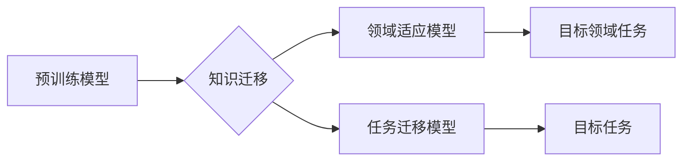

                 

## LLM在知识迁移任务上的技术挑战

> 关键词：大型语言模型 (LLM)、知识迁移、迁移学习、参数共享、领域适应、数据效率、泛化能力、评估指标

## 1. 背景介绍

近年来，大型语言模型 (LLM) 在自然语言处理 (NLP) 领域取得了显著的成就，例如文本生成、机器翻译、问答系统等。然而，LLM 的训练通常需要海量数据和大量的计算资源，这使得它们在部署到新的领域或任务时面临着挑战。知识迁移，即利用已有的知识和经验来提高模型在新的任务或领域上的性能，成为解决这一问题的关键途径。

知识迁移任务可以分为以下几种类型：

* **领域适应 (Domain Adaptation):** 将预训练的 LLM 迁移到新的领域，例如将医疗文本处理模型迁移到法律文本处理领域。
* **任务迁移 (Task Transfer):** 将预训练的 LLM 迁移到新的任务，例如将文本生成模型迁移到代码生成任务。
* **零样本学习 (Zero-Shot Learning):** 在没有见过目标任务示例的情况下，利用预训练的 LLM 直接进行预测。

## 2. 核心概念与联系

**2.1 核心概念**

* **预训练 (Pre-training):** 在大量通用文本数据上训练 LLM，学习语言的通用表示和知识。
* **微调 (Fine-tuning):** 在特定任务或领域的数据上对预训练的 LLM 进行调整，以提高其在该任务或领域上的性能。
* **参数共享 (Parameter Sharing):** 在知识迁移过程中，共享预训练模型的参数，减少训练所需的数据和计算资源。

**2.2 架构图**



## 3. 核心算法原理 & 具体操作步骤

**3.1 算法原理概述**

知识迁移算法的核心思想是利用预训练模型已经学习到的语言表示和知识，通过微调的方式将其应用到新的任务或领域。常见的知识迁移算法包括：

* **领域自适应 (Domain Adaptation):** 通过对输入数据进行变换，例如特征映射或对抗训练，减少领域之间的差异，从而提高模型在目标领域的性能。
* **迁移学习 (Transfer Learning):** 通过共享预训练模型的参数，在目标任务上进行微调，利用预训练模型的知识加速学习过程。

**3.2 算法步骤详解**

1. **预训练模型选择:** 选择一个在相关领域或任务上表现良好的预训练模型。
2. **数据准备:** 收集目标任务或领域的训练数据，并进行预处理，例如文本清洗、分词、标记等。
3. **模型微调:** 将预训练模型的参数冻结或部分解冻，在目标任务或领域的数据上进行微调。
4. **性能评估:** 使用目标任务或领域的测试数据评估模型的性能，并选择最佳的模型参数和超参数。

**3.3 算法优缺点**

* **优点:** 
    * 数据效率高，可以利用少量的目标任务数据进行训练。
    * 能够提高模型在目标任务或领域上的性能。
    * 可以加速模型训练过程。
* **缺点:** 
    * 预训练模型的知识可能与目标任务或领域不完全一致，需要进行一定的领域适应或任务迁移。
    * 微调过程可能需要大量的计算资源。

**3.4 算法应用领域**

* **自然语言处理:** 文本分类、情感分析、机器翻译、问答系统等。
* **计算机视觉:** 图像分类、目标检测、图像分割等。
* **语音识别:** 语音转文本、语音合成等。

## 4. 数学模型和公式 & 详细讲解 & 举例说明

**4.1 数学模型构建**

知识迁移任务可以看作是一个优化问题，目标是找到一个模型参数，使得模型在目标任务或领域上的性能达到最大。

假设我们有一个预训练模型 $f_{\theta}$，其中 $\theta$ 是模型参数。目标任务或领域的数据集为 $(x_i, y_i)$，其中 $x_i$ 是输入数据，$y_i$ 是目标输出。

我们希望找到一个新的模型参数 $\theta'$，使得模型在目标任务或领域上的性能达到最大，可以使用以下损失函数进行优化：

$$L(\theta') = \sum_{i=1}^{N} \mathcal{L}(f_{\theta'}(x_i), y_i)$$

其中，$\mathcal{L}$ 是损失函数，$N$ 是目标任务或领域数据集中样本的数量。

**4.2 公式推导过程**

为了提高模型在目标任务或领域上的性能，我们可以使用以下几种方法进行微调：

* **全参数微调 (Full Fine-tuning):** 将预训练模型的所有参数进行微调。
* **部分参数微调 (Partial Fine-tuning):** 只微调预训练模型的一部分参数，例如最后一层参数。
* **冻结预训练层 (Freezing Pre-trained Layers):** 将预训练模型的某些层冻结，只微调最后一层参数。

**4.3 案例分析与讲解**

例如，在将预训练的文本生成模型迁移到代码生成任务时，我们可以使用部分参数微调的方法。将预训练模型的语言表示层冻结，只微调代码生成相关的层，例如解码器层。

## 5. 项目实践：代码实例和详细解释说明

**5.1 开发环境搭建**

* Python 3.7+
* PyTorch 或 TensorFlow
* CUDA 和 cuDNN (可选)

**5.2 源代码详细实现**

```python
import torch
import torch.nn as nn

# 定义预训练模型
class PreTrainedModel(nn.Module):
    # ...

# 定义目标任务模型
class TargetTaskModel(nn.Module):
    # ...

# 加载预训练模型
pretrained_model = PreTrainedModel.load_state_dict(torch.load("pretrained_model.pth"))

# 创建目标任务模型
target_model = TargetTaskModel()

# 微调预训练模型
for param in target_model.parameters():
    param.requires_grad = True

# 训练目标任务模型
optimizer = torch.optim.Adam(target_model.parameters(), lr=0.001)
for epoch in range(num_epochs):
    # ...

# 保存微调后的模型
torch.save(target_model.state_dict(), "fine_tuned_model.pth")
```

**5.3 代码解读与分析**

* 首先，我们加载预训练模型的权重。
* 然后，我们创建一个目标任务模型，并将其参数设置为可训练。
* 最后，我们使用优化器对目标任务模型进行微调，并保存微调后的模型权重。

**5.4 运行结果展示**

通过在目标任务或领域的数据集上进行微调，我们可以观察到模型性能的提升。

## 6. 实际应用场景

* **医疗领域:** 将预训练的 LLM 迁移到医疗文本处理任务，例如疾病诊断、药物发现等。
* **法律领域:** 将预训练的 LLM 迁移到法律文本处理任务，例如合同分析、法律意见书撰写等。
* **教育领域:** 将预训练的 LLM 迁移到教育辅助任务，例如智能问答、个性化学习等。

**6.4 未来应用展望**

随着 LLM 技术的不断发展，知识迁移将成为 LLM 应用的关键技术之一。未来，知识迁移技术将应用于更广泛的领域，例如自动驾驶、机器人、金融等。

## 7. 工具和资源推荐

**7.1 学习资源推荐**

* **书籍:**
    * Deep Learning by Ian Goodfellow, Yoshua Bengio, and Aaron Courville
    * Transfer Learning by Sinno Jernite
* **课程:**
    * Stanford CS224N: Natural Language Processing with Deep Learning
    * Coursera: Deep Learning Specialization

**7.2 开发工具推荐**

* **PyTorch:** https://pytorch.org/
* **TensorFlow:** https://www.tensorflow.org/

**7.3 相关论文推荐**

* **BERT: Pre-training of Deep Bidirectional Transformers for Language Understanding**
* **GPT-3: Language Models are Few-Shot Learners**
* **XLNet: Generalized Autoregressive Pretraining for Language Understanding**

## 8. 总结：未来发展趋势与挑战

**8.1 研究成果总结**

近年来，在知识迁移领域取得了显著的进展，例如领域自适应、迁移学习等算法取得了很好的效果。

**8.2 未来发展趋势**

* **更有效的知识迁移方法:** 研究更有效的知识迁移方法，例如跨模态知识迁移、无监督知识迁移等。
* **更强大的预训练模型:** 开发更强大的预训练模型，例如多模态预训练模型、跨语言预训练模型等。
* **更广泛的应用场景:** 将知识迁移技术应用于更广泛的领域，例如自动驾驶、机器人、金融等。

**8.3 面临的挑战**

* **数据稀缺性:** 目标任务或领域的数据往往稀缺，这使得知识迁移变得更加困难。
* **领域差异:** 预训练模型的知识可能与目标任务或领域存在差异，需要进行有效的领域适应。
* **模型解释性:** LLM 的黑盒性质使得知识迁移过程难以解释，这限制了其在安全关键领域的应用。

**8.4 研究展望**

未来，知识迁移将成为 LLM 研究的重要方向之一，需要进一步探索更有效的知识迁移方法、更强大的预训练模型以及更广泛的应用场景。


## 9. 附录：常见问题与解答

**9.1 Q: 如何选择合适的预训练模型？**

**A:** 选择预训练模型时，需要考虑模型的规模、训练数据、任务类型等因素。

**9.2 Q: 如何进行领域自适应？**

**A:** 常见的领域自适应方法包括特征映射、对抗训练等。

**9.3 Q: 如何评估知识迁移的效果？**

**A:** 可以使用目标任务或领域的测试数据评估模型的性能，例如准确率、F1-score等。


作者：禅与计算机程序设计艺术 / Zen and the Art of Computer Programming 
<end_of_turn>

