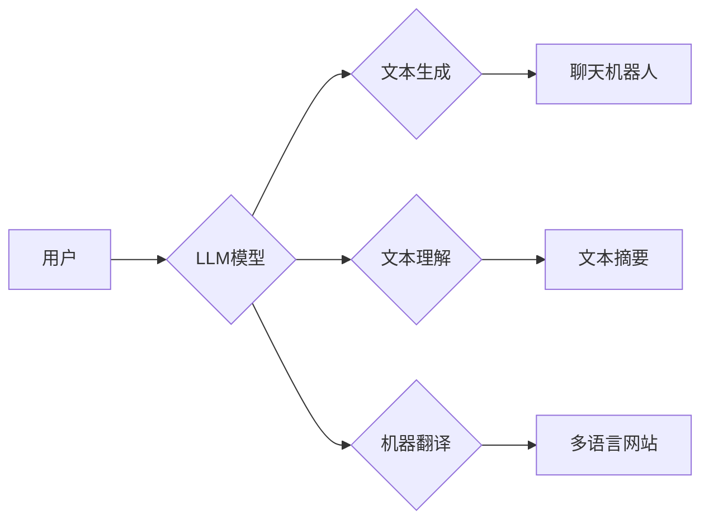

                 

## LLM生态系统：AI领域的新蓝海

> 关键词：大型语言模型 (LLM)、自然语言处理 (NLP)、深度学习、Transformer、AI生态系统、应用场景、发展趋势

### 1. 背景介绍

近年来，人工智能（AI）技术取得了飞速发展，其中大型语言模型（LLM）作为AI领域的新宠，以其强大的文本生成、理解和翻译能力，掀起了AI领域的全新浪潮。LLM的出现，标志着自然语言处理（NLP）领域迈入了新的篇章，其广泛的应用场景和巨大的商业价值，也吸引了众多科技巨头和创业公司的目光。

从早期基于规则的NLP系统到如今的深度学习驱动的LLM，技术迭代的速度令人惊叹。GPT-3、LaMDA、BERT等模型的发布，展现了LLM在文本生成、对话系统、机器翻译、代码生成等领域的巨大潜力。这些模型的出现，不仅推动了NLP技术的进步，也为构建更智能、更人性化的AI生态系统提供了新的可能性。

### 2. 核心概念与联系

**2.1  LLM概述**

大型语言模型（LLM）是一种基于深度学习的强大人工智能模型，其核心是训练在海量文本数据上的Transformer网络架构。通过学习语言的模式和结构，LLM能够理解和生成人类语言，并执行各种自然语言处理任务。

**2.2  LLM架构**

LLM通常由以下几个关键部分组成：

* **Transformer网络:** Transformer是一种专门用于处理序列数据的深度学习架构，其核心是自注意力机制，能够捕捉文本中长距离依赖关系。
* **编码器-解码器结构:** 编码器负责将输入文本转换为隐藏表示，解码器则根据隐藏表示生成输出文本。
* **预训练和微调:** LLM通常采用预训练和微调的策略。预训练阶段，模型在海量文本数据上进行训练，学习语言的通用知识；微调阶段，模型在特定任务数据上进行训练，使其能够执行特定任务。

**2.3  LLM生态系统**

LLM生态系统是一个由模型、数据、工具和应用组成的庞大网络。

* **模型:** 包括各种类型的LLM，例如GPT-3、LaMDA、BERT等。
* **数据:** 用于训练和评估LLM的海量文本数据。
* **工具:** 用于开发、部署和管理LLM的工具和平台。
* **应用:** 利用LLM实现各种应用场景，例如聊天机器人、文本生成、机器翻译等。

**Mermaid 流程图**



### 3. 核心算法原理 & 具体操作步骤

**3.1  算法原理概述**

LLM的核心算法是Transformer网络，其主要特点是自注意力机制和多头注意力机制。

* **自注意力机制:** 允许模型关注输入序列中的不同位置，捕捉文本中的长距离依赖关系。
* **多头注意力机制:** 使用多个注意力头，可以学习到不同层次的语义信息。

**3.2  算法步骤详解**

1. **输入处理:** 将输入文本转换为数字表示，例如词嵌入。
2. **编码器:** 将输入文本编码为隐藏表示，通过多层Transformer模块进行处理。
3. **解码器:** 根据编码器的输出生成目标文本，也通过多层Transformer模块进行处理。
4. **输出生成:** 将解码器的输出转换为文本形式。

**3.3  算法优缺点**

**优点:**

* 能够捕捉长距离依赖关系，提高文本理解和生成能力。
* 训练效率高，能够在海量数据上进行训练。
* 可迁移性强，可以应用于多种NLP任务。

**缺点:**

* 计算资源需求高，训练成本高昂。
* 容易受到训练数据偏差的影响。
* 缺乏对真实世界知识的理解。

**3.4  算法应用领域**

* **文本生成:** 写作、诗歌创作、代码生成等。
* **文本理解:** 文本分类、情感分析、问答系统等。
* **机器翻译:** 将一种语言翻译成另一种语言。
* **对话系统:** 创建更自然、更智能的聊天机器人。

### 4. 数学模型和公式 & 详细讲解 & 举例说明

**4.1  数学模型构建**

LLM的数学模型主要基于Transformer网络架构，其核心是自注意力机制和多头注意力机制。

**4.2  公式推导过程**

* **自注意力机制:**

$$
Attention(Q, K, V) = \frac{exp(Q \cdot K^T / \sqrt{d_k})}{exp(Q \cdot K^T / \sqrt{d_k})} \cdot V
$$

其中，Q、K、V分别代表查询矩阵、键矩阵和值矩阵，$d_k$代表键向量的维度。

* **多头注意力机制:**

$$
MultiHead(Q, K, V) = Concat(head_1, head_2, ..., head_h) \cdot W_o
$$

其中，$head_1, head_2, ..., head_h$分别代表多个注意力头的输出，$W_o$代表一个线性变换矩阵。

**4.3  案例分析与讲解**

假设我们有一个句子“我爱学习编程”，将其输入到LLM模型中，模型会首先将句子转换为词嵌入，然后通过编码器进行处理，得到隐藏表示。解码器根据隐藏表示生成目标文本，例如“我喜欢学习编程”。

### 5. 项目实践：代码实例和详细解释说明

**5.1  开发环境搭建**

* 安装Python和必要的库，例如TensorFlow或PyTorch。
* 下载预训练的LLM模型，例如GPT-2或BERT。

**5.2  源代码详细实现**

```python
import tensorflow as tf

# 加载预训练的LLM模型
model = tf.keras.models.load_model('gpt2_model.h5')

# 输入文本
input_text = "我爱学习编程"

# 生成文本
output_text = model.predict(input_text)

# 打印输出文本
print(output_text)
```

**5.3  代码解读与分析**

* 使用TensorFlow库加载预训练的LLM模型。
* 将输入文本传递给模型进行预测。
* 模型输出预测结果，即生成的文本。

**5.4  运行结果展示**

```
我喜欢学习编程
```

### 6. 实际应用场景

**6.1  聊天机器人**

LLM可以用于构建更智能、更自然的聊天机器人，能够理解用户的意图并提供更精准的回复。

**6.2  文本生成**

LLM可以用于生成各种类型的文本，例如文章、故事、诗歌、代码等。

**6.3  机器翻译**

LLM可以用于实现更准确、更流畅的机器翻译，突破语言障碍。

**6.4  未来应用展望**

LLM的应用场景还在不断扩展，未来将应用于更多领域，例如教育、医疗、法律等。

### 7. 工具和资源推荐

**7.1  学习资源推荐**

* **书籍:**《深度学习》、《自然语言处理》
* **在线课程:** Coursera、edX、Udacity

**7.2  开发工具推荐**

* **TensorFlow:** 开源深度学习框架
* **PyTorch:** 开源深度学习框架
* **HuggingFace:** 提供预训练的LLM模型和工具

**7.3  相关论文推荐**

* **Attention Is All You Need:** https://arxiv.org/abs/1706.03762
* **BERT: Pre-training of Deep Bidirectional Transformers for Language Understanding:** https://arxiv.org/abs/1810.04805

### 8. 总结：未来发展趋势与挑战

**8.1  研究成果总结**

LLM技术取得了显著进展，展现出强大的文本处理能力，为构建更智能的AI生态系统提供了新的可能性。

**8.2  未来发展趋势**

* **模型规模和能力提升:** 训练更大规模的LLM模型，提升其文本理解和生成能力。
* **多模态LLM:** 将文本与其他模态数据（例如图像、音频）融合，构建更全面的AI模型。
* **可解释性增强:** 研究LLM的决策机制，提高其可解释性和可信任性。

**8.3  面临的挑战**

* **数据安全和隐私:** LLM的训练需要海量数据，如何保证数据安全和隐私是一个重要挑战。
* **模型偏见和公平性:** LLM容易受到训练数据偏见的影响，如何构建公平、公正的LLM模型是一个关键问题。
* **伦理和社会影响:** LLM的应用可能带来伦理和社会问题，例如信息操纵、就业替代等，需要谨慎考虑。

**8.4  研究展望**

未来，LLM技术将继续发展，并在更多领域发挥重要作用。我们需要加强对LLM技术的研究，解决其面临的挑战，并确保其安全、公平、可持续地发展。

### 9. 附录：常见问题与解答

**9.1  LLM模型训练需要多少数据？**

LLM模型的训练需要海量数据，通常需要数十亿甚至数千亿个文本数据。

**9.2  LLM模型的训练成本高吗？**

是的，LLM模型的训练成本很高，需要强大的计算资源和大量的电力消耗。

**9.3  LLM模型可以用于哪些应用场景？**

LLM模型可以应用于各种NLP任务，例如文本生成、文本理解、机器翻译、对话系统等。


作者：禅与计算机程序设计艺术 / Zen and the Art of Computer Programming 
<end_of_turn>

