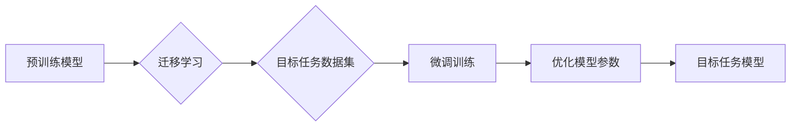

                 

## SFT：有监督的微调技术

> 关键词：SFT, 有监督微调, 大语言模型, 迁移学习, 自然语言处理, 参数调整, 性能提升

## 1. 背景介绍

近年来，大语言模型（LLM）在自然语言处理（NLP）领域取得了显著的进展，展现出强大的文本生成、翻译、问答等能力。然而，这些预训练模型通常在特定任务上的表现仍有提升空间。为了解决这个问题，**有监督微调（Supervised Fine-Tuning，SFT）**技术应运而生。SFT是一种通过在特定任务数据集上对预训练模型进行微调的训练方法，可以有效提升模型在目标任务上的性能。

SFT技术的核心思想是利用预训练模型已经学习到的语言表示能力，并通过在特定任务数据集上的有监督训练进一步优化模型参数，使其能够更好地适应目标任务的需求。

## 2. 核心概念与联系

SFT技术是迁移学习的一种应用，它将预训练模型作为初始模型，并在目标任务数据集上进行微调。

**迁移学习**是一种机器学习范式，它利用已学习到的知识和经验来解决新的、相关的问题。在SFT中，预训练模型的知识和经验就是从大量文本数据中学习到的语言表示能力。

**Mermaid 流程图**



**核心概念原理和架构**

* **预训练模型:** 在大量文本数据上进行预训练，学习到通用的语言表示能力。
* **目标任务数据集:** 包含特定任务所需的数据，例如文本分类、问答、机器翻译等。
* **微调训练:** 在目标任务数据集上对预训练模型进行训练，调整模型参数以适应目标任务。
* **优化模型参数:** 通过梯度下降等优化算法，调整模型参数以最小化目标任务的损失函数。
* **目标任务模型:** 微调后的模型，能够在目标任务上取得更好的性能。

## 3. 核心算法原理 & 具体操作步骤

### 3.1  算法原理概述

SFT算法的核心原理是利用预训练模型已经学习到的语言表示能力，并通过在目标任务数据集上进行有监督训练，进一步优化模型参数，使其能够更好地适应目标任务的需求。

具体来说，SFT算法将预训练模型作为初始模型，并将其所有可训练参数冻结。然后，在目标任务数据集上添加新的全连接层，并将该层的输出连接到预训练模型的输出层。最后，通过反向传播算法，更新新的全连接层的参数，同时保持预训练模型参数不变。

### 3.2  算法步骤详解

1. **准备预训练模型:** 选择一个已经预训练好的语言模型，例如BERT、GPT-3等。
2. **准备目标任务数据集:** 收集包含目标任务所需数据的训练集、验证集和测试集。
3. **添加新的全连接层:** 在预训练模型的基础上添加一个新的全连接层，该层的输出维度与目标任务的输出维度相匹配。
4. **冻结预训练模型参数:** 将预训练模型的所有可训练参数冻结，只训练新的全连接层的参数。
5. **进行微调训练:** 使用目标任务数据集进行训练，并使用交叉熵损失函数作为损失函数。
6. **评估模型性能:** 在验证集上评估模型性能，并根据性能调整超参数，例如学习率、批处理大小等。
7. **测试模型性能:** 在测试集上评估模型性能，并记录最终的性能指标。

### 3.3  算法优缺点

**优点:**

* **性能提升:** SFT可以有效提升模型在目标任务上的性能。
* **数据效率:** 相比于从头训练模型，SFT只需要少量目标任务数据即可达到较好的效果。
* **易于实现:** SFT的实现相对简单，只需要对预训练模型进行微调即可。

**缺点:**

* **过拟合风险:** 如果目标任务数据集较小，SFT可能会导致模型过拟合。
* **参数量增加:** 添加新的全连接层会增加模型的参数量，从而增加计算成本。
* **数据依赖性:** SFT的性能取决于目标任务数据集的质量。

### 3.4  算法应用领域

SFT技术广泛应用于各种NLP任务，例如：

* **文本分类:** 识别文本的类别，例如情感分析、主题分类等。
* **问答:** 回答用户提出的问题，例如问答系统、聊天机器人等。
* **机器翻译:** 将文本从一种语言翻译成另一种语言。
* **文本摘要:** 生成文本的简短摘要。
* **代码生成:** 根据自然语言描述生成代码。

## 4. 数学模型和公式 & 详细讲解 & 举例说明

### 4.1  数学模型构建

SFT的数学模型可以简单地表示为一个带有额外全连接层的预训练模型。

假设预训练模型的输出为 $h_i$，目标任务的输出为 $y_i$，则新的全连接层的输出为：

$$
z_i = W_f h_i + b_f
$$

其中，$W_f$ 是新的全连接层的权重矩阵，$b_f$ 是偏置项。

### 4.2  公式推导过程

SFT的目标是最小化目标任务的损失函数，例如交叉熵损失函数：

$$
L = -\sum_{i=1}^{N} y_i \log(p_i)
$$

其中，$N$ 是样本数量，$y_i$ 是真实标签，$p_i$ 是模型预测的概率。

通过反向传播算法，可以计算出每个参数的梯度，并使用梯度下降算法更新参数：

$$
\theta_{t+1} = \theta_t - \eta \nabla L(\theta_t)
$$

其中，$\theta$ 是模型参数，$\eta$ 是学习率，$t$ 是迭代次数。

### 4.3  案例分析与讲解

例如，在文本分类任务中，目标任务的输出为类别标签，可以使用softmax函数将模型输出转换为概率分布：

$$
p_i = \frac{e^{z_i}}{\sum_{j=1}^{K} e^{z_j}}
$$

其中，$K$ 是类别数量。

通过交叉熵损失函数和梯度下降算法，可以训练模型，使其能够将文本分类到正确的类别。

## 5. 项目实践：代码实例和详细解释说明

### 5.1  开发环境搭建

* Python 3.7+
* PyTorch 1.7+
* Transformers 4.10+

### 5.2  源代码详细实现

```python
from transformers import AutoModelForSequenceClassification, AutoTokenizer

# 加载预训练模型和词典
model_name = "bert-base-uncased"
tokenizer = AutoTokenizer.from_pretrained(model_name)
model = AutoModelForSequenceClassification.from_pretrained(model_name, num_labels=2)

# 定义训练数据加载器
train_dataset = ... # 你的训练数据

# 定义训练参数
learning_rate = 2e-5
batch_size = 16
epochs = 3

# 定义训练器
optimizer = torch.optim.AdamW(model.parameters(), lr=learning_rate)
train_dataloader = DataLoader(train_dataset, batch_size=batch_size)

# 训练模型
for epoch in range(epochs):
    for batch in train_dataloader:
        input_ids = batch["input_ids"]
        attention_mask = batch["attention_mask"]
        labels = batch["labels"]

        outputs = model(input_ids=input_ids, attention_mask=attention_mask, labels=labels)
        loss = outputs.loss

        optimizer.zero_grad()
        loss.backward()
        optimizer.step()

# 保存模型
model.save_pretrained("sft_model")
```

### 5.3  代码解读与分析

* 代码首先加载预训练模型和词典。
* 然后定义训练数据加载器，训练参数和训练器。
* 训练循环中，将训练数据输入模型，计算损失，并使用梯度下降算法更新模型参数。
* 最后，保存训练好的模型。

### 5.4  运行结果展示

训练完成后，可以将模型应用于目标任务，并评估模型性能。

## 6. 实际应用场景

SFT技术在实际应用场景中具有广泛的应用前景，例如：

* **个性化推荐:** 根据用户的历史行为和偏好，推荐个性化的商品、内容或服务。
* **医疗诊断:** 利用患者的病历和症状信息，辅助医生进行疾病诊断。
* **金融风险评估:** 分析用户的财务数据，评估其信用风险和投资风险。
* **法律文本分析:** 分析法律文本，识别关键信息和法律关系。

### 6.4  未来应用展望

随着大语言模型的不断发展和完善，SFT技术将有望在更多领域得到应用，例如：

* **自动代码生成:** 根据自然语言描述自动生成代码，提高软件开发效率。
* **机器翻译:** 实现更高质量、更流畅的机器翻译。
* **跨语言对话:** 实现跨语言的自然对话，打破语言障碍。

## 7. 工具和资源推荐

### 7.1  学习资源推荐

* **论文:**
    * Devlin, J., Chang, M. W., Lee, K., & Toutanova, K. (2018). Bert: Pre-training of deep bidirectional transformers for language understanding. arXiv preprint arXiv:1810.04805.
* **博客:**
    * https://huggingface.co/blog/bert-fine-tuning
    * https://towardsdatascience.com/fine-tuning-bert-for-text-classification-a-practical-guide-81b303826a96

### 7.2  开发工具推荐

* **Transformers:** https://huggingface.co/docs/transformers/index
* **PyTorch:** https://pytorch.org/

### 7.3  相关论文推荐

* **BERT:** Devlin et al. (2018)
* **GPT-3:** Brown et al. (2020)
* **XLNet:** Yang et al. (2019)

## 8. 总结：未来发展趋势与挑战

### 8.1  研究成果总结

SFT技术在NLP领域取得了显著的进展，有效提升了模型在目标任务上的性能。

### 8.2  未来发展趋势

* **更强大的预训练模型:** 预训练模型的规模和能力将不断提升，为SFT提供更强大的基础。
* **更有效的微调方法:** 将探索更有效的微调方法，例如知识蒸馏、渐进式微调等。
* **跨模态SFT:** 将SFT扩展到跨模态任务，例如文本-图像、文本-音频等。

### 8.3  面临的挑战

* **数据效率:** SFT仍然依赖于大量目标任务数据，如何提高数据效率是未来研究的重要方向。
* **模型可解释性:** SFT模型的决策过程往往难以解释，如何提高模型的可解释性也是一个挑战。
* **公平性与偏见:** SFT模型可能继承预训练模型的公平性与偏见问题，如何解决这些问题是未来需要关注的议题。

### 8.4  研究展望

未来，SFT技术将继续朝着更强大、更有效、更可解释的方向发展，并在更多领域发挥重要作用。


## 9. 附录：常见问题与解答

**Q1: SFT与迁移学习有什么区别？**

**A1:** SFT是一种迁移学习的应用，它利用预训练模型的知识和经验来解决新的、相关的问题。

**Q2: SFT的优点是什么？**

**A2:** SFT可以有效提升模型在目标任务上的性能，数据效率高，易于实现。

**Q3: SFT的缺点是什么？**

**A3:** SFT可能会导致模型过拟合，参数量增加，数据依赖性强。

**Q4: 如何选择合适的预训练模型？**

**A4:** 选择预训练模型时需要考虑目标任务的性质、模型的规模和性能等因素。

**Q5: 如何评估SFT模型的性能？**

**A5:** 可以使用准确率、召回率、F1-score等指标评估SFT模型的性能。


作者：禅与计算机程序设计艺术 / Zen and the Art of Computer Programming 
<end_of_turn>

