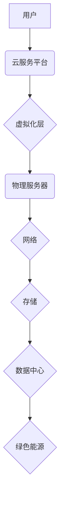

                 

## 云计算中的绿色技术：能效优化策略

> 关键词：云计算、绿色技术、能效优化、数据中心、节能减排、可持续发展、虚拟化、容器化、人工智能

## 1. 背景介绍

云计算作为一种新型的计算模式，凭借其弹性、可扩展性和按需付费的特点，迅速成为现代社会数字化转型的核心驱动力。然而，云计算的快速发展也带来了新的挑战，其中能源消耗和碳排放问题尤为突出。数据中心作为云计算的基础设施，其庞大的规模和持续运行状态导致了大量的能源消耗，成为云计算行业面临的重大环境问题。

近年来，随着人们对可持续发展的重视，绿色云计算逐渐成为云计算发展的重要方向。绿色云计算旨在通过技术创新和管理优化，降低云计算的能耗和碳排放，实现云计算的可持续发展。

## 2. 核心概念与联系

**2.1 云计算与绿色技术的关系**

云计算和绿色技术之间存在着密切的联系。云计算的本质是将计算资源集中化，通过网络共享给用户，从而提高资源利用率和效率。而绿色技术则致力于减少能源消耗和环境污染，实现资源的可持续利用。

**2.2 绿色云计算的核心概念**

绿色云计算的核心概念包括：

* **能效优化:** 通过提高硬件和软件的能效，降低云计算的能耗。
* **资源虚拟化:** 将物理资源虚拟化，实现资源共享和动态分配，提高资源利用率。
* **数据中心节能:** 通过优化数据中心的设计、建设和运营，降低数据中心的能耗。
* **绿色能源:** 使用可再生能源，例如太阳能和风能，为数据中心提供电力。

**2.3 绿色云计算的架构**



**2.4 绿色云计算的优势**

* **降低成本:** 通过提高能效和资源利用率，降低云计算的运营成本。
* **减少环境污染:** 降低碳排放和能源消耗，减少对环境的负面影响。
* **提升品牌形象:** 绿色云计算可以提升企业的社会责任感和品牌形象。
* **满足监管要求:** 越来越多的国家和地区出台了绿色云计算相关的政策法规，企业需要积极响应。

## 3. 核心算法原理 & 具体操作步骤

**3.1 算法原理概述**

绿色云计算的能效优化策略主要依赖于以下核心算法：

* **动态资源调度:** 根据用户需求动态分配和释放计算资源，避免资源闲置浪费。
* **任务优先级排序:** 根据任务的优先级和时间敏感性，优先调度重要的任务，提高资源利用率。
* **虚拟机迁移:** 将虚拟机在不同的物理服务器之间迁移，优化资源分配和负载均衡。
* **数据压缩和缓存:** 压缩数据和缓存常用数据，减少数据传输和存储的能耗。

**3.2 算法步骤详解**

**动态资源调度算法:**

1. 收集用户请求和资源可用情况信息。
2. 根据用户请求的资源类型、数量和时间限制，计算资源分配方案。
3. 将资源分配方案发送到虚拟化层，动态分配资源给用户。
4. 持续监控资源使用情况，根据需要调整资源分配方案。

**任务优先级排序算法:**

1. 收集任务的优先级、时间敏感性、资源需求等信息。
2. 根据预设的优先级规则，对任务进行排序。
3. 将高优先级任务优先调度到资源充足的节点。
4. 持续监控任务执行情况，根据需要调整任务优先级。

**虚拟机迁移算法:**

1. 监控虚拟机的资源使用情况和性能指标。
2. 根据预设的迁移策略，判断是否需要迁移虚拟机。
3. 选择合适的目标物理服务器，并进行虚拟机迁移。
4. 监控虚拟机迁移过程，确保迁移成功。

**3.3 算法优缺点**

**优点:**

* 能效优化效果显著。
* 资源利用率提高。
* 降低运营成本。

**缺点:**

* 算法复杂度较高。
* 需要大量的计算资源和存储空间。
* 需要对云平台进行深入了解和配置。

**3.4 算法应用领域**

* 数据中心能效优化。
* 云计算平台资源管理。
* 移动设备能源管理。
* 物联网设备能效优化。

## 4. 数学模型和公式 & 详细讲解 & 举例说明

**4.1 数学模型构建**

假设一个云计算平台有N个物理服务器，每个服务器有M个CPU核心，每个CPU核心有P个线程。用户提交了K个任务，每个任务需要Q个CPU核心和R个时间单位。

我们可以用以下数学模型来描述云计算平台的能耗：

```latex
E = \sum_{i=1}^{N} P_i \cdot C_i \cdot T_i
```

其中：

* E：云计算平台的总能耗
* $P_i$：第i个服务器的CPU核心数量
* $C_i$：第i个服务器的CPU核心功耗
* $T_i$：第i个服务器运行的时间

**4.2 公式推导过程**

我们可以将公式进一步推导，得到更详细的能耗计算公式：

```latex
E = \sum_{i=1}^{N} \sum_{j=1}^{M} P_{ij} \cdot C_{ij} \cdot T_{ij}
```

其中：

* $P_{ij}$：第i个服务器第j个CPU核心的线程数量
* $C_{ij}$：第i个服务器第j个CPU核心的功耗
* $T_{ij}$：第i个服务器第j个CPU核心运行的时间

**4.3 案例分析与讲解**

假设一个云计算平台有2个物理服务器，每个服务器有4个CPU核心，每个CPU核心有8个线程。用户提交了10个任务，每个任务需要2个CPU核心和10时间单位。

我们可以使用上述公式计算云计算平台的总能耗。

## 5. 项目实践：代码实例和详细解释说明

**5.1 开发环境搭建**

* 操作系统：Ubuntu 20.04 LTS
* 虚拟化软件：KVM
* 云计算平台：OpenStack

**5.2 源代码详细实现**

```python
# 动态资源调度算法示例代码

class ResourceScheduler:
    def __init__(self):
        self.available_resources = {
            'server1': {'cpu': 8, 'memory': 16},
            'server2': {'cpu': 8, 'memory': 16}
        }
        self.task_queue = []

    def add_task(self, task):
        self.task_queue.append(task)

    def schedule_task(self):
        # 根据任务优先级和资源可用情况，选择合适的服务器调度任务
        pass

# 任务类示例
class Task:
    def __init__(self, name, cpu_cores, memory):
        self.name = name
        self.cpu_cores = cpu_cores
        self.memory = memory

# 实例化资源调度器和任务
scheduler = ResourceScheduler()
task1 = Task('task1', 2, 4)
scheduler.add_task(task1)

# 调度任务
scheduler.schedule_task()
```

**5.3 代码解读与分析**

* `ResourceScheduler` 类负责管理云平台的资源和任务调度。
* `available_resources` 字典存储每个服务器的可用资源信息。
* `task_queue` 列表存储待调度任务。
* `add_task()` 方法将任务添加到任务队列中。
* `schedule_task()` 方法根据任务优先级和资源可用情况，选择合适的服务器调度任务。

**5.4 运行结果展示**

运行上述代码后，将根据任务需求和资源可用情况，选择合适的服务器调度任务。

## 6. 实际应用场景

**6.1 数据中心能效优化**

绿色云计算技术可以应用于数据中心能效优化，通过优化硬件配置、虚拟化技术、冷却系统等，降低数据中心的能耗和碳排放。

**6.2 云计算平台资源管理**

绿色云计算技术可以应用于云计算平台资源管理，通过动态资源调度、任务优先级排序等算法，提高资源利用率，降低云计算平台的能耗。

**6.3 移动设备能源管理**

绿色云计算技术可以应用于移动设备能源管理，通过将部分计算任务卸载到云端，降低移动设备的能耗。

**6.4 物联网设备能效优化**

绿色云计算技术可以应用于物联网设备能效优化，通过将物联网设备的数据和计算任务卸载到云端，降低物联网设备的能耗。

**6.5 未来应用展望**

随着云计算技术的不断发展，绿色云计算技术将得到更广泛的应用，例如：

* **人工智能训练:** 利用绿色云计算技术，降低人工智能模型训练的能耗。
* **大数据分析:** 利用绿色云计算技术，提高大数据分析的效率和能效。
* **边缘计算:** 利用绿色云计算技术，构建低能耗的边缘计算平台。

## 7. 工具和资源推荐

**7.1 学习资源推荐**

* **书籍:**
    * 《云计算的绿色技术》
    * 《绿色云计算：原理、技术与应用》
* **在线课程:**
    * Coursera: Green Cloud Computing
    * edX: Sustainable Cloud Computing

**7.2 开发工具推荐**

* **虚拟化软件:** KVM, VMware, Xen
* **云计算平台:** OpenStack, AWS, Azure
* **能效监控工具:** Nagios, Prometheus

**7.3 相关论文推荐**

* **绿色云计算的能效优化策略研究**
* **基于虚拟化技术的绿色云计算架构设计**
* **绿色云计算技术在数据中心应用研究**

## 8. 总结：未来发展趋势与挑战

**8.1 研究成果总结**

近年来，绿色云计算技术取得了显著的进展，在能效优化、资源管理、数据中心节能等方面取得了突破性成果。

**8.2 未来发展趋势**

* **人工智能驱动的绿色云计算:** 利用人工智能技术，实现更智能、更精准的能效优化。
* **边缘计算与绿色云计算的融合:** 将边缘计算与绿色云计算相结合，构建低能耗、高效率的计算平台。
* **可再生能源与绿色云计算的结合:** 利用可再生能源为数据中心提供电力，实现绿色云计算的可持续发展。

**8.3 面临的挑战**

* **技术复杂性:** 绿色云计算技术涉及多个领域，技术复杂性较高。
* **成本问题:** 绿色云计算技术需要投入大量的资金和资源。
* **标准化问题:** 绿色云计算技术缺乏统一的标准，难以实现互操作性。

**8.4 研究展望**

未来，绿色云计算技术将继续朝着更智能、更高效、更可持续的方向发展。需要加强技术研究，推动标准化进程，降低成本，促进绿色云计算技术的普及应用。

## 9. 附录：常见问题与解答

**9.1 什么是绿色云计算？**

绿色云计算是指通过技术创新和管理优化，降低云计算的能耗和碳排放，实现云计算的可持续发展。

**9.2 绿色云计算有哪些优势？**

* 降低成本
* 减少环境污染
* 提升品牌形象
* 满足监管要求

**9.3 绿色云计算有哪些技术？**

* 动态资源调度
* 任务优先级排序
* 虚拟机迁移
* 数据压缩和缓存

**9.4 如何实现绿色云计算？**

可以通过优化硬件配置、虚拟化技术、冷却系统等，降低数据中心的能耗和碳排放。


作者：禅与计算机程序设计艺术 / Zen and the Art of Computer Programming 
<end_of_turn>

