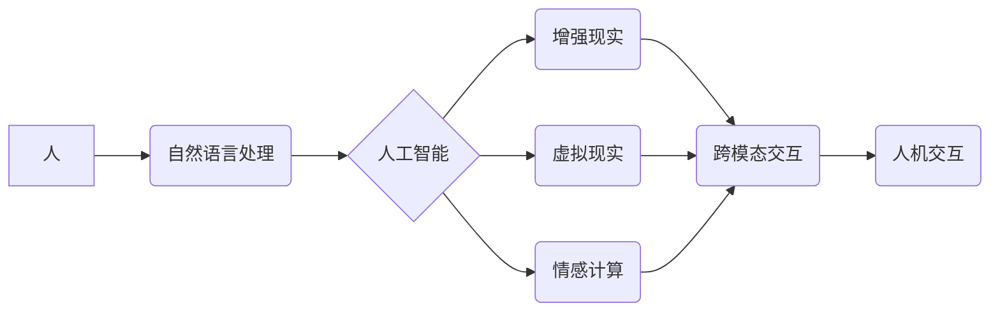

                 

## 人机交互：未来趋势与展望

> 关键词： 人机交互、自然语言处理、人工智能、增强现实、虚拟现实、情感计算、跨模态交互、可穿戴设备

## 1. 背景介绍

人机交互 (Human-Computer Interaction，HCI) 作为计算机科学的一个重要分支，致力于研究人和计算机之间如何有效地交流和合作。从早期的命令行界面到如今的图形用户界面，再到未来的自然语言交互和沉浸式虚拟现实体验，HCI 始终在推动着人与技术的融合，改变着我们与世界互动的方式。

随着人工智能 (AI)、自然语言处理 (NLP)、增强现实 (AR) 和虚拟现实 (VR) 等技术的快速发展，人机交互领域迎来了前所未有的机遇和挑战。这些新兴技术为我们提供了构建更加智能、自然、沉浸式的交互体验的可能性，同时也带来了新的伦理和社会问题。

## 2. 核心概念与联系

### 2.1  核心概念

* **人机交互 (HCI):** 研究人和计算机之间如何有效地交流和合作，旨在设计用户友好的交互系统。
* **自然语言处理 (NLP):** 使计算机能够理解、解释和生成人类语言。
* **人工智能 (AI):** 使计算机能够模拟人类的智能行为，例如学习、推理和决策。
* **增强现实 (AR):** 在现实世界中叠加虚拟信息，增强用户对现实世界的感知。
* **虚拟现实 (VR):** 创建一个完全虚拟的环境，让用户沉浸其中。
* **情感计算:** 研究计算机如何识别、理解和响应人类的情感。
* **跨模态交互:** 允许用户使用多种输入方式和输出方式与计算机交互，例如语音、文本、图像和手势。

### 2.2  核心概念联系



## 3. 核心算法原理 & 具体操作步骤

### 3.1  算法原理概述

人机交互的核心算法原理涉及自然语言理解、机器学习、计算机视觉、图形渲染等多个领域。

* **自然语言理解:** 利用统计模型、语义网络和深度学习等技术，使计算机能够理解人类语言的含义。
* **机器学习:** 通过训练数据，使计算机能够学习和改进其对语言、图像和声音的理解和处理能力。
* **计算机视觉:** 使计算机能够“看”和理解图像和视频，例如识别物体、场景和人脸。
* **图形渲染:** 将虚拟场景和物体转化为可视化的图像，呈现给用户。

### 3.2  算法步骤详解

具体算法步骤取决于具体的交互场景和技术。例如，一个基于语音识别的虚拟助手，其算法步骤可能包括：

1. **语音采集:** 使用麦克风采集用户的语音信号。
2. **语音识别:** 利用语音识别算法将语音信号转换为文本。
3. **自然语言理解:** 利用自然语言理解算法分析文本的含义，识别用户的意图和需求。
4. **知识检索:** 根据用户的意图，从知识库中检索相关信息。
5. **文本生成:** 利用文本生成算法生成自然流畅的回复文本。
6. **语音合成:** 将回复文本转换为语音信号，通过扬声器播放给用户。

### 3.3  算法优缺点

不同的算法具有不同的优缺点，需要根据具体的应用场景进行选择。例如，基于规则的自然语言理解算法易于理解和维护，但难以处理复杂和模糊的语言；基于机器学习的自然语言理解算法能够处理更复杂的语言，但需要大量的训练数据。

### 3.4  算法应用领域

人机交互算法广泛应用于各个领域，例如：

* **智能助手:** 例如 Siri、Alexa 和 Google Assistant。
* **聊天机器人:** 用于提供客户服务、咨询和娱乐。
* **虚拟现实和增强现实:** 创建沉浸式和交互式的虚拟体验。
* **自动驾驶:** 使汽车能够感知周围环境并做出决策。
* **医疗保健:** 用于诊断疾病、治疗患者和提供远程医疗服务。

## 4. 数学模型和公式 & 详细讲解 & 举例说明

### 4.1  数学模型构建

人机交互算法的数学模型通常基于概率论、统计学和机器学习。例如，自然语言理解算法通常使用概率模型来计算单词和短语出现的概率，从而推断出文本的含义。

### 4.2  公式推导过程

例如，一个简单的词袋模型可以用来计算文本中单词出现的频率。假设一个文本包含 N 个单词，其中单词 w 的出现次数为 n(w)，则单词 w 在文本中的概率可以表示为：

$$P(w|T) = \frac{n(w)}{N}$$

其中 T 表示整个文本。

### 4.3  案例分析与讲解

例如，假设一个文本包含以下单词：

"The quick brown fox jumps over the lazy dog."

其中 "the" 出现了 2 次，"quick" 出现了 1 次，"brown" 出现了 1 次，"fox" 出现了 1 次，"jumps" 出现了 1 次，"over" 出现了 1 次，"lazy" 出现了 1 次，"dog" 出现了 1 次。

则单词 "the" 在文本中的概率为：

$$P(\text{the}|T) = \frac{2}{17}$$

## 5. 项目实践：代码实例和详细解释说明

### 5.1  开发环境搭建

为了实现一个简单的基于文本的聊天机器人，我们可以使用 Python 语言和一些常用的库，例如 NLTK 和 TensorFlow。

### 5.2  源代码详细实现

```python
import nltk
from nltk.chat.util import Chat, reflections

pairs = [
    [
        r"my name is (.*)",
        ["Hello %1, how can I help you today?",]
    ],
    [
        r"what is your name?",
        ["My name is ChatBot.",]
    ],
    [
        r"how are you?",
        ["I am doing well, thank you.",]
    ],
    [
        r"tell me a joke",
        ["Why don't scientists trust atoms? Because they make up everything!",]
    ],
]

chat = Chat(pairs, reflections)
chat.converse()
```

### 5.3  代码解读与分析

这段代码定义了一个简单的聊天机器人，它使用 NLTK 库中的 `Chat` 类来实现文本交互。

* `pairs` 变量定义了一组规则，用于匹配用户输入和机器人回复。
* `reflections` 变量定义了一组词语映射，用于处理用户输入中的代词和反身代词。
* `chat = Chat(pairs, reflections)` 创建了一个聊天机器人实例。
* `chat.converse()` 启动聊天交互。

### 5.4  运行结果展示

当运行这段代码时，用户可以与聊天机器人进行文本交互。例如，用户可以输入 "Hello"，机器人会回复 "Hello, how can I help you today?"。

## 6. 实际应用场景

### 6.1  智能客服

聊天机器人可以用于提供 24/7 的客户服务，回答常见问题，处理简单的请求，并引导用户到更高级的服务。

### 6.2  教育辅助

聊天机器人可以作为教育辅助工具，帮助学生学习新知识，练习技能，并提供个性化的学习体验。

### 6.3  娱乐互动

聊天机器人可以用于创建游戏、模拟角色扮演和提供其他形式的娱乐互动。

### 6.4  未来应用展望

未来，人机交互技术将更加智能、自然和沉浸式。例如：

* **跨模态交互:** 用户可以使用多种输入方式和输出方式与计算机交互，例如语音、文本、图像、手势和表情。
* **情感计算:** 计算机能够识别和理解人类的情感，并做出相应的反应。
* **个性化交互:** 计算机能够根据用户的个人喜好和需求，提供个性化的交互体验。
* **协作交互:** 人和计算机可以共同完成任务，例如设计、创作和解决问题。

## 7. 工具和资源推荐

### 7.1  学习资源推荐

* **书籍:**
    * "Designing the User Interface: Strategies for Effective Human-Computer Interaction" by Ben Shneiderman
    * "Human-Computer Interaction" by Alan Dix, Janet Finlay, Gregory Abowd, and Russell Beale
* **在线课程:**
    * Coursera: Human-Computer Interaction Specialization
    * edX: Introduction to Human-Computer Interaction

### 7.2  开发工具推荐

* **Python:** 广泛用于人机交互开发，拥有丰富的库和工具。
* **NLTK:** 自然语言处理库。
* **TensorFlow:** 深度学习框架。
* **Unity:** 游戏引擎，也适用于虚拟现实和增强现实开发。

### 7.3  相关论文推荐

* "A Survey of Human-Computer Interaction Techniques" by John M. Carroll
* "The Evolution of Human-Computer Interaction" by Brenda Laurel
* "Affective Computing" by Rosalind Picard

## 8. 总结：未来发展趋势与挑战

### 8.1  研究成果总结

近年来，人机交互领域取得了显著的进展，例如自然语言处理、人工智能、虚拟现实和增强现实等技术的快速发展，为我们构建更加智能、自然、沉浸式的交互体验提供了新的可能性。

### 8.2  未来发展趋势

未来，人机交互技术将朝着更加智能、自然、沉浸式和个性化的方向发展。例如：

* **跨模态交互:** 用户可以使用多种输入方式和输出方式与计算机交互，例如语音、文本、图像、手势和表情。
* **情感计算:** 计算机能够识别和理解人类的情感，并做出相应的反应。
* **个性化交互:** 计算机能够根据用户的个人喜好和需求，提供个性化的交互体验。
* **协作交互:** 人和计算机可以共同完成任务，例如设计、创作和解决问题。

### 8.3  面临的挑战

人机交互技术的发展也面临着一些挑战，例如：

* **伦理问题:** 人工智能的快速发展引发了关于隐私、安全和责任等伦理问题的关注。
* **社会影响:** 人机交互技术可能会改变人们的工作方式、生活方式和社会关系。
* **技术瓶颈:** 跨模态交互、情感计算和个性化交互等技术仍然存在一些技术瓶颈。

### 8.4  研究展望

未来，人机交互领域的研究将继续关注以下几个方面：

* **更智能的交互算法:** 开发能够更好地理解和响应人类需求的交互算法。
* **更自然的人机交互方式:** 研究更加自然、直观和易用的交互方式。
* **更安全的交互系统:** 确保人机交互系统安全可靠，并保护用户的隐私和数据安全。
* **更广泛的应用场景:** 将人机交互技术应用到更多领域，例如医疗保健、教育、娱乐和交通运输。

## 9. 附录：常见问题与解答

### 9.1  常见问题

* **什么是人机交互？**

人机交互 (HCI) 是研究人和计算机之间如何有效地交流和合作的学科。

* **人机交互有哪些重要技术？**

一些重要的技术包括自然语言处理、人工智能、计算机视觉、图形渲染和情感计算。

* **人机交互有哪些应用场景？**

人机交互技术广泛应用于智能助手、聊天机器人、虚拟现实、增强现实、自动驾驶、医疗保健等领域。

### 9.2  解答

* **人机交互的未来趋势是什么？**

未来，人机交互技术将更加智能、自然、沉浸式和个性化。

* **人机交互面临哪些挑战？**

人机交互技术面临着伦理问题、社会影响和技术瓶颈等挑战。


作者：禅与计算机程序设计艺术 / Zen and the Art of Computer Programming 
<end_of_turn>

