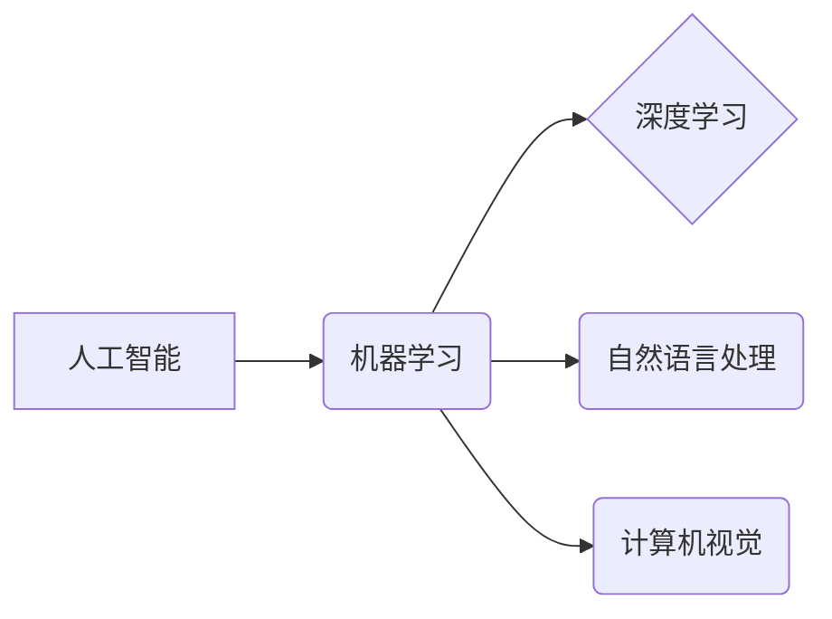

                 

## 人类智慧：AI 时代的新力量

> 关键词：人工智能、深度学习、机器学习、自然语言处理、计算机视觉、算法、模型、应用场景

### 1. 背景介绍

人工智能（AI）正以惊人的速度发展，深刻地改变着我们的世界。从自动驾驶汽车到智能语音助手，AI 正在渗透到生活的方方面面。作为人类智慧的延伸，AI 正在展现出强大的潜力，帮助我们解决复杂问题、提高效率、创造新的价值。

然而，AI 的发展也引发了许多思考和担忧。如何确保 AI 的安全、公平和可解释性？AI 是否会取代人类的工作？AI 将如何影响社会和经济？这些问题都需要我们认真探讨和应对。

### 2. 核心概念与联系

**2.1 人工智能 (AI)**

人工智能是指模拟人类智能行为的计算机系统。这些行为包括学习、推理、决策、感知和语言理解等。

**2.2 机器学习 (ML)**

机器学习是 AI 的一个子领域，它使计算机能够从数据中学习，无需明确编程。通过分析大量数据，机器学习算法可以识别模式、做出预测和改进性能。

**2.3 深度学习 (DL)**

深度学习是机器学习的一个更高级的子领域，它使用多层神经网络来模拟大脑的学习过程。深度学习算法能够处理复杂的数据，例如图像、语音和文本，并取得了令人瞩目的成果。

**2.4 自然语言处理 (NLP)**

自然语言处理是让计算机理解和处理人类语言的技术。NLP 涉及许多任务，例如文本分类、机器翻译和对话系统。

**2.5 计算机视觉 (CV)**

计算机视觉是让计算机“看”和理解图像的技术。CV 涉及许多任务，例如图像识别、物体检测和图像分割。

**2.6 核心概念关系图**



### 3. 核心算法原理 & 具体操作步骤

**3.1 算法原理概述**

深度学习算法的核心是多层神经网络。神经网络由许多相互连接的神经元组成，每个神经元接收输入信号，对其进行处理，并输出信号。通过调整神经元的连接权重，深度学习算法可以学习数据中的模式。

**3.2 算法步骤详解**

1. **数据预处理:** 将原始数据转换为深度学习算法可以理解的格式。
2. **网络结构设计:** 根据任务需求设计神经网络的结构，包括层数、神经元数量和激活函数等。
3. **参数初始化:** 为神经网络的参数（权重和偏置）赋初值。
4. **前向传播:** 将输入数据通过神经网络传递，计算输出结果。
5. **损失函数计算:** 计算模型输出与真实值的差异，即损失值。
6. **反向传播:** 根据损失值，调整神经网络的参数，使损失值最小化。
7. **训练迭代:** 重复前向传播和反向传播的过程，直到模型达到预设的精度。
8. **模型评估:** 使用测试数据评估模型的性能。

**3.3 算法优缺点**

**优点:**

* 能够处理复杂的数据，例如图像、语音和文本。
* 学习能力强，能够自动提取特征。
* 性能优异，在许多任务中取得了突破性进展。

**缺点:**

* 需要大量的训练数据。
* 训练时间长，计算资源消耗大。
* 模型解释性差，难以理解模型的决策过程。

**3.4 算法应用领域**

* **图像识别:** 人脸识别、物体检测、图像分类。
* **语音识别:** 语音转文本、语音助手。
* **自然语言处理:** 机器翻译、文本摘要、情感分析。
* **推荐系统:** 产品推荐、内容推荐。
* **医疗诊断:** 病情预测、疾病诊断。

### 4. 数学模型和公式 & 详细讲解 & 举例说明

**4.1 数学模型构建**

深度学习算法的核心是神经网络，其数学模型可以表示为一系列的矩阵运算。

**4.2 公式推导过程**

* **激活函数:** 激活函数将神经元的输入转换为输出，常用的激活函数包括 sigmoid 函数、ReLU 函数和 tanh 函数。

* **损失函数:** 损失函数衡量模型预测结果与真实值的差异，常用的损失函数包括均方误差 (MSE) 和交叉熵 (Cross-Entropy)。

* **梯度下降:** 梯度下降算法用于调整神经网络的参数，使其最小化损失函数。

**4.3 案例分析与讲解**

假设我们有一个简单的线性回归模型，其目标是预测房价。模型输入包括房屋面积和房间数量，输出为房价。

* **模型公式:**

$$
y = w_1x_1 + w_2x_2 + b
$$

其中：

* $y$ 为房价
* $x_1$ 为房屋面积
* $x_2$ 为房间数量
* $w_1$ 和 $w_2$ 为权重
* $b$ 为偏置

* **损失函数:**

$$
L = \frac{1}{n}\sum_{i=1}^{n}(y_i - \hat{y}_i)^2
$$

其中：

* $n$ 为样本数量
* $y_i$ 为真实房价
* $\hat{y}_i$ 为模型预测的房价

* **梯度下降算法:**

通过计算损失函数对权重和偏置的梯度，并使用学习率进行更新，可以逐步调整模型参数，使其最小化损失函数。

### 5. 项目实践：代码实例和详细解释说明

**5.1 开发环境搭建**

* Python 3.x
* TensorFlow 或 PyTorch 深度学习框架
* Jupyter Notebook 或 VS Code 开发环境

**5.2 源代码详细实现**

```python
import tensorflow as tf

# 定义模型
model = tf.keras.models.Sequential([
  tf.keras.layers.Dense(64, activation='relu', input_shape=(2,)),
  tf.keras.layers.Dense(1)
])

# 编译模型
model.compile(optimizer='adam', loss='mse')

# 训练模型
model.fit(x_train, y_train, epochs=10)

# 评估模型
loss = model.evaluate(x_test, y_test)
```

**5.3 代码解读与分析**

* 使用 TensorFlow 框架定义一个简单的线性回归模型。
* 模型包含两层全连接神经元，第一层有 64 个神经元，使用 ReLU 激活函数，输入维度为 2。
* 使用 Adam 优化器和均方误差损失函数编译模型。
* 使用训练数据训练模型 10 个 epochs。
* 使用测试数据评估模型的性能。

**5.4 运行结果展示**

* 模型训练完成后，可以查看训练过程中的损失值变化曲线。
* 可以使用测试数据预测房价，并与真实房价进行比较。

### 6. 实际应用场景

**6.1 医疗诊断**

* AI 算法可以分析医学图像，辅助医生诊断疾病，例如癌症、心血管疾病等。
* AI 可以分析患者的电子病历，预测疾病风险，提供个性化医疗建议。

**6.2 金融服务**

* AI 可以用于欺诈检测、风险评估、客户服务等领域。
* AI 可以分析市场数据，提供投资建议，辅助金融决策。

**6.3 自动驾驶**

* AI 算法可以帮助汽车感知周围环境，做出驾驶决策，实现自动驾驶。
* AI 可以分析道路状况，优化驾驶路线，提高交通效率。

**6.4 未来应用展望**

* AI 将在更多领域得到应用，例如教育、娱乐、制造业等。
* AI 将与其他技术融合，例如物联网、云计算等，创造新的价值。

### 7. 工具和资源推荐

**7.1 学习资源推荐**

* **书籍:**

* 《深度学习》
* 《机器学习实战》
* 《Python机器学习》

* **在线课程:**

* Coursera: 深度学习
* edX: 机器学习
* Udacity: AI 编程

**7.2 开发工具推荐**

* TensorFlow
* PyTorch
* Keras

**7.3 相关论文推荐**

* 《ImageNet Classification with Deep Convolutional Neural Networks》
* 《Attention Is All You Need》
* 《BERT: Pre-training of Deep Bidirectional Transformers for Language Understanding》

### 8. 总结：未来发展趋势与挑战

**8.1 研究成果总结**

近年来，AI 取得了令人瞩目的进展，在图像识别、语音识别、自然语言处理等领域取得了突破性成果。

**8.2 未来发展趋势**

* **模型规模和复杂度提升:** 未来 AI 模型将更加强大，能够处理更复杂的数据，解决更复杂的问题。
* **算法效率和可解释性提升:** 研究者将致力于开发更高效、更易解释的 AI 算法。
* **边缘计算和联邦学习:** AI 将更加广泛地部署在边缘设备和分布式系统中，提高效率和隐私保护。

**8.3 面临的挑战**

* **数据安全和隐私保护:** AI 算法依赖大量数据，如何确保数据安全和隐私保护是一个重要挑战。
* **算法偏见和公平性:** AI 算法可能存在偏见，导致不公平的结果，需要研究如何解决算法偏见问题。
* **伦理和社会影响:** AI 的发展对社会和伦理带来挑战，需要认真思考和应对。

**8.4 研究展望**

未来 AI 研究将更加注重可解释性、安全性、公平性和伦理等方面，努力将 AI 技术应用于更广泛的领域，造福人类社会。

### 9. 附录：常见问题与解答

* **什么是深度学习？**

深度学习是机器学习的一个子领域，它使用多层神经网络来模拟大脑的学习过程。

* **深度学习算法有哪些？**

常用的深度学习算法包括卷积神经网络 (CNN)、循环神经网络 (RNN) 和 Transformer 等。

* **如何训练深度学习模型？**

深度学习模型的训练过程包括数据预处理、网络结构设计、参数初始化、前向传播、损失函数计算、反向传播和模型评估等步骤。

* **深度学习的应用场景有哪些？**

深度学习的应用场景非常广泛，包括图像识别、语音识别、自然语言处理、推荐系统、医疗诊断、金融服务等领域。


作者：禅与计算机程序设计艺术 / Zen and the Art of Computer Programming 
<end_of_turn>

