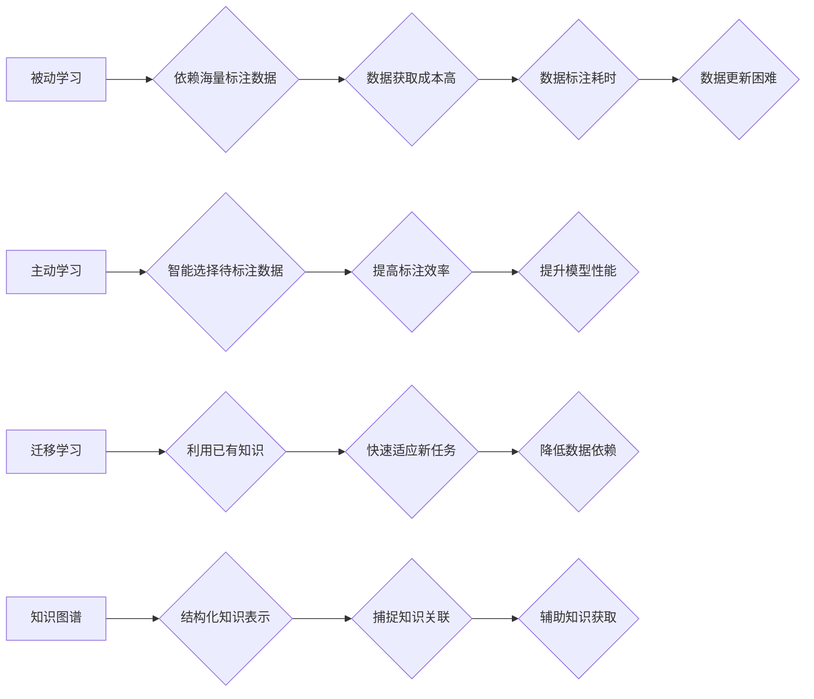

                 

## 从被动接收到主动探索：知识获取的范式转移

> 关键词：知识获取、主动学习、被动学习、深度学习、迁移学习、知识图谱、人工智能

### 1. 背景介绍

在人工智能领域，知识获取一直是研究的热点问题。传统的机器学习方法主要依赖于海量标注数据，这种被动学习模式存在着数据获取成本高、数据标注耗时、数据更新困难等问题。随着深度学习技术的快速发展，机器学习模型的性能得到显著提升，但其对数据依赖性依然十分强。

为了解决这些问题，主动学习和迁移学习等方法应运而生。主动学习旨在通过智能地选择待标注数据，最大限度地提高标注效率和模型性能。迁移学习则通过利用已有的知识和经验，帮助模型快速适应新的任务和领域。

近年来，知识图谱（Knowledge Graph，KG）技术也为知识获取提供了新的思路。知识图谱是一种结构化的知识表示形式，能够将知识表示为实体和关系的网络结构，从而更好地捕捉知识之间的关联性。

本文将探讨知识获取的范式转移，从被动接收到主动探索，并分析不同方法的优缺点，以及在实际应用中的挑战和展望。

### 2. 核心概念与联系

#### 2.1  被动学习与主动学习

被动学习是指模型从已有的标注数据中学习知识，其学习过程是完全依赖于外部数据提供的。主动学习则旨在通过智能地选择待标注数据，引导模型学习更重要的知识，从而提高学习效率和模型性能。

#### 2.2  迁移学习与知识图谱

迁移学习是指利用已有的知识和经验，帮助模型快速适应新的任务和领域。知识图谱可以作为迁移学习的知识源，通过提取和利用知识图谱中的结构化知识，帮助模型迁移到新的任务中。

#### 2.3  知识获取的范式转移

传统的被动学习模式依赖于海量标注数据，而主动学习和迁移学习则试图通过更智能的方式获取知识，从而减轻对标注数据的依赖。知识图谱技术为知识获取提供了新的思路，可以帮助模型更好地理解和利用知识之间的关联性。

**Mermaid 流程图**



### 3. 核心算法原理 & 具体操作步骤

#### 3.1  算法原理概述

主动学习算法的核心思想是通过选择最能帮助模型学习的样本进行标注，从而最大限度地提高标注效率和模型性能。常见的主动学习策略包括：

* **不确定性采样:** 选择模型预测结果不确定的样本进行标注，因为这些样本对模型学习最有帮助。
* **多样性采样:** 选择模型预测结果差异较大的样本进行标注，以增加模型对不同样本类型的理解。
* **边界采样:** 选择位于模型决策边界附近的样本进行标注，以帮助模型更好地理解决策边界。

#### 3.2  算法步骤详解

1. **初始化模型:** 使用初始的模型进行训练，可以是预训练模型或随机初始化的模型。
2. **选择待标注样本:** 根据选择的主动学习策略，从未标注的数据集中选择待标注样本。
3. **标注样本:** 将选择的样本交给人工标注员进行标注。
4. **更新模型:** 使用标注后的样本更新模型参数。
5. **重复步骤2-4:** 直到达到预设的标注数量或模型性能达到目标水平。

#### 3.3  算法优缺点

**优点:**

* 提高标注效率: 通过智能地选择待标注样本，可以减少标注数量，降低标注成本。
* 提升模型性能: 选择最能帮助模型学习的样本，可以提高模型的学习效率和最终性能。

**缺点:**

* 需要设计有效的主动学习策略: 不同的主动学习策略适用于不同的任务和数据集，需要根据具体情况进行选择和设计。
* 需要人工标注: 尽管主动学习可以减少标注数量，但仍然需要人工标注部分样本。

#### 3.4  算法应用领域

主动学习算法广泛应用于图像识别、自然语言处理、语音识别等领域，例如：

* **图像识别:** 选择模型预测结果不确定的图像进行标注，提高图像分类模型的准确率。
* **自然语言处理:** 选择模型理解难度较大的文本进行标注，提高文本分类、情感分析等模型的性能。
* **语音识别:** 选择模型识别难度较大的语音片段进行标注，提高语音识别模型的准确率。

### 4. 数学模型和公式 & 详细讲解 & 举例说明

#### 4.1  数学模型构建

假设我们有一个包含 $N$ 个样本的数据集 $D = \{x_1, x_2, ..., x_N\}$, 每个样本 $x_i$ 都有一个对应的标签 $y_i$. 我们希望通过主动学习算法选择 $M$ 个样本进行标注，其中 $M << N$.

我们可以使用以下数学模型来表示主动学习算法的目标:

$$
argmax_{S \subseteq D} \frac{d(f(S), y)}{||S||},
$$

其中:

* $S$ 是待标注样本的集合，$||S||$ 表示集合 $S$ 中样本的数量。
* $f(S)$ 是使用标注样本 $S$ 训练得到的模型预测结果。
* $d(f(S), y)$ 是模型预测结果 $f(S)$ 与真实标签 $y$ 之间的距离度量。

#### 4.2  公式推导过程

目标函数的目的是最大化模型在标注样本 $S$ 上的性能，同时最小化标注样本的数量。

我们可以使用以下方法来推导目标函数:

* **距离度量:** 可以使用交叉熵损失函数、均方误差等距离度量来衡量模型预测结果与真实标签之间的差异。
* **性能指标:** 可以使用准确率、召回率、F1-score等指标来衡量模型的性能。

#### 4.3  案例分析与讲解

假设我们有一个图像分类任务，需要将图像分类为猫和狗两类。我们可以使用不确定性采样策略进行主动学习。

1. 使用初始模型对所有图像进行预测，并计算每个图像的预测概率。
2. 选择预测概率最不确定的图像进行标注。
3. 使用标注后的图像更新模型参数。
4. 重复步骤1-3，直到模型性能达到目标水平。

通过这种方式，我们可以选择最能帮助模型学习的图像进行标注，从而提高模型的准确率。

### 5. 项目实践：代码实例和详细解释说明

#### 5.1  开发环境搭建

* Python 3.7+
* TensorFlow 2.0+
* PyTorch 1.0+
* scikit-learn 0.20+

#### 5.2  源代码详细实现

```python
import numpy as np
from sklearn.datasets import make_classification
from sklearn.model_selection import train_test_split
from sklearn.linear_model import LogisticRegression
from sklearn.metrics import accuracy_score

# 生成合成数据集
X, y = make_classification(n_samples=1000, n_features=20, random_state=42)

# 将数据集划分为训练集和测试集
X_train, X_test, y_train, y_test = train_test_split(X, y, test_size=0.2, random_state=42)

# 初始化模型
model = LogisticRegression()

# 定义主动学习策略
def uncertainty_sampling(model, X_unlabeled):
    # 使用模型对未标注数据进行预测
    y_pred_proba = model.predict_proba(X_unlabeled)
    # 计算每个样本的预测概率不确定性
    uncertainty = 1 - np.max(y_pred_proba, axis=1)
    # 选择预测概率不确定性最大的样本
    return X_unlabeled[np.argsort(uncertainty)[-10:]]

# 主动学习迭代
for _ in range(5):
    # 选择待标注样本
    X_selected = uncertainty_sampling(model, X_train)
    # 标注样本
    # ...
    # 更新模型
    model.fit(X_train, y_train)

# 评估模型性能
y_pred = model.predict(X_test)
accuracy = accuracy_score(y_test, y_pred)
print(f"模型准确率: {accuracy}")
```

#### 5.3  代码解读与分析

* 代码首先生成一个合成数据集，并将其划分为训练集和测试集。
* 然后，初始化一个逻辑回归模型。
* 定义一个主动学习策略 `uncertainty_sampling`，该策略选择预测概率不确定性最大的样本进行标注。
* 主动学习迭代过程：
    * 选择待标注样本。
    * 标注样本（此处省略实际标注过程）。
    * 更新模型参数。
* 最后，评估模型性能，并打印模型准确率。

#### 5.4  运行结果展示

运行代码后，可以得到模型在测试集上的准确率。

### 6. 实际应用场景

#### 6.1  医疗诊断

主动学习可以用于辅助医生进行疾病诊断。例如，可以利用主动学习算法选择需要进一步检查的患者样本，从而提高诊断效率和准确率。

#### 6.2  金融风险评估

主动学习可以用于识别金融风险。例如，可以利用主动学习算法选择需要进一步调查的交易样本，从而降低金融风险。

#### 6.3  个性化推荐

主动学习可以用于个性化推荐。例如，可以利用主动学习算法选择用户可能感兴趣的商品进行推荐，从而提高推荐的准确率和用户满意度。

#### 6.4  未来应用展望

随着人工智能技术的不断发展，主动学习和迁移学习等方法将得到更广泛的应用。未来，我们可以期待看到更多基于主动学习和迁移学习的创新应用，例如：

* **自动标注数据:** 利用主动学习算法自动标注数据，从而降低数据标注成本。
* **跨领域迁移:** 利用迁移学习技术将知识从一个领域迁移到另一个领域，从而加速新领域模型的训练。
* **个性化学习:** 利用主动学习和迁移学习技术为每个用户提供个性化的学习体验。

### 7. 工具和资源推荐

#### 7.1  学习资源推荐

* **书籍:**
    * "Active Learning" by Paul S. Bradley
    * "Transfer Learning" by Shih-Fu Chang
* **在线课程:**
    * Coursera: "Machine Learning" by Andrew Ng
    * Udacity: "Deep Learning Nanodegree"

#### 7.2  开发工具推荐

* **Python:** 
    * scikit-learn
    * TensorFlow
    * PyTorch
* **工具库:**
    * ActiveLearner
    * MLflow

#### 7.3  相关论文推荐

* **主动学习:**
    * "Active Learning" by Paul S. Bradley
    * "Uncertainty Sampling for Active Learning" by Lewis and Gale
* **迁移学习:**
    * "Transfer Learning" by Shih-Fu Chang
    * "Domain Adaptation for Machine Learning" by Pan and Yang

### 8. 总结：未来发展趋势与挑战

#### 8.1  研究成果总结

主动学习和迁移学习等方法为知识获取提供了新的思路，能够有效地减轻对标注数据的依赖，提高模型的学习效率和性能。

#### 8.2  未来发展趋势

* **理论研究:** 探索更有效的主动学习和迁移学习策略，以及更深入的理论分析。
* **算法创新:** 开发新的主动学习和迁移学习算法，提高算法的效率和鲁棒性。
* **应用拓展:** 将主动学习和迁移学习应用到更多领域，例如医疗诊断、金融风险评估、个性化推荐等。

#### 8.3  面临的挑战

* **标注成本:** 尽管主动学习可以减少标注数量，但仍然需要人工标注部分样本，标注成本仍然是一个挑战。
* **数据质量:** 主动学习算法的性能依赖于数据质量，数据噪声和不完整性会影响算法效果。
* **模型解释性:** 主动学习和迁移学习算法的决策过程往往比较复杂，缺乏可解释性，这限制了其在一些应用场景中的应用。

#### 8.4  研究展望

未来，我们将继续致力于探索主动学习和迁移学习等方法，开发更有效的知识获取技术，推动人工智能技术的进步。

### 9. 附录：常见问题与解答

#### 9.1  常见问题

* **主动学习和被动学习有什么区别？**

主动学习是指模型主动选择需要标注的样本，而被动学习是指模型从已有的标注数据中学习知识。

* **主动学习有哪些常见的策略？**

常见的主动学习策略包括不确定性采样、多样性采样和边界采样。

* **迁移学习和主动学习有什么关系？**

迁移学习可以作为主动学习的知识源，帮助模型迁移到新的任务中。

* **主动学习有哪些应用场景？**

主动学习广泛应用于图像识别、自然语言处理、语音识别等领域。

#### 9.2  解答

* **主动学习和被动学习的区别:** 主动学习通过智能地选择待标注样本，提高标注效率和模型性能，而被动学习依赖于海量标注数据，效率较低。
* **主动学习策略:** 不确定性采样选择预测不确定的样本，多样性采样选择预测差异大的样本，边界采样选择位于决策边界的样本。
* **迁移学习和主动学习的关系:** 迁移学习可以提供预训练模型或知识，帮助主动学习算法更快地学习新的任务。
* **主动学习的应用场景:** 主动学习可以应用于医疗诊断、金融风险评估、个性化推荐等领域，提高效率和准确率。


作者：禅与计算机程序设计艺术 / Zen and the Art of Computer Programming<end_of_turn>

