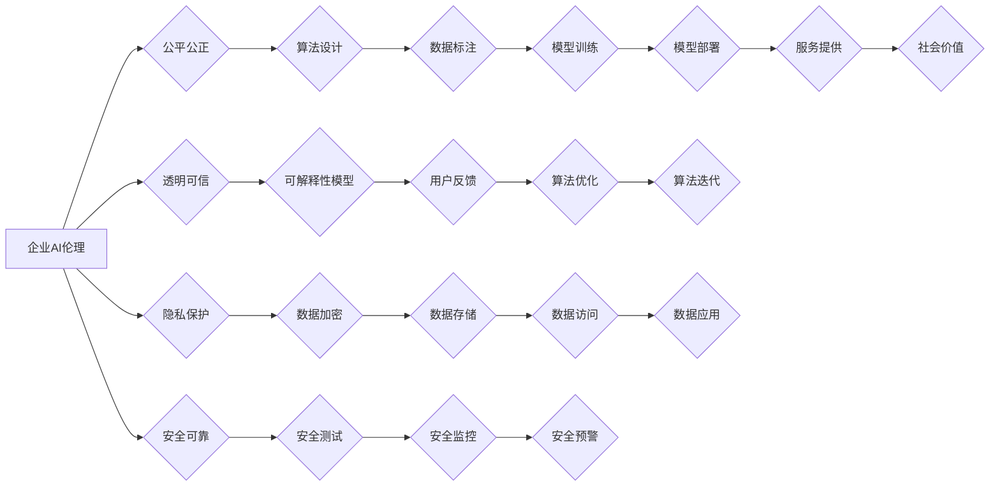

                 

## 企业AI伦理：Lepton AI的社会责任

> 关键词：人工智能伦理、企业责任、算法偏见、数据隐私、透明度、可解释性、社会影响

### 1. 背景介绍

人工智能（AI）技术的飞速发展，为各行各业带来了前所未有的机遇，但也引发了广泛的社会关注和伦理探讨。企业在开发和应用AI技术时，必须承担起相应的社会责任，确保AI技术的发展和应用符合人类的价值观和利益。

Lepton AI作为一家致力于推动AI技术进步的科技公司，深知AI伦理的重要性。我们致力于将伦理原则融入到我们的产品、服务和运营方针中，确保我们的AI技术安全、可靠、公平、透明，并为社会带来积极的价值。

### 2. 核心概念与联系

**2.1 AI伦理的核心概念**

AI伦理是一个多方面、复杂的议题，涉及到多个领域，包括：

* **公平性与不歧视:** AI系统应公平地对待所有用户，避免因种族、性别、宗教等因素而产生歧视。
* **透明度与可解释性:** AI系统的决策过程应透明可解释，用户应能够理解AI系统是如何做出决定的。
* **隐私保护:** AI系统应保护用户的个人隐私信息，避免未经授权的收集、使用和披露。
* **安全与可靠性:** AI系统应安全可靠，避免出现安全漏洞或意外故障，造成负面影响。
* **责任与问责:** AI系统的开发和应用应有明确的责任主体，并对AI系统可能造成的负面影响承担相应的责任。

**2.2 AI伦理与企业责任的联系**

企业作为AI技术的开发和应用主体，承担着重要的社会责任。企业应将AI伦理原则融入到公司的战略、运营和产品开发中，确保AI技术的应用符合社会道德规范和伦理标准。

**2.3  Lepton AI的AI伦理框架**

Lepton AI建立了以下AI伦理框架，作为我们开发和应用AI技术的指导原则：

* **以人为本:** 我们始终将人类的福祉放在首位，确保AI技术服务于人类利益。
* **公平公正:** 我们致力于开发和应用公平公正的AI系统，避免产生歧视或偏见。
* **透明可信:** 我们将AI系统的决策过程进行透明化和可解释性，让用户能够理解AI系统的运作方式。
* **隐私保护:** 我们将严格保护用户的个人隐私信息，并遵守相关法律法规。
* **安全可靠:** 我们将确保AI系统的安全性和可靠性，避免出现安全漏洞或意外故障。
* **持续改进:** 我们将不断改进我们的AI伦理框架，并与社会各界进行沟通和合作，共同推动AI技术的健康发展。

**2.4  Mermaid 流程图**



### 3. 核心算法原理 & 具体操作步骤

**3.1 算法原理概述**

Lepton AI的核心算法基于深度学习技术，并结合了强化学习和迁移学习等先进方法。我们的算法模型能够学习和理解复杂的模式和关系，并根据学习到的知识进行预测、分类和决策。

**3.2 算法步骤详解**

1. **数据收集和预处理:** 收集相关数据，并进行清洗、格式化和特征提取等预处理操作。
2. **模型构建:** 根据具体任务选择合适的深度学习模型架构，例如卷积神经网络（CNN）、循环神经网络（RNN）或Transformer等。
3. **模型训练:** 使用训练数据对模型进行训练，调整模型参数，使其能够准确地完成目标任务。
4. **模型评估:** 使用测试数据评估模型的性能，并根据评估结果进行模型调优。
5. **模型部署:** 将训练好的模型部署到生产环境中，用于实际应用。

**3.3 算法优缺点**

**优点:**

* **高准确率:** 深度学习算法能够学习到复杂的模式和关系，从而实现高准确率的预测和分类。
* **自动化学习:** 深度学习算法能够自动学习特征，无需人工特征工程。
* **可扩展性:** 深度学习算法能够处理海量数据，并可扩展到更大的模型规模。

**缺点:**

* **数据依赖:** 深度学习算法对训练数据的质量和数量有很高的依赖性。
* **黑盒效应:** 深度学习模型的决策过程难以解释，难以理解模型是如何做出决定的。
* **计算资源需求:** 训练深度学习模型需要大量的计算资源和时间。

**3.4 算法应用领域**

Lepton AI的核心算法应用于多个领域，包括：

* **自然语言处理:** 文本分类、情感分析、机器翻译等。
* **计算机视觉:** 图像识别、物体检测、图像分割等。
* **语音识别:** 语音转文本、语音合成等。
* **推荐系统:** 产品推荐、内容推荐等。
* **医疗诊断:** 病症诊断、疾病预测等。

### 4. 数学模型和公式 & 详细讲解 & 举例说明

**4.1 数学模型构建**

Lepton AI的核心算法基于神经网络模型，其数学模型可以概括为以下公式：

$$
y = f(W x + b)
$$

其中：

* $y$ 是模型输出
* $x$ 是输入数据
* $W$ 是权重矩阵
* $b$ 是偏置向量
* $f$ 是激活函数

**4.2 公式推导过程**

神经网络模型的训练过程是通过优化权重矩阵 $W$ 和偏置向量 $b$ 来实现的。常用的优化算法包括梯度下降法和其变种算法。

梯度下降法的核心思想是通过不断调整权重和偏置，使模型输出与真实值之间的误差最小化。具体步骤如下：

1. 计算模型输出与真实值的误差，即损失函数。
2. 计算损失函数对权重和偏置的梯度。
3. 根据梯度方向更新权重和偏置，使损失函数减小。

**4.3 案例分析与讲解**

例如，在图像分类任务中，输入数据 $x$ 是图像像素值，输出 $y$ 是图像类别概率分布。

训练过程中，通过不断调整权重矩阵 $W$ 和偏置向量 $b$，使模型能够将图像像素值映射到正确的类别概率分布。

**4.4  举例说明**

假设我们有一个简单的图像分类模型，用于识别猫和狗的图片。训练数据包含了大量猫和狗的图片，以及对应的标签。

模型训练完成后，当输入一张新的图片时，模型会根据训练到的知识，将图片像素值映射到猫和狗的类别概率分布。

如果模型预测的猫的概率更高，则认为图片是猫；反之，则认为图片是狗。

### 5. 项目实践：代码实例和详细解释说明

**5.1 开发环境搭建**

Lepton AI的开发环境基于Python语言和深度学习框架TensorFlow或PyTorch。

需要安装Python、TensorFlow或PyTorch、NumPy、Pandas等相关库。

**5.2 源代码详细实现**

以下是一个简单的图像分类模型的代码示例，使用TensorFlow框架实现：

```python
import tensorflow as tf

# 定义模型结构
model = tf.keras.models.Sequential([
  tf.keras.layers.Conv2D(32, (3, 3), activation='relu', input_shape=(28, 28, 1)),
  tf.keras.layers.MaxPooling2D((2, 2)),
  tf.keras.layers.Conv2D(64, (3, 3), activation='relu'),
  tf.keras.layers.MaxPooling2D((2, 2)),
  tf.keras.layers.Flatten(),
  tf.keras.layers.Dense(10, activation='softmax')
])

# 编译模型
model.compile(optimizer='adam',
              loss='sparse_categorical_crossentropy',
              metrics=['accuracy'])

# 训练模型
model.fit(x_train, y_train, epochs=10)

# 评估模型
loss, accuracy = model.evaluate(x_test, y_test)
print('Test loss:', loss)
print('Test accuracy:', accuracy)
```

**5.3 代码解读与分析**

这段代码定义了一个简单的卷积神经网络模型，用于图像分类。

模型包含两个卷积层、两个最大池化层、一个全连接层和一个softmax输出层。

模型使用Adam优化器、交叉熵损失函数和准确率作为评估指标。

**5.4 运行结果展示**

训练完成后，模型可以用来预测新的图像类别。

例如，当输入一张猫的图片时，模型会输出一个概率分布，其中猫的概率会很高。

### 6. 实际应用场景

Lepton AI的核心算法已应用于多个实际场景，例如：

* **医疗诊断辅助:** 帮助医生识别病灶、预测疾病风险。
* **金融风险控制:** 识别欺诈交易、评估信用风险。
* **智能客服:** 提供自动化的客户服务，例如回答常见问题、处理简单的请求。
* **个性化推荐:** 为用户推荐个性化的产品、内容和服务。

**6.4 未来应用展望**

Lepton AI将继续探索AI技术的应用，并将其应用于更多领域，例如：

* **自动驾驶:** 帮助车辆感知周围环境、做出决策。
* **机器人技术:** 赋予机器人更强的智能和自主性。
* **教育科技:** 提供个性化的学习体验、辅助教学。

### 7. 工具和资源推荐

**7.1 学习资源推荐**

* **在线课程:** Coursera、edX、Udacity等平台提供丰富的AI课程。
* **书籍:** 《深度学习》、《机器学习》、《人工智能导论》等经典书籍。
* **开源项目:** TensorFlow、PyTorch、OpenCV等开源项目提供丰富的代码和资源。

**7.2 开发工具推荐**

* **深度学习框架:** TensorFlow、PyTorch、Keras等。
* **数据处理工具:** Pandas、NumPy等。
* **可视化工具:** Matplotlib、Seaborn等。

**7.3 相关论文推荐**

* **《ImageNet Classification with Deep Convolutional Neural Networks》**
* **《Attention Is All You Need》**
* **《BERT: Pre-training of Deep Bidirectional Transformers for Language Understanding》**

### 8. 总结：未来发展趋势与挑战

**8.1 研究成果总结**

Lepton AI在AI伦理方面取得了一定的成果，建立了AI伦理框架，并将其融入到我们的产品和服务中。

我们致力于与社会各界合作，共同推动AI技术的健康发展。

**8.2 未来发展趋势**

未来，AI伦理将成为AI技术发展的重要议题。

我们需要不断探索新的AI伦理原则和方法，以应对AI技术带来的新的挑战。

**8.3 面临的挑战**

* **算法偏见:** AI算法可能存在偏见，导致不公平的结果。
* **数据隐私:** AI算法需要大量数据进行训练，如何保护用户隐私是一个重要问题。
* **透明度与可解释性:** AI算法的决策过程难以解释，如何提高透明度和可解释性是一个挑战。
* **责任与问责:** AI算法可能造成负面影响，如何明确责任主体和问责机制是一个重要问题。

**8.4 研究展望**

Lepton AI将继续关注AI伦理的研究，并致力于开发更公平、更安全、更透明的AI技术。

我们相信，通过共同努力，我们可以将AI技术用于造福人类。

### 9. 附录：常见问题与解答

**9.1 如何避免算法偏见？**

* 使用多样化的训练数据，确保数据代表真实世界。
* 识别和缓解算法中的偏见，例如使用公平性评估指标。
* 持续监控和评估算法的性能，及时发现和解决偏见问题。

**9.2 如何保护用户隐私？**

* 使用数据加密技术保护用户隐私信息。
* 遵循数据隐私法规，例如GDPR和CCPA。
* 采取匿名化和去识别化技术，减少用户个人信息的泄露。

**9.3 如何提高算法的透明度和可解释性？**

* 使用可解释性模型，例如线性模型或决策树。
* 开发可视化工具，帮助用户理解算法的决策过程。
* 提供算法的文档和解释，帮助用户理解算法的工作原理。


作者：禅与计算机程序设计艺术 / Zen and the Art of Computer Programming 
<end_of_turn>

