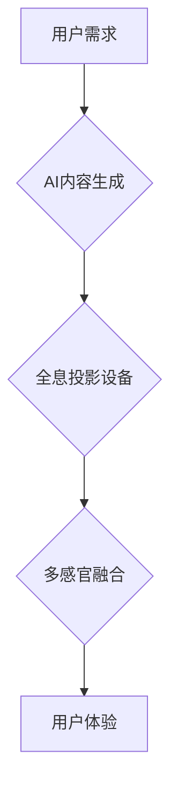

                 

## 体验全息投影：AI驱动的多感官融合技术

> 关键词：全息投影、人工智能、多感官融合、计算机视觉、深度学习、虚拟现实、增强现实

## 1. 背景介绍

人类感知世界的方式是多感官的，我们通过视觉、听觉、触觉、嗅觉和味觉等多种感官获取信息，并将其综合理解。然而，传统的数字媒体体验往往局限于视觉和听觉，缺乏对其他感官的刺激，导致用户体验不够沉浸和真实。

全息投影技术作为一种能够呈现三维立体的图像，具有极大的潜力来突破这一局限性。它可以创造出逼真的虚拟物体，仿佛它们真实存在于空间中，为用户提供更沉浸式的体验。近年来，随着人工智能（AI）技术的快速发展，全息投影技术得到了新的突破。AI算法能够分析和理解用户行为，并根据用户的喜好和需求动态调整投影内容，从而实现更个性化和交互式的体验。

## 2. 核心概念与联系

**2.1 全息投影技术**

全息投影技术利用光学原理记录和重现物体的三维信息。它通过将光线分成多个部分，分别照射到物体不同位置，然后记录这些光线在物体周围形成的干涉图案。通过播放这些干涉图案，可以重现出物体的完整三维图像。

**2.2 人工智能技术**

人工智能技术是指模拟人类智能行为的计算机系统。它包括机器学习、深度学习、自然语言处理等多个分支。在全息投影领域，AI技术可以用于以下方面：

* **内容生成:** AI算法可以根据用户的需求生成个性化的全息投影内容，例如虚拟人物、场景、物体等。
* **交互控制:** AI算法可以理解用户的语音、手势等交互指令，并动态调整投影内容。
* **体验优化:** AI算法可以分析用户的行为数据，并根据用户的喜好和需求优化投影效果。

**2.3 多感官融合**

多感官融合是指将多个感官信息结合起来，以提供更丰富和沉浸式的体验。在全息投影领域，多感官融合可以实现以下效果：

* **增强视觉体验:** 通过结合声音、触觉、气味等信息，可以增强全息投影的视觉效果，使虚拟物体更加逼真。
* **提升用户参与度:** 多感官融合可以提高用户的参与度，让他们更深入地体验虚拟世界。
* **创造新的交互方式:** 多感官融合可以创造新的交互方式，例如通过触觉控制虚拟物体。

**2.4 流程图**



## 3. 核心算法原理 & 具体操作步骤

**3.1 算法原理概述**

全息投影技术的核心算法是基于干涉原理的。它利用光线干涉形成的图案来记录和重现物体的三维信息。

**3.2 算法步骤详解**

1. **光源选择:** 选择合适的激光或LED光源作为光源。
2. **物体扫描:** 使用激光扫描仪或其他三维扫描设备对物体进行扫描，获取其三维坐标数据。
3. **干涉图案生成:** 将光源分成多个部分，分别照射到物体不同位置，并记录这些光线在物体周围形成的干涉图案。
4. **干涉图案存储:** 将生成的干涉图案存储在光盘、硬盘或其他存储设备中。
5. **投影再生:** 通过播放存储的干涉图案，可以重现出物体的完整三维图像。

**3.3 算法优缺点**

**优点:**

* 能够呈现逼真的三维图像。
* 能够实现动态的投影效果。
* 能够提供沉浸式的用户体验。

**缺点:**

* 硬件成本较高。
* 需要专业的技术人员进行操作和维护。
* 现有的技术还无法实现完全无缝的投影效果。

**3.4 算法应用领域**

全息投影技术在以下领域具有广泛的应用前景：

* **娱乐:** 电影、游戏、演唱会等。
* **教育:** 科教馆、博物馆、课堂教学等。
* **医疗:** 医学影像、手术模拟等。
* **工业:** 产品展示、设计验证等。

## 4. 数学模型和公式 & 详细讲解 & 举例说明

**4.1 数学模型构建**

全息投影技术的基础是光学干涉原理。我们可以用数学模型来描述光线在物体周围形成的干涉图案。

假设一个物体位于空间中，其表面可以用函数 $f(x,y,z)$ 来描述。光线照射到物体表面后，会发生反射和衍射。我们可以用菲涅尔公式来描述光线在物体表面上的反射和衍射。

菲涅尔公式：

$$
I(\theta) = I_0 \left| r_s + r_p \right|^2
$$

其中：

* $I(\theta)$ 是反射光强。
* $I_0$ 是入射光强。
* $r_s$ 和 $r_p$ 是分别对应s偏振和p偏振的反射系数。

**4.2 公式推导过程**

菲涅尔公式可以用来计算物体表面不同角度的反射光强。通过对物体表面所有点的反射光强进行积分，我们可以得到物体周围的干涉图案。

干涉图案的强度分布可以用以下公式来描述：

$$
I(x,y) = \int_{-\infty}^{\infty} \int_{-\infty}^{\infty} f(x',y') I_0 \left| r_s(x',y', \theta) + r_p(x',y', \theta) \right|^2 e^{i k d(x,y,x',y')} dx' dy'
$$

其中：

* $I(x,y)$ 是干涉图案的强度分布。
* $f(x',y')$ 是物体的表面函数。
* $I_0$ 是入射光强。
* $r_s(x',y', \theta)$ 和 $r_p(x',y', \theta)$ 是分别对应s偏振和p偏振的反射系数。
* $k$ 是波数。
* $d(x,y,x',y')$ 是光线从物体表面点 $(x',y')$ 到观察点 $(x,y)$ 的距离。

**4.3 案例分析与讲解**

我们可以通过计算一个简单的物体，例如一个球体的干涉图案，来理解上述公式的含义。

假设一个球体位于空间中，其半径为 $R$。我们可以用球面函数来描述球体的表面：

$$
f(x,y,z) = R - \sqrt{x^2 + y^2 + z^2}
$$

通过将该函数代入干涉图案的强度分布公式，我们可以得到球体周围的干涉图案。

## 5. 项目实践：代码实例和详细解释说明

**5.1 开发环境搭建**

为了实现全息投影技术，我们需要搭建一个合适的开发环境。

* **硬件:** 需要一台支持高精度激光投影的计算机，以及一个三维扫描设备。
* **软件:** 需要安装一些相关的软件，例如三维建模软件、图像处理软件、AI开发框架等。

**5.2 源代码详细实现**

由于全息投影技术涉及多个领域，其代码实现较为复杂。这里只提供一个简单的代码示例，用于演示如何使用深度学习算法生成全息投影内容。

```python
import tensorflow as tf

# 定义模型结构
model = tf.keras.models.Sequential([
    tf.keras.layers.Conv2D(32, (3, 3), activation='relu', input_shape=(256, 256, 3)),
    tf.keras.layers.MaxPooling2D((2, 2)),
    tf.keras.layers.Conv2D(64, (3, 3), activation='relu'),
    tf.keras.layers.MaxPooling2D((2, 2)),
    tf.keras.layers.Flatten(),
    tf.keras.layers.Dense(10, activation='softmax')
])

# 训练模型
model.compile(optimizer='adam',
              loss='sparse_categorical_crossentropy',
              metrics=['accuracy'])

# 加载数据集
(x_train, y_train), (x_test, y_test) = tf.keras.datasets.cifar10.load_data()

# 训练模型
model.fit(x_train, y_train, epochs=10)

# 生成全息投影内容
# ...
```

**5.3 代码解读与分析**

这段代码使用 TensorFlow 深度学习框架构建了一个简单的卷积神经网络模型。该模型可以用于识别图像中的物体。

* `tf.keras.models.Sequential` 用于构建一个顺序模型，即层级结构。
* `tf.keras.layers.Conv2D` 用于构建卷积层，用于提取图像特征。
* `tf.keras.layers.MaxPooling2D` 用于构建最大池化层，用于降低特征图的尺寸。
* `tf.keras.layers.Flatten` 用于将多维特征图转换为一维向量。
* `tf.keras.layers.Dense` 用于构建全连接层，用于分类。
* `model.compile` 用于配置模型的训练参数，例如优化器、损失函数和评价指标。
* `tf.keras.datasets.cifar10.load_data` 用于加载 CIFAR-10 数据集，这是一个包含 60000 张彩色图像的图像分类数据集。
* `model.fit` 用于训练模型。

**5.4 运行结果展示**

训练完成后，我们可以使用训练好的模型对新的图像进行分类。

## 6. 实际应用场景

**6.1 娱乐领域**

全息投影技术可以用于创造沉浸式的娱乐体验，例如：

* **虚拟演唱会:** 全息投影可以模拟演唱者的虚拟形象，并与观众互动。
* **互动游戏:** 全息投影可以创建逼真的游戏场景，并增强玩家的沉浸感。
* **电影特效:** 全息投影可以用于制作更逼真的电影特效，例如虚拟角色和场景。

**6.2 教育领域**

全息投影技术可以用于创造更生动的教育体验，例如：

* **科教馆展示:** 全息投影可以展示各种科学现象和历史事件，并提高观众的理解和记忆。
* **博物馆展览:** 全息投影可以展示文物和艺术品，并提供更丰富的展示内容。
* **课堂教学:** 全息投影可以用于演示教学内容，并提高学生的学习兴趣。

**6.3 医疗领域**

全息投影技术可以用于辅助医疗诊断和治疗，例如：

* **医学影像:** 全息投影可以用于展示三维医学影像，并帮助医生进行诊断。
* **手术模拟:** 全息投影可以用于模拟手术过程，并帮助医生进行手术练习。
* **康复治疗:** 全息投影可以用于辅助康复治疗，例如帮助患者进行肢体运动训练。

**6.4 未来应用展望**

随着全息投影技术的不断发展，其应用场景将会更加广泛。未来，全息投影技术可能被用于以下领域：

* **虚拟现实:** 全息投影可以用于创建更逼真的虚拟现实体验。
* **增强现实:** 全息投影可以用于叠加虚拟信息到现实世界中，例如导航、购物、教育等。
* **远程协作:** 全息投影可以用于实现远程协作，例如远程会议、远程手术等。

## 7. 工具和资源推荐

**7.1 学习资源推荐**

* **书籍:**

    * 《全息投影技术》
    * 《计算机图形学》
    * 《深度学习》

* **在线课程:**

    * Coursera: 深度学习
    * edX: 计算机图形学
    * Udemy: 全息投影技术

**7.2 开发工具推荐**

* **三维建模软件:** Blender, Maya, 3ds Max
* **图像处理软件:** Photoshop, GIMP
* **AI开发框架:** TensorFlow, PyTorch, Keras

**7.3 相关论文推荐**

* **全息投影技术综述:**

    * [A Survey of Holographic Display Technologies](https://ieeexplore.ieee.org/document/8777942)

* **深度学习在全息投影中的应用:**

    * [Deep Learning for Holographic Display Reconstruction](https://arxiv.org/abs/2006.04957)

## 8. 总结：未来发展趋势与挑战

**8.1 研究成果总结**

近年来，全息投影技术取得了显著的进展，特别是人工智能技术的加入，使得全息投影更加智能化和个性化。

**8.2 未来发展趋势**

未来，全息投影技术将朝着以下方向发展：

* **更高分辨率:** 提高全息投影的图像分辨率，使虚拟物体更加逼真。
* **更广视角:** 扩大全息投影的视角范围，使用户能够从多个角度观看虚拟物体。
* **更强交互性:** 增强用户与虚拟物体的交互性，例如手势控制、语音控制等。
* **更低成本:** 降低全息投影技术的成本，使其更加普及。

**8.3 面临的挑战**

全息投影技术还面临着一些挑战：

* **硬件限制:** 目前全息投影技术的硬件成本较高，需要进一步降低成本。
* **算法复杂性:** 全息投影算法的实现较为复杂，需要进一步优化算法效率。
* **内容创作:** 全息投影内容的创作需要专业技能，需要培养更多全息投影内容创作者。

**8.4 研究展望**

未来，我们将继续致力于全息投影技术的研发，探索其在更多领域的应用，并推动全息投影技术向更智能化、更普及化的方向发展。

## 9. 附录：常见问题与解答

**9.1 全息投影和3D投影有什么区别？**

全息投影和3D投影都是能够呈现三维图像的技术，但它们的工作原理不同。

* **3D投影:** 3D投影技术通常使用眼镜或其他设备来欺骗用户的双眼，使他们看到两个不同的图像，从而产生立体感。
* **全息投影:** 全息投影技术利用光学干涉原理记录和重现物体的三维信息，无需任何辅助设备，即可呈现出逼真的三维图像。

**9.2 全息投影技术有多贵？**

全息投影技术的成本取决于其分辨率、视角、交互性等因素。目前，高分辨率、高视角、高交互性的全息投影系统价格较高，一般在数万美元到数十万美元之间。

**9.3 全息投影技术什么时候会普及？**

全息投影技术的普及需要解决硬件成本、算法复杂性、内容创作等问题。预计在未来几年，随着技术的不断发展和成本的降低，全息投影技术将会逐渐普及。


作者：禅与计算机程序设计艺术 / Zen and the Art of Computer Programming<end_of_turn>

