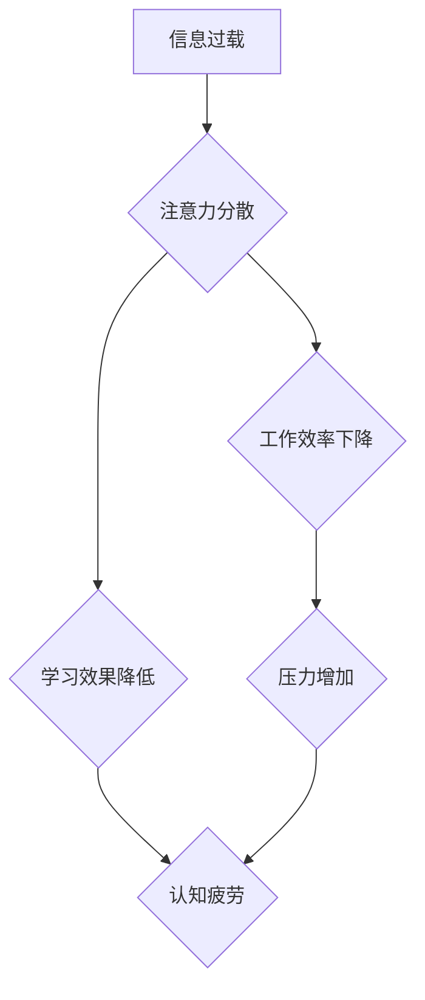

                 

## 信息时代的注意力管理：在充满干扰的世界中保持专注

> 关键词：注意力管理、深度工作、干扰、专注力、认知科学、时间管理、效率提升、信息过载

### 1. 背景介绍

在当今信息爆炸的时代，我们被来自各个方向的信息和干扰所包围。智能手机、社交媒体、电子邮件、即时通讯软件等，无时无刻不在提醒我们，争夺着我们的注意力。这种信息过载和持续的干扰，严重损害了我们的专注力，影响了工作效率和生活质量。

注意力，是人类认知的核心能力之一，它指我们对特定信息或任务的集中和持续的关注。专注力强的人能够更好地过滤无关信息，将精力集中在重要的事情上，从而提高工作效率和学习成果。然而，现代社会的信息环境对我们的注意力构成巨大挑战。

### 2. 核心概念与联系

#### 2.1  注意力机制

注意力机制是近年来深度学习领域取得的重要突破，它模拟了人类对信息的筛选和关注机制。注意力机制的核心思想是，在处理信息时，我们并不总是对所有信息给予同等的关注，而是会根据信息的 relevance 和 importance 来分配注意力。

#### 2.2  深度工作

深度工作是指在不受干扰的环境中，专注于一项重要任务，并投入大量时间和精力进行思考和创造。深度工作是提高效率、提升创造力和解决复杂问题的关键。

#### 2.3  干扰

干扰是指任何分散我们注意力、阻碍我们专注于任务的信息或事件。干扰可以来自外部环境，例如噪音、社交媒体通知等，也可以来自内部因素，例如焦虑、压力等。

**Mermaid 流程图**



### 3. 核心算法原理 & 具体操作步骤

#### 3.1  算法原理概述

注意力机制的算法原理主要基于以下几个方面：

* **注意力权重:**  注意力机制会为每个输入信息分配一个注意力权重，权重越高，表示对该信息的关注程度越高。
* **注意力计算:**  注意力权重通常通过一个注意力函数计算得到，该函数会根据输入信息的特征和目标任务的需要来确定权重。
* **加权求和:**  计算得到注意力权重后，会对输入信息进行加权求和，得到一个新的表示，该表示更注重重要信息。

#### 3.2  算法步骤详解

1. **输入数据:**  将需要处理的信息作为输入数据。
2. **特征提取:**  对输入数据进行特征提取，得到每个信息的特征向量。
3. **注意力计算:**  使用注意力函数计算每个信息的注意力权重。
4. **加权求和:**  对特征向量进行加权求和，得到一个新的表示。
5. **输出结果:**  将新的表示作为输出结果。

#### 3.3  算法优缺点

**优点:**

* 可以有效地过滤无关信息，提高对重要信息的关注度。
* 可以学习到不同信息之间的关系，从而更好地理解上下文。
* 在许多任务中，例如机器翻译、文本摘要、图像识别等，都取得了优异的性能。

**缺点:**

* 计算复杂度较高，训练时间较长。
* 需要大量的训练数据才能达到较好的效果。
* 对输入数据的质量要求较高，如果输入数据质量差，注意力机制的效果也会下降。

#### 3.4  算法应用领域

注意力机制在许多领域都有广泛的应用，例如：

* **自然语言处理:**  机器翻译、文本摘要、问答系统、情感分析等。
* **计算机视觉:**  图像识别、目标检测、图像分割等。
* **语音识别:**  语音转文本、语音合成等。
* **推荐系统:**  个性化推荐、内容过滤等。

### 4. 数学模型和公式 & 详细讲解 & 举例说明

#### 4.1  数学模型构建

注意力机制的数学模型通常基于以下公式：

**注意力权重:**

$$
\alpha_{i} = \frac{exp(e_{i})}{\sum_{j=1}^{N} exp(e_{j})}
$$

其中，$e_{i}$ 表示第 $i$ 个输入信息的注意力得分，$N$ 表示输入信息的总数。

**加权求和:**

$$
\mathbf{c} = \sum_{i=1}^{N} \alpha_{i} \mathbf{h}_{i}
$$

其中，$\mathbf{c}$ 表示加权求和后的输出表示，$\mathbf{h}_{i}$ 表示第 $i$ 个输入信息的特征向量。

#### 4.2  公式推导过程

注意力权重的计算公式是基于 softmax 函数，softmax 函数将输入向量映射到一个概率分布，其中每个元素代表了对相应输入的关注程度。

加权求和公式则将每个输入信息的特征向量与对应的注意力权重相乘，然后求和得到最终的输出表示。

#### 4.3  案例分析与讲解

例如，在机器翻译任务中，注意力机制可以帮助模型关注源语言中与目标语言中特定词语相关的词语，从而提高翻译的准确性。

### 5. 项目实践：代码实例和详细解释说明

#### 5.1  开发环境搭建

* Python 3.x
* TensorFlow 或 PyTorch

#### 5.2  源代码详细实现

```python
import tensorflow as tf

# 定义注意力机制
def attention_layer(inputs, attention_weights):
    # 使用注意力权重对输入进行加权求和
    output = tf.matmul(attention_weights, inputs)
    return output

# 定义一个简单的文本分类模型
model = tf.keras.Sequential([
    tf.keras.layers.Embedding(input_dim=10000, output_dim=128),
    tf.keras.layers.LSTM(units=128),
    attention_layer(inputs=model.layers[-1].output, attention_weights=tf.Variable(tf.random.normal([128, 128])))
])

# 编译模型
model.compile(optimizer='adam', loss='categorical_crossentropy', metrics=['accuracy'])

# 训练模型
model.fit(x_train, y_train, epochs=10)
```

#### 5.3  代码解读与分析

* `attention_layer()` 函数定义了注意力机制，它接受输入信息和注意力权重作为参数，并使用注意力权重对输入进行加权求和。
* `model` 是一个简单的文本分类模型，它包含一个嵌入层、一个 LSTM 层和一个注意力层。
* `model.compile()` 函数编译了模型，指定了优化器、损失函数和评估指标。
* `model.fit()` 函数训练了模型，使用训练数据进行训练。

#### 5.4  运行结果展示

训练完成后，可以使用测试数据评估模型的性能。

### 6. 实际应用场景

#### 6.1  工作场景

* **深度工作:**  使用注意力管理技术，可以帮助我们专注于重要的工作任务，减少干扰，提高工作效率。
* **项目管理:**  注意力管理可以帮助项目经理更好地分配资源，关注关键任务，提高项目进度和质量。

#### 6.2  学习场景

* **高效学习:**  注意力管理可以帮助我们集中注意力，更好地理解和记忆学习内容，提高学习效率。
* **在线学习:**  注意力管理可以帮助我们克服在线学习环境中的干扰，更好地专注于课程内容。

#### 6.3  生活场景

* **阅读:**  注意力管理可以帮助我们更好地理解和享受阅读，提高阅读效率。
* **社交:**  注意力管理可以帮助我们更好地控制社交媒体的使用时间，避免过度沉迷，保持健康的生活方式。

#### 6.4  未来应用展望

随着人工智能技术的不断发展，注意力管理技术将会在更多领域得到应用，例如：

* **个性化教育:**  根据学生的注意力特点，提供个性化的学习方案。
* **医疗诊断:**  帮助医生更好地关注患者的症状和病史，提高诊断准确率。
* **自动驾驶:**  帮助自动驾驶系统更好地感知周围环境，提高安全性。

### 7. 工具和资源推荐

#### 7.1  学习资源推荐

* **书籍:**  《深度学习》、《注意力机制》
* **在线课程:**  Coursera、edX、Udacity

#### 7.2  开发工具推荐

* **TensorFlow:**  开源深度学习框架
* **PyTorch:**  开源深度学习框架
* **Jupyter Notebook:**  交互式编程环境

#### 7.3  相关论文推荐

* **Attention Is All You Need:**  Transformer 模型的论文
* **BERT: Pre-training of Deep Bidirectional Transformers for Language Understanding:**  BERT 模型的论文

### 8. 总结：未来发展趋势与挑战

#### 8.1  研究成果总结

注意力机制是近年来深度学习领域取得的重要突破，它为解决信息过载和提高专注力问题提供了新的思路和方法。

#### 8.2  未来发展趋势

* **更有效的注意力机制:**  研究更有效的注意力机制，提高其计算效率和准确性。
* **跨模态注意力:**  研究跨模态注意力机制，能够处理不同类型的信息，例如文本、图像、音频等。
* **可解释性注意力:**  研究可解释性注意力机制，能够解释注意力机制是如何工作的，提高其可信度和可控性。

#### 8.3  面临的挑战

* **计算复杂度:**  注意力机制的计算复杂度较高，在处理大规模数据时，会带来很大的计算负担。
* **数据依赖性:**  注意力机制需要大量的训练数据才能达到较好的效果，而高质量的训练数据往往难以获取。
* **伦理问题:**  注意力机制可能会被用于操纵用户行为，例如推送个性化广告，因此需要关注其伦理问题。

#### 8.4  研究展望

未来，注意力机制将会在更多领域得到应用，并与其他人工智能技术相结合，例如自然语言处理、计算机视觉、机器人技术等，为我们创造更加智能、便捷的生活。

### 9. 附录：常见问题与解答

**Q1: 如何提高注意力集中力？**

**A1:**  

* 设定明确的目标，并专注于完成目标。
* 创造一个安静、舒适的工作环境，减少干扰。
* 使用番茄工作法等时间管理技巧，将工作时间划分为多个间隔，并在每个间隔内集中注意力。
* 定期休息，让大脑得到放松。

**Q2: 注意力机制是如何工作的？**

**A2:**  注意力机制模拟了人类对信息的筛选和关注机制，它会为每个输入信息分配一个注意力权重，权重越高，表示对该信息的关注程度越高。然后，会根据注意力权重对输入信息进行加权求和，得到一个新的表示，该表示更注重重要信息。

**Q3: 注意力机制有哪些应用场景？**

**A3:**  注意力机制在许多领域都有广泛的应用，例如：

* 自然语言处理: 机器翻译、文本摘要、问答系统、情感分析等。
* 计算机视觉: 图像识别、目标检测、图像分割等。
* 语音识别: 语音转文本、语音合成等。
* 推荐系统: 个性化推荐、内容过滤等。


作者：禅与计算机程序设计艺术 / Zen and the Art of Computer Programming 
<end_of_turn>

