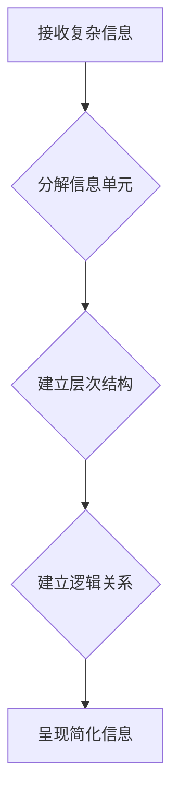

                 

## 信息简化的原则与艺术：在混乱中建立秩序与简化

> 关键词：信息简化、算法设计、数据结构、复杂系统、软件架构、代码优化、可读性、可维护性

### 1. 背景介绍

在当今信息爆炸的时代，我们被海量数据和复杂系统所包围。从庞大的数据库到复杂的软件应用程序，信息以惊人的速度增长，这使得信息处理和理解变得越来越困难。如何有效地简化信息，从中提取有价值的洞察力，已成为一个至关重要的挑战。

信息简化不仅仅是减少数据量，更是一种思维方式，一种将复杂问题分解成更易理解的组成部分，并通过清晰的结构和逻辑表达的方式呈现信息的艺术。它涉及到算法设计、数据结构、软件架构、代码优化等多个方面，旨在提高信息的可读性、可维护性和可扩展性。

### 2. 核心概念与联系

信息简化的核心概念是将复杂的信息分解成更小的、更易于处理的单元，并建立起清晰的层次结构和逻辑关系。

**Mermaid 流程图：信息简化流程**



信息简化涉及到以下几个关键环节：

* **信息分解:** 将复杂的信息分解成更小的、更易于理解的单元，例如将大型数据结构分解成更小的子结构，将复杂的算法分解成更小的步骤。
* **层次结构:** 建立清晰的层次结构，将信息按照重要程度、相关性等进行分类和排序，以便于快速定位和理解。
* **逻辑关系:** 建立清晰的逻辑关系，例如使用连接词、箭头等符号表示信息之间的因果关系、依赖关系等。
* **信息呈现:** 选择合适的格式和方式呈现简化后的信息，例如使用图表、流程图、代码注释等，使信息更直观易懂。

### 3. 核心算法原理 & 具体操作步骤

信息简化算法的核心是高效地处理和组织信息，使其更加易于理解和利用。以下是一些常用的信息简化算法及其操作步骤：

#### 3.1 算法原理概述

* **数据压缩算法:** 

   数据压缩算法通过去除冗余信息，将数据量压缩到最小，例如 Huffman 编码、Lempel-Ziv 算法等。

* **信息提取算法:** 

   信息提取算法从海量数据中提取关键信息，例如文本挖掘、情感分析、知识图谱构建等。

* **数据聚类算法:** 

   数据聚类算法将数据按照相似性进行分组，例如 K-means 聚类、层次聚类等。

#### 3.2 算法步骤详解

以数据压缩算法为例，其基本步骤如下：

1. **统计频率:** 对数据进行统计，计算每个符号或字符出现的频率。
2. **构建编码表:** 根据符号频率，构建一个编码表，将高频符号编码为短码，低频符号编码为长码。
3. **编码数据:** 使用编码表将数据进行编码，将原始数据转换为压缩后的数据。
4. **解码数据:** 使用相同的编码表将压缩后的数据解码回原始数据。

#### 3.3 算法优缺点

* **数据压缩算法:**

   优点: 减少存储空间和传输带宽，提高数据处理效率。
   缺点: 解压缩过程需要消耗一定的计算资源。

* **信息提取算法:**

   优点: 从海量数据中提取关键信息，提高数据分析效率。
   缺点: 需要复杂的算法模型和大量训练数据。

* **数据聚类算法:**

   优点: 将数据按照相似性进行分组，方便数据分析和分类。
   缺点: 聚类结果的 interpretability 较低，需要根据具体应用场景选择合适的聚类算法。

#### 3.4 算法应用领域

信息简化算法广泛应用于各个领域，例如：

* **数据存储和传输:** 数据压缩算法用于压缩文件、图像、视频等数据，减少存储空间和传输带宽。
* **信息检索和分析:** 信息提取算法用于从文本、图像、音频等数据中提取关键信息，例如关键词、主题、情感等。
* **机器学习和人工智能:** 数据聚类算法用于将数据进行分组，为机器学习模型提供更有效的训练数据。
* **软件开发:** 代码优化和信息架构设计等方面，信息简化算法可以提高软件的可读性、可维护性和可扩展性。

### 4. 数学模型和公式 & 详细讲解 & 举例说明

信息简化算法的原理和设计往往基于数学模型和公式。以下是一些常用的数学模型和公式，以及它们的详细讲解和举例说明：

#### 4.1 数学模型构建

* **信息熵:** 信息熵是衡量信息不确定性的度量，其公式为：

$$H(X) = - \sum_{i=1}^{n} p(x_i) \log_2 p(x_i)$$

其中，$X$ 是随机变量，$x_i$ 是 $X$ 的取值，$p(x_i)$ 是 $x_i$ 的概率。

信息熵越大，信息的不确定性越大。数据压缩算法的目标是降低信息熵，从而压缩数据量。

* **卡方检验:** 卡方检验是一种统计检验方法，用于检验两个随机变量之间的独立性。在信息提取算法中，卡方检验可以用于判断特征和目标变量之间的相关性。

#### 4.2 公式推导过程

* **Huffman 编码:** Huffman 编码是一种基于信息熵的压缩算法。其核心思想是将高频符号编码为短码，低频符号编码为长码，从而减少数据量。

Huffman 编码的推导过程涉及到构建优先队列、合并节点等操作，最终得到一个编码表，用于将数据进行编码和解码。

#### 4.3 案例分析与讲解

* **文本压缩:** 使用 Huffman 编码对文本进行压缩，可以显著减少文本文件的大小。例如，对一段包含大量重复字符的文本进行压缩，可以将文件大小减少一半甚至更多。

* **图像压缩:** 使用 JPEG 算法对图像进行压缩，可以有效地减少图像文件的大小，同时保持图像质量。JPEG 算法利用图像的冗余信息，通过量化和离散余弦变换等技术，将图像数据压缩到更小的尺寸。

### 5. 项目实践：代码实例和详细解释说明

以下是一个使用 Python 实现数据压缩的简单代码实例：

#### 5.1 开发环境搭建

* Python 3.x 环境
* 安装必要的库，例如 `collections`、`zlib` 等。

#### 5.2 源代码详细实现

```python
import collections

def huffman_encode(text):
    # 1. 统计字符频率
    frequency = collections.Counter(text)

    # 2. 建立优先队列
    heap = [(frequency[char], char) for char in frequency]
    heapq.heapify(heap)

    # 3. 合并节点
    while len(heap) > 1:
        left = heapq.heappop(heap)
        right = heapq.heappop(heap)
        heapq.heappush(heap, (left[0] + right[0], (left[1], right[1])))

    # 4. 生成编码表
    root = heapq.heappop(heap)[1]
    codes = {}
    def build_codes(node, code):
        if isinstance(node, tuple):
            build_codes(node[0], code + '0')
            build_codes(node[1], code + '1')
        else:
            codes[node] = code
    build_codes(root, '')

    # 5. 编码数据
    encoded_text = ''.join([codes[char] for char in text])

    return encoded_text

# 示例使用
text = "hello world"
encoded_text = huffman_encode(text)
print(f"原始文本: {text}")
print(f"编码文本: {encoded_text}")
```

#### 5.3 代码解读与分析

* 该代码首先统计文本中每个字符出现的频率。
* 然后，它构建一个优先队列，将字符及其频率作为节点存储在队列中。
* 优先队列按照频率从小到大排序，然后不断合并两个频率最低的节点，形成新的节点，直到只剩下一个节点。
* 最后，它根据优先队列中的节点结构，构建一个编码表，将每个字符编码为一个二进制码。

#### 5.4 运行结果展示

运行该代码后，会输出原始文本和编码后的文本。编码后的文本长度会比原始文本短，表明数据已经压缩成功。

### 6. 实际应用场景

信息简化技术在各个领域都有广泛的应用场景：

#### 6.1 数据存储和传输

* **文件压缩:** 使用 ZIP、RAR 等压缩工具压缩文件，减少存储空间和传输带宽。
* **图像和视频压缩:** 使用 JPEG、PNG、MP4 等压缩格式压缩图像和视频，减少文件大小，提高网络传输效率。

#### 6.2 信息检索和分析

* **文本挖掘:** 使用信息提取算法从文本中提取关键词、主题、情感等信息，用于搜索引擎、舆情分析等领域。
* **知识图谱构建:** 使用信息提取算法和数据聚类算法构建知识图谱，用于知识表示、推理和查询。

#### 6.3 机器学习和人工智能

* **特征选择:** 使用信息增益、互信息等指标选择最相关的特征，提高机器学习模型的性能。
* **数据降维:** 使用 PCA、LDA 等降维算法将高维数据降维，减少数据维度，提高计算效率。

#### 6.4 软件开发

* **代码优化:** 使用代码分析工具和重构技术简化代码结构，提高代码可读性和可维护性。
* **信息架构设计:** 使用信息架构原则设计网站和应用程序的结构，使信息更加易于理解和导航。

#### 6.5 未来应用展望

随着信息量的不断增长，信息简化技术将发挥越来越重要的作用。未来，信息简化技术可能会在以下领域得到更广泛的应用：

* **个性化信息服务:** 根据用户的兴趣和需求，对信息进行个性化简化和呈现。
* **智能数据分析:** 使用人工智能技术自动简化和分析复杂数据，提取有价值的洞察力。
* **虚拟现实和增强现实:** 在虚拟现实和增强现实环境中，使用信息简化技术增强用户体验。

### 7. 工具和资源推荐

#### 7.1 学习资源推荐

* **书籍:**
    * 《信息简化》
    * 《数据结构与算法分析》
    * 《算法导论》
* **在线课程:**
    * Coursera 上的《算法设计与分析》课程
    * edX 上的《数据结构与算法》课程

#### 7.2 开发工具推荐

* **Python:** 广泛用于数据分析、机器学习和软件开发。
* **Java:** 适用于大型应用程序开发。
* **C++:** 性能优异，适用于高性能计算和游戏开发。

#### 7.3 相关论文推荐

* **Huffman Coding:** David A. Huffman, "A Method for the Construction of Minimum Redundancy Codes," 1952.
* **K-means Clustering:** Stuart Lloyd, "Least Squares Quantization in PCM," 1982.
* **Principal Component Analysis (PCA):** J. Hotelling, "Analysis of Principal Components," 1933.

### 8. 总结：未来发展趋势与挑战

信息简化技术在信息时代具有重要的意义，它可以帮助我们更好地理解和利用信息，提高效率和创造力。

#### 8.1 研究成果总结

近年来，信息简化技术取得了显著的进展，例如：

* **深度学习算法:** 深度学习算法可以自动学习数据中的复杂模式，并进行信息提取和简化。
* **自然语言处理:** 自然语言处理技术可以帮助我们更好地理解和处理文本信息，例如文本摘要、机器翻译等。
* **可视化技术:** 可视化技术可以帮助我们更直观地理解和呈现信息，例如数据可视化、信息图表等。

#### 8.2 未来发展趋势

未来，信息简化技术将朝着以下方向发展：

* **更加智能化:** 使用人工智能技术，实现更加智能的信息简化和分析。
* **更加个性化:** 根据用户的需求和偏好，提供更加个性化的信息简化服务。
* **更加跨领域:** 将信息简化技术应用于更多领域，例如医疗、教育、金融等。

#### 8.3 面临的挑战

信息简化技术也面临着一些挑战：

* **数据质量:** 信息简化算法的性能依赖于数据质量，如何处理噪声数据和不完整数据是一个重要的挑战。
* **解释性:** 一些复杂的机器学习算法难以解释，如何提高信息简化算法的 interpretability 是一个重要的研究方向。
* **伦理问题:** 信息简化技术可能会被用于操纵信息和影响用户决策，如何确保信息简化技术的伦理使用是一个重要的议题。

#### 8.4 研究展望

信息简化技术是一个充满机遇和挑战的领域，未来将会有更多的研究和创新。我们期待看到更多新的信息简化算法和应用，帮助我们更好地理解和利用信息，创造更加美好的未来。

### 9. 附录：常见问题与解答

* **什么是信息简化？**

   信息简化是指将复杂的信息分解成更易于理解和处理的单元，并建立清晰的层次结构和逻辑关系，使其更加易于理解和利用。

* **信息简化有哪些应用场景？**

   信息简化技术广泛应用于数据存储和传输、信息检索和分析、机器学习和人工智能、软件开发等领域。

* **如何进行信息简化？**

   信息简化可以通过多种方法实现，例如数据压缩、信息提取、数据聚类等算法。

* **信息简化技术有哪些挑战？**

   信息简化技术面临着数据质量、解释性、伦理问题等挑战。


作者：禅与计算机程序设计艺术 / Zen and the Art of Computer Programming<end_of_turn>

