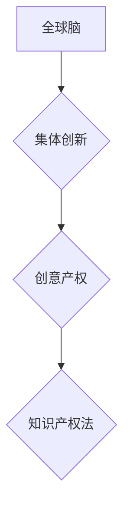

                 

## 全球脑创意产权保护:集体创新成果的知识产权法

> 关键词：全球脑、集体创新、知识产权、创意产权、数字版权、人工智能、法律框架、伦理问题

## 1. 背景介绍

随着人工智能技术的飞速发展，全球脑的概念逐渐从科幻小说走向现实。全球脑，也称为“世界大脑”，是指一个由全球分散的计算资源和网络连接而成的超级智能系统。它将汇集人类的知识、经验和创造力，实现对信息和数据的无缝整合，从而推动人类文明的进步。

然而，全球脑的出现也带来了新的挑战，其中之一就是创意产权的保护。在全球脑中，创意产权的产生和传播将更加复杂和难以控制。传统的知识产权法体系难以适应这种全新的环境，因此需要建立新的法律框架来保护集体创新成果。

## 2. 核心概念与联系

### 2.1 全球脑

全球脑是一个由分布式计算节点组成的庞大网络，通过网络连接和数据共享，实现协同计算和智能决策。其核心特点包括：

* **分布式架构:** 全球脑由众多分散的计算节点组成，每个节点拥有独立的计算能力和存储资源。
* **网络连接:** 节点之间通过高速网络连接，实现数据和信息的快速交换。
* **协同计算:** 节点之间可以协同计算，共同解决复杂问题。
* **智能决策:** 全球脑通过机器学习和人工智能算法，实现对数据的分析和决策。

### 2.2 集体创新

集体创新是指由多个个体共同参与，通过协作和分享，创造出新的知识、技术或产品的过程。在全球脑中，集体创新将更加普遍和高效，因为：

* **信息共享:** 全球脑提供了一个平台，让个体可以轻松地共享信息和知识。
* **协作工具:** 全球脑提供各种协作工具，帮助个体进行高效的合作。
* **智能辅助:** 全球脑可以利用人工智能算法，辅助个体进行创新。

### 2.3 创意产权

创意产权是指对原创作品的合法权益，包括文学、艺术、音乐、发明等方面的作品。在全球脑中，创意产权的保护更加复杂，因为：

* **匿名性:** 全球脑中的个体可能匿名参与，难以确定具体的创作者。
* **共同创作:** 全球脑中的创意产权可能由多个个体共同创作，难以界定每个个体的贡献。
* **快速传播:** 全球脑中的创意产权可以快速传播，难以控制其使用和复制。

**核心概念与联系流程图**



## 3. 核心算法原理 & 具体操作步骤

### 3.1 算法原理概述

为了保护全球脑中的集体创新成果，需要开发新的算法来识别、归属和保护创意产权。这些算法可以基于以下原理：

* **数据分析:** 利用机器学习算法分析全球脑中的数据流，识别出潜在的创意产权。
* **贡献度评估:** 评估每个个体对创意产权的贡献度，并根据贡献度分配相应的权益。
* **版权登记:** 建立一个全球脑级的版权登记系统，记录创意产权的产生和所有权。

### 3.2 算法步骤详解

1. **数据采集:** 从全球脑中收集相关数据，包括代码、文本、图像、音频等。
2. **数据预处理:** 对收集到的数据进行清洗、格式化和转换，使其适合算法分析。
3. **特征提取:** 利用机器学习算法提取数据的特征，例如文本的主题、代码的结构、图像的风格等。
4. **创意识别:** 基于提取的特征，识别出潜在的创意产权，例如新的算法、设计方案、艺术作品等。
5. **贡献度评估:** 利用算法评估每个个体对创意产权的贡献度，例如代码提交量、参与讨论次数、提出建议数量等。
6. **权益分配:** 根据贡献度评估结果，分配相应的创意产权权益。
7. **版权登记:** 将创意产权信息登记到全球脑级的版权登记系统中。

### 3.3 算法优缺点

**优点:**

* **自动化:** 算法可以自动识别和归属创意产权，提高效率。
* **客观性:** 算法可以根据数据分析结果进行评估，减少主观判断。
* **可扩展性:** 算法可以扩展到全球脑的整个网络，覆盖更广泛的创意产权。

**缺点:**

* **算法准确性:** 算法识别创意产权的准确性仍然存在挑战，需要不断改进算法模型。
* **数据隐私:** 数据分析过程可能会涉及个人隐私信息，需要采取措施保护数据安全。
* **伦理问题:** 算法分配权益的标准需要考虑伦理因素，避免出现不公平的情况。

### 3.4 算法应用领域

* **软件开发:** 识别和保护开源软件中的贡献者权益。
* **艺术创作:** 识别和保护数字艺术作品的版权。
* **科学研究:** 识别和保护科研成果的知识产权。
* **教育领域:** 识别和保护学生作品的版权。

## 4. 数学模型和公式 & 详细讲解 & 举例说明

### 4.1 数学模型构建

为了量化个体对创意产权的贡献度，可以构建一个基于数据分析的贡献度模型。该模型可以采用以下公式：

$$ Contribution = \sum_{i=1}^{n} w_i * f_i $$

其中：

* **Contribution:** 个体对创意产权的贡献度
* **n:** 数据特征的数量
* **w_i:** 第 i 个特征的权重
* **f_i:** 个体在第 i 个特征上的得分

### 4.2 公式推导过程

权重 $w_i$ 可以根据特征的重要性进行设定，例如代码提交量、参与讨论次数、提出建议数量等。每个个体的得分 $f_i$ 可以通过数据分析算法计算得出，例如代码质量评估、文本相似度计算等。

### 4.3 案例分析与讲解

假设一个开源软件项目中，共有三个个体参与开发，他们的贡献度模型如下：

* **个体 A:** 代码提交量 (w_1 = 0.5, f_1 = 10), 参与讨论次数 (w_2 = 0.3, f_2 = 5), 提出了建议数量 (w_3 = 0.2, f_3 = 3)
* **个体 B:** 代码提交量 (w_1 = 0.5, f_1 = 5), 参与讨论次数 (w_2 = 0.3, f_2 = 10), 提出了建议数量 (w_3 = 0.2, f_3 = 2)
* **个体 C:** 代码提交量 (w_1 = 0.5, f_1 = 8), 参与讨论次数 (w_2 = 0.3, f_2 = 8), 提出了建议数量 (w_3 = 0.2, f_3 = 5)

根据公式计算，每个个体的贡献度如下：

* **个体 A:** Contribution = 0.5 * 10 + 0.3 * 5 + 0.2 * 3 = 6.1
* **个体 B:** Contribution = 0.5 * 5 + 0.3 * 10 + 0.2 * 2 = 5.6
* **个体 C:** Contribution = 0.5 * 8 + 0.3 * 8 + 0.2 * 5 = 6.9

## 5. 项目实践：代码实例和详细解释说明

### 5.1 开发环境搭建

为了实现创意产权保护算法，需要搭建一个开发环境，包括以下软件和硬件：

* **操作系统:** Linux 或 Windows
* **编程语言:** Python 或 Java
* **机器学习框架:** TensorFlow 或 PyTorch
* **数据库:** MySQL 或 PostgreSQL
* **服务器:** 云服务器或本地服务器

### 5.2 源代码详细实现

以下是一个使用 Python 和 TensorFlow 实现创意产权贡献度评估算法的代码示例：

```python
import tensorflow as tf

# 定义模型结构
model = tf.keras.models.Sequential([
    tf.keras.layers.Dense(64, activation='relu', input_shape=(3,)),
    tf.keras.layers.Dense(32, activation='relu'),
    tf.keras.layers.Dense(1)
])

# 编译模型
model.compile(optimizer='adam', loss='mse')

# 训练模型
# ...

# 预测贡献度
def predict_contribution(data):
    return model.predict(data)

# 示例数据
data = [[10, 5, 3], [5, 10, 2], [8, 8, 5]]

# 预测贡献度
contributions = predict_contribution(data)

# 打印结果
print(contributions)
```

### 5.3 代码解读与分析

这段代码定义了一个简单的深度学习模型，用于预测个体的贡献度。模型的输入是三个特征的数值，例如代码提交量、参与讨论次数、提出建议数量。模型的输出是一个浮点数，代表个体的贡献度。

### 5.4 运行结果展示

运行这段代码后，会输出三个个体的贡献度数值。这些数值可以用于分配创意产权权益。

## 6. 实际应用场景

### 6.1 开源软件开发

全球脑可以促进开源软件的开发和维护，但同时也带来了新的挑战。如何保护开源软件中的贡献者权益，激励更多人参与开源开发，是需要解决的关键问题。

### 6.2 数字艺术创作

数字艺术作品的版权保护一直是一个难题。全球脑可以为数字艺术创作提供新的平台和工具，但也需要建立新的法律框架来保护数字艺术作品的版权。

### 6.3 科学研究

全球脑可以加速科学研究的进程，但同时也需要解决科研成果的知识产权问题。如何公平地分配科研成果的权益，避免知识产权纠纷，是需要认真考虑的问题。

### 6.4 未来应用展望

随着全球脑技术的不断发展，其应用场景将更加广泛，创意产权保护将成为一个更加重要的议题。未来，我们需要探索新的技术和法律手段，来更好地保护全球脑中的集体创新成果。

## 7. 工具和资源推荐

### 7.1 学习资源推荐

* **书籍:**

    * 《人工智能：一种现代方法》
    * 《深度学习》
    * 《机器学习》

* **在线课程:**

    * Coursera
    * edX
    * Udacity

### 7.2 开发工具推荐

* **编程语言:** Python, Java
* **机器学习框架:** TensorFlow, PyTorch
* **数据库:** MySQL, PostgreSQL
* **云平台:** AWS, Azure, GCP

### 7.3 相关论文推荐

* **论文:**

    * 《全球脑：概念、架构和挑战》
    * 《人工智能与知识产权》
    * 《集体智慧：全球脑时代的创新》

## 8. 总结：未来发展趋势与挑战

### 8.1 研究成果总结

本文探讨了全球脑创意产权保护的挑战和机遇，并提出了基于数据分析和机器学习的算法解决方案。这些算法可以帮助识别、归属和保护全球脑中的集体创新成果，促进全球脑的健康发展。

### 8.2 未来发展趋势

未来，全球脑创意产权保护将朝着以下方向发展：

* **算法智能化:** 开发更智能、更精准的算法，能够更好地识别和评估创意产权。
* **法律框架完善:** 建立更加完善的法律框架，明确全球脑中创意产权的归属和保护机制。
* **伦理规范制定:** 制定相应的伦理规范，确保全球脑创意产权保护的公平性和公正性。

### 8.3 面临的挑战

全球脑创意产权保护仍然面临着许多挑战：

* **算法准确性:** 算法识别创意产权的准确性仍然存在挑战，需要不断改进算法模型。
* **数据隐私:** 数据分析过程可能会涉及个人隐私信息，需要采取措施保护数据安全。
* **伦理问题:** 算法分配权益的标准需要考虑伦理因素，避免出现不公平的情况。

### 8.4 研究展望

未来，我们需要继续深入研究全球脑创意产权保护的理论和实践，探索新的技术和法律手段，为全球脑的健康发展提供保障。

## 9. 附录：常见问题与解答

### 9.1 如何保护我的创意产权在全球脑中？

* 利用全球脑中的版权登记系统，将你的创意产权信息登记到系统中。
* 使用加密技术保护你的创意产权，防止未经授权的访问和使用。
* 与其他个体合作开发创意产权，并明确各自的权益分配方案。

### 9.2 全球脑中的创意产权如何分配？

全球脑中的创意产权分配将根据个体的贡献度进行，可以使用基于数据分析的算法评估个体的贡献度，并根据贡献度分配相应的权益。

### 9.3 全球脑的创意产权法律框架如何制定？

全球脑的创意产权法律框架需要由国际社会共同制定，需要考虑不同国家和地区的法律制度，以及全球脑的特殊性。


作者：禅与计算机程序设计艺术 / Zen and the Art of Computer Programming 


<end_of_turn>

