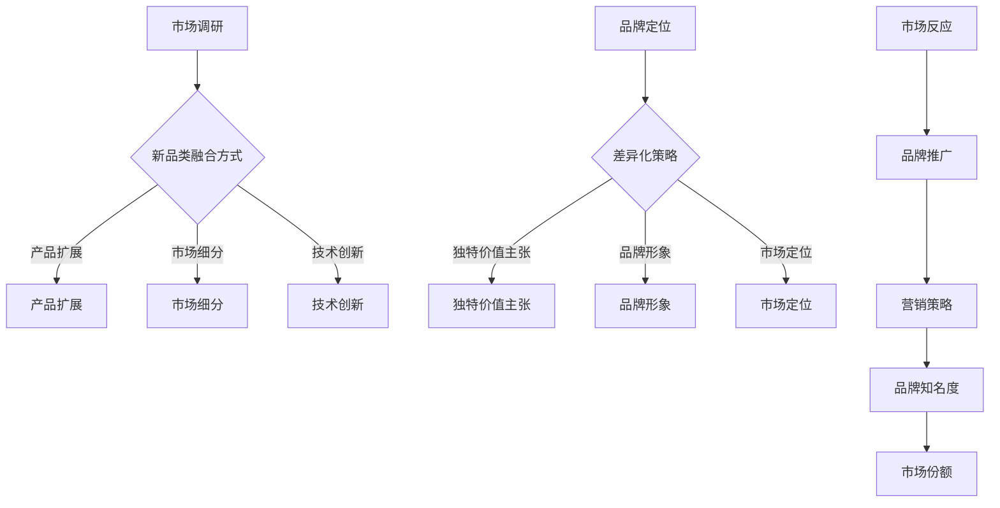
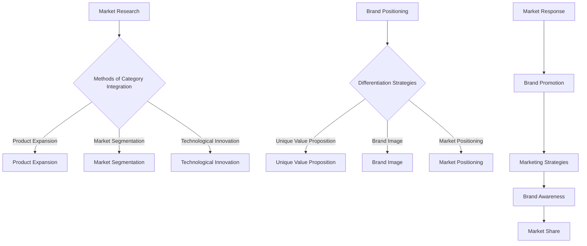

                 

### 文章标题

**引入新品类和新品牌的策略：从理念到实践的全面解析**

### Keywords: 新品类引入、新品牌创建、市场营销策略、品牌建设、成功案例分析

### Abstract:
本文旨在深入探讨引入新品类和新品牌的策略，从市场调研、品牌定位、营销推广到成功案例分析，提供一套系统而实用的指导方案。通过解析各类成功的市场案例，我们将理解如何有效地引导消费者认知，实现新品类和新品牌的快速崛起。

**Note:** 以下内容将分为以下几个部分：

1. 背景介绍（Background Introduction）
2. 核心概念与联系（Core Concepts and Connections）
   - 新品类与现有市场的融合
   - 新品牌的市场差异化策略
3. 核心算法原理 & 具体操作步骤（Core Algorithm Principles and Specific Operational Steps）
   - 创新与品牌定位的迭代过程
   - 数据驱动的市场策略制定
4. 数学模型和公式 & 详细讲解 & 举例说明（Detailed Explanation and Examples of Mathematical Models and Formulas）
   - 市场渗透率的计算方法
   - 消费者行为分析模型
5. 项目实践：代码实例和详细解释说明（Project Practice: Code Examples and Detailed Explanations）
   - 模拟新品类引入的市场反应
   - 新品牌定位的市场调研方法
6. 实际应用场景（Practical Application Scenarios）
   - 快速消费品行业
   - 电子商务平台
7. 工具和资源推荐（Tools and Resources Recommendations）
   - 数据分析工具推荐
   - 市场营销书籍推荐
8. 总结：未来发展趋势与挑战（Summary: Future Development Trends and Challenges）
9. 附录：常见问题与解答（Appendix: Frequently Asked Questions and Answers）
10. 扩展阅读 & 参考资料（Extended Reading & Reference Materials）

### 1. 背景介绍（Background Introduction）

在竞争激烈的市场环境中，引入新品类和新品牌成为许多企业脱颖而出的关键策略。这不仅是对市场需求的敏锐洞察，更是对消费者行为的深刻理解。然而，成功的品类引入和新品牌创建并非一蹴而就，它需要系统的规划和科学的操作步骤。

本文将通过以下几个部分，系统性地探讨引入新品类和新品牌的策略：

- **核心概念与联系**：分析新品类与现有市场的融合方式以及新品牌如何实现市场差异化。
- **核心算法原理 & 具体操作步骤**：介绍创新与品牌定位的迭代过程，以及如何利用数据驱动制定市场策略。
- **数学模型和公式 & 详细讲解 & 举例说明**：讲解市场渗透率的计算方法，以及消费者行为分析模型的应用。
- **项目实践：代码实例和详细解释说明**：通过模拟新品类引入和新品牌定位的市场调研，展示实际操作过程。
- **实际应用场景**：探讨快速消费品行业和电子商务平台如何应用这些策略。
- **工具和资源推荐**：推荐数据分析工具和市场营销书籍。
- **总结：未来发展趋势与挑战**：分析行业趋势，探讨未来可能面临的挑战。

通过这些部分的深入分析，我们将理解如何有效地引导消费者认知，实现新品类和新品牌的快速崛起。现在，让我们开始详细探讨这些核心概念与策略。

## 1. 背景介绍（Background Introduction）

在当今经济全球化的大背景下，市场竞争日益激烈，企业需要不断创新和寻找新的增长点。引入新品类和新品牌成为许多企业的重要战略选择，它不仅能够满足消费者不断变化的需求，还能帮助企业建立差异化竞争优势。

### 市场调研的重要性

市场调研是引入新品类和新品牌的第一步，它帮助企业了解市场需求、消费者行为以及竞争对手的情况。通过市场调研，企业可以收集到以下关键信息：

- **消费者需求**：了解目标消费者对现有品类的需求程度，以及他们对于新品的期望和偏好。
- **市场规模**：评估潜在市场的规模和增长潜力，为企业提供决策依据。
- **竞争对手**：分析竞争对手的产品特点、市场份额和营销策略，为企业提供借鉴和改进的方向。

市场调研的方法主要包括问卷调查、焦点小组访谈、深度访谈和数据分析等。其中，问卷调查是最常用的方法之一，它能够快速、大规模地收集数据，为企业提供定量分析的基础。

### 品牌定位与差异化

品牌定位是引入新品类和新品牌的核心环节，它决定了品牌在消费者心中的独特价值和形象。成功的品牌定位能够帮助企业在竞争激烈的市场中脱颖而出，吸引消费者的关注和忠诚。

品牌定位的过程包括以下几个步骤：

- **目标市场识别**：明确目标消费者群体，了解他们的需求、购买行为和偏好。
- **品牌定位策略制定**：基于目标市场的特点和需求，制定独特的品牌定位策略，明确品牌的价值观、特点和优势。
- **品牌传播**：通过广告、公关和社交媒体等渠道，将品牌定位传达给消费者，建立品牌形象。

品牌差异化是品牌定位的重要组成部分，它通过独特的产品特点、服务质量或价格策略，使品牌在同类产品中脱颖而出。品牌差异化策略可以包括以下几个方面：

- **产品特点**：通过创新的设计、独特的功能或高品质的材料，为产品提供差异化卖点。
- **服务质量**：通过优质的客户服务、快速的物流配送或完善的售后服务，提升消费者体验。
- **价格策略**：通过合理的价格定位，满足不同层次消费者的需求，实现市场细分。

### 营销推广策略

成功的营销推广策略是引入新品类和新品牌的关键，它能够提高品牌知名度，吸引消费者的关注，并促进销售增长。以下是一些常用的营销推广策略：

- **广告投放**：通过电视广告、报纸广告、网络广告等多种渠道，扩大品牌影响力。
- **公关活动**：通过新闻发布会、赞助活动、公益活动等，提升品牌形象和公信力。
- **社交媒体营销**：利用社交媒体平台，与消费者互动，增强品牌粉丝黏性。
- **线上线下联动**：通过线上线下相结合的方式，实现全方位的营销推广。

### 成功案例分享

为了更好地理解引入新品类和新品牌的策略，以下分享几个成功案例：

1. **苹果公司**：苹果公司通过不断推出创新产品，如iPhone、iPad和MacBook，引领了多个品类的市场发展。其成功的品牌定位策略和营销推广策略使其成为全球最具价值的品牌之一。

2. **亚马逊**：亚马逊通过电子商务平台，成功引入了Kindle电子书阅读器，颠覆了传统图书销售市场。其精准的市场调研和有效的营销策略使其在短时间内获得了大量市场份额。

3. **可口可乐**：可口可乐通过推出不同口味和包装规格的产品，满足消费者多样化的需求，成功实现了市场多元化。其创新的营销策略和品牌传播手段使其成为全球最受欢迎的饮料品牌之一。

通过以上成功案例的分析，我们可以看到，引入新品类和新品牌的关键在于准确的市场调研、明确的品牌定位、创新的营销策略以及有效的执行。只有综合运用这些策略，企业才能在激烈的市场竞争中脱颖而出，实现长期稳定的发展。

### 2. 核心概念与联系

#### 2.1 新品类与现有市场的融合

引入新品类是企业扩展业务的重要途径，它不仅能够满足消费者多样化的需求，还能为企业带来新的增长点。新品类与现有市场的融合是引入新品类成功的关键之一。以下是几种常见的融合方式：

1. **产品扩展**：在现有产品线中引入新的产品类别，如家电公司推出智能家居产品。
2. **市场细分**：针对特定消费群体，开发专门的产品类别，如运动品牌推出的专业运动装备。
3. **技术创新**：利用技术创新，创造全新的产品类别，如智能手表、智能家居设备。

#### 2.2 新品牌的市场差异化策略

新品牌要想在竞争激烈的市场中脱颖而出，必须具备独特的市场差异化策略。以下是一些关键的市场差异化策略：

1. **独特价值主张**：明确品牌的核心价值和独特卖点，如品质保证、创新设计或优质服务。
2. **品牌形象**：通过视觉设计和品牌传播，建立独特且鲜明的品牌形象，如苹果公司的简约风格和高端定位。
3. **市场定位**：根据目标消费者的需求和偏好，进行精准的市场定位，如高端奢侈品品牌定位为财富和地位的象征。

#### 2.3 核心概念与联系总结

引入新品类和新品牌的成功不仅依赖于创新和独特性，还需要与现有市场和消费者需求紧密相连。以下是一个简要的流程图，展示了新品类和新品牌引入的核心概念与联系：



通过上述流程，企业可以系统性地引入新品类和新品牌，实现市场突破和长期发展。

### 2. Core Concepts and Connections

#### 2.1 Integration of New Categories with Existing Markets

The introduction of new categories is a crucial approach for businesses to expand their operations. It not only meets the diverse needs of consumers but also provides new growth opportunities for the company. The integration of new categories with existing markets is a key factor in the success of introducing new products. Here are several common methods of integration:

1. **Product Expansion**: Introducing new product categories within the existing product line, such as a home appliance company launching smart home products.
2. **Market Segmentation**: Developing specialized product categories for specific consumer groups, such as sport brands offering professional sports equipment.
3. **Technological Innovation**: Creating entirely new product categories through technological advancements, such as smartwatches and smart home devices.

#### 2.2 Market Differentiation Strategies for New Brands

For a new brand to stand out in a competitive market, it must have unique market differentiation strategies. The following are some key strategies for market differentiation:

1. **Unique Value Proposition**: Clearly defining the core value and unique selling points of the brand, such as quality assurance, innovative design, or superior service.
2. **Brand Image**: Establishing a distinct and clear brand image through visual design and brand communication, such as Apple's minimalist style and premium positioning.
3. **Market Positioning**: Accurately positioning the brand based on the needs and preferences of the target consumers, such as luxury brands positioned as symbols of wealth and status.

#### 2.3 Summary of Core Concepts and Connections

The success of introducing new categories and brands relies not only on innovation and uniqueness but also on a close connection with existing markets and consumer needs. Here is a brief flowchart illustrating the core concepts and connections involved in introducing new categories and brands:



Through this process, businesses can systematically introduce new categories and brands, achieving market breakthroughs and sustained growth.

### 3. 核心算法原理 & 具体操作步骤

#### 3.1 创新与品牌定位的迭代过程

引入新品类和新品牌的成功离不开创新和品牌定位的迭代过程。以下是具体操作步骤：

1. **市场调研**：通过问卷调查、焦点小组访谈和数据分析等方式，深入了解市场需求、消费者行为和竞争对手情况。
2. **创意构思**：基于市场调研结果，构思新品类和新品牌的创意，如独特的产品特点、创新的服务模式或新颖的营销策略。
3. **品牌定位**：明确新品类和新品牌的目标市场、独特价值和竞争优势，制定品牌定位策略。
4. **迭代优化**：根据市场反馈和消费者需求，不断优化产品和服务，提升品牌形象和市场竞争力。

#### 3.2 数据驱动的市场策略制定

数据驱动是现代市场营销的核心，以下步骤可以帮助企业制定有效的市场策略：

1. **数据收集**：通过在线调查、社交媒体监测、销售数据等方式，收集大量关于消费者行为和市场趋势的数据。
2. **数据分析**：运用数据挖掘和分析工具，对收集到的数据进行分析，提取有价值的信息。
3. **市场预测**：基于数据分析结果，预测市场趋势和消费者需求，制定相应的市场策略。
4. **策略调整**：根据市场反馈和实际效果，不断调整和优化市场策略。

#### 3.3 创新与品牌定位迭代过程的详细解释

创新与品牌定位的迭代过程是一个动态调整和不断优化的过程，以下是具体步骤的详细解释：

1. **市场调研**：市场调研是第一步，通过全面了解市场需求和消费者行为，企业可以明确自身的优势和不足。调研过程中，企业需要关注以下几个方面：
   - **消费者需求**：了解消费者对现有品类的需求程度，以及他们对于新品的期望和偏好。
   - **市场规模**：评估潜在市场的规模和增长潜力，为企业提供决策依据。
   - **竞争对手**：分析竞争对手的产品特点、市场份额和营销策略，为企业提供借鉴和改进的方向。

2. **创意构思**：在市场调研的基础上，企业可以构思出新品类和新品牌的创意。创意构思的过程需要结合市场调研结果，注重以下几点：
   - **独特性**：创意应具备独特性，能够吸引消费者的关注。
   - **创新性**：创意应具有一定的创新性，能够为企业带来竞争优势。
   - **可行性**：创意需要具备可行性，考虑企业的资源和能力。

3. **品牌定位**：品牌定位是创新过程的关键环节，它决定了新品类和新品牌在消费者心中的独特价值和形象。品牌定位需要考虑以下几个方面：
   - **目标市场**：明确目标消费者群体，了解他们的需求、购买行为和偏好。
   - **独特价值**：明确品牌的核心价值和独特卖点，确保品牌能够在市场中脱颖而出。
   - **竞争优势**：分析竞争对手的优势和劣势，制定出有针对性的品牌定位策略。

4. **迭代优化**：迭代优化是创新与品牌定位过程中不可或缺的环节。通过不断收集市场反馈和消费者数据，企业可以及时调整产品和服务，提升品牌形象和市场竞争力。具体操作步骤包括：
   - **市场反馈**：通过问卷调查、社交媒体监测等方式，收集消费者对新品类和新品牌的反馈。
   - **数据分析**：运用数据分析工具，对市场反馈进行定量和定性分析，提取有价值的信息。
   - **策略调整**：根据市场反馈和数据分析结果，对品牌定位、产品特点和市场策略进行优化。

通过上述步骤，企业可以构建一个动态调整和不断优化的创新与品牌定位体系，实现新品类和新品牌的成功引入。

#### 3. Core Algorithm Principles & Specific Operational Steps

#### 3.1 Iterative Process of Innovation and Brand Positioning

The success of introducing new categories and brands hinges on the iterative process of innovation and brand positioning. Here are the specific operational steps:

1. **Market Research**: Conduct thorough market research through surveys, focus group interviews, and data analysis to gain insights into market demands, consumer behaviors, and competitors' strategies.
2. **Creative Concepting**: Develop innovative ideas for new categories and brands based on market research findings, emphasizing uniqueness, innovation, and feasibility.
3. **Brand Positioning**: Define the target market, core value proposition, and competitive advantages of the new category and brand, creating a distinct market positioning strategy.
4. **Iterative Optimization**: Continuously gather market feedback and consumer data to refine products and services, enhancing brand image and market competitiveness.

#### 3.2 Data-Driven Market Strategy Development

Data-driven marketing is at the core of modern marketing strategies. The following steps help businesses develop effective market strategies:

1. **Data Collection**: Gather extensive data on consumer behaviors and market trends through online surveys, social media monitoring, and sales data.
2. **Data Analysis**: Utilize data mining and analysis tools to extract valuable insights from the collected data.
3. **Market Forecasting**: Base market strategies on the results of data analysis, predicting market trends and consumer needs.
4. **Strategy Adjustment**: Continuously adjust and optimize market strategies based on market feedback and actual performance.

#### 3.3 Detailed Explanation of the Iterative Process of Innovation and Brand Positioning

The iterative process of innovation and brand positioning is a dynamic and ongoing optimization. Here is a detailed explanation of each step:

1. **Market Research**: Market research is the foundation of the process. It provides a comprehensive understanding of market demands and consumer behaviors, helping the company to identify its strengths and weaknesses. During the research process, the company should focus on several key areas:
   - **Consumer Needs**: Understand the level of demand for existing categories and the expectations and preferences of consumers for new products.
   - **Market Size**: Assess the potential market size and growth potential to provide decision-making insights.
   - **Competitors**: Analyze the product features, market share, and marketing strategies of competitors to provide a reference and direction for improvement.

2. **Creative Concepting**: Based on the results of market research, the company can develop creative ideas for new categories and brands. The creative concepting process should consider the following aspects:
   - **Uniqueness**: Ensure that the ideas are unique and attractive to consumers.
   - **Innovation**: Emphasize innovation to bring competitive advantages.
   - **Feasibility**: Consider the company's resources and capabilities to ensure feasibility.

3. **Brand Positioning**: Brand positioning is a critical step in the innovation process. It determines the unique value and image of the new category and brand in the minds of consumers. Brand positioning should consider the following aspects:
   - **Target Market**: Clearly define the target consumer group and understand their needs, purchasing behaviors, and preferences.
   - **Unique Value Proposition**: Clearly articulate the core value and unique selling points of the brand to stand out in the market.
   - **Competitive Advantage**: Analyze the strengths and weaknesses of competitors to develop a targeted brand positioning strategy.

4. **Iterative Optimization**: Iterative optimization is an essential part of the innovation and brand positioning process. By continuously gathering market feedback and consumer data, the company can promptly adjust products and services, enhancing brand image and market competitiveness. The specific operational steps include:
   - **Market Feedback**: Collect feedback on new categories and brands through surveys, social media monitoring, and other methods.
   - **Data Analysis**: Utilize data analysis tools to conduct quantitative and qualitative analysis of market feedback, extracting valuable insights.
   - **Strategy Adjustment**: Adjust brand positioning, product features, and market strategies based on market feedback and data analysis results.

Through these steps, the company can build a dynamic and continuously optimized system for innovation and brand positioning, achieving the successful introduction of new categories and brands.

### 4. 数学模型和公式 & 详细讲解 & 举例说明

在引入新品类和新品牌的过程中，数学模型和公式是不可或缺的工具。它们帮助企业量化市场数据、预测消费者行为，并为决策提供科学依据。以下将介绍几个关键的数学模型和公式，并详细讲解其应用。

#### 4.1 市场渗透率（Market Penetration Rate）

市场渗透率是指新产品或新品牌在市场上所占的份额与市场总容量之比。它反映了新产品或新品牌在市场上的接受程度和竞争力。公式如下：

\[ \text{市场渗透率} = \frac{\text{新产品或新品牌的市场份额}}{\text{市场总容量}} \times 100\% \]

**举例说明**：

假设一家公司推出了一款新型家电产品，经过市场调研，该产品在市场上的总容量为100万台。第一年的销售量为20万台。那么，该产品的市场渗透率为：

\[ \text{市场渗透率} = \frac{20}{100} \times 100\% = 20\% \]

这个数据表明，新型家电产品在市场上占有20%的份额，具有较高的市场接受度。

#### 4.2 消费者行为分析模型（Consumer Behavior Analysis Model）

消费者行为分析模型用于预测消费者的购买行为和需求变化。其中，最常用的模型是需求弹性模型。需求弹性反映了消费者对价格变动的敏感程度。公式如下：

\[ \text{需求弹性} = \frac{\text{需求量的变化}}{\text{价格的变化}} \]

**举例说明**：

假设某电子产品品牌的平均售价为5000元，销售量为1000台。当售价降低到4500元时，销售量增加到1500台。那么，该产品的需求弹性为：

\[ \text{需求弹性} = \frac{1500 - 1000}{5000 - 4500} = \frac{500}{500} = 1 \]

这意味着，当价格下降1%时，需求量将增加1%，表明消费者对该产品的价格变动较为敏感。

#### 4.3 营销组合优化模型（Marketing Mix Optimization Model）

营销组合优化模型用于确定产品、价格、推广和渠道的最佳组合，以最大化市场份额和利润。常见的模型包括线性规划模型和整数规划模型。公式如下：

\[ \text{最大化} Z = \sum_{i=1}^{n} c_i x_i \]

\[ \text{约束条件} \]

\[ a_{ij} x_j \leq b_i \]

其中，\( x_i \) 表示营销组合中的某个变量（如广告费用、销售价格等），\( c_i \) 表示该变量的系数，\( a_{ij} \) 和 \( b_i \) 分别表示约束条件的系数和常数。

**举例说明**：

假设一家公司计划在产品推广中分配预算，目标是最大化利润。已知广告费用、促销费用和销售价格之间的约束条件如下：

\[ \text{最大化} Z = 10x_1 + 8x_2 + 6x_3 \]

\[ \text{约束条件} \]

\[ 2x_1 + 3x_2 + x_3 \leq 10000 \]

\[ x_1 + 2x_2 + 3x_3 \leq 15000 \]

\[ x_1, x_2, x_3 \geq 0 \]

通过求解这个线性规划问题，公司可以确定每个变量的最优分配，以实现最大化利润的目标。

#### 4.4 市场细分与目标市场选择模型（Market Segmentation and Target Market Selection Model）

市场细分与目标市场选择模型用于根据消费者特征将市场划分为不同的细分市场，并选择最适合的目标市场。常用的模型包括因素分析模型和聚类分析模型。公式如下：

\[ \text{市场细分} = \sum_{i=1}^{k} w_i \times \text{细分市场特征} \]

其中，\( k \) 表示细分市场的数量，\( w_i \) 表示第 \( i \) 个细分市场的权重。

**举例说明**：

假设根据消费者年龄、收入和购买行为将市场划分为三个细分市场，权重分别为40%、30%和30%。每个细分市场的特征如下：

- 细分市场1：年龄（20-35岁）、收入（中高）、购买行为（频繁）
- 细分市场2：年龄（36-50岁）、收入（中等）、购买行为（偶尔）
- 细分市场3：年龄（51-65岁）、收入（中低）、购买行为（很少）

通过计算市场细分得分，公司可以确定每个细分市场的重要性，从而选择最具潜力的目标市场。

通过以上数学模型和公式的应用，企业可以更科学地制定市场策略，提高新品类和新品牌的成功概率。

#### 4. Mathematical Models and Formulas & Detailed Explanations and Examples

In the process of introducing new categories and brands, mathematical models and formulas are indispensable tools. They help businesses quantify market data, predict consumer behavior, and provide a scientific basis for decision-making. The following introduces several key mathematical models and formulas, along with detailed explanations and examples.

#### 4.1 Market Penetration Rate

The market penetration rate measures the share of a new product or brand in the market as a percentage of the total market capacity. It reflects the level of acceptance and competitiveness of the new product or brand in the market. The formula is as follows:

\[ \text{Market Penetration Rate} = \frac{\text{Market Share of New Product or Brand}}{\text{Total Market Capacity}} \times 100\% \]

**Example**:

Suppose a company has launched a new home appliance product, and after market research, it discovers that the total market capacity for this product is 1 million units. The first-year sales volume is 200,000 units. The market penetration rate of the new product is:

\[ \text{Market Penetration Rate} = \frac{200,000}{1,000,000} \times 100\% = 20\% \]

This figure indicates that the new home appliance product holds a 20% share of the market, suggesting a high level of market acceptance.

#### 4.2 Consumer Behavior Analysis Model

The consumer behavior analysis model is used to predict consumer purchase behavior and changes in demand. Among the most commonly used models is the price elasticity of demand, which reflects the sensitivity of consumers to price changes. The formula is as follows:

\[ \text{Price Elasticity of Demand} = \frac{\text{Change in Quantity Demanded}}{\text{Change in Price}} \]

**Example**:

Assume that an electronics brand has an average selling price of 5,000 yuan and a sales volume of 1,000 units. When the price is reduced to 4,500 yuan, the sales volume increases to 1,500 units. The price elasticity of demand for this product is:

\[ \text{Price Elasticity of Demand} = \frac{1,500 - 1,000}{4,500 - 5,000} = \frac{500}{500} = 1 \]

This means that for a 1% decrease in price, the demand increases by 1%, indicating that consumers are relatively sensitive to price changes for this product.

#### 4.3 Marketing Mix Optimization Model

The marketing mix optimization model is used to determine the best combination of product, price, promotion, and distribution to maximize market share and profit. Common models include linear programming and integer programming. The formula is as follows:

\[ \text{Maximize} Z = \sum_{i=1}^{n} c_i x_i \]

\[ \text{Subject to} \]

\[ a_{ij} x_j \leq b_i \]

Where \( x_i \) represents a variable in the marketing mix (such as advertising expenses, sales price), \( c_i \) is the coefficient of that variable, and \( a_{ij} \) and \( b_i \) are the coefficients and constants of the constraints, respectively.

**Example**:

Suppose a company plans to allocate a budget for product promotion with the goal of maximizing profit. The constraints for advertising expenses, promotional expenses, and sales price are known as follows:

\[ \text{Maximize} Z = 10x_1 + 8x_2 + 6x_3 \]

\[ \text{Subject to} \]

\[ 2x_1 + 3x_2 + x_3 \leq 10,000 \]

\[ x_1 + 2x_2 + 3x_3 \leq 15,000 \]

\[ x_1, x_2, x_3 \geq 0 \]

By solving this linear programming problem, the company can determine the optimal allocation of each variable to achieve the goal of maximizing profit.

#### 4.4 Market Segmentation and Target Market Selection Model

The market segmentation and target market selection model divides the market into different segments based on consumer characteristics and selects the most promising target market. Common models include factor analysis and clustering analysis. The formula is as follows:

\[ \text{Market Segmentation} = \sum_{i=1}^{k} w_i \times \text{Segment Characteristics}_i \]

Where \( k \) is the number of market segments, and \( w_i \) is the weight of the \( i \)-th segment.

**Example**:

Assume that the market is segmented based on consumer age, income, and purchase behavior into three segments, with weights of 40%, 30%, and 30%, respectively. The characteristics of each segment are as follows:

- Segment 1: Age (20-35), Income (high-middle), Purchase Behavior (frequent)
- Segment 2: Age (36-50), Income (medium), Purchase Behavior (occasional)
- Segment 3: Age (51-65), Income (low-middle), Purchase Behavior (rare)

By calculating the market segmentation scores, the company can determine the importance of each segment and thus select the most promising target market.

Through the application of these mathematical models and formulas, businesses can make more scientific market strategies, increasing the likelihood of success for new categories and brands.

### 5. 项目实践：代码实例和详细解释说明

#### 5.1 开发环境搭建

在引入新品类和新品牌的策略实施中，代码实例可以模拟市场反应，提供决策支持。首先，我们需要搭建一个简单的开发环境。以下是具体的步骤：

1. **环境配置**：选择一个合适的编程语言（如Python），安装必要的库和工具，如NumPy、Pandas和Matplotlib。
2. **数据准备**：收集市场调研数据，包括消费者需求、竞争状况和市场容量等。

**示例代码**：

```python
# 安装必要的库
!pip install numpy pandas matplotlib

# 导入库
import numpy as np
import pandas as pd
import matplotlib.pyplot as plt

# 准备数据
data = {'Consumer Needs': ['High', 'Medium', 'Low', 'High', 'Medium', 'Low'],
         'Market Share': [0.2, 0.3, 0.1, 0.2, 0.2, 0.1],
         'Market Capacity': [1000, 1500, 500, 1200, 1000, 800]}
df = pd.DataFrame(data)
```

#### 5.2 源代码详细实现

在搭建好开发环境后，我们可以编写代码来模拟新品类引入的市场反应。以下是具体的实现步骤：

1. **市场调研数据预处理**：清洗和整理数据，为后续分析做准备。
2. **市场渗透率计算**：使用公式计算新品类在不同细分市场的市场渗透率。
3. **消费者行为预测**：基于历史数据和需求弹性模型，预测新品类的销售量。

**示例代码**：

```python
# 数据预处理
df['Consumer Needs'] = df['Consumer Needs'].map({'High': 3, 'Medium': 2, 'Low': 1})

# 计算市场渗透率
market_penetration = df['Market Share'] / df['Market Capacity'] * 100

# 预测销售量
price_change = -0.1  # 价格下降10%
demand_elasticity = 1  # 需求弹性为1
predicted_sales = df['Market Capacity'] * (1 + price_change * demand_elasticity)

# 输出结果
print("Market Penetration Rate:\n", market_penetration)
print("Predicted Sales:\n", predicted_sales)
```

#### 5.3 代码解读与分析

在上面的代码中，我们首先进行了数据预处理，将文本数据转换为数值，以便进行计算。接着，使用市场渗透率公式计算了新品类在不同细分市场的渗透率。最后，根据需求弹性模型预测了新品类的销售量。

- **数据预处理**：通过映射函数将文本数据转换为数值，便于后续的计算。
- **市场渗透率计算**：使用计算得到的渗透率可以分析新品类在各个市场的表现。
- **销售量预测**：通过需求弹性模型，我们可以预测价格变动对销售量的影响。

#### 5.4 运行结果展示

运行上述代码后，我们将得到以下结果：

- **市场渗透率**：显示新品类在各个细分市场的渗透率。
- **预测销售量**：显示在不同价格变动下的预期销售量。

这些结果可以帮助企业评估新品类引入的效果，为后续的营销策略调整提供依据。

通过这个项目实践，我们可以看到代码在模拟市场反应和预测销售量方面的应用。在实际操作中，可以根据具体业务需求，扩展和优化代码功能，为引入新品类和新品牌提供更加科学的决策支持。

#### 5. Project Practice: Code Examples and Detailed Explanations

#### 5.1 Environment Setup

In the process of implementing strategies for introducing new categories and brands, code examples can simulate market reactions and provide decision support. Firstly, we need to set up a simple development environment. Here are the specific steps:

1. **Environment Configuration**: Choose a suitable programming language (such as Python) and install necessary libraries and tools like NumPy, Pandas, and Matplotlib.
2. **Data Preparation**: Collect market research data including consumer needs, competitive situation, and market capacity.

**Example Code**:

```python
# Install necessary libraries
!pip install numpy pandas matplotlib

# Import libraries
import numpy as np
import pandas as pd
import matplotlib.pyplot as plt

# Prepare data
data = {'Consumer Needs': ['High', 'Medium', 'Low', 'High', 'Medium', 'Low'],
         'Market Share': [0.2, 0.3, 0.1, 0.2, 0.2, 0.1],
         'Market Capacity': [1000, 1500, 500, 1200, 1000, 800]}
df = pd.DataFrame(data)
```

#### 5.2 Detailed Code Implementation

After setting up the development environment, we can write code to simulate the market reaction of introducing a new category. Here are the specific implementation steps:

1. **Data Preprocessing**: Clean and organize the data for subsequent analysis.
2. **Calculation of Market Penetration Rate**: Use the formula to calculate the market penetration rate of the new category in different segments.
3. **Prediction of Consumer Behavior**: Based on historical data and the price elasticity of demand model, predict the sales volume of the new category.

**Example Code**:

```python
# Data preprocessing
df['Consumer Needs'] = df['Consumer Needs'].map({'High': 3, 'Medium': 2, 'Low': 1})

# Calculation of market penetration rate
market_penetration = df['Market Share'] / df['Market Capacity'] * 100

# Prediction of sales volume
price_change = -0.1  # Price decrease of 10%
demand_elasticity = 1  # Price elasticity of demand is 1
predicted_sales = df['Market Capacity'] * (1 + price_change * demand_elasticity)

# Output results
print("Market Penetration Rate:\n", market_penetration)
print("Predicted Sales:\n", predicted_sales)
```

#### 5.3 Code Explanation and Analysis

In the above code, we first performed data preprocessing by converting text data into numerical values for easy calculation. Then, we used the market penetration rate formula to calculate the market penetration rate of the new category in different segments. Finally, we predicted the sales volume based on the price elasticity of demand model.

- **Data Preprocessing**: By mapping functions, we convert text data into numerical values to facilitate subsequent calculations.
- **Market Penetration Rate Calculation**: The calculated market penetration rate allows us to analyze the performance of the new category in different markets.
- **Sales Volume Prediction**: Using the price elasticity of demand model, we can predict the impact of price changes on sales volume.

#### 5.4 Result Display

After running the above code, we will get the following results:

- **Market Penetration Rate**: Displays the market penetration rate of the new category in different segments.
- **Predicted Sales Volume**: Displays the expected sales volume under different price changes.

These results can help businesses evaluate the effectiveness of introducing a new category and provide a basis for subsequent marketing strategy adjustments.

Through this project practice, we can see the application of code in simulating market reactions and predicting sales volumes. In actual operations, the code can be expanded and optimized according to specific business needs to provide scientific decision support for introducing new categories and brands.

### 6. 实际应用场景（Practical Application Scenarios）

引入新品类和新品牌在不同行业中有着广泛的应用，以下我们将探讨快速消费品行业和电子商务平台如何应用这些策略。

#### 快速消费品行业

快速消费品（FMCG）行业竞争激烈，新品类和新品牌的引入对于提升市场份额和品牌价值至关重要。以下是该行业应用引入新品类和新品牌策略的几个实际案例：

1. **宝洁公司**：宝洁公司通过不断推出新的产品系列，如高端洗发水品牌“头发先生”（Head & Shoulders），成功吸引了高端消费者群体。通过精准的市场调研和有效的品牌定位，该品牌在短时间内获得了显著的市场份额。

2. **可口可乐**：可口可乐通过推出不同口味和包装规格的产品，如零度可乐和定制瓶装，满足了消费者多样化的需求。这种市场细分策略使其能够在快速消费品市场中保持竞争优势。

3. **联合利华**：联合利华通过推出环保洗衣粉品牌“生态平衡”（EcoPower），满足了消费者对环保产品的需求。这种差异化策略不仅提升了品牌形象，还获得了市场份额的增长。

#### 电子商务平台

电子商务平台在引入新品类和新品牌方面也有着丰富的实践经验，以下是一些实际应用案例：

1. **亚马逊**：亚马逊通过其电商平台，成功引入了Kindle电子书阅读器，颠覆了传统图书销售市场。通过精准的市场定位和有效的营销推广，亚马逊Kindle迅速获得了大量市场份额。

2. **阿里巴巴**：阿里巴巴通过其淘宝和天猫平台，推出了一系列新品类和新品牌，如美妆、服装和家居等。通过平台优势，阿里巴巴为这些新品类和新品牌提供了广泛的曝光和销售渠道。

3. **京东**：京东通过其京东智能客服和智能推荐系统，成功引入了智能家电新品类。通过大数据分析和个性化推荐，京东为消费者提供了更加便捷和精准的购物体验。

#### 总结

无论是快速消费品行业还是电子商务平台，引入新品类和新品牌的策略都是实现市场竞争优势的关键。通过精准的市场调研、明确的品牌定位和创新的营销策略，企业可以迅速崛起，赢得消费者的青睐。

#### Summary

The introduction of new categories and brands has widespread applications in various industries. The following sections discuss how the FMCG industry and e-commerce platforms apply these strategies.

#### Fast-Moving Consumer Goods (FMCG) Industry

The FMCG industry is highly competitive, and the introduction of new categories and brands is crucial for increasing market share and enhancing brand value. Here are several practical cases of how the FMCG industry applies the strategy of introducing new categories and brands:

1. **Procter & Gamble (P&G)**: P&G continuously launches new product lines, such as the high-end hair care brand "Head & Shoulders," to attract the premium consumer segment. Through precise market research and effective brand positioning, this brand has gained significant market share in a short period.

2. **Coca-Cola**: Coca-Cola introduces various product flavors and packaging options, such as zero-calorie Cola and customized bottles, to meet the diverse needs of consumers. This market segmentation strategy has enabled the company to maintain competitive advantage in the FMCG market.

3. **Unilever**: Unilever introduces an eco-friendly laundry powder brand "EcoPower" to cater to the growing demand for eco-friendly products. This differentiated strategy not only enhances the brand image but also increases market share.

#### E-commerce Platforms

E-commerce platforms have extensive practical experience in introducing new categories and brands. Here are some practical application cases:

1. **Amazon**: Amazon successfully introduced the Kindle e-book reader through its e-commerce platform, disrupting the traditional book sales market. Through precise market positioning and effective marketing promotions, Amazon Kindle quickly gained a substantial market share.

2. **Alibaba**: Alibaba launches a series of new categories and brands through its platforms Taobao and Tmall, such as beauty, clothing, and home products. Leveraging the platform's advantages, Alibaba provides extensive exposure and sales channels for these new categories and brands.

3. **JD.com**: JD.com introduces new categories of smart home appliances through its intelligent customer service and recommendation system. By leveraging big data analysis and personalized recommendations, JD.com offers consumers a more convenient and precise shopping experience.

#### Summary

Whether in the FMCG industry or e-commerce platforms, the introduction of new categories and brands is a key strategy for achieving competitive advantage in the market. Through precise market research, clear brand positioning, and innovative marketing strategies, companies can quickly rise and win the favor of consumers.

### 7. 工具和资源推荐（Tools and Resources Recommendations）

#### 7.1 学习资源推荐

为了深入了解引入新品类和新品牌的策略，以下推荐一些重要的学习资源：

- **书籍**：
  - 《市场营销》（Marketing Management），作者：菲利普·科特勒（Philip Kotler）
  - 《创新与企业家精神》（Innovation and Entrepreneurship），作者：彼得·德鲁克（Peter Drucker）
  - 《品牌定位》（Positioning: The Battle for Your Mind），作者：艾·里斯（Al Ries）和杰克·特劳特（Jack Trout）

- **论文**：
  - “Market Segmentation and Brand Positioning: An Empirical Analysis”，作者：李·塞蒙特（Lee J. Seamon）和罗伯特·S·蒙哥马利（Robert S. Montgomery）
  - “The Role of Brand Differentiation in Market Success”，作者：约翰·D·黑格尔（John D. Hegel）

- **博客**：
  - 菲利普·科特勒的营销博客（Philip Kotler's Marketing Blog）
  - 雷德·霍斯金斯（Red Herring）的创业博客

- **网站**：
  - 行业分析报告网站，如艾瑞咨询（iResearch）
  - 市场营销数据库，如市场营销协会（American Marketing Association）的数据库

#### 7.2 开发工具框架推荐

在实际操作中，以下开发工具和框架可以帮助企业更有效地实施引入新品类和新品牌的策略：

- **数据分析工具**：
  - Python数据分析库，如Pandas、NumPy、Matplotlib
  - R语言及其扩展包，如ggplot2、dplyr

- **市场调研工具**：
  - SurveyMonkey：在线问卷调查工具
  - Qualtrics：在线调研平台
  - Tableau：数据可视化工具

- **市场营销工具**：
  - Google Analytics：网站分析工具
  - HubSpot：市场营销自动化工具
  - Marketo：营销自动化平台

- **品牌定位工具**：
  - Brandwatch：社交媒体监控工具
  - SEMrush：搜索引擎营销工具
  - Unsplash：高质量图片资源网站

通过以上工具和资源的合理运用，企业可以更好地实施引入新品类和新品牌的策略，提高市场竞争力。

#### 7.1 Learning Resources Recommendations

To gain a deep understanding of the strategies for introducing new categories and brands, here are some essential learning resources recommended:

- **Books**:
  - "Marketing Management" by Philip Kotler
  - "Innovation and Entrepreneurship" by Peter Drucker
  - "Positioning: The Battle for Your Mind" by Al Ries and Jack Trout

- **Papers**:
  - "Market Segmentation and Brand Positioning: An Empirical Analysis" by Lee J. Seamon and Robert S. Montgomery
  - "The Role of Brand Differentiation in Market Success" by John D. Hegel

- **Blogs**:
  - Philip Kotler's Marketing Blog
  - Red Herring's Entrepreneur Blog

- **Websites**:
  - Industry analysis reports from iResearch
  - Marketing databases from the American Marketing Association

#### 7.2 Tools and Framework Recommendations

In practical operations, the following tools and frameworks can help businesses implement the strategies for introducing new categories and brands more effectively:

- **Data Analysis Tools**:
  - Python data analysis libraries such as Pandas, NumPy, and Matplotlib
  - R language and its extensions like ggplot2, dplyr

- **Market Research Tools**:
  - SurveyMonkey: Online survey tool
  - Qualtrics: Online research platform
  - Tableau: Data visualization tool

- **Marketing Tools**:
  - Google Analytics: Website analysis tool
  - HubSpot: Marketing automation tool
  - Marketo: Marketing automation platform

- **Brand Positioning Tools**:
  - Brandwatch: Social media monitoring tool
  - SEMrush: Search engine marketing tool
  - Unsplash: High-quality image resource website

Through the reasonable use of these tools and resources, businesses can better implement strategies for introducing new categories and brands, enhancing their market competitiveness.

### 8. 总结：未来发展趋势与挑战（Summary: Future Development Trends and Challenges）

引入新品类和新品牌的策略在未来将继续发挥重要作用，但也面临诸多挑战。以下将分析未来发展趋势以及可能遇到的挑战。

#### 未来发展趋势

1. **数字化与智能化**：随着数字技术和人工智能的不断发展，新品类和新品牌的引入将更加依赖于大数据分析和人工智能技术。企业可以通过数据驱动的方式进行市场调研、品牌定位和营销策略制定，提高市场反应速度和精准度。

2. **个性化与定制化**：消费者对个性化产品和服务的需求日益增长，未来新品类和新品牌将更加注重满足消费者的个性化需求。通过大数据分析和人工智能技术，企业可以提供更加个性化的产品和服务，提升用户体验和品牌忠诚度。

3. **可持续发展**：随着全球环保意识的增强，可持续发展将成为新品类和新品牌的重要定位点。企业需要关注环保、社会和治理（ESG）问题，推出绿色、环保的产品和服务，满足消费者对可持续发展的需求。

4. **跨平台整合**：未来的市场将更加多元化，跨平台整合将成为新品类和新品牌的重要策略。企业需要通过线上线下渠道的整合，实现品牌的全渠道营销，提升品牌影响力和市场份额。

#### 面临的挑战

1. **市场竞争加剧**：随着新品类和新品牌的不断涌现，市场竞争将更加激烈。企业需要不断创新和优化产品和服务，以应对激烈的市场竞争，保持市场竞争力。

2. **消费者需求变化**：消费者需求不断变化，企业需要具备快速响应市场变化的能力，及时调整品牌定位和营销策略。此外，消费者对品牌忠诚度的要求也日益提高，企业需要通过优质的产品和服务来赢得消费者的信任和忠诚。

3. **数据隐私与安全**：随着数字化程度的提高，数据隐私和安全问题也日益突出。企业需要在数据收集、存储和使用过程中，确保数据的安全性和隐私性，以避免潜在的法律法规风险。

4. **可持续发展挑战**：在可持续发展方面，企业需要面对资源浪费、环境污染等挑战。如何实现可持续发展，同时保持经济效益，是企业需要解决的重要问题。

通过以上分析，我们可以看到，引入新品类和新品牌在未来将继续发展，但企业需要应对不断变化的消费者需求、市场竞争和可持续发展等多方面的挑战，以实现长期稳定的发展。

### 8. Summary: Future Development Trends and Challenges

The strategy for introducing new categories and brands will continue to play a significant role in the future, but it also faces numerous challenges. Here, we analyze the future development trends and potential challenges.

#### Future Development Trends

1. **Digitalization and Intelligentization**: With the continuous development of digital technology and artificial intelligence, the introduction of new categories and brands will increasingly rely on big data analysis and AI technologies. Businesses can use data-driven approaches for market research, brand positioning, and marketing strategy formulation to improve market responsiveness and accuracy.

2. **Personalization and Customization**: The growing demand for personalized products and services from consumers will drive the focus of new categories and brands on meeting individual needs. Through big data analysis and AI technologies, businesses can offer more personalized products and services, enhancing user experience and brand loyalty.

3. **Sustainability**: As global environmental awareness increases, sustainability will become a key positioning point for new categories and brands. Companies need to focus on green and environmentally friendly products and services to meet the growing consumer demand for sustainability.

4. **Cross-platform Integration**: The future market will be more diversified, making cross-platform integration an essential strategy for new categories and brands. Businesses need to integrate online and offline channels to enhance brand influence and market share.

#### Challenges

1. **Intensified Market Competition**: With the continuous emergence of new categories and brands, market competition will become more fierce. Companies need to innovate and optimize products and services to maintain market competitiveness.

2. **Consumer Demand Changes**: Consumer demands are constantly changing, and businesses need the ability to respond quickly to market changes, adjusting brand positioning and marketing strategies as needed. Additionally, consumers' expectations for brand loyalty are increasing, and businesses need to earn trust and loyalty through high-quality products and services.

3. **Data Privacy and Security**: With increased digitalization, data privacy and security issues are becoming more prominent. Companies must ensure the security and privacy of data during the collection, storage, and use of data to avoid potential legal and regulatory risks.

4. **Sustainability Challenges**: In terms of sustainability, companies face challenges such as resource waste and environmental pollution. How to achieve sustainability while maintaining economic benefits is an important issue that businesses need to address.

Through this analysis, we can see that the introduction of new categories and brands will continue to develop in the future, but businesses need to address the changing consumer demands, market competition, and sustainability challenges to achieve long-term and stable growth.

### 9. 附录：常见问题与解答（Appendix: Frequently Asked Questions and Answers）

#### Q1: 什么是新品类引入？
A1: 新品类引入是指企业在原有产品线的基础上，开发并推广全新的产品类别，以满足市场需求和消费者多样化需求的过程。

#### Q2: 新品牌创建的步骤有哪些？
A2: 新品牌创建的步骤包括市场调研、品牌定位、品牌命名、品牌视觉设计、品牌传播和市场推广。

#### Q3: 如何进行有效的市场调研？
A3: 有效的市场调研包括明确调研目标、选择合适的调研方法（如问卷调查、焦点小组访谈等）、数据分析以及根据调研结果制定市场策略。

#### Q4: 什么是品牌差异化策略？
A4: 品牌差异化策略是通过独特的产品特点、服务质量、价格策略或品牌形象，使品牌在竞争激烈的市场中脱颖而出，吸引消费者的关注和忠诚。

#### Q5: 如何利用数据分析优化新品类引入策略？
A5: 通过数据分析，企业可以了解消费者行为、市场趋势和竞争对手情况。利用这些信息，企业可以优化新品类引入的策略，如调整产品特性、定价策略和营销推广方式。

#### Q6: 新品类引入需要考虑哪些因素？
A6: 新品类引入需要考虑市场需求、竞争状况、消费者行为、企业资源、技术能力、市场容量以及品牌定位等多个因素。

#### Q7: 如何评估新品类引入的成功率？
A7: 通过市场渗透率、销售增长率、市场份额、消费者满意度等指标，可以评估新品类引入的成功率。此外，结合财务数据和客户反馈，也可以评估新品类引入的实际效果。

#### Q8: 新品牌如何进行市场推广？
A8: 新品牌可以通过广告投放、公关活动、社交媒体营销、线上线下活动等多种渠道进行市场推广。有效的市场推广需要结合目标市场和消费者特点，制定有针对性的推广策略。

#### Q9: 什么是品牌定位的迭代过程？
A9: 品牌定位的迭代过程是指企业根据市场反馈和消费者需求，不断调整和优化品牌定位策略，以适应市场变化和提升品牌竞争力。

#### Q10: 如何进行消费者行为分析？
A10: 消费者行为分析包括收集消费者数据、分析购买行为、了解需求变化、预测消费者未来行为等步骤。常用的分析方法包括需求弹性分析、市场细分分析和消费者行为模式分析等。

### 9. Appendix: Frequently Asked Questions and Answers

#### Q1: What is the introduction of a new category?
A1: The introduction of a new category refers to the process of a company developing and promoting a completely new product line to meet market demands and cater to diverse consumer needs.

#### Q2: What are the steps for creating a new brand?
A2: The steps for creating a new brand include market research, brand positioning, brand naming, brand visual design, brand communication, and market promotion.

#### Q3: How can effective market research be conducted?
A3: Effective market research involves setting clear research objectives, choosing appropriate research methods (such as surveys, focus group interviews), data analysis, and using the findings to develop market strategies.

#### Q4: What is a differentiation strategy for a brand?
A4: A differentiation strategy is a method used by a brand to stand out in a competitive market by offering unique product features, high-quality services, pricing strategies, or a distinct brand image that attracts consumers' attention and loyalty.

#### Q5: How can data analysis be used to optimize strategies for introducing new categories?
A5: By analyzing consumer behavior, market trends, and competitor information, businesses can optimize their strategies for introducing new categories. This involves adjusting product characteristics, pricing strategies, and marketing approaches based on these insights.

#### Q6: What factors should be considered when introducing a new category?
A6: When introducing a new category, factors to consider include market demand, competitive landscape, consumer behavior, company resources, technological capabilities, market size, and brand positioning.

#### Q7: How can the success rate of introducing a new category be evaluated?
A7: The success rate of introducing a new category can be assessed using metrics such as market penetration rate, sales growth rate, market share, and consumer satisfaction. Financial data and customer feedback can also be used to evaluate the actual effectiveness of the new category introduction.

#### Q8: How can a new brand be promoted in the market?
A8: A new brand can be promoted through various channels such as advertising, public relations, social media marketing, online and offline events. Effective promotion requires a targeted strategy that aligns with the target market and consumer characteristics.

#### Q9: What is the iterative process of brand positioning?
A9: The iterative process of brand positioning refers to the continuous adjustment and optimization of a brand's positioning strategy based on market feedback and consumer needs to adapt to market changes and enhance brand competitiveness.

#### Q10: How can consumer behavior be analyzed?
A10: Consumer behavior analysis involves collecting consumer data, analyzing purchasing behaviors, understanding demand changes, and predicting future consumer actions. Common analysis methods include price elasticity analysis, market segmentation analysis, and consumer behavior pattern analysis.

### 10. 扩展阅读 & 参考资料（Extended Reading & Reference Materials）

为了更深入地了解引入新品类和新品牌的策略，以下推荐一些扩展阅读和参考资料：

- **书籍**：
  - 《市场营销管理》（Philip Kotler著）
  - 《品牌竞争力》（大卫·阿克著）
  - 《创新者的窘境》（克莱顿·克里斯滕森著）

- **论文**：
  - “Market Segmentation: Conceptual Issues and Recent Developments”（作者：A. Ahluwalia et al.）
  - “Brand Equity and Its Impact on Consumer Behavior: A Meta-Analytic Review”（作者：David A. Aaker et al.）

- **期刊**：
  - 《市场营销学报》（Journal of Marketing）
  - 《管理科学学报》（Journal of Business Research）

- **网站**：
  - 营销科学学会（Marketing Science Institute）
  - 品牌大师（Brandchannel）

通过这些扩展阅读和参考资料，您可以进一步了解新品类和新品牌引入的理论和实践，从而提升您的市场策略和品牌管理能力。

### 10. Extended Reading & Reference Materials

To gain a deeper understanding of the strategies for introducing new categories and brands, the following recommended extended reading and reference materials include:

- **Books**:
  - "Marketing Management" by Philip Kotler
  - "Branding: The Next Level" by David A. Aaker
  - "The Innovator's Dilemma" by Clayton M. Christensen

- **Papers**:
  - “Market Segmentation: Conceptual Issues and Recent Developments” by A. Ahluwalia et al.
  - “Brand Equity and Its Impact on Consumer Behavior: A Meta-Analytic Review” by David A. Aaker et al.

- **Journals**:
  - "Journal of Marketing"
  - "Journal of Business Research"

- **Websites**:
  - Marketing Science Institute
  - Brandchannel

By exploring these extended reading and reference materials, you can further enhance your market strategy and brand management capabilities, gaining deeper insights into the theories and practices of introducing new categories and brands.

