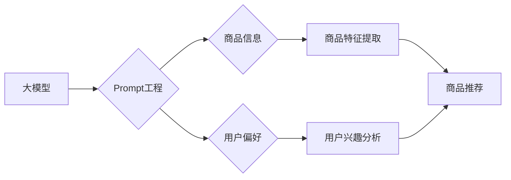

                 

## 利用大模型进行商品推荐的新型Prompt策略

> 关键词：大模型、商品推荐、Prompt工程、自然语言处理、推荐系统

## 1. 背景介绍

随着电商行业的蓬勃发展，商品推荐系统已成为提升用户体验、促进销售的重要驱动力。传统的基于协同过滤、内容过滤和基于规则的推荐算法，虽然取得了一定的效果，但面临着数据稀疏、冷启动问题以及难以捕捉用户复杂需求等挑战。近年来，大模型的兴起为商品推荐领域带来了新的机遇。大模型凭借其强大的语义理解和文本生成能力，能够更深入地挖掘用户偏好和商品特征，从而提供更精准、个性化的推荐结果。

然而，直接将大模型应用于商品推荐并非易事。大模型的输入和输出通常是文本格式，而商品推荐系统需要处理商品的类别、属性、价格等多种数据类型。因此，如何有效地将商品信息转换为大模型可理解的文本格式，并设计合理的Prompt策略，成为实现大模型驱动商品推荐的关键。

## 2. 核心概念与联系

### 2.1  大模型

大模型是指参数量巨大、训练数据海量的人工智能模型，通常拥有数十亿甚至千亿个参数。它们通过深度学习技术，能够学习到复杂的语言模式和知识表示，从而实现强大的文本理解、生成和推理能力。

### 2.2  Prompt工程

Prompt工程是指设计和优化输入文本（Prompt）的过程，以引导大模型生成期望的输出结果。在商品推荐领域，Prompt工程的关键在于如何将商品信息和用户偏好有效地表达出来，以便大模型能够理解并进行精准的推荐。

### 2.3  推荐系统

推荐系统旨在根据用户的历史行为、偏好和上下文信息，预测用户对商品的兴趣，并推荐相关的商品。传统的推荐系统主要依赖于协同过滤、内容过滤和基于规则等算法，而大模型驱动的推荐系统则利用大模型的语义理解能力，能够更深入地挖掘用户需求和商品特征，从而提供更个性化、精准的推荐结果。

**核心概念与架构流程图**



## 3. 核心算法原理 & 具体操作步骤

### 3.1  算法原理概述

大模型驱动的商品推荐系统通常采用以下核心算法原理：

* **文本嵌入:** 将商品信息和用户偏好转换为向量形式，以便大模型进行语义理解和比较。
* **语义相似度计算:** 利用大模型的语义理解能力，计算商品和用户偏好之间的语义相似度，从而判断用户对商品的兴趣程度。
* **推荐排序:** 根据商品和用户之间的语义相似度，对推荐结果进行排序，并输出用户最感兴趣的商品。

### 3.2  算法步骤详解

1. **数据预处理:** 收集商品信息和用户行为数据，并进行清洗、格式化和编码处理。
2. **文本嵌入:** 利用预训练的大模型，将商品信息和用户偏好转换为向量形式，例如使用BERT、RoBERTa等模型进行词嵌入或句子嵌入。
3. **语义相似度计算:** 利用余弦相似度、夹角余弦相似度等方法，计算商品向量和用户偏好向量之间的相似度。
4. **推荐排序:** 根据商品和用户之间的语义相似度，对推荐结果进行排序，并输出用户最感兴趣的商品。
5. **结果评估:** 利用指标如准确率、召回率、NDCG等，评估推荐系统的性能。

### 3.3  算法优缺点

**优点:**

* **精准度高:** 大模型能够捕捉用户需求和商品特征的复杂关系，从而提供更精准的推荐结果。
* **个性化强:** 大模型可以根据用户的历史行为和偏好，提供个性化的商品推荐。
* **可扩展性强:** 大模型可以轻松扩展到新的商品类别和用户群体。

**缺点:**

* **计算资源消耗大:** 大模型训练和推理需要大量的计算资源。
* **数据依赖性强:** 大模型的性能依赖于训练数据的质量和数量。
* **可解释性差:** 大模型的决策过程难以解释，难以理解模型是如何生成推荐结果的。

### 3.4  算法应用领域

大模型驱动的商品推荐算法广泛应用于以下领域:

* **电商平台:** 为用户推荐商品，提高转化率。
* **内容平台:** 为用户推荐文章、视频等内容，提升用户粘性。
* **社交媒体:** 为用户推荐好友、话题等内容，提升用户互动。

## 4. 数学模型和公式 & 详细讲解 & 举例说明

### 4.1  数学模型构建

大模型驱动的商品推荐系统通常采用基于用户的协同过滤模型，其数学模型可以表示为：

$$
r_{ui} = \mathbf{u}^T \mathbf{i} + \epsilon
$$

其中：

* $r_{ui}$ 表示用户 $u$ 对商品 $i$ 的评分。
* $\mathbf{u}$ 表示用户 $u$ 的特征向量。
* $\mathbf{i}$ 表示商品 $i$ 的特征向量。
* $\epsilon$ 表示评分误差。

### 4.2  公式推导过程

该模型假设用户和商品的特征向量可以表示用户对商品的评分。通过训练大模型，学习用户和商品的特征向量，从而预测用户对商品的评分。

### 4.3  案例分析与讲解

假设用户 $u$ 对商品 $i$ 的评分为 4，用户 $u$ 的特征向量为 $\mathbf{u} = [0.2, 0.5, 0.8]$, 商品 $i$ 的特征向量为 $\mathbf{i} = [0.3, 0.6, 0.9]$. 则根据公式，可以计算出评分误差为：

$$
\epsilon = r_{ui} - \mathbf{u}^T \mathbf{i} = 4 - (0.2 \times 0.3 + 0.5 \times 0.6 + 0.8 \times 0.9) = 4 - 1.06 = 2.94
$$

## 5. 项目实践：代码实例和详细解释说明

### 5.1  开发环境搭建

* Python 3.7+
* PyTorch 1.7+
* Transformers 4.10+

### 5.2  源代码详细实现

```python
from transformers import AutoTokenizer, AutoModel

# 加载预训练模型和词典
model_name = "bert-base-uncased"
tokenizer = AutoTokenizer.from_pretrained(model_name)
model = AutoModel.from_pretrained(model_name)

# 定义商品信息和用户偏好
product_info = "这款手机拥有强大的性能和出色的拍照功能。"
user_preference = "我想要购买一款性能强劲的手机。"

# 将商品信息和用户偏好转换为文本嵌入
product_embedding = model(tokenizer.encode(product_info))[0][0]
user_embedding = model(tokenizer.encode(user_preference))[0][0]

# 计算语义相似度
similarity = cosine_similarity(product_embedding, user_embedding)

# 打印语义相似度
print(f"商品和用户偏好之间的语义相似度为: {similarity}")
```

### 5.3  代码解读与分析

* 该代码首先加载预训练的BERT模型和词典。
* 然后，将商品信息和用户偏好转换为文本嵌入。
* 最后，计算商品和用户偏好之间的语义相似度，并打印结果。

### 5.4  运行结果展示

运行该代码后，会输出商品和用户偏好之间的语义相似度。

## 6. 实际应用场景

大模型驱动的商品推荐系统已在许多电商平台、内容平台和社交媒体平台得到广泛应用。例如：

* **淘宝:** 利用大模型分析用户浏览历史、购买记录和评价信息，推荐个性化的商品。
* **亚马逊:** 利用大模型分析用户搜索词、浏览记录和购买历史，推荐相关的商品和服务。
* **Netflix:** 利用大模型分析用户观看历史、评分和评论信息，推荐个性化的影视内容。

### 6.4  未来应用展望

随着大模型技术的不断发展，大模型驱动的商品推荐系统将更加智能化、个性化和精准化。未来，大模型驱动的商品推荐系统可能具备以下特点：

* **多模态推荐:** 融合文本、图像、视频等多种数据类型，提供更丰富的商品推荐结果。
* **实时推荐:** 基于用户的实时行为和上下文信息，提供更精准的实时推荐。
* **个性化定制:** 根据用户的个性化需求，定制个性化的商品推荐方案。

## 7. 工具和资源推荐

### 7.1  学习资源推荐

* **HuggingFace:** https://huggingface.co/
* **OpenAI:** https://openai.com/
* **Paperswithcode:** https://paperswithcode.com/

### 7.2  开发工具推荐

* **PyTorch:** https://pytorch.org/
* **TensorFlow:** https://www.tensorflow.org/
* **Transformers:** https://huggingface.co/docs/transformers/index

### 7.3  相关论文推荐

* **BERT: Pre-training of Deep Bidirectional Transformers for Language Understanding**
* **RoBERTa: A Robustly Optimized BERT Pretraining Approach**
* **XLNet: Generalized Autoregressive Pretraining for Language Understanding**

## 8. 总结：未来发展趋势与挑战

### 8.1  研究成果总结

大模型驱动的商品推荐系统取得了显著的成果，能够提供更精准、个性化的推荐结果。

### 8.2  未来发展趋势

未来，大模型驱动的商品推荐系统将朝着多模态、实时、个性化定制的方向发展。

### 8.3  面临的挑战

大模型驱动的商品推荐系统面临着计算资源消耗大、数据依赖性强、可解释性差等挑战。

### 8.4  研究展望

未来研究将重点关注解决大模型的计算资源消耗、数据依赖性和可解释性问题，并探索大模型在商品推荐领域的更多应用场景。

## 9. 附录：常见问题与解答

**Q1: 大模型驱动的商品推荐系统与传统的推荐系统相比有哪些优势？**

**A1:** 大模型驱动的商品推荐系统能够捕捉用户需求和商品特征的复杂关系，从而提供更精准、个性化的推荐结果。

**Q2: 如何评估大模型驱动的商品推荐系统的性能？**

**A2:** 可以使用准确率、召回率、NDCG等指标来评估大模型驱动的商品推荐系统的性能。

**Q3: 大模型驱动的商品推荐系统有哪些应用场景？**

**A3:** 大模型驱动的商品推荐系统广泛应用于电商平台、内容平台和社交媒体平台。

作者：禅与计算机程序设计艺术 / Zen and the Art of Computer Programming


<end_of_turn>

