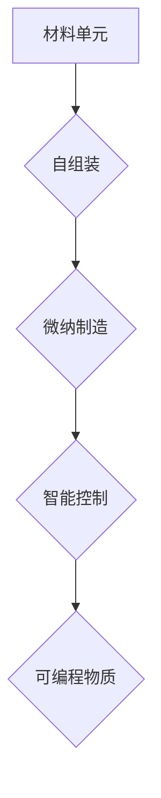

                 

## 可编程物质技术：创造具有特定功能的新材料

> 关键词：可编程物质、自组装、纳米技术、3D打印、材料科学、人工智能、机器学习

## 1. 背景介绍

人类文明的发展离不开对材料的不断探索和利用。从石器时代使用的石材到现代科技的金属、塑料、陶瓷等，材料的演变一直推动着社会进步。然而，现有的材料合成方法往往局限于预设的结构和功能，难以满足日益增长的个性化需求和复杂应用场景。

可编程物质技术（Programmable Matter）应运而生，它旨在通过对材料的微观结构和功能进行编程，创造出具有特定功能的新材料。这种新兴技术融合了材料科学、纳米技术、人工智能和计算机科学等多个领域，为我们打开了全新的材料设计和制造大门。

可编程物质的概念最早可以追溯到20世纪94年，当时科学家们开始探索如何利用微型机器人组装成复杂结构。随着纳米技术和自组装技术的快速发展，可编程物质的研究取得了长足进步。

## 2. 核心概念与联系

可编程物质的核心概念是通过对材料的微观结构和功能进行编程，实现对材料性能的精确控制。这种编程可以是基于物理、化学或生物学原理的，也可以是基于人工智能算法的。

可编程物质的实现依赖于以下几个关键技术：

* **自组装:** 利用分子间相互作用，使材料单元自发地组装成预定的结构。
* **微纳制造:** 利用微米和纳米级的加工技术，制造出具有特定形状和功能的材料单元。
* **智能控制:** 利用传感器、 actuators 和人工智能算法，对材料单元进行实时控制和调节。

**Mermaid 流程图**



## 3. 核心算法原理 & 具体操作步骤

### 3.1  算法原理概述

可编程物质的设计和制造通常依赖于以下几种算法：

* **遗传算法:** 借鉴自然进化机制，通过迭代优化，找到最优的材料结构和功能。
* **模拟退火算法:** 通过随机搜索和温度下降策略，找到局部最优解。
* **粒子群算法:** 模拟鸟群觅食的行为，通过粒子间的相互作用，找到全局最优解。

这些算法可以根据具体的应用场景和材料特性进行选择和组合。

### 3.2  算法步骤详解

以遗传算法为例，可编程物质设计流程可以概括为以下步骤：

1. **编码:** 将材料结构和功能编码成计算机可理解的格式，例如基因序列。
2. **初始化种群:** 生成初始的材料结构和功能组合，构成种群。
3. **评估适应度:** 对每个个体进行评估，根据其性能指标计算适应度值。
4. **选择:** 根据适应度值，选择部分个体进行交叉和变异操作。
5. **交叉和变异:** 将选中的个体进行交叉和变异操作，产生新的个体。
6. **重复步骤3-5:** 重复上述步骤，直到找到满足要求的最佳材料结构和功能。

### 3.3  算法优缺点

**优点:**

* **全局搜索能力强:** 可以探索更广泛的搜索空间，找到更优的解决方案。
* **适应性强:** 可以根据不同的应用场景和材料特性进行调整。
* **并行化能力强:** 可以利用多核处理器进行并行计算，加速算法执行速度。

**缺点:**

* **计算复杂度高:** 对于复杂问题，计算时间可能较长。
* **参数设置敏感:** 算法性能受参数设置的影响较大，需要进行仔细调试。

### 3.4  算法应用领域

可编程物质算法广泛应用于以下领域:

* **材料设计:** 设计具有特定功能的材料，例如自修复材料、形状记忆材料、智能传感器等。
* **药物研发:** 设计新型药物和药物递送系统。
* **制造业:** 实现柔性制造、个性化定制等。
* **生物医学:** 开发生物兼容的材料，用于组织工程、再生医学等。

## 4. 数学模型和公式 & 详细讲解 & 举例说明

### 4.1  数学模型构建

可编程物质的数学模型通常基于微观结构和功能之间的关系。例如，可以建立材料的力学性能与微观结构参数之间的关系模型。

假设材料由一系列相互连接的单元组成，每个单元的力学性能可以通过其形状、尺寸和材料特性等参数来描述。可以利用有限元分析等方法，建立材料整体的力学模型，并通过优化算法寻找最优的微观结构参数，以实现预定的力学性能。

### 4.2  公式推导过程

以下是一个简单的例子，展示了材料的弹性模量与微观结构参数之间的关系模型：

$$E = k \cdot \frac{A}{V}$$

其中：

* $E$ 是材料的弹性模量
* $k$ 是材料单元的弹性模量
* $A$ 是材料单元的横截面积
* $V$ 是材料单元的体积

这个公式表明，材料的弹性模量与材料单元的弹性模量、横截面积和体积成正比。

### 4.3  案例分析与讲解

例如，我们可以利用这个模型来设计一种具有高弹性模量的可编程材料。通过调整材料单元的形状、尺寸和材料特性，可以提高材料的弹性模量。

## 5. 项目实践：代码实例和详细解释说明

### 5.1  开发环境搭建

可编程物质的开发环境通常包括以下软件：

* **编程语言:** Python, C++, Java 等
* **数值计算库:** NumPy, SciPy 等
* **图形处理库:** Matplotlib, OpenGL 等
* **模拟软件:** LAMMPS, Molecular Dynamics 等

### 5.2  源代码详细实现

以下是一个简单的 Python 代码示例，演示了如何使用遗传算法设计一种具有特定形状的可编程材料：

```python
import random

# 定义材料单元的形状和尺寸
class MaterialUnit:
    def __init__(self, shape, size):
        self.shape = shape
        self.size = size

# 定义适应度函数
def fitness(material_structure):
    # 计算材料结构的形状适应度
    # ...

# 初始化种群
population_size = 100
population = [MaterialUnit(random.choice(['circle', 'square']), random.uniform(1, 10)) for _ in range(population_size)]

# 迭代优化
for generation in range(100):
    # 选择
    selected_individuals = select_individuals(population)

    # 交叉
    offspring = crossover(selected_individuals)

    # 变异
    offspring = mutate(offspring)

    # 更新种群
    population = offspring

# 输出最佳个体
best_individual = max(population, key=fitness)
print(best_individual)
```

### 5.3  代码解读与分析

这段代码定义了材料单元的形状和尺寸，并定义了一个适应度函数来评估材料结构的形状适应度。然后，它使用遗传算法迭代优化材料结构，最终输出最佳个体。

### 5.4  运行结果展示

运行这段代码后，可以得到一个具有特定形状的可编程材料的最佳结构。

## 6. 实际应用场景

可编程物质技术在多个领域拥有巨大的应用潜力，例如：

* **自修复材料:** 可编程物质可以设计成具有自修复功能，例如，当材料表面出现裂纹时，可以自动修复。
* **形状记忆材料:** 可编程物质可以设计成具有形状记忆功能，例如，在高温下变形，但在冷却后恢复原有形状。
* **智能传感器:** 可编程物质可以设计成具有智能感知功能，例如，可以检测温度、压力、湿度等环境变化。
* **柔性电子:** 可编程物质可以用于制造柔性电子器件，例如，柔性显示屏、柔性传感器等。

### 6.4  未来应用展望

随着可编程物质技术的不断发展，未来将有更多令人惊叹的应用场景出现，例如：

* **可编程机器人:** 利用可编程物质制造出具有自组装、变形和适应能力的机器人。
* **生物仿生材料:** 设计出具有生物相容性和自修复功能的材料，用于组织工程和再生医学。
* **个性化医疗:** 利用可编程物质制造出个性化的医疗器械和药物递送系统。

## 7. 工具和资源推荐

### 7.1  学习资源推荐

* **书籍:**
    * Programmable Matter: Principles and Applications by Michael P. Deering
    * Self-Assembly: From Molecules to Materials by Peter G. Vekilov
* **在线课程:**
    * MIT OpenCourseWare: Principles of Materials Science and Engineering
    * Coursera: Introduction to Nanotechnology

### 7.2  开发工具推荐

* **编程语言:** Python, C++, Java
* **数值计算库:** NumPy, SciPy
* **图形处理库:** Matplotlib, OpenGL
* **模拟软件:** LAMMPS, Molecular Dynamics

### 7.3  相关论文推荐

* **Self-Assembly of Programmable Matter** by Michael P. Deering
* **Programmable Materials: Design and Applications** by David J. Smith
* **Towards Programmable Matter: A Review** by Michael J. Shelley

## 8. 总结：未来发展趋势与挑战

### 8.1  研究成果总结

可编程物质技术近年来取得了长足进步，从理论研究到实际应用，都取得了令人瞩目的成果。

### 8.2  未来发展趋势

可编程物质技术未来将朝着以下几个方向发展:

* **更加智能化:** 利用人工智能和机器学习技术，实现对材料的更智能化控制和编程。
* **更加复杂化:** 设计和制造出更加复杂、多功能的可编程材料。
* **更加可持续化:** 开发更加环保、可持续的材料合成和制造方法。

### 8.3  面临的挑战

可编程物质技术还面临着一些挑战:

* **材料性能的预测和控制:** 如何准确预测和控制可编程材料的性能，仍然是一个难题。
* **大规模制造的可行性:** 如何实现大规模、低成本的可编程材料制造，也是一个需要解决的问题。
* **安全性与可靠性:** 可编程材料的安全性与可靠性需要得到进一步验证和提升。

### 8.4  研究展望

尽管面临挑战，但可编程物质技术的前景依然光明。随着技术的不断发展，相信可编程物质将为人类社会带来更多创新和改变。

## 9. 附录：常见问题与解答

**Q1: 可编程物质和传统材料有什么区别？**

**A1:** 传统材料的结构和功能是固定的，而可编程物质可以根据需要进行编程和调整。

**Q2: 可编程物质的应用场景有哪些？**

**A2:** 可编程物质的应用场景非常广泛，包括自修复材料、形状记忆材料、智能传感器、柔性电子等。

**Q3: 如何设计和制造可编程物质？**

**A3:** 设计和制造可编程物质需要结合材料科学、纳米技术、人工智能等多个领域的知识和技术。

**作者：禅与计算机程序设计艺术 / Zen and the Art of Computer Programming**<end_of_turn>

