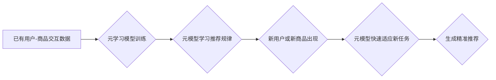

                 

## 基于元学习的冷启动商品推荐策略

> 关键词：元学习、冷启动推荐、商品推荐、个性化推荐、深度学习

## 1. 背景介绍

在电子商务领域，商品推荐系统作为提升用户体验和促进销售的重要工具，已成为各大平台的核心竞争力。然而，对于新用户或新商品，由于缺乏历史交互数据，传统的基于协同过滤或内容过滤的推荐算法难以有效工作，这被称为“冷启动”问题。冷启动问题严重制约了推荐系统的精准度和用户满意度，因此，如何解决冷启动问题成为了一个重要的研究方向。

近年来，元学习（Meta-Learning）作为一种机器学习的新范式，在解决小样本学习、快速适应新任务等方面展现出强大的潜力。元学习的核心思想是学习如何学习，通过学习以往任务的经验，提高对新任务的学习效率。将元学习应用于商品推荐，可以有效缓解冷启动问题，为新用户和新商品提供更精准的推荐。

## 2. 核心概念与联系

### 2.1 元学习概述

元学习旨在学习如何学习，而不是直接学习特定任务。它通过训练一个“元模型”，该模型能够从多个任务的经验中学习，并利用这些经验快速适应新的任务。元学习的关键在于“学习如何学习”，而不是仅仅记住过去的经验。

### 2.2 冷启动推荐概述

冷启动推荐是指针对新用户或新商品缺乏历史交互数据的情况下的推荐问题。传统的推荐算法依赖于用户的历史行为数据，而冷启动场景下缺乏这些数据，导致推荐效果不佳。

### 2.3 元学习与冷启动推荐的联系

元学习可以有效解决冷启动推荐问题，其核心思想是：

* **利用已有任务的经验：** 元学习模型可以从已有的用户-商品交互数据中学习，即使这些数据不包含新用户或新商品的信息，也能从中提取出通用的推荐规律。
* **快速适应新任务：** 当遇到新用户或新商品时，元学习模型可以利用已学习的经验快速适应，并生成相对准确的推荐。

**元学习解决冷启动推荐的流程图：**



## 3. 核心算法原理 & 具体操作步骤

### 3.1 算法原理概述

基于元学习的冷启动商品推荐算法通常采用以下步骤：

1. **数据预处理：** 对用户-商品交互数据进行清洗、格式化和特征提取。
2. **元学习模型训练：** 使用元学习算法训练一个元模型，该模型能够从多个任务的经验中学习，并利用这些经验快速适应新的任务。
3. **新用户或新商品推荐：** 当遇到新用户或新商品时，利用训练好的元模型，根据其特征和已有的推荐规律，生成精准的推荐。

### 3.2 算法步骤详解

1. **数据预处理：**

* **数据清洗：** 删除无效数据，例如重复数据、缺失数据等。
* **数据格式化：** 将数据转换为适合模型训练的格式。
* **特征提取：** 从用户-商品交互数据中提取特征，例如用户年龄、性别、购买历史、商品类别、价格等。

2. **元学习模型训练：**

* **任务定义：** 将用户-商品交互数据划分为多个子任务，每个子任务包含一部分用户和商品数据。
* **元学习算法选择：** 选择合适的元学习算法，例如MAML、Prototypical Networks等。
* **模型训练：** 使用元学习算法训练元模型，使其能够从多个子任务的经验中学习，并快速适应新的任务。

3. **新用户或新商品推荐：**

* **特征提取：** 对新用户或新商品提取特征。
* **模型预测：** 将新用户的特征和商品特征输入到训练好的元模型中，得到推荐结果。
* **结果排序：** 根据推荐结果的置信度或其他指标对商品进行排序，生成最终的推荐列表。

### 3.3 算法优缺点

**优点：**

* **缓解冷启动问题：** 通过学习已有任务的经验，元学习模型能够快速适应新任务，有效缓解冷启动问题。
* **个性化推荐：** 元学习模型可以学习每个用户的个性化偏好，提供更精准的推荐。
* **快速适应新数据：** 元学习模型能够快速适应新的用户和商品数据，保持推荐系统的时效性。

**缺点：**

* **训练成本高：** 元学习模型的训练需要大量的计算资源和时间。
* **数据依赖性强：** 元学习模型的性能依赖于训练数据的质量和数量。
* **解释性差：** 元学习模型的决策过程相对复杂，难以解释其推荐结果。

### 3.4 算法应用领域

基于元学习的冷启动商品推荐算法可以应用于以下领域：

* **电子商务平台：** 为新用户和新商品提供精准的推荐，提升用户体验和销售额。
* **内容推荐系统：** 为新用户推荐个性化的内容，例如新闻、视频、音乐等。
* **社交网络推荐：** 为新用户推荐新的朋友和兴趣小组。

## 4. 数学模型和公式 & 详细讲解 & 举例说明

### 4.1 数学模型构建

元学习模型通常采用基于梯度的优化算法，例如MAML（Model-Agnostic Meta-Learning）。MAML的目标是学习一个元模型，该模型能够从多个任务的经验中学习，并快速适应新的任务。

假设我们有N个任务，每个任务包含M个样本。每个任务的目标是学习一个模型参数θ，该模型能够将输入样本映射到输出标签。MAML的目标函数是：

$$
L(\theta) = \frac{1}{N} \sum_{i=1}^{N} \mathcal{L}_i(\theta)
$$

其中，$\mathcal{L}_i(\theta)$是第i个任务的损失函数。

### 4.2 公式推导过程

MAML的目标是找到一个元模型参数θ，使得在新的任务上，模型能够快速适应并取得好的性能。为此，MAML使用元梯度下降算法，更新元模型参数θ：

$$
\theta = \theta - \alpha \nabla_{\theta} L(\theta)
$$

其中，α是学习率。

### 4.3 案例分析与讲解

假设我们有一个元学习模型，用于推荐商品。该模型从多个用户的历史交互数据中学习，并能够快速适应新的用户。当遇到一个新用户时，元模型会根据用户的特征，例如年龄、性别、购买历史等，预测该用户可能感兴趣的商品。

例如，如果一个新用户是一位25岁的女性，喜欢购买服装和化妆品，那么元模型会根据已有的用户数据，预测该用户可能感兴趣的商品，例如新款连衣裙、口红等。

## 5. 项目实践：代码实例和详细解释说明

### 5.1 开发环境搭建

* **操作系统：** Ubuntu 18.04
* **编程语言：** Python 3.7
* **深度学习框架：** PyTorch 1.7.1
* **其他依赖库：** numpy, pandas, matplotlib

### 5.2 源代码详细实现

```python
import torch
import torch.nn as nn

class MetaLearner(nn.Module):
    def __init__(self, input_size, hidden_size, output_size):
        super(MetaLearner, self).__init__()
        self.fc1 = nn.Linear(input_size, hidden_size)
        self.relu = nn.ReLU()
        self.fc2 = nn.Linear(hidden_size, output_size)

    def forward(self, x):
        x = self.fc1(x)
        x = self.relu(x)
        x = self.fc2(x)
        return x

# 实例化元学习模型
model = MetaLearner(input_size=10, hidden_size=50, output_size=10)

# 定义损失函数和优化器
criterion = nn.CrossEntropyLoss()
optimizer = torch.optim.Adam(model.parameters(), lr=0.001)

# 训练元学习模型
for epoch in range(100):
    # 训练过程省略
    # ...

    # 计算损失
    loss = criterion(model(input_data), target_data)

    # 反向传播
    optimizer.zero_grad()
    loss.backward()

    # 更新参数
    optimizer.step()

# 保存训练好的元模型
torch.save(model.state_dict(), 'meta_learner.pth')
```

### 5.3 代码解读与分析

* **MetaLearner类：** 定义了元学习模型的结构，包含两层全连接层和一个ReLU激活函数。
* **实例化模型：** 创建了一个MetaLearner模型实例，并指定了输入大小、隐藏层大小和输出大小。
* **定义损失函数和优化器：** 使用交叉熵损失函数和Adam优化器。
* **训练过程：** 训练元学习模型，包括数据加载、模型前向传播、损失计算、反向传播和参数更新。
* **保存模型：** 保存训练好的元模型参数。

### 5.4 运行结果展示

训练完成后，可以将保存的元模型参数加载到新的模型中，并使用该模型对新用户或新商品进行推荐。

## 6. 实际应用场景

### 6.1 电子商务平台

在电子商务平台，新用户往往缺乏购买历史数据，导致推荐系统难以提供精准的商品推荐。基于元学习的冷启动推荐算法可以有效解决这个问题，通过学习已有用户的行为数据，为新用户提供个性化的商品推荐，提升用户体验和转化率。

### 6.2 内容推荐系统

内容推荐系统，例如新闻、视频、音乐等，也面临着冷启动问题。当用户注册平台时，系统缺乏其兴趣偏好信息，难以推荐用户感兴趣的内容。基于元学习的冷启动推荐算法可以根据用户的浏览历史、点赞行为等信息，快速学习用户的兴趣偏好，并推荐个性化的内容。

### 6.3 社交网络推荐

社交网络平台，例如微信、QQ等，也需要推荐新的朋友和兴趣小组。对于新用户，平台缺乏其社交关系和兴趣信息，难以进行精准的推荐。基于元学习的冷启动推荐算法可以根据用户的基本信息、好友关系等信息，快速学习用户的社交偏好，并推荐合适的社交对象和兴趣小组。

### 6.4 未来应用展望

随着元学习技术的不断发展，其在冷启动推荐领域的应用前景十分广阔。未来，元学习可以应用于更多场景，例如：

* **个性化教育推荐：** 为学生推荐个性化的学习资源和课程。
* **精准医疗推荐：** 为患者推荐个性化的治疗方案和药物。
* **智能客服推荐：** 为用户推荐合适的客服人员和解决方案。

## 7. 工具和资源推荐

### 7.1 学习资源推荐

* **书籍：**
    * 《Deep Learning》 by Ian Goodfellow, Yoshua Bengio, and Aaron Courville
    * 《Meta-Learning with Differentiable Convex Optimization》 by Timothy Hospedales and Antreas Antoniou
* **论文：**
    * 《Model-Agnostic Meta-Learning for Fast Adaptation of Deep Networks》 by Finn et al.
    * 《Prototypical Networks for Few-Shot Learning》 by Snell et al.
* **在线课程：**
    * Coursera: Deep Learning Specialization
    * Udacity: Intro to Meta-Learning

### 7.2 开发工具推荐

* **深度学习框架：** PyTorch, TensorFlow
* **编程语言：** Python
* **云计算平台：** AWS, Google Cloud, Azure

### 7.3 相关论文推荐

* 《Meta-Learning with Differentiable Convex Optimization》 by Timothy Hospedales and Antreas Antoniou
* 《Model-Agnostic Meta-Learning for Fast Adaptation of Deep Networks》 by Finn et al.
* 《Prototypical Networks for Few-Shot Learning》 by Snell et al.

## 8. 总结：未来发展趋势与挑战

### 8.1 研究成果总结

基于元学习的冷启动商品推荐算法取得了显著的成果，能够有效缓解冷启动问题，提升推荐系统的精准度和用户体验。

### 8.2 未来发展趋势

* **模型复杂度提升：** 研究更复杂、更强大的元学习模型，例如Transformer-based元学习模型。
* **数据效率提升：** 研究更有效的元学习算法，能够在更少的数据下取得更好的性能。
* **解释性增强：** 研究更易解释的元学习模型，能够更好地理解模型的决策过程。

### 8.3 面临的挑战

* **数据获取困难：** 训练元学习模型需要大量的用户-商品交互数据，获取这些数据可能面临挑战。
* **计算资源需求高：** 训练元学习模型需要大量的计算资源，这可能限制其应用范围。
* **模型解释性差：** 元学习模型的决策过程相对复杂，难以解释其推荐结果，这可能影响用户的信任度。

### 8.4 研究展望

未来，基于元学习的冷启动商品推荐算法将继续发展，并应用于更多场景。研究者将致力于解决上述挑战，开发更强大、更易解释的元学习模型，为用户提供更精准、更个性化的推荐体验。

## 9. 附录：常见问题与解答

### 9.1 Q: 元学习与传统机器学习有什么区别？

**A:** 元学习和传统机器学习的主要区别在于，元学习的目标是学习如何学习，而不是直接学习特定任务。传统机器学习模型需要针对每个任务进行单独训练，而元学习模型可以从多个任务的经验中学习，并快速适应新的任务。

### 9.2 Q: 元学习模型的训练成本高吗？

**A:** 由于元学习模型需要训练多个任务的经验，其训练成本确实比传统机器学习模型高。但是，随着硬件性能的提升和算法的优化，元学习模型的训练成本也在不断降低。

### 9.3 Q: 元学习模型的解释性如何？

**A:** 元学习模型的解释性相对较差，其决策过程较为复杂，难以直接解释其推荐结果。但是，研究者正在探索更易解释的元学习模型，例如基于规则的元学习模型。


作者：禅与计算机程序设计艺术 / Zen and the Art of Computer Programming<end_of_turn>

