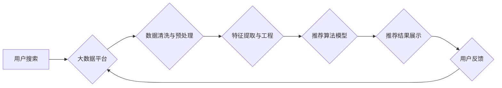

                 

## 大数据与AI 驱动的电商搜索推荐：以用户体验为中心的算法优化

> 关键词：电商搜索推荐、大数据、人工智能、机器学习、协同过滤、内容基余、深度学习、用户体验、算法优化

## 1. 背景介绍

在当今数字经济时代，电商平台已成为人们获取商品和服务的首选方式。然而，面对海量商品和日益复杂的搜索需求，如何为用户提供精准、高效、个性化的搜索推荐体验成为了电商平台的核心竞争力。大数据和人工智能技术的蓬勃发展为电商搜索推荐带来了前所未有的机遇。

传统的电商搜索推荐主要依赖于关键词匹配和商品分类等规则引擎，难以满足用户个性化需求和复杂搜索场景。而大数据和人工智能技术的应用，则能够挖掘用户行为、商品属性和市场趋势等海量数据，构建更智能、更精准的推荐模型，从而提升用户体验和商业价值。

## 2. 核心概念与联系

### 2.1  电商搜索推荐

电商搜索推荐是指在电商平台上，根据用户的搜索意图和历史行为，推荐相关商品或服务的过程。其目标是帮助用户快速找到所需商品，提升用户购物体验和转化率。

### 2.2  大数据

大数据是指海量、高速度、高多样性的数据，其特点是体量庞大、结构复杂、更新速度快。大数据分析能够从海量数据中挖掘出隐藏的价值和规律，为电商搜索推荐提供数据支撑。

### 2.3  人工智能

人工智能是指模拟人类智能行为的计算机系统。在电商搜索推荐领域，人工智能技术主要应用于推荐算法的构建和优化，例如机器学习、深度学习等。

**核心概念与联系流程图**



## 3. 核心算法原理 & 具体操作步骤

### 3.1  算法原理概述

电商搜索推荐算法主要分为两大类：基于内容的推荐和基于协同过滤的推荐。

* **基于内容的推荐:** 根据商品的属性和用户过去的浏览、购买历史等信息，推荐与用户兴趣相符的商品。
* **基于协同过滤的推荐:** 根据用户的行为相似性，推荐与相似用户喜欢的商品。

近年来，深度学习技术在电商搜索推荐领域得到了广泛应用，例如基于神经网络的协同过滤和内容基余推荐算法，能够更好地捕捉用户行为和商品特征之间的复杂关系，提升推荐效果。

### 3.2  算法步骤详解

**基于内容的推荐算法步骤:**

1. **数据收集:** 收集商品属性数据和用户行为数据，例如商品类别、品牌、价格、用户浏览记录、购买记录等。
2. **数据预处理:** 对数据进行清洗、转换和特征工程，例如去除噪声数据、标准化数据、提取商品和用户特征向量等。
3. **模型训练:** 使用机器学习算法，例如逻辑回归、支持向量机等，训练基于内容的推荐模型。
4. **推荐结果生成:** 根据用户的特征向量，预测用户对不同商品的兴趣评分，并根据评分排序推荐商品。

**基于协同过滤的推荐算法步骤:**

1. **用户-商品矩阵构建:** 将用户和商品信息构建成一个用户-商品交互矩阵，其中每个元素表示用户对商品的评分或交互行为。
2. **相似性计算:** 计算用户之间的相似度或商品之间的相似度，例如使用余弦相似度、皮尔逊相关系数等。
3. **推荐结果生成:** 根据用户的相似用户或商品，推荐用户可能感兴趣的商品。

### 3.3  算法优缺点

**基于内容的推荐算法:**

* **优点:** 可以推荐与用户兴趣相符的商品，能够解释推荐结果。
* **缺点:** 需要大量的商品属性数据，难以捕捉用户隐性需求。

**基于协同过滤的推荐算法:**

* **优点:** 可以推荐用户可能感兴趣但未曾接触过的商品，能够捕捉用户隐性需求。
* **缺点:** 容易出现冷启动问题，需要大量的用户交互数据。

### 3.4  算法应用领域

电商搜索推荐算法广泛应用于以下领域:

* **商品推荐:** 根据用户的搜索历史、浏览记录和购买记录，推荐相关商品。
* **个性化广告:** 根据用户的兴趣和行为，推荐个性化广告。
* **内容推荐:** 根据用户的阅读历史和兴趣，推荐相关内容。
* **社交推荐:** 根据用户的社交关系，推荐可能感兴趣的用户或内容。

## 4. 数学模型和公式 & 详细讲解 & 举例说明

### 4.1  数学模型构建

**基于协同过滤的推荐算法**

假设用户集合为U，商品集合为I，用户-商品交互矩阵为R，其中R(u,i)表示用户u对商品i的评分或交互行为。

**用户相似度计算:**

可以使用余弦相似度计算用户之间的相似度:

$$
sim(u_1, u_2) = \frac{u_1 \cdot u_2}{||u_1|| ||u_2||}
$$

其中，$u_1$ 和 $u_2$ 是用户 $u_1$ 和 $u_2$ 的特征向量，$ \cdot $ 表示点积，$||u_1||$ 和 $||u_2||$ 分别表示 $u_1$ 和 $u_2$ 的范数。

**商品相似度计算:**

可以使用余弦相似度计算商品之间的相似度:

$$
sim(i_1, i_2) = \frac{i_1 \cdot i_2}{||i_1|| ||i_2||}
$$

其中，$i_1$ 和 $i_2$ 是商品 $i_1$ 和 $i_2$ 的特征向量。

### 4.2  公式推导过程

**基于用户相似度的推荐算法:**

对于用户 $u$，推荐与其相似用户 $v$ 喜欢的商品 $i$。

$$
推荐(u, i) = \sum_{v \in N(u)} sim(u, v) * R(v, i)
$$

其中，$N(u)$ 是用户 $u$ 的相似用户集合。

**基于商品相似度的推荐算法:**

对于用户 $u$，推荐与用户 $u$ 喜欢的商品 $i$ 相似的商品 $j$。

$$
推荐(u, j) = \sum_{i \in P(u)} sim(i, j) * R(u, i)
$$

其中，$P(u)$ 是用户 $u$ 喜欢的商品集合。

### 4.3  案例分析与讲解

**案例:** 假设有一个电商平台，用户集合为 U = {u1, u2, u3}, 商品集合为 I = {i1, i2, i3}, 用户-商品交互矩阵为:

$$
R = \begin{bmatrix}
5 & 3 & 4 \\
4 & 5 & 2 \\
3 & 2 & 5
\end{bmatrix}
$$

**用户相似度计算:**

使用余弦相似度计算用户之间的相似度，例如:

$$
sim(u1, u2) = \frac{(5, 3, 4) \cdot (4, 5, 2)}{\sqrt{5^2 + 3^2 + 4^2} \sqrt{4^2 + 5^2 + 2^2}}
$$

**商品相似度计算:**

使用余弦相似度计算商品之间的相似度，例如:

$$
sim(i1, i2) = \frac{(5, 4, 3) \cdot (3, 5, 2)}{\sqrt{5^2 + 4^2 + 3^2} \sqrt{3^2 + 5^2 + 2^2}}
$$

**推荐结果生成:**

根据用户相似度和商品相似度，可以生成推荐结果，例如推荐用户 u1 喜欢的商品 i2。

## 5. 项目实践：代码实例和详细解释说明

### 5.1  开发环境搭建

* **操作系统:** Linux/macOS/Windows
* **编程语言:** Python
* **库依赖:** pandas, numpy, scikit-learn, tensorflow/pytorch

### 5.2  源代码详细实现

```python
# 基于协同过滤的推荐算法示例代码

import pandas as pd
from sklearn.metrics.pairwise import cosine_similarity

# 加载用户-商品交互数据
data = pd.read_csv('user_item_data.csv')

# 构建用户-商品交互矩阵
user_item_matrix = data.pivot_table(index='user_id', columns='item_id', values='rating')

# 计算用户相似度
user_similarity = cosine_similarity(user_item_matrix)

# 计算商品相似度
item_similarity = cosine_similarity(user_item_matrix.T)

# 获取用户 u1 的相似用户
similar_users = user_similarity[0].argsort()[:-6:-1]  # 排序并获取前5个相似用户

# 推荐商品
recommended_items = []
for user in similar_users:
    for item in user_item_matrix.columns:
        if user_item_matrix.loc[user, item] > 0:
            recommended_items.append(item)

# 去除重复商品
recommended_items = list(set(recommended_items))

# 打印推荐结果
print(f'推荐给用户 u1 的商品: {recommended_items}')
```

### 5.3  代码解读与分析

* **数据加载:** 使用 pandas 库加载用户-商品交互数据。
* **交互矩阵构建:** 使用 pivot_table 方法构建用户-商品交互矩阵。
* **相似度计算:** 使用 cosine_similarity 方法计算用户和商品之间的相似度。
* **推荐结果生成:** 根据用户相似度和商品相似度，推荐用户可能感兴趣的商品。
* **重复商品去除:** 使用 set 去除推荐结果中的重复商品。

### 5.4  运行结果展示

运行上述代码，将输出用户 u1 可能感兴趣的商品列表。

## 6. 实际应用场景

### 6.1  电商平台商品推荐

电商平台可以利用大数据和人工智能技术，构建个性化商品推荐系统，为用户推荐符合其兴趣和需求的商品，提升用户购物体验和转化率。

### 6.2  内容推荐系统

新闻网站、视频平台等可以利用用户浏览历史和兴趣偏好，推荐相关内容，提升用户粘性和参与度。

### 6.3  社交推荐系统

社交平台可以利用用户社交关系和兴趣爱好，推荐可能感兴趣的用户或内容，促进用户互动和社区建设。

### 6.4  未来应用展望

随着大数据和人工智能技术的不断发展，电商搜索推荐将更加智能化、个性化和精准化。未来，电商搜索推荐可能应用于以下领域:

* **多模态推荐:** 结合文本、图像、视频等多模态数据，构建更全面的用户画像和商品特征，提升推荐效果。
* **实时推荐:** 基于用户实时行为，动态调整推荐结果，提供更及时和个性化的推荐体验。
* **跨平台推荐:** 将用户行为数据整合到多个平台，实现跨平台的个性化推荐。

## 7. 工具和资源推荐

### 7.1  学习资源推荐

* **书籍:**
    * 《推荐系统实践》
    * 《深度学习》
* **在线课程:**
    * Coursera: Recommender Systems
    * Udacity: Machine Learning Engineer Nanodegree
* **博客和网站:**
    * Towards Data Science
    * Machine Learning Mastery

### 7.2  开发工具推荐

* **Python:** 广泛应用于数据分析和机器学习领域，拥有丰富的库和工具。
* **Spark:** 大数据处理框架，能够处理海量数据。
* **TensorFlow/PyTorch:** 深度学习框架，用于构建和训练深度学习模型。

### 7.3  相关论文推荐

* **Collaborative Filtering for Implicit Feedback Datasets**
* **Deep Learning for Recommender Systems**
* **Hybrid Recommender Systems: A Survey**

## 8. 总结：未来发展趋势与挑战

### 8.1  研究成果总结

大数据和人工智能技术的应用，为电商搜索推荐带来了前所未有的机遇，提升了推荐效果和用户体验。基于协同过滤和内容基余的推荐算法，以及深度学习技术的应用，为电商搜索推荐提供了强大的技术支撑。

### 8.2  未来发展趋势

* **多模态推荐:** 结合文本、图像、视频等多模态数据，构建更全面的用户画像和商品特征，提升推荐效果。
* **实时推荐:** 基于用户实时行为，动态调整推荐结果，提供更及时和个性化的推荐体验。
* **跨平台推荐:** 将用户行为数据整合到多个平台，实现跨平台的个性化推荐。

### 8.3  面临的挑战

* **数据稀疏性:** 用户-商品交互数据往往是稀疏的，难以构建准确的推荐模型。
* **冷启动问题:** 新用户和新商品难以获得推荐，需要新的算法和策略来解决。
* **用户隐私保护:** 大数据分析和推荐系统需要考虑用户隐私保护问题，确保用户数据安全。

### 8.4  研究展望

未来，电商搜索推荐研究将更加注重以下方面:

* **开发新的推荐算法:** 针对数据稀疏性和冷启动问题，开发新的推荐算法，提高推荐效果。
* **提升推荐个性化:** 基于用户细粒度特征和行为，提供更个性化的推荐体验。
* **保障用户隐私安全:** 开发隐私保护机制，确保用户数据安全。


## 9. 附录：常见问题与解答

**Q1: 如何解决数据稀疏性问题?**

**A1:** 可以使用以下方法解决数据稀疏性问题:

* **数据增强:** 通过人工标注、聚类等方法增加数据量。
* **协同过滤算法改进:** 使用矩阵分解、隐语义模型等方法，从低维数据中挖掘出潜在的特征。
* **内容基余推荐:** 利用商品属性和用户兴趣信息，构建内容特征，提升推荐效果。

**Q2: 如何解决冷启动问题?**

**A2:** 可以使用以下方法解决冷启动问题:

* **基于内容的推荐:** 利用新商品的属性信息，推荐与用户兴趣相符的商品。
* **基于相似用户的推荐:** 推荐与新用户兴趣相似的用户的商品。
* **利用外部数据:** 利用商品评论、百科信息等外部数据，构建商品特征，提升推荐效果。


作者：禅与计算机程序设计艺术 / Zen and the Art of Computer Programming<end_of_turn>

