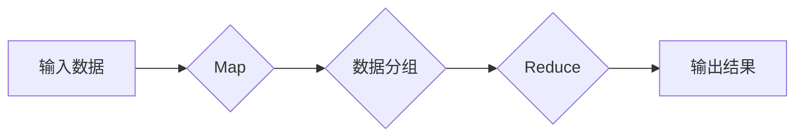
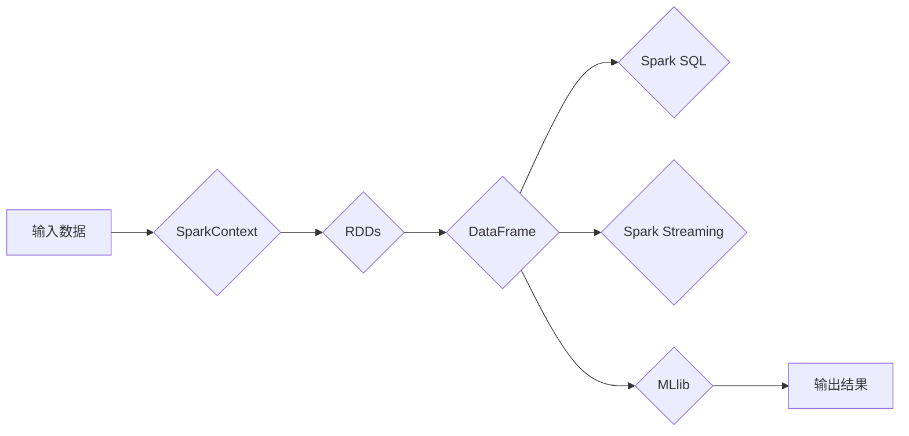

                 

## 大数据处理技术：MapReduce 和 Apache Spark

> 关键词：大数据处理、MapReduce、Apache Spark、分布式计算、数据并行、数据处理框架

## 1. 背景介绍

随着互联网和移动技术的飞速发展，海量数据呈指数级增长。传统的单机数据处理技术已难以满足大数据处理的需求。为了有效处理海量数据，分布式计算技术应运而生。其中，MapReduce 和 Apache Spark 是两种重要的分布式数据处理框架，在处理海量数据方面发挥着重要作用。

MapReduce 是 Google 公司提出的一个分布式数据处理模型和编程框架，它将数据处理任务分解成多个独立的 Map 和 Reduce 操作，并通过集群的计算机节点进行并行处理。Apache Spark 是一个开源的通用数据处理引擎，它支持多种编程语言，并提供更丰富的功能，例如内存计算、流式处理和机器学习等。

## 2. 核心概念与联系

### 2.1 MapReduce 核心概念

MapReduce 模型的核心思想是将大规模数据处理任务分解成两个主要步骤：

* **Map:** 将输入数据划分为多个独立的块，每个块由一个 Map 函数处理，将数据映射到键值对。
* **Reduce:** 将 Map 阶段产生的所有键值对聚合，每个键对应的值由一个 Reduce 函数合并，最终输出结果。

**MapReduce 架构流程图:**



### 2.2 Apache Spark 核心概念

Apache Spark 也是一个分布式数据处理框架，它支持多种编程语言，例如 Scala、Java、Python 和 R。Spark 的核心功能包括：

* **Resilient Distributed Datasets (RDDs):** Spark 的基本数据结构，是分布式数据集的抽象表示。RDDs 可以通过多种操作进行处理，例如过滤、映射、聚合等。
* **DataFrames:** Spark 提供了一种基于列的 DataFrame 数据结构，它类似于关系数据库中的表，并支持 SQL 查询和数据分析。
* **Spark Streaming:** 用于处理实时数据流的框架，可以将数据流实时处理和分析。
* **MLlib:** Spark 的机器学习库，提供各种机器学习算法和模型。

**Spark 架构流程图:**



### 2.3 MapReduce 和 Apache Spark 的联系

MapReduce 和 Apache Spark 都是分布式数据处理框架，它们都将数据处理任务分解成多个并行任务，并通过集群的计算机节点进行处理。

* **相似之处:** 
    * 都支持并行处理，提高数据处理效率。
    * 都提供数据处理的抽象模型，简化开发过程。
* **区别:**
    * MapReduce 主要用于批处理任务，而 Spark 支持批处理和流式处理。
    * Spark 支持内存计算，可以显著提高数据处理速度。
    * Spark 提供更丰富的功能，例如 DataFrame、Spark SQL、Spark Streaming 和 MLlib。

## 3. 核心算法原理 & 具体操作步骤

### 3.1 MapReduce 算法原理概述

MapReduce 算法的核心思想是将大规模数据处理任务分解成两个主要步骤：Map 和 Reduce。

* **Map 阶段:** 将输入数据划分为多个独立的块，每个块由一个 Map 函数处理，将数据映射到键值对。
* **Reduce 阶段:** 将 Map 阶段产生的所有键值对聚合，每个键对应的值由一个 Reduce 函数合并，最终输出结果。

### 3.2 MapReduce 算法步骤详解

1. **数据切分:** 将输入数据划分为多个独立的块，每个块的大小可以根据实际情况进行调整。
2. **Map 阶段:** 每个块由一个 Map 函数处理，将数据映射到键值对。
3. **数据分组:** 将 Map 阶段产生的所有键值对按照键进行分组。
4. **Reduce 阶段:** 每个键对应的值由一个 Reduce 函数合并，最终输出结果。

### 3.3 MapReduce 算法优缺点

**优点:**

* **简单易用:** MapReduce 模型和编程框架相对简单，易于理解和使用。
* **高并行度:** MapReduce 可以将数据处理任务分解成多个并行任务，提高数据处理效率。
* **容错性:** MapReduce 框架具有容错机制，可以处理节点故障。

**缺点:**

* **性能瓶颈:** MapReduce 的数据处理速度主要取决于磁盘 I/O，对于数据量较大的任务，性能瓶颈明显。
* **功能有限:** MapReduce 主要用于批处理任务，对于实时数据处理和机器学习等功能支持有限。

### 3.4 MapReduce 算法应用领域

MapReduce 算法广泛应用于各种大数据处理场景，例如：

* **搜索引擎:** 处理海量网页数据，进行关键词索引和排名。
* **社交网络:** 分析用户行为数据，推荐好友和内容。
* **电子商务:** 处理用户购买数据，进行商品推荐和市场分析。
* **金融:** 处理交易数据，进行风险控制和欺诈检测。

## 4. 数学模型和公式 & 详细讲解 & 举例说明

### 4.1 MapReduce 数学模型构建

MapReduce 算法可以抽象为一个数据流处理模型，其中数据流由一系列的转换操作组成。

* **输入数据:**  $D = \{d_1, d_2, ..., d_n\}$，其中 $d_i$ 表示单个数据元素。
* **Map 函数:** $M: D \rightarrow K_1 \times V_1$，将每个数据元素 $d_i$ 映射到键值对 $(k_{i1}, v_{i1})$。
* **Reduce 函数:** $R: K_1 \times V_1^* \rightarrow K_2 \times V_2$，将每个键 $k_{i1}$ 对应的所有值 $v_{i1}$ 聚合，生成键值对 $(k_{j1}, v_{j1})$。
* **输出结果:** $O = \{o_1, o_2, ..., o_m\}$，其中 $o_i$ 表示最终处理结果。

### 4.2 公式推导过程

MapReduce 算法的输出结果可以表示为：

$$O = R(M(D))$$

其中，$M(D)$ 表示 Map 阶段的输出，$R$ 表示 Reduce 阶段的输出。

### 4.3 案例分析与讲解

假设我们有一个包含学生成绩的输入数据，我们需要统计每个学生的平均成绩。

* **Map 函数:** 将每个学生的信息映射到键值对，键为学生姓名，值是该学生的成绩。
* **Reduce 函数:** 将每个学生姓名对应的所有成绩进行求和，然后除以成绩数量，得到平均成绩。

最终输出结果是一个包含每个学生姓名和平均成绩的键值对集合。

## 5. 项目实践：代码实例和详细解释说明

### 5.1 开发环境搭建

* **操作系统:** Linux 或 macOS
* **Java JDK:** 1.8 或更高版本
* **Hadoop:** 2.7 或更高版本
* **Apache Spark:** 2.4 或更高版本

### 5.2 源代码详细实现

```java
// MapReduce 算法实现
import org.apache.hadoop.conf.Configuration;
import org.apache.hadoop.fs.Path;
import org.apache.hadoop.io.IntWritable;
import org.apache.hadoop.io.Text;
import org.apache.hadoop.mapreduce.Job;
import org.apache.hadoop.mapreduce.Mapper;
import org.apache.hadoop.mapreduce.Reducer;
import org.apache.hadoop.mapreduce.lib.input.FileInputFormat;
import org.apache.hadoop.mapreduce.lib.output.FileOutputFormat;

public class AverageScore {

    public static class Map extends Mapper<Object, Text, Text, IntWritable> {
        @Override
        protected void map(Object key, Text value, Context context) throws IOException, InterruptedException {
            String[] line = value.toString().split(",");
            String name = line[0];
            int score = Integer.parseInt(line[1]);
            context.write(new Text(name), new IntWritable(score));
        }
    }

    public static class Reduce extends Reducer<Text, IntWritable, Text, IntWritable> {
        @Override
        protected void reduce(Text key, Iterable<IntWritable> values, Context context) throws IOException, InterruptedException {
            int sum = 0;
            int count = 0;
            for (IntWritable value : values) {
                sum += value.get();
                count++;
            }
            double average = (double) sum / count;
            context.write(key, new IntWritable((int) average));
        }
    }

    public static void main(String[] args) throws Exception {
        Configuration conf = new Configuration();
        Job job = Job.getInstance(conf, "AverageScore");
        job.setJarByClass(AverageScore.class);
        job.setMapperClass(Map.class);
        job.setReducerClass(Reduce.class);
        job.setOutputKeyClass(Text.class);
        job.setOutputValueClass(IntWritable.class);
        FileInputFormat.addInputPath(job, new Path(args[0]));
        FileOutputFormat.setOutputPath(job, new Path(args[1]));
        System.exit(job.waitForCompletion(true) ? 0 : 1);
    }
}
```

### 5.3 代码解读与分析

* **Map 类:** 负责将输入数据映射到键值对。
* **Reduce 类:** 负责将每个键对应的所有值进行聚合，计算平均成绩。
* **main 方法:** 配置 Job 对象，设置输入输出路径，提交任务并等待完成。

### 5.4 运行结果展示

运行上述代码后，会生成一个包含每个学生姓名和平均成绩的输出文件。

## 6. 实际应用场景

### 6.1  电商平台商品推荐

电商平台每天处理海量用户行为数据，例如浏览记录、购买记录、评价记录等。通过 MapReduce 或 Spark 等框架，可以对这些数据进行分析，挖掘用户兴趣偏好，并推荐相关商品。

### 6.2  社交网络好友推荐

社交网络平台拥有庞大的用户群体，用户之间存在复杂的社交关系。MapReduce 或 Spark 可以用于分析用户之间的互动关系，例如点赞、评论、转发等，并推荐潜在好友。

### 6.3  金融风险控制

金融机构处理大量交易数据，需要实时监控交易异常行为，进行风险控制。MapReduce 或 Spark 可以用于构建实时数据处理系统，快速识别和处理潜在风险。

### 6.4  未来应用展望

随着大数据技术的不断发展，MapReduce 和 Apache Spark 将在更多领域得到应用，例如：

* **人工智能:** MapReduce 和 Spark 可以用于训练机器学习模型，例如图像识别、自然语言处理等。
* **物联网:** MapReduce 和 Spark 可以用于处理海量物联网数据，进行设备监控、数据分析等。
* **云计算:** MapReduce 和 Spark 是云计算平台的重要组成部分，用于提供大数据处理服务。

## 7. 工具和资源推荐

### 7.1 学习资源推荐

* **Apache Hadoop 官方文档:** https://hadoop.apache.org/docs/
* **Apache Spark 官方文档:** https://spark.apache.org/docs/
* **大数据处理技术书籍:** 《Hadoop权威指南》、《Spark权威指南》

### 7.2 开发工具推荐

* **Eclipse:** https://www.eclipse.org/
* **IntelliJ IDEA:** https://www.jetbrains.com/idea/
* **Cloudera Manager:** https://www.cloudera.com/products/manager.html

### 7.3 相关论文推荐

* **MapReduce: Simplified Data Processing on Large Clusters:** https://static.googleusercontent.com/media/research.google.com/en//pubs/archive/40911.pdf
* **Spark: Cluster Computing with Working Sets:** https://static.googleusercontent.com/media/research.google.com/en//pubs/archive/44210.pdf

## 8. 总结：未来发展趋势与挑战

### 8.1 研究成果总结

MapReduce 和 Apache Spark 都是重要的分布式数据处理框架，它们为大数据处理提供了高效、可靠的解决方案。

### 8.2 未来发展趋势

* **更快的处理速度:** 研究人员将继续探索新的算法和架构，提高数据处理速度。
* **更丰富的功能:** 框架将不断扩展功能，支持更多类型的任务，例如实时数据处理、机器学习等。
* **更易于使用:** 框架将更加易于使用，降低开发门槛。

### 8.3 面临的挑战

* **数据规模增长:** 数据规模的不断增长对框架的性能提出了更高的要求。
* **异构数据处理:** 不同类型的数据需要不同的处理方式，如何统一处理异构数据是一个挑战。
* **数据安全和隐私:** 大数据处理涉及大量敏感数据，如何保证数据安全和隐私是一个重要问题。

### 8.4 研究展望

未来，大数据处理技术将继续发展，MapReduce 和 Apache Spark 将继续扮演重要角色。研究人员将继续探索新的算法、架构和应用场景，推动大数据处理技术的发展。

## 9. 附录：常见问题与解答

### 9.1 MapReduce 和 Spark 的区别是什么？

MapReduce 主要用于批处理任务，而 Spark 支持批处理和流式处理。Spark 支持内存计算，可以显著提高数据处理速度。Spark 提供更丰富的功能，例如 DataFrame、Spark SQL、Spark Streaming 和 MLlib。

### 9.2 如何选择 MapReduce 和 Spark？

选择 MapReduce 或 Spark 需要根据具体任务需求进行考虑。如果任务是简单的批处理任务，MapReduce 可以是一个不错的选择。如果任务需要实时处理或支持更丰富的功能，Spark 是更好的选择。

### 9.3 如何学习 MapReduce 和 Spark？

可以参考 Apache Hadoop 和 Apache Spark 官方文档，阅读相关书籍和博客文章，并通过实践项目进行学习。


作者：禅与计算机程序设计艺术 / Zen and the Art of Computer Programming 


<end_of_turn>

