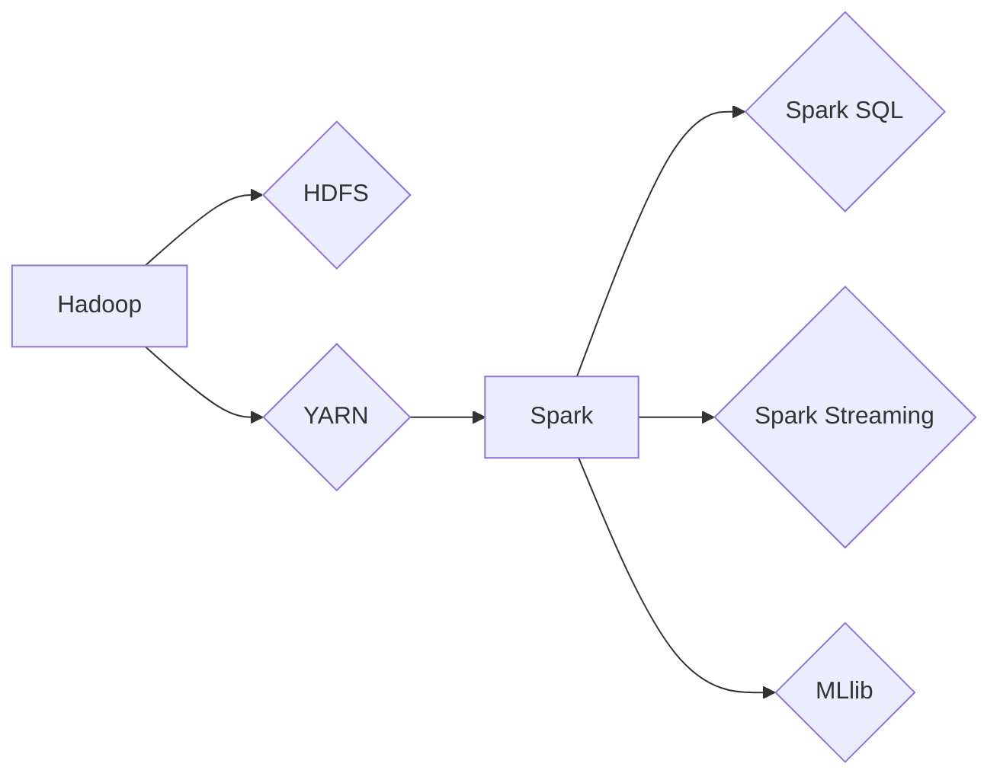

                 

## 大数据处理框架：Hadoop和Spark的应用

> 关键词：Hadoop, Spark, 大数据处理, 分布式计算, MapReduce, Resilient Distributed Datasets (RDD), 

## 1. 背景介绍

随着互联网和移动技术的飞速发展，海量数据呈指数级增长。传统数据库和处理方式已难以应对如此庞大的数据规模和处理需求。大数据处理框架应运而生，为高效处理和分析海量数据提供了解决方案。

Hadoop 和 Spark 是当下最流行的两大开源大数据处理框架，它们分别基于不同的架构和算法，在处理大数据方面展现出各自的优势。本文将深入探讨 Hadoop 和 Spark 的核心概念、算法原理、应用场景以及未来发展趋势，帮助读者理解这两款框架的异同，并选择适合自身需求的工具。

## 2. 核心概念与联系

### 2.1 Hadoop

Hadoop 是一个开源的分布式存储和处理框架，由 Apache 软件基金会维护。它主要由两个核心组件组成：

* **HDFS (Hadoop Distributed File System):** 分布式文件系统，将数据存储在集群中的多个节点上，实现数据冗余和高可用性。
* **YARN (Yet Another Resource Negotiator):** 资源管理系统，负责调度和管理集群资源，为应用程序分配计算资源和存储空间。

Hadoop 的核心处理机制是 MapReduce，它将大规模数据处理任务分解成多个小的 Map 和 Reduce 任务，并并行执行，最终将结果汇总。

### 2.2 Spark

Spark 是一个基于内存的分布式计算框架，由 Apache 软件基金会维护。它比 Hadoop 更快、更灵活，并支持多种编程语言，如 Scala、Java、Python 和 R。Spark 的核心数据结构是 Resilient Distributed Datasets (RDD)，它是一个分布式、可持久化的数据集合，可以进行各种数据操作，如过滤、聚合、转换等。

Spark 提供了多种高性能的处理引擎，如 Spark SQL、Spark Streaming 和 MLlib，可以用于数据分析、流式处理和机器学习等领域。

### 2.3  Hadoop 和 Spark 的关系

Hadoop 和 Spark 可以协同工作，形成强大的大数据处理生态系统。Spark 可以作为 Hadoop 的数据处理引擎，利用 HDFS 的存储能力，并行处理海量数据。

**Hadoop 和 Spark 的关系图:**



## 3. 核心算法原理 & 具体操作步骤

### 3.1  算法原理概述

**MapReduce** 是 Hadoop 的核心处理机制，它将大规模数据处理任务分解成两个阶段：

* **Map:** 将输入数据划分为多个键值对，并对每个键值对进行处理，生成新的键值对。
* **Reduce:** 对 Map 阶段生成的键值对进行聚合，最终生成最终结果。

**Spark 的 RDD** 是一个分布式、可持久化的数据集合，它支持多种数据操作，如：

* **过滤:** 根据条件筛选数据。
* **聚合:** 对数据进行统计分析，如求和、平均值、最大值等。
* **转换:** 对数据进行结构转换，如将数据格式从 CSV 转换为 JSON。

### 3.2  算法步骤详解

**MapReduce 算法步骤:**

1. **数据切片:** 将输入数据切分成多个小块，每个小块称为一个数据切片。
2. **Map 阶段:** 将每个数据切片分配给一个 Map 任务，每个 Map 任务对数据切片进行处理，生成新的键值对。
3. **数据分组:** 将 Map 阶段生成的键值对根据键进行分组。
4. **Reduce 阶段:** 将每个键对应的键值对分配给一个 Reduce 任务，每个 Reduce 任务对键对应的键值对进行聚合，生成最终结果。

**RDD 算法步骤:**

1. **数据创建:** 创建一个 RDD 对象，可以从文件、数据库或其他数据源中加载数据。
2. **数据操作:** 对 RDD 对象进行各种数据操作，如过滤、聚合、转换等。
3. **数据持久化:** 将 RDD 对象持久化到内存或磁盘，以便后续操作。
4. **数据收集:** 将 RDD 对象中的数据收集到本地机器。

### 3.3  算法优缺点

**MapReduce 算法:**

* **优点:** 简单易用，易于扩展，适合处理海量数据。
* **缺点:** 性能相对较低，数据处理过程需要多次磁盘读写，不适合实时处理数据。

**RDD 算法:**

* **优点:** 性能高，数据处理过程主要在内存中进行，适合实时处理数据。
* **缺点:** 复杂度较高，需要更深入的理解 Spark 的底层机制。

### 3.4  算法应用领域

**MapReduce 算法:**

* 数据清洗和预处理
* 数据分析和挖掘
* 文本处理和搜索

**RDD 算法:**

* 实时数据流处理
* 机器学习和深度学习
* 图数据分析

## 4. 数学模型和公式 & 详细讲解 & 举例说明

### 4.1  数学模型构建

**MapReduce 算法的数学模型:**

* **输入数据:**  $D = \{d_1, d_2, ..., d_n\}$，其中 $d_i$ 表示单个数据元素。
* **Map 函数:** $f_m: d_i \rightarrow \{k_j, v_j\}$，其中 $k_j$ 表示键，$v_j$ 表示值。
* **Reduce 函数:** $f_r: \{v_1, v_2, ..., v_m\} \rightarrow v$，其中 $v$ 表示最终结果。

**RDD 算法的数学模型:**

* **数据集合:** $D = \{d_1, d_2, ..., d_n\}$
* **操作函数:** $f: D \rightarrow D'$，其中 $D'$ 表示经过操作后的数据集合。

### 4.2  公式推导过程

**MapReduce 算法的计算过程:**

1. **Map 阶段:** $D' = \{f_m(d_1), f_m(d_2), ..., f_m(d_n)\}$
2. **Reduce 阶段:** $R = f_r(D')$

**RDD 算法的计算过程:**

1. **数据操作:** $D' = f(D)$

### 4.3  案例分析与讲解

**MapReduce 算法案例:**

计算一个文本文件中的单词频率。

* **Map 函数:** 将每个单词作为键，单词出现的次数作为值。
* **Reduce 函数:** 对相同单词的次数进行累加，得到最终的单词频率。

**RDD 算法案例:**

计算一个流式数据中的平均温度。

* **数据操作:** 对流式数据中的温度值进行平均计算。

## 5. 项目实践：代码实例和详细解释说明

### 5.1  开发环境搭建

* 安装 Java 或 Scala 运行环境。
* 下载并安装 Hadoop 或 Spark 集群。
* 配置开发环境变量，例如 HADOOP_HOME 和 SPARK_HOME。

### 5.2  源代码详细实现

**Hadoop MapReduce 代码示例:**

```java
import org.apache.hadoop.conf.Configuration;
import org.apache.hadoop.fs.Path;
import org.apache.hadoop.io.IntWritable;
import org.apache.hadoop.io.Text;
import org.apache.hadoop.mapreduce.Job;
import org.apache.hadoop.mapreduce.Mapper;
import org.apache.hadoop.mapreduce.Reducer;
import org.apache.hadoop.mapreduce.lib.input.FileInputFormat;
import org.apache.hadoop.mapreduce.lib.output.FileOutputFormat;

public class WordCount {

    public static class Map extends Mapper<Object, Text, Text, IntWritable> {
        private final IntWritable one = new IntWritable(1);
        private Text word = new Text();

        @Override
        public void map(Object key, Text value, Context context) throws IOException, InterruptedException {
            String line = value.toString();
            String[] words = line.split("\\s+");
            for (String word : words) {
                this.word.set(word);
                context.write(this.word, one);
            }
        }
    }

    public static class Reduce extends Reducer<Text, IntWritable, Text, IntWritable> {
        private IntWritable result = new IntWritable();

        @Override
        public void reduce(Text key, Iterable<IntWritable> values, Context context) throws IOException, InterruptedException {
            int sum = 0;
            for (IntWritable value : values) {
                sum += value.get();
            }
            result.set(sum);
            context.write(key, result);
        }
    }

    public static void main(String[] args) throws Exception {
        Configuration conf = new Configuration();
        Job job = Job.getInstance(conf, "wordcount");
        job.setJarByClass(WordCount.class);
        job.setMapperClass(Map.class);
        job.setReducerClass(Reduce.class);
        job.setOutputKeyClass(Text.class);
        job.setOutputValueClass(IntWritable.class);
        FileInputFormat.addInputPath(job, new Path(args[0]));
        FileOutputFormat.setOutputPath(job, new Path(args[1]));
        System.exit(job.waitForCompletion(true) ? 0 : 1);
    }
}
```

**Spark RDD 代码示例:**

```scala
import org.apache.spark.SparkConf
import org.apache.spark.SparkContext

object WordCount {
  def main(args: Array[String]): Unit = {
    val conf = new SparkConf().setAppName("WordCount").setMaster("local")
    val sc = new SparkContext(conf)

    val lines = sc.textFile("input.txt")
    val words = lines.flatMap(_.split("\\s+"))
    val wordCounts = words.map(word => (word, 1)).reduceByKey(_ + _)

    wordCounts.foreach(println)
    sc.stop()
  }
}
```

### 5.3  代码解读与分析

**Hadoop MapReduce 代码解读:**

* `Map` 类负责将输入数据进行单词分割，并将每个单词作为键，出现次数作为值输出。
* `Reduce` 类负责对相同单词的次数进行累加，最终输出单词频率。
* `main` 方法配置 Hadoop 任务，指定输入输出路径，并提交任务执行。

**Spark RDD 代码解读:**

* `textFile` 方法读取输入文件，将文件内容转换为 RDD。
* `flatMap` 方法将每个单词分割成独立的元素，并转换为 RDD。
* `map` 方法将每个单词映射为 (单词, 1) 的键值对。
* `reduceByKey` 方法对相同单词的次数进行累加，最终输出单词频率。
* `foreach` 方法将结果打印到控制台。

### 5.4  运行结果展示

运行上述代码后，将输出每个单词出现的次数。

## 6. 实际应用场景

### 6.1  电商平台

* **商品推荐:** 利用用户购买历史和浏览记录，推荐相关商品。
* **用户画像:** 分析用户行为数据，构建用户画像，进行精准营销。
* **库存管理:** 实时监控商品库存，优化库存管理策略。

### 6.2  金融行业

* **欺诈检测:** 分析交易数据，识别异常交易行为，防止欺诈。
* **风险评估:** 分析客户信用数据，评估客户风险等级。
* **投资分析:** 分析市场数据，进行投资决策。

### 6.3  医疗行业

* **疾病诊断:** 分析患者病历数据，辅助医生进行疾病诊断。
* **药物研发:** 分析药物临床试验数据，加速药物研发。
* **健康管理:** 分析患者健康数据，提供个性化健康管理建议。

### 6.4  未来应用展望

随着大数据技术的不断发展，Hadoop 和 Spark 将在更多领域得到应用，例如：

* **智能交通:** 分析交通数据，优化交通流量，提高道路安全。
* **智能制造:** 分析生产数据，提高生产效率，降低生产成本。
* **智慧城市:** 分析城市数据，提升城市管理水平，改善城市生活。

## 7. 工具和资源推荐

### 7.1  学习资源推荐

* **Hadoop 官方文档:** https://hadoop.apache.org/docs/
* **Spark 官方文档:** https://spark.apache.org/docs/
* **Hadoop 和 Spark 入门书籍:**
    * Hadoop: The Definitive Guide
    * Spark: The Definitive Guide

### 7.2  开发工具推荐

* **Eclipse:** https://www.eclipse.org/
* **IntelliJ IDEA:** https://www.jetbrains.com/idea/
* **Cloudera Manager:** https://www.cloudera.com/products/manager.html
* **Databricks:** https://www.databricks.com/

### 7.3  相关论文推荐

* **MapReduce: Simplified Data Processing on Large Clusters:** https://static.googleusercontent.com/media/research.google.com/en//pubs/archive/40991.pdf
* **Spark: Cluster Computing with Working Sets:** https://static.googleusercontent.com/media/research.google.com/en//pubs/archive/40991.pdf

## 8. 总结：未来发展趋势与挑战

### 8.1  研究成果总结

Hadoop 和 Spark 作为大数据处理领域的明星框架，在处理海量数据方面取得了显著成果。它们提供了高效、灵活、可扩展的解决方案，推动了大数据应用的快速发展。

### 8.2  未来发展趋势

* **更快的性能:** 框架性能将继续提升，支持更复杂的计算任务和更大的数据规模。
* **更易于使用:** 框架将更加易于使用，降低学习门槛，吸引更多开发者参与。
* **更广泛的应用:** 框架将应用于更多领域，例如人工智能、物联网、边缘计算等。

### 8.3  面临的挑战

* **数据隐私和安全:** 如何保护大数据中的隐私和安全信息，是未来发展面临的重要挑战。
* **数据可解释性:** 如何提高大数据分析结果的可解释性，帮助用户理解数据背后的含义，也是一个关键问题。
* **生态系统建设:** 完善大数据生态系统，包括工具、平台、人才等，是推动大数据发展的重要保障。

### 8.4  研究展望

未来，大数据处理框架将朝着更智能、更安全、更易于使用的方向发展。研究者将继续探索新的算法、架构和技术，以应对大数据处理的挑战，推动大数据应用的创新发展。

## 9. 附录：常见问题与解答

**Q1: Hadoop 和 Spark 的区别是什么？**

**A1:** Hadoop 是一个基于分布式文件系统和 MapReduce 处理机制的框架，适合处理海量静态数据。Spark 是一个基于内存计算的框架，性能更高，更灵活，适合处理实时数据和复杂计算任务。

**Q2: 如何选择 Hadoop 和 Spark？**

**A2:** 选择 Hadoop 或 Spark 需要根据具体应用场景和需求进行评估。

* 如果需要处理海量静态数据，并且对性能要求不高，可以选择 Hadoop。
* 如果需要处理实时数据，或者需要进行复杂计算，可以选择 Spark。

**Q3: 如何学习 Hadoop 和 Spark？**

**A3:** 可以通过官方文档、书籍、在线课程等方式学习 Hadoop 和 Spark。

* Hadoop 官方文档: https://hadoop.apache.org/docs/
* Spark 官方文档: https://spark.apache.org/docs/
* Hadoop 和 Spark 入门书籍:
    * Hadoop: The Definitive Guide
    * Spark: The Definitive Guide


作者：禅与计算机程序设计艺术 / Zen and the Art of Computer Programming<end_of_turn>

