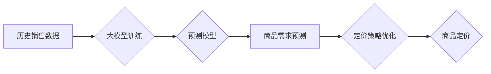

                 

## 大模型在商品定价策略优化中的应用

> 关键词：大模型、商品定价、机器学习、预测模型、优化算法、数据分析、商业智能

## 1. 背景介绍

在当今数据爆炸的时代，商品定价策略已不再是简单的成本加成或市场调研，而是需要结合大量数据和先进算法进行精准分析和优化。传统定价方法往往依赖经验和主观判断，难以适应市场瞬息万变的动态。而大模型，作为近年来人工智能领域取得的重大突破，凭借其强大的学习能力和泛化能力，为商品定价策略优化提供了全新的思路和方法。

大模型的出现，标志着人工智能进入了一个新的发展阶段。其核心在于训练规模庞大、参数数量惊人的神经网络模型，能够从海量数据中学习到复杂的模式和规律。在商品定价领域，大模型可以分析历史销售数据、市场趋势、竞争对手价格、消费者行为等多方面因素，构建精准的预测模型，为企业制定更科学、更有效的定价策略。

## 2. 核心概念与联系

### 2.1  大模型概述

大模型是指参数数量在数十亿甚至千亿级别的神经网络模型。其训练数据量庞大，涵盖了广泛的领域和知识，能够学习到更深层次的语义和关系。

### 2.2  商品定价策略

商品定价策略是指企业根据市场环境、产品特点、目标客户等因素，制定商品价格的方案和方法。常见的定价策略包括成本加成定价、价值定价、竞争性定价、渗透定价等。

### 2.3  大模型与商品定价策略的联系

大模型可以帮助企业优化商品定价策略，主要体现在以下几个方面：

* **数据分析与挖掘:** 大模型可以对海量商品销售数据、市场趋势数据、消费者行为数据等进行深度分析，挖掘出隐藏的规律和趋势，为定价决策提供数据支持。
* **预测模型构建:** 大模型可以构建精准的商品需求预测模型，预测不同价格下商品的销量和利润，帮助企业制定最优的定价策略。
* **动态调整:** 大模型可以实时监控市场变化和消费者行为，根据变化情况动态调整商品价格，实现精准定价。

**Mermaid 流程图**



## 3. 核心算法原理 & 具体操作步骤

### 3.1  算法原理概述

大模型在商品定价策略优化中的应用主要基于以下核心算法：

* **机器学习算法:** 

    * **回归算法:** 用于预测商品价格与销量之间的关系，例如线性回归、逻辑回归、支持向量机等。
    * **分类算法:** 用于预测商品的市场定位和目标客户群体，例如决策树、随机森林、神经网络等。

* **深度学习算法:** 

    * **卷积神经网络(CNN):** 用于提取商品图像特征，例如颜色、形状、品牌等，辅助定价决策。
    * **循环神经网络(RNN):** 用于分析商品销售时间序列数据，预测未来销量趋势。

* **强化学习算法:** 用于优化定价策略，通过不断调整价格，最大化利润。

### 3.2  算法步骤详解

1. **数据收集与预处理:** 收集历史销售数据、市场趋势数据、消费者行为数据等，并进行清洗、转换、特征工程等预处理操作。
2. **模型选择与训练:** 根据具体业务需求选择合适的机器学习或深度学习算法，并利用训练数据对模型进行训练。
3. **模型评估与优化:** 利用测试数据对模型进行评估，并根据评估结果调整模型参数，优化模型性能。
4. **预测与决策:** 将训练好的模型应用于实际场景，预测不同价格下商品的销量和利润，并根据预测结果制定最优的定价策略。
5. **监控与调整:** 实时监控市场变化和消费者行为，根据变化情况动态调整商品价格，实现精准定价。

### 3.3  算法优缺点

**优点:**

* **数据驱动:** 基于海量数据分析，决策更加科学和精准。
* **自动化:** 自动化定价流程，提高效率和降低成本。
* **动态调整:** 可以根据市场变化实时调整价格，提高利润。

**缺点:**

* **数据依赖:** 模型性能取决于数据质量和数量。
* **算法复杂:** 需要专业的技术人员进行模型开发和维护。
* **解释性差:** 深度学习模型的决策过程难以解释，缺乏透明度。

### 3.4  算法应用领域

大模型在商品定价策略优化中的应用领域广泛，包括：

* **电商平台:** 为商品定价、促销活动、会员权益等提供数据支持。
* **零售企业:** 优化商品库存管理、促销策略、定价策略等。
* **制造业:** 预测产品需求、优化生产计划、制定定价策略等。
* **金融服务:** 评估风险、预测投资回报、制定理财策略等。

## 4. 数学模型和公式 & 详细讲解 & 举例说明

### 4.1  数学模型构建

商品定价策略优化通常采用以下数学模型：

* **线性回归模型:** 用于预测商品价格与销量之间的线性关系。

$$
y = mx + c
$$

其中：

* $y$ 为商品销量
* $x$ 为商品价格
* $m$ 为斜率，表示销量对价格的敏感度
* $c$ 为截距，表示当价格为0时，销量为c

* **逻辑回归模型:** 用于预测商品是否会被购买，根据价格和其它特征计算购买概率。

$$
P(购买) = \frac{1}{1 + e^{-(wx + b)}}
$$

其中：

* $P(购买)$ 为购买概率
* $w$ 为权重，表示不同特征对购买的影响程度
* $x$ 为商品价格和其它特征
* $b$ 为偏置项

### 4.2  公式推导过程

以上公式的推导过程较为复杂，涉及到微积分、概率统计等数学知识。

### 4.3  案例分析与讲解

假设一家电商平台销售一款手机，通过收集历史销售数据，建立了以下线性回归模型：

$$
y = -0.05x + 100
$$

其中：

* $y$ 为手机销量
* $x$ 为手机价格

该模型表明，手机价格每增加1元，销量会减少0.05个。

如果手机价格为2000元，根据模型预测，销量为：

$$
y = -0.05 * 2000 + 100 = 0
$$

这意味着，当手机价格为2000元时，销量为0。

## 5. 项目实践：代码实例和详细解释说明

### 5.1  开发环境搭建

* Python 3.x
* TensorFlow 或 PyTorch 深度学习框架
* Jupyter Notebook 或 VS Code 开发环境

### 5.2  源代码详细实现

```python
import pandas as pd
from sklearn.linear_model import LinearRegression

# 1. 数据加载
data = pd.read_csv('sales_data.csv')

# 2. 特征工程
X = data[['price']]  # 输入特征：价格
y = data['sales']  # 输出目标：销量

# 3. 模型训练
model = LinearRegression()
model.fit(X, y)

# 4. 模型评估
# ...

# 5. 预测
new_price = 2000
predicted_sales = model.predict([[new_price]])
print(f'预测销量：{predicted_sales[0]}')
```

### 5.3  代码解读与分析

* 数据加载：使用 pandas 库读取销售数据文件。
* 特征工程：选择价格作为输入特征，销量作为输出目标。
* 模型训练：使用 scikit-learn 库的线性回归模型进行训练。
* 模型评估：使用测试数据评估模型性能，例如计算 R-squared 值。
* 预测：使用训练好的模型预测不同价格下商品的销量。

### 5.4  运行结果展示

运行代码后，会输出预测销量结果。例如，如果预测结果为 50，则表示当价格为 2000 元时，预计销量为 50 个。

## 6. 实际应用场景

### 6.1  电商平台

电商平台可以利用大模型优化商品定价策略，例如：

* **个性化定价:** 根据用户的购买历史、浏览记录、地域等信息，为不同用户提供个性化的价格。
* **动态调整:** 实时监控市场变化和竞争对手价格，动态调整商品价格，保持竞争力。
* **促销活动:** 利用大模型预测促销活动的效果，制定最优的促销策略。

### 6.2  零售企业

零售企业可以利用大模型优化商品定价策略，例如：

* **库存管理:** 预测商品需求，优化库存水平，降低库存成本。
* **促销策略:** 利用大模型分析消费者行为，制定更有效的促销策略。
* **定价策略:** 根据市场趋势和竞争对手价格，制定更合理的定价策略。

### 6.3  未来应用展望

随着大模型技术的不断发展，其在商品定价策略优化中的应用场景将更加广泛，例如：

* **智能定价:** 利用强化学习算法，实现自动化的智能定价，最大化利润。
* **跨境电商:** 跨境电商平台可以利用大模型分析不同国家和地区的市场需求，制定更精准的定价策略。
* **新零售:** 新零售模式下，大模型可以帮助企业更好地理解消费者需求，提供更个性化的商品和服务。

## 7. 工具和资源推荐

### 7.1  学习资源推荐

* **书籍:**
    * 《深度学习》
    * 《机器学习实战》
    * 《Python机器学习》
* **在线课程:**
    * Coursera: 深度学习
    * edX: 机器学习
    * Udacity: 机器学习工程师

### 7.2  开发工具推荐

* **Python:** 
    * TensorFlow
    * PyTorch
    * scikit-learn
* **Jupyter Notebook:** 
    * VS Code

### 7.3  相关论文推荐

* **Attention Is All You Need:** https://arxiv.org/abs/1706.03762
* **BERT: Pre-training of Deep Bidirectional Transformers for Language Understanding:** https://arxiv.org/abs/1810.04805
* **Generative Pre-trained Transformer 3 (GPT-3):** https://openai.com/blog/gpt-3/

## 8. 总结：未来发展趋势与挑战

### 8.1  研究成果总结

大模型在商品定价策略优化领域取得了显著成果，能够帮助企业更加科学、精准地制定定价策略，提高利润。

### 8.2  未来发展趋势

* **模型规模与性能提升:** 随着计算能力的提升，大模型的规模和性能将不断提升，能够学习到更复杂的模式和规律。
* **多模态融合:** 将文本、图像、音频等多模态数据融合到大模型中，提升定价决策的准确性和全面性。
* **解释性增强:** 研究更易于解释的深度学习模型，提高定价决策的透明度和可信度。

### 8.3  面临的挑战

* **数据质量与隐私:** 大模型依赖于高质量的数据，数据质量问题会直接影响模型性能。同时，数据隐私保护也是一个重要的挑战。
* **算法可解释性:** 深度学习模型的决策过程难以解释，缺乏透明度，难以获得用户的信任。
* **计算资源需求:** 训练大型模型需要大量的计算资源，成本较高。

### 8.4  研究展望

未来，大模型在商品定价策略优化领域将继续发挥重要作用，并不断朝着更智能、更精准、更可解释的方向发展。


## 9. 附录：常见问题与解答

**Q1: 大模型的定价策略是否会影响消费者体验？**

**A1:** 大模型的定价策略旨在优化企业利润，但同时也需要考虑消费者体验。通过个性化定价、促销活动等方式，可以平衡企业利益和消费者需求。

**Q2: 大模型的定价策略是否会造成价格歧视？**

**A2:** 大模型的定价策略需要遵循公平公正的原则，避免造成价格歧视。企业需要确保定价算法不会基于敏感信息（例如种族、性别、年龄等）进行决策。

**Q3: 如何评估大模型的定价策略效果？**

**A3:** 可以通过以下指标评估大模型的定价策略效果：

* **销量增长:** 
* **利润率提升:** 
* **客户满意度:** 
* **市场份额增长:** 


作者：禅与计算机程序设计艺术 / Zen and the Art of Computer Programming<end_of_turn>

