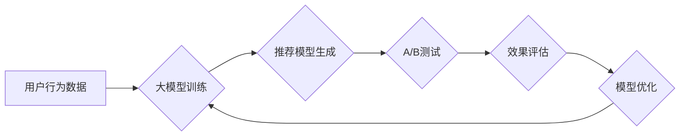

                 

## 大模型在推荐系统A/B测试中的应用

> 关键词：大模型、推荐系统、A/B测试、机器学习、模型优化、个性化推荐、数据分析

## 1. 背景介绍

推荐系统是互联网时代的重要组成部分，其核心目标是根据用户的历史行为、偏好和上下文信息，预测用户对特定物品的兴趣，并提供个性化的推荐结果。传统的推荐系统主要依赖于协同过滤、内容过滤等算法，但随着数据量的爆炸式增长和用户行为的多样性增加，这些算法面临着越来越大的挑战。

近年来，大模型技术在自然语言处理、计算机视觉等领域取得了突破性进展，其强大的学习能力和泛化能力为推荐系统带来了新的机遇。大模型能够学习到更深层的用户特征和物品关系，从而提供更精准、更个性化的推荐。

A/B测试是互联网产品开发中常用的评估方法，通过比较两个或多个版本的产品效果，选择最优版本。在推荐系统领域，A/B测试可以用于评估不同推荐算法、推荐策略和推荐参数的效果，从而不断优化推荐系统性能。

## 2. 核心概念与联系

### 2.1 推荐系统

推荐系统旨在根据用户的历史行为、偏好和上下文信息，预测用户对特定物品的兴趣，并提供个性化的推荐结果。

### 2.2 大模型

大模型是指参数规模庞大、训练数据量巨大的深度学习模型。大模型能够学习到更深层的用户特征和物品关系，从而提供更精准、更个性化的推荐。

### 2.3 A/B测试

A/B测试是一种比较两个或多个版本产品效果的实验方法。通过随机将用户分配到不同的版本，并比较不同版本的用户行为数据，可以评估不同版本的效果，选择最优版本。

**大模型在推荐系统A/B测试中的应用流程:**



## 3. 核心算法原理 & 具体操作步骤

### 3.1 算法原理概述

大模型在推荐系统A/B测试中的应用主要基于以下核心算法原理：

* **深度学习:** 大模型通常基于深度神经网络架构，能够学习到用户和物品之间的复杂关系。
* **迁移学习:** 利用预训练的大模型，在推荐任务上进行微调，可以提高模型的效率和性能。
* **强化学习:** 可以将A/B测试结果作为奖励信号，训练强化学习模型，不断优化推荐策略。

### 3.2 算法步骤详解

1. **数据收集和预处理:** 收集用户行为数据，例如点击、购买、浏览等，并进行清洗、转换和特征工程。
2. **大模型训练:** 利用预训练的大模型，在推荐任务上进行微调，训练出推荐模型。
3. **A/B测试方案设计:** 设计A/B测试方案，例如比较不同推荐算法、推荐策略或推荐参数的效果。
4. **用户分组和实验运行:** 将用户随机分配到不同的测试组，运行A/B测试实验。
5. **效果评估:** 收集不同测试组的用户行为数据，并进行统计分析，评估不同版本的效果。
6. **模型优化:** 根据A/B测试结果，对推荐模型进行优化，例如调整模型参数、更新训练数据等。
7. **迭代优化:** 重复上述步骤，不断迭代优化推荐模型，提高推荐系统性能。

### 3.3 算法优缺点

**优点:**

* **精准度提升:** 大模型能够学习到更深层的用户特征和物品关系，从而提供更精准的推荐。
* **个性化增强:** 大模型可以根据用户的个性化需求，提供更个性化的推荐。
* **效率提升:** 利用预训练的大模型，可以减少模型训练时间和资源消耗。

**缺点:**

* **数据依赖:** 大模型需要大量的训练数据，数据质量和数量直接影响模型性能。
* **计算资源需求:** 大模型训练和部署需要大量的计算资源，成本较高。
* **可解释性差:** 大模型的决策过程较为复杂，难以解释模型的推荐结果。

### 3.4 算法应用领域

大模型在推荐系统A/B测试中的应用领域广泛，例如：

* **电商推荐:** 为用户推荐商品、优惠券、促销活动等。
* **内容推荐:** 为用户推荐新闻、视频、音乐、书籍等内容。
* **社交推荐:** 为用户推荐好友、群组、话题等。
* **广告推荐:** 为用户推荐精准的广告信息。

## 4. 数学模型和公式 & 详细讲解 & 举例说明

### 4.1 数学模型构建

大模型在推荐系统A/B测试中的应用通常基于以下数学模型：

* **协同过滤模型:** 基于用户的历史行为数据，预测用户对特定物品的兴趣。
* **内容过滤模型:** 基于物品的特征信息，预测用户对特定物品的兴趣。
* **深度学习模型:** 利用深度神经网络架构，学习用户和物品之间的复杂关系。

### 4.2 公式推导过程

例如，协同过滤模型中的用户-物品评分预测公式可以表示为：

$$
r_{ui} = \beta_0 + \beta_u u_i + \beta_i i_u + \epsilon_{ui}
$$

其中：

* $r_{ui}$ 表示用户 $u$ 对物品 $i$ 的评分。
* $\beta_0$ 是模型的偏差项。
* $\beta_u$ 和 $\beta_i$ 分别是用户 $u$ 和物品 $i$ 的权重系数。
* $u_i$ 和 $i_u$ 分别是用户 $u$ 和物品 $i$ 的特征向量。
* $\epsilon_{ui}$ 是预测误差项。

### 4.3 案例分析与讲解

假设我们有一个电商平台，想要推荐商品给用户。我们可以使用协同过滤模型，根据用户的历史购买记录和商品的特征信息，预测用户对特定商品的兴趣。

例如，如果用户 $A$ 购买了商品 $X$ 和商品 $Y$，并且商品 $X$ 和商品 $Z$ 具有相似的特征，那么我们可以预测用户 $A$ 对商品 $Z$ 的兴趣较高。

## 5. 项目实践：代码实例和详细解释说明

### 5.1 开发环境搭建

* **操作系统:** Linux 或 macOS
* **编程语言:** Python
* **深度学习框架:** TensorFlow 或 PyTorch
* **数据存储:** MySQL 或 MongoDB

### 5.2 源代码详细实现

```python
# 导入必要的库
import tensorflow as tf

# 定义模型结构
model = tf.keras.Sequential([
    tf.keras.layers.Embedding(input_dim=vocab_size, output_dim=embedding_dim),
    tf.keras.layers.Flatten(),
    tf.keras.layers.Dense(units=1, activation='sigmoid')
])

# 编译模型
model.compile(optimizer='adam', loss='binary_crossentropy', metrics=['accuracy'])

# 训练模型
model.fit(x_train, y_train, epochs=10, batch_size=32)

# 评估模型
loss, accuracy = model.evaluate(x_test, y_test)
print('Loss:', loss)
print('Accuracy:', accuracy)
```

### 5.3 代码解读与分析

* **Embedding层:** 将用户和物品的ID转换为稠密的向量表示。
* **Flatten层:** 将多维向量转换为一维向量。
* **Dense层:** 全连接层，用于预测用户对特定物品的兴趣。
* **sigmoid激活函数:** 将预测结果映射到0到1之间，表示用户对物品的兴趣程度。

### 5.4 运行结果展示

训练完成后，我们可以使用模型预测用户对特定物品的兴趣，并进行A/B测试，评估不同推荐策略的效果。

## 6. 实际应用场景

### 6.1 电商推荐

大模型在电商推荐系统中可以用于推荐商品、优惠券、促销活动等，提高用户转化率和销售额。

### 6.2 内容推荐

大模型可以用于推荐新闻、视频、音乐、书籍等内容，满足用户的个性化需求，提高用户粘性和活跃度。

### 6.3 社交推荐

大模型可以用于推荐好友、群组、话题等，帮助用户发现新的兴趣和连接，增强社交体验。

### 6.4 未来应用展望

随着大模型技术的不断发展，其在推荐系统A/B测试中的应用场景将更加广泛，例如：

* **个性化广告推荐:** 为用户推荐更精准的广告信息，提高广告效果。
* **跨平台推荐:** 将用户行为数据整合到不同的平台，提供更全面的个性化推荐。
* **多模态推荐:** 利用文本、图像、音频等多模态数据，提供更丰富的推荐体验。

## 7. 工具和资源推荐

### 7.1 学习资源推荐

* **书籍:**
    * Deep Learning by Ian Goodfellow
    * Hands-On Machine Learning with Scikit-Learn, Keras & TensorFlow by Aurélien Géron
* **在线课程:**
    * TensorFlow Tutorials: https://www.tensorflow.org/tutorials
    * PyTorch Tutorials: https://pytorch.org/tutorials/

### 7.2 开发工具推荐

* **深度学习框架:** TensorFlow, PyTorch
* **数据处理工具:** Pandas, NumPy
* **云计算平台:** AWS, Azure, Google Cloud

### 7.3 相关论文推荐

* **BERT: Pre-training of Deep Bidirectional Transformers for Language Understanding**
* **GPT-3: Language Models are Few-Shot Learners**
* **DALL-E: Creating Images from Text**

## 8. 总结：未来发展趋势与挑战

### 8.1 研究成果总结

大模型在推荐系统A/B测试中的应用取得了显著成果，能够提高推荐精准度、个性化程度和效率。

### 8.2 未来发展趋势

* **模型规模和能力的提升:** 大模型规模将继续扩大，模型能力将进一步增强。
* **多模态融合:** 将文本、图像、音频等多模态数据融合到推荐系统中，提供更丰富的推荐体验。
* **可解释性增强:** 研究更可解释的大模型，帮助用户理解模型的推荐结果。

### 8.3 面临的挑战

* **数据隐私和安全:** 大模型训练需要大量用户数据，如何保护用户隐私和数据安全是一个重要挑战。
* **模型公平性和偏见:** 大模型可能存在公平性和偏见问题，需要进行相应的调优和改进。
* **模型部署和维护成本:** 大模型部署和维护成本较高，需要寻找更有效的解决方案。

### 8.4 研究展望

未来，大模型在推荐系统A/B测试领域的应用将更加广泛和深入，需要继续加强研究和探索，解决上述挑战，推动推荐系统技术的发展。

## 9. 附录：常见问题与解答

* **Q1: 大模型训练需要多少数据？**

A1: 大模型训练需要大量的训练数据，通常需要百万甚至数十亿条数据。

* **Q2: 大模型训练需要多少计算资源？**

A2: 大模型训练需要大量的计算资源，通常需要使用高性能GPU集群。

* **Q3: 如何评估大模型的推荐效果？**

A3: 可以使用A/B测试、点击率、转化率等指标来评估大模型的推荐效果。


作者：禅与计算机程序设计艺术 / Zen and the Art of Computer Programming 
<end_of_turn>

