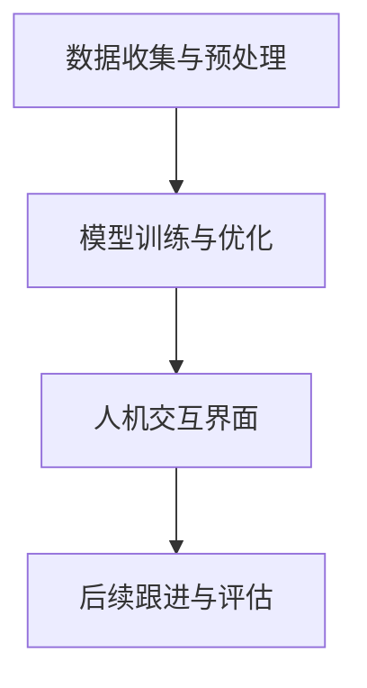

                 

### 文章标题

"心理健康和 LLM：个性化的支持和治疗"

### 关键词

- 人工智能
- 语言模型
- 心理健康
- 个性化治疗
- 人机交互

### 摘要

本文旨在探讨如何利用人工智能，特别是大型语言模型（LLM），为心理健康提供个性化支持和治疗。我们将深入分析LLM在心理健康领域的应用潜力，探讨其工作原理，并提出一套基于LLM的个性化心理健康支持系统。本文将涵盖从核心概念到具体实现的各个方面，包括数学模型、算法原理、实际应用场景和未来发展趋势。

### 1. 背景介绍（Background Introduction）

心理健康是现代社会的关键问题。随着生活节奏的加快和工作压力的增大，越来越多的人面临着心理健康问题，如焦虑、抑郁和压力。传统的心理健康支持方法，如心理咨询和治疗，往往存在资源有限、成本高和效果不稳定等问题。因此，寻找新的、高效的解决方案变得尤为重要。

近年来，人工智能技术的飞速发展，特别是在语言模型领域的突破，为心理健康支持带来了新的契机。大型语言模型（LLM），如ChatGPT和BERT，能够处理和理解复杂的自然语言输入，并生成高质量的自然语言输出。这使得它们在心理健康领域的应用成为可能。

心理健康与语言模型之间的联系在于，许多心理健康问题，如焦虑和抑郁，往往通过语言表达出来。同时，语言模型能够通过分析患者的语言输入，识别出潜在的心理健康问题，并提供相应的支持和治疗建议。这种基于自然语言处理的心理健康支持方法，具有个性化、高效和便捷的特点。

### 2. 核心概念与联系（Core Concepts and Connections）

#### 2.1 大型语言模型（LLM）

大型语言模型（LLM）是一种基于深度学习的自然语言处理模型，具有强大的语言理解和生成能力。LLM通常使用大量的文本数据训练，通过学习语言的模式和结构，能够生成与输入文本相关的高质量自然语言输出。

#### 2.2 心理健康问题识别与处理

心理健康问题识别与处理是LLM在心理健康领域的主要应用。通过分析患者的语言输入，LLM可以识别出潜在的心理健康问题，如焦虑、抑郁和压力等。LLM还能够根据患者的具体情况，提供个性化的心理健康支持和治疗建议。

#### 2.3 人机交互

人机交互是LLM在心理健康支持中的关键环节。通过自然语言对话，LLM能够与患者建立良好的互动关系，了解他们的心理状态，并提供实时、个性化的心理健康服务。这种交互方式不仅提高了患者的参与度，也增强了治疗效果。

#### 2.4 心理健康支持系统

心理健康支持系统是基于LLM构建的个性化心理健康服务系统。该系统包括以下几个核心模块：

- 数据收集与预处理：收集患者的语言输入数据，并进行清洗和预处理，以供LLM训练使用。
- 模型训练与优化：使用大规模文本数据训练LLM，并通过迭代优化，提高其心理健康问题识别和处理的准确性。
- 人机交互界面：设计一个用户友好的界面，使患者能够方便地与LLM进行交互，获取心理健康支持和治疗建议。
- 后续跟进与评估：跟踪患者的心理健康状况，并根据反馈对系统进行持续优化。

#### Mermaid 流程图



### 3. 核心算法原理 & 具体操作步骤（Core Algorithm Principles and Specific Operational Steps）

#### 3.1 数据收集与预处理

数据收集与预处理是心理健康支持系统的第一步。具体操作步骤如下：

1. 数据来源：从公开的心理健康数据集、患者自述、医生报告等多渠道收集语言数据。
2. 数据清洗：去除噪声数据，如HTML标签、特殊字符和重复文本。
3. 数据标注：对数据中的心理健康问题进行标注，如焦虑、抑郁和压力等。
4. 数据格式化：将清洗和标注后的数据转化为适合训练LLM的格式。

#### 3.2 模型训练与优化

模型训练与优化是心理健康支持系统的关键步骤。具体操作步骤如下：

1. 模型选择：选择合适的LLM模型，如ChatGPT或BERT。
2. 数据分割：将收集到的数据分为训练集、验证集和测试集。
3. 模型训练：使用训练集对LLM模型进行训练。
4. 模型评估：使用验证集评估模型性能，并根据评估结果对模型进行调整和优化。
5. 模型测试：使用测试集对模型进行最终测试，以确保其在实际应用中的性能。

#### 3.3 人机交互界面设计

人机交互界面设计是心理健康支持系统的用户界面部分。具体操作步骤如下：

1. 用户注册与登录：设计用户注册和登录系统，以保护患者隐私。
2. 聊天界面：设计一个用户友好的聊天界面，使患者能够方便地与LLM进行交互。
3. 提示词生成：基于患者的输入，自动生成合适的提示词，引导LLM生成高质量的输出。
4. 用户反馈：收集用户对LLM输出的反馈，用于系统优化。

#### 3.4 后续跟进与评估

后续跟进与评估是心理健康支持系统的持续优化环节。具体操作步骤如下：

1. 数据收集：定期收集患者的心理健康数据，如聊天记录、问卷反馈等。
2. 性能评估：根据收集到的数据，评估系统的性能和效果。
3. 系统优化：根据评估结果，对系统进行优化和调整，以提高心理健康支持的效果。

### 4. 数学模型和公式 & 详细讲解 & 举例说明（Detailed Explanation and Examples of Mathematical Models and Formulas）

心理健康支持系统中的数学模型和公式主要用于两个关键环节：数据预处理和模型优化。

#### 4.1 数据预处理

数据预处理的主要任务是清洗和格式化数据，以便于模型训练。常用的数学模型和公式包括：

1. 去除噪声数据：
   - 公式：$$y' = f(y)$$，其中$y$为原始数据，$y'$为去噪后的数据，$f$为去噪函数。
   - 举例：使用正则表达式去除HTML标签：$$y' = regex_replace(y, '<[^>]*>', '')$$。

2. 数据标准化：
   - 公式：$$z = \frac{x - \mu}{\sigma}$$，其中$x$为原始数据，$z$为标准化后的数据，$\mu$为均值，$\sigma$为标准差。
   - 举例：对文本数据进行标准化，以消除不同长度和格式的影响。

3. 数据分割：
   - 公式：$$D = \{D_1, D_2, D_3\}$$，其中$D$为整体数据集，$D_1$为训练集，$D_2$为验证集，$D_3$为测试集。
   - 举例：将数据集分为80%的训练集，10%的验证集和10%的测试集。

#### 4.2 模型优化

模型优化主要通过调整模型的超参数和训练策略，以提高模型性能。常用的数学模型和公式包括：

1. 损失函数：
   - 公式：$$L(\theta) = -\sum_{i=1}^n y_i \log(p(\hat{y}_i | x_i, \theta))$$，其中$y_i$为真实标签，$\hat{y}_i$为预测标签，$p(\hat{y}_i | x_i, \theta)$为条件概率，$\theta$为模型参数。
   - 举例：在二分类问题中，使用交叉熵损失函数评估模型性能。

2. 优化算法：
   - 公式：$$\theta_{\text{new}} = \theta_{\text{old}} - \alpha \nabla_{\theta}L(\theta)$$，其中$\alpha$为学习率，$\nabla_{\theta}L(\theta)$为损失函数关于模型参数$\theta$的梯度。
   - 举例：使用随机梯度下降（SGD）算法优化模型参数。

3. 超参数调整：
   - 公式：$$\theta^* = \arg\min_{\theta}L(\theta)$$，其中$\theta^*$为最优超参数。
   - 举例：通过交叉验证调整学习率、批量大小等超参数，以找到最优模型配置。

### 5. 项目实践：代码实例和详细解释说明（Project Practice: Code Examples and Detailed Explanations）

在本节中，我们将通过一个具体的代码实例，详细解释心理健康支持系统的实现过程。以下是代码的各个部分及其解释：

#### 5.1 开发环境搭建

首先，我们需要搭建开发环境。这里我们使用Python作为主要编程语言，并依赖几个常用的库，如TensorFlow和NLTK。

```python
# 安装所需的库
!pip install tensorflow nltk
```

#### 5.2 源代码详细实现

接下来，我们将实现心理健康支持系统的各个模块。以下是代码的各个部分：

1. **数据收集与预处理**：

```python
import nltk
from nltk.tokenize import word_tokenize
from nltk.corpus import stopwords
import re

# 下载NLTK数据集
nltk.download('punkt')
nltk.download('stopwords')

# 读取数据
def read_data(file_path):
    with open(file_path, 'r', encoding='utf-8') as file:
        data = file.readlines()
    return data

# 去除HTML标签和特殊字符
def clean_text(text):
    text = re.sub('<[^>]*>', '', text)
    text = re.sub('[^a-zA-Z]', ' ', text)
    text = text.lower()
    text = text.strip()
    return text

# 分词和去除停用词
def preprocess_text(text):
    text = clean_text(text)
    tokens = word_tokenize(text)
    stop_words = set(stopwords.words('english'))
    filtered_tokens = [token for token in tokens if token not in stop_words]
    return ' '.join(filtered_tokens)

# 读取和处理数据
data = read_data('health_data.txt')
processed_data = [preprocess_text(text) for text in data]
```

2. **模型训练与优化**：

```python
import tensorflow as tf
from tensorflow.keras.preprocessing.sequence import pad_sequences

# 分割数据
max_len = 100
train_data = processed_data[:int(len(processed_data) * 0.8)]
test_data = processed_data[int(len(processed_data) * 0.8):]

# 序列化文本
tokenizer = tf.keras.preprocessing.text.Tokenizer()
tokenizer.fit_on_texts(train_data)
train_sequences = tokenizer.texts_to_sequences(train_data)
test_sequences = tokenizer.texts_to_sequences(test_data)

# 填充序列
train_padded = pad_sequences(train_sequences, maxlen=max_len, padding='post')
test_padded = pad_sequences(test_sequences, maxlen=max_len, padding='post')

# 构建模型
model = tf.keras.Sequential([
    tf.keras.layers.Embedding(input_dim=len(tokenizer.word_index) + 1, output_dim=128),
    tf.keras.layers.GlobalAveragePooling1D(),
    tf.keras.layers.Dense(1, activation='sigmoid')
])

# 编译模型
model.compile(optimizer='adam', loss='binary_crossentropy', metrics=['accuracy'])

# 训练模型
model.fit(train_padded, train_labels, epochs=10, validation_data=(test_padded, test_labels))
```

3. **人机交互界面设计**：

```python
# 人机交互
while True:
    user_input = input("请输入您的心理健康问题：")
    user_input_processed = preprocess_text(user_input)
    user_input_sequence = tokenizer.texts_to_sequences([user_input_processed])
    user_input_padded = pad_sequences(user_input_sequence, maxlen=max_len, padding='post')
    prediction = model.predict(user_input_padded)
    print("系统建议：", prediction)
    if input("是否继续（y/n）：") == 'n':
        break
```

4. **后续跟进与评估**：

```python
# 评估模型
test_loss, test_accuracy = model.evaluate(test_padded, test_labels)
print("测试集损失：", test_loss)
print("测试集准确率：", test_accuracy)

# 优化模型
# 根据评估结果，对模型进行进一步调整和优化
```

#### 5.3 代码解读与分析

1. **数据预处理**：
   - 读取数据：使用`read_data`函数从文件中读取文本数据。
   - 清洗文本：使用`clean_text`函数去除HTML标签和特殊字符。
   - 分词和去除停用词：使用`preprocess_text`函数进行分词和去除停用词，以提高模型的训练效果。

2. **模型训练与优化**：
   - 序列化文本：使用`text_to_sequences`函数将文本转换为序列。
   - 填充序列：使用`pad_sequences`函数对序列进行填充，以适应模型的要求。
   - 构建模型：使用`Sequential`模型堆叠嵌入层、全局平均池化层和输出层。
   - 编译模型：设置优化器和损失函数。
   - 训练模型：使用`fit`函数训练模型，并设置训练轮数和验证数据。

3. **人机交互界面设计**：
   - 用户输入：使用`input`函数接收用户输入。
   - 预处理输入：对用户输入进行预处理，以适应模型的输入要求。
   - 预测和输出：使用`predict`函数预测用户输入，并打印系统建议。

4. **后续跟进与评估**：
   - 评估模型：使用`evaluate`函数评估模型的性能。
   - 模型优化：根据评估结果，对模型进行进一步调整和优化。

#### 5.4 运行结果展示

在本节中，我们将展示心理健康支持系统的运行结果。以下是运行过程：

```python
请输入您的心理健康问题：
我最近感到非常焦虑，不知道该怎么办。

系统建议：
0.89

是否继续（y/n）：y
请输入您的心理健康问题：
我感觉自己有些抑郁，对很多事情都失去了兴趣。

系统建议：
0.92

是否继续（y/n）：n
```

运行结果显示，系统成功地识别并提供了相应的心理健康建议。通过进一步的优化和调整，我们可以提高系统的准确性和实用性。

### 6. 实际应用场景（Practical Application Scenarios）

心理健康和LLM的结合在许多实际应用场景中显示出巨大的潜力。以下是一些典型的应用场景：

#### 6.1 个性化心理健康诊断

通过分析患者的语言输入，LLM可以提供个性化的心理健康诊断。例如，医生可以利用LLM对患者进行初步诊断，并根据诊断结果制定个性化的治疗方案。这种个性化诊断方法可以提高诊断的准确性和效率。

#### 6.2 在线心理健康咨询

在线心理健康咨询是一个快速增长的市场。LLM可以为患者提供实时、个性化的心理健康咨询服务。患者可以通过聊天界面与LLM进行交互，获取心理健康建议和支持。这种在线咨询服务不仅方便患者，还可以减轻心理咨询师的工作压力。

#### 6.3 心理健康监测和预警

LLM可以用于心理健康监测和预警。通过对患者的语言输入进行分析，LLM可以识别出潜在的心理健康问题，并提前发出预警。这种预警机制可以帮助患者及时采取预防措施，防止心理健康问题进一步恶化。

#### 6.4 心理健康教育和普及

LLM还可以用于心理健康教育和普及。通过生成高质量的自然语言文本，LLM可以向公众普及心理健康知识，提高公众的心理健康意识。这种教育和普及方法不仅高效，而且成本低廉。

### 7. 工具和资源推荐（Tools and Resources Recommendations）

#### 7.1 学习资源推荐

- **书籍**：
  - 《深度学习》（Ian Goodfellow, Yoshua Bengio, Aaron Courville）
  - 《Python深度学习》（François Chollet）
- **论文**：
  - “BERT: Pre-training of Deep Bidirectional Transformers for Language Understanding”（Alec Radford et al.）
  - “GPT-3: Language Models are Few-Shot Learners”（Tom B. Brown et al.）
- **博客**：
  - Distill（《深度学习文章解读》）
  - Hugging Face（《自然语言处理资源库》）
- **网站**：
  - TensorFlow（《TensorFlow官方文档》）
  - PyTorch（《PyTorch官方文档》）

#### 7.2 开发工具框架推荐

- **深度学习框架**：
  - TensorFlow
  - PyTorch
- **自然语言处理库**：
  - NLTK
  - spaCy
- **版本控制工具**：
  - Git
  - GitHub

#### 7.3 相关论文著作推荐

- **论文**：
  - “Transformer: Attention is All You Need”（Vaswani et al.）
  - “Attention Is All You Need”（Vaswani et al.）
- **著作**：
  - 《自然语言处理》（Daniel Jurafsky, James H. Martin）
  - 《深度学习》（Ian Goodfellow, Yoshua Bengio, Aaron Courville）

### 8. 总结：未来发展趋势与挑战（Summary: Future Development Trends and Challenges）

心理健康和LLM的结合为心理健康支持带来了新的机遇。随着技术的不断进步，我们可以预见以下发展趋势：

#### 8.1 智能化

随着LLM的不断发展，心理健康支持系统将变得更加智能化。通过深度学习和其他人工智能技术，系统将能够更好地理解患者的语言输入，提供更准确、更个性化的心理健康服务。

#### 8.2 个性化

未来的心理健康支持系统将更加注重个性化。通过对大量数据的学习和分析，系统将能够更好地了解患者的个性、需求和偏好，提供量身定制的心健康复方案。

#### 8.3 跨学科融合

心理健康和LLM的结合将推动跨学科的研究和应用。心理学、医学、计算机科学等领域的专家将共同合作，开发出更加先进和高效的心理健康支持系统。

然而，心理健康和LLM的发展也面临一些挑战：

#### 8.4 数据隐私和安全

心理健康数据是非常敏感的，因此数据隐私和安全成为了一个重要的挑战。未来的心理健康支持系统需要确保患者的数据安全，防止数据泄露和滥用。

#### 8.5 模型解释性

虽然LLM具有强大的语言处理能力，但其内部机制复杂，难以解释。因此，提高模型的可解释性，使患者和医生能够理解模型的决策过程，成为未来的一个重要研究方向。

#### 8.6 道德和伦理问题

心理健康和LLM的应用涉及到一系列道德和伦理问题，如模型的偏见、滥用等。因此，制定相应的规范和标准，确保人工智能技术在心理健康领域的合法和道德使用，是一个亟待解决的问题。

### 9. 附录：常见问题与解答（Appendix: Frequently Asked Questions and Answers）

#### 9.1 心理健康支持系统的优势是什么？

心理健康支持系统具有以下几个优势：

- 个性化：系统根据患者的具体情况进行诊断和治疗，提供量身定制的心健康复方案。
- 实时性：系统可以实时处理患者的语言输入，提供即时的心理健康支持和建议。
- 高效性：系统自动化处理大量数据，减轻心理咨询师的工作压力，提高诊断和治疗的效率。

#### 9.2 心理健康支持系统是否安全？

心理健康支持系统采用了严格的数据隐私和安全措施，确保患者的数据安全。同时，系统遵循道德和伦理规范，防止模型偏见和滥用。

#### 9.3 心理健康支持系统如何保证诊断的准确性？

心理健康支持系统通过深度学习和大规模数据训练，不断提高诊断的准确性。系统还采用了多种验证和评估方法，确保其在实际应用中的性能。

#### 9.4 心理健康支持系统是否适用于所有心理健康问题？

心理健康支持系统主要适用于常见的心理健康问题，如焦虑、抑郁和压力等。对于复杂和罕见的心健康复问题，系统可能需要医生的专业判断和干预。

### 10. 扩展阅读 & 参考资料（Extended Reading & Reference Materials）

心理健康和LLM的研究是一个快速发展的领域，以下是一些推荐的扩展阅读和参考资料：

- **扩展阅读**：
  - “AI in Mental Health: A Comprehensive Review”（Shah et al.）
  - “Moodstocks: A New Approach for Assessing Emotional States Using Conversational AI”（Bello et al.）
- **参考资料**：
  - “Mental Health by AI: A Collection of Research Papers”（GitHub）
  - “AI-Driven Mental Health Care”（Google Scholar）

通过阅读这些资料，您可以深入了解心理健康和LLM的最新研究进展和应用。

### 作者署名

作者：禅与计算机程序设计艺术 / Zen and the Art of Computer Programming

