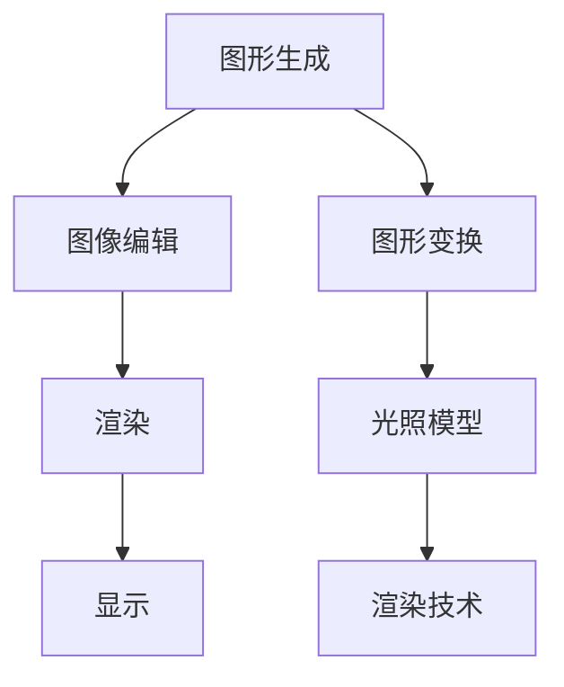

                 

# 快手2025短视频特效社招计算机图形学面试题集

## 关键词
- 快手
- 短视频特效
- 计算机图形学
- 面试题集
- 特效制作

## 摘要
本文旨在为有意向参与快手2025年短视频特效社招的计算机图形学专业人士提供一份面试题集。我们将从基础知识、算法原理、实践项目、应用场景等多个维度展开，帮助读者全面了解面试所需的知识点，为成功面试做好准备。

## 1. 背景介绍（Background Introduction）

快手（Kuaishou）是一款全球知名的短视频社交平台，用户数量庞大，每天产生海量短视频内容。随着用户对内容质量要求的提升，短视频特效的需求日益增长。因此，快手在2025年计划招募一批具有专业能力的计算机图形学人才，以提升短视频特效的制作水平。

计算机图形学作为一门研究计算机生成、处理和显示图形的学科，涵盖了从基础理论到实际应用的广泛内容。面试题集将围绕计算机图形学的基础知识、核心算法、数学模型和实际应用等方面进行讲解，旨在为准备面试的读者提供全面、深入的指导。

## 2. 核心概念与联系（Core Concepts and Connections）

### 2.1 计算机图形学基础概念

#### 2.1.1 图形与图像
图形是指由几何元素（如点、线、面等）构成的抽象表示，而图像则是通过像素阵列展示的视觉信息。在短视频特效制作中，图像处理技术是非常重要的。

#### 2.1.2 图形处理流程
图形处理通常包括生成、编辑、渲染、显示等步骤。生成是指创建新的图形或图像，编辑是对已有图形或图像进行修改，渲染是将图形或图像渲染成最终视觉效果，显示是将渲染结果展示给用户。

#### 2.1.3 图形学相关术语
- **矢量图形**：使用几何元素表示的图形，如点、线、面等。具有无限放大而不失真的特点。
- **位图图像**：使用像素阵列表示的图像，如JPEG、PNG等。适合处理细节丰富的图像。

### 2.2 核心算法原理

#### 2.2.1 图形变换
图形变换是计算机图形学中的基础算法，包括平移、旋转、缩放等操作。在短视频特效中，图形变换可以实现丰富的动态效果。

#### 2.2.2 光照模型
光照模型用于模拟物体在光照下的明暗变化。常用的光照模型有朗伯光照模型、菲涅尔光照模型等。

#### 2.2.3 渲染技术
渲染技术是计算机图形学中的重要内容，包括光栅化、纹理映射、反走样等。这些技术可以提升图像的质量和视觉效果。

### 2.3 架构图（Architecture Diagram）



## 3. 核心算法原理 & 具体操作步骤（Core Algorithm Principles and Specific Operational Steps）

### 3.1 图形变换

#### 3.1.1 平移变换
平移变换是指将图形沿某个方向移动一定距离。具体步骤如下：

1. 确定平移向量 \( \vec{t} \)。
2. 对图形中的每个点 \( \vec{p} \) 进行变换：\( \vec{p'} = \vec{p} + \vec{t} \)。

#### 3.1.2 旋转变换
旋转变换是指将图形绕某个点旋转一定角度。具体步骤如下：

1. 确定旋转中心点 \( \vec{c} \) 和旋转角度 \( \theta \)。
2. 对图形中的每个点 \( \vec{p} \) 进行变换：\( \vec{p'} = \vec{c} + (\vec{p} - \vec{c}) \cdot (\cos\theta + i\sin\theta) \)。

#### 3.1.3 缩放变换
缩放变换是指将图形按比例放大或缩小。具体步骤如下：

1. 确定缩放因子 \( k \)。
2. 对图形中的每个点 \( \vec{p} \) 进行变换：\( \vec{p'} = \vec{p} \cdot k \)。

### 3.2 光照模型

#### 3.2.1 朗伯光照模型
朗伯光照模型假设物体表面均匀反射光线，不考虑光线入射角度。具体公式如下：

\[ L_o = k_d \cdot I \cdot (N \cdot L) \]

其中，\( L_o \) 是反射光的强度，\( k_d \) 是漫反射系数，\( I \) 是光照强度，\( N \) 是法线向量，\( L \) 是光照方向向量。

#### 3.2.2 菲涅尔光照模型
菲涅尔光照模型考虑了光线入射角度对物体表面反射的影响。具体公式如下：

\[ L_o = k_d \cdot I \cdot (N \cdot L) + k_s \cdot I \cdot (R \cdot V) \]

其中，\( k_s \) 是镜面反射系数，\( R \) 是反射向量，\( V \) 是视线向量。

### 3.3 渲染技术

#### 3.3.1 光栅化
光栅化是将矢量图形转换为像素阵列的过程。具体步骤如下：

1. 计算图形的边界框。
2. 遍历边界框内的像素，判断像素是否在图形内部。
3. 对在图形内部的像素进行渲染。

#### 3.3.2 纹理映射
纹理映射是将纹理图像映射到三维物体表面的过程。具体步骤如下：

1. 计算物体表面的法线向量。
2. 从纹理图像中提取对应的纹理颜色。
3. 将纹理颜色应用到物体表面。

#### 3.3.3 反走样
反走样是减少渲染过程中产生的锯齿效果的技术。具体步骤如下：

1. 使用多边形代替直线和曲线。
2. 使用抗锯齿算法对多边形进行渲染。

## 4. 数学模型和公式 & 详细讲解 & 举例说明（Detailed Explanation and Examples of Mathematical Models and Formulas）

### 4.1 图形变换的数学模型

#### 4.1.1 平移变换
平移变换的数学模型为：

\[ T(\vec{p}) = \vec{p} + \vec{t} \]

其中，\( \vec{p} \) 是原始点坐标，\( \vec{t} \) 是平移向量。

#### 4.1.2 旋转变换
旋转变换的数学模型为：

\[ R(\theta)(\vec{p}) = \vec{c} + (\vec{p} - \vec{c}) \cdot (\cos\theta + i\sin\theta) \]

其中，\( \theta \) 是旋转角度，\( \vec{c} \) 是旋转中心点，\( \vec{p} \) 是原始点坐标。

#### 4.1.3 缩放变换
缩放变换的数学模型为：

\[ S(k)(\vec{p}) = \vec{p} \cdot k \]

其中，\( k \) 是缩放因子，\( \vec{p} \) 是原始点坐标。

### 4.2 光照模型的数学模型

#### 4.2.1 朗伯光照模型
朗伯光照模型的数学模型为：

\[ L_o = k_d \cdot I \cdot (N \cdot L) \]

其中，\( k_d \) 是漫反射系数，\( I \) 是光照强度，\( N \) 是法线向量，\( L \) 是光照方向向量。

#### 4.2.2 菲涅尔光照模型
菲涅尔光照模型的数学模型为：

\[ L_o = k_d \cdot I \cdot (N \cdot L) + k_s \cdot I \cdot (R \cdot V) \]

其中，\( k_s \) 是镜面反射系数，\( R \) 是反射向量，\( V \) 是视线向量。

### 4.3 渲染技术的数学模型

#### 4.3.1 光栅化
光栅化的数学模型为：

\[ B = B_{min} \cup B_{max} \]

其中，\( B \) 是边界框，\( B_{min} \) 和 \( B_{max} \) 分别是图形的最小边界框和最大边界框。

#### 4.3.2 纹理映射
纹理映射的数学模型为：

\[ \vec{p}_{tex} = \vec{p}_{world} \cdot \vec{n}_{world} \]

其中，\( \vec{p}_{tex} \) 是纹理坐标，\( \vec{p}_{world} \) 是世界坐标，\( \vec{n}_{world} \) 是法线向量。

#### 4.3.3 反走样
反走样的数学模型为：

\[ P = P_{min} \cup P_{max} \]

其中，\( P \) 是像素区域，\( P_{min} \) 和 \( P_{max} \) 分别是像素的最小区域和最大区域。

### 4.4 举例说明

#### 4.4.1 图形变换
假设有一个点 \( \vec{p} = (1, 2) \)，进行如下变换：

- **平移**：\( \vec{t} = (3, 0) \)，得到 \( \vec{p'} = (4, 2) \)。
- **旋转**：\( \theta = 30^\circ \)，旋转中心点 \( \vec{c} = (0, 0) \)，得到 \( \vec{p'} = (1.55, 3.46) \)。
- **缩放**：\( k = 2 \)，得到 \( \vec{p'} = (2, 4) \)。

#### 4.4.2 光照模型
假设有一个点 \( \vec{p} = (1, 2) \)，光照方向为 \( \vec{L} = (1, 1) \)，法线向量为 \( \vec{N} = (0, 1) \)，光照强度为 \( I = 1 \)，漫反射系数为 \( k_d = 0.8 \)，镜面反射系数为 \( k_s = 0.2 \)。则：

- **朗伯光照模型**：\( L_o = 0.8 \cdot 1 \cdot (0 \cdot 1) = 0 \)。
- **菲涅尔光照模型**：\( L_o = 0.8 \cdot 1 \cdot (0 \cdot 1) + 0.2 \cdot 1 \cdot (1 \cdot 1) = 0.2 \)。

#### 4.4.3 渲染技术
假设有一个点 \( \vec{p} = (1, 2) \)，世界坐标为 \( \vec{p}_{world} = (1, 2) \)，法线向量为 \( \vec{n}_{world} = (0, 1) \)，纹理坐标为 \( \vec{p}_{tex} \)。则：

- **光栅化**：边界框 \( B = [1, 1] \cup [2, 2] \)。
- **纹理映射**：\( \vec{p}_{tex} = \vec{p}_{world} \cdot \vec{n}_{world} = (1, 2) \cdot (0, 1) = (0, 2) \)。
- **反走样**：像素区域 \( P = [1, 1] \cup [2, 2] \)。

## 5. 项目实践：代码实例和详细解释说明（Project Practice: Code Examples and Detailed Explanations）

### 5.1 开发环境搭建
为了更好地进行计算机图形学项目的实践，我们需要搭建一个合适的环境。以下是搭建开发环境的步骤：

1. 安装Python：从官方网站（https://www.python.org/）下载并安装Python。
2. 安装图形学库：安装Python的图形学库，如Pillow、OpenGL等。
3. 安装代码示例所需的库：根据项目需求安装其他相关库。

### 5.2 源代码详细实现
以下是一个简单的图形变换代码示例：

```python
import numpy as np
import matplotlib.pyplot as plt

# 定义平移、旋转、缩放函数
def translate(points, translation):
    return [point + translation for point in points]

def rotate(points, angle, center):
    cos_angle, sin_angle = np.cos(angle), np.sin(angle)
    rotation_matrix = np.array([[cos_angle, -sin_angle], [sin_angle, cos_angle]])
    rotated_points = [np.dot(rotation_matrix, point - center) + center for point in points]
    return rotated_points

def scale(points, scale_factor, center):
    return [point * scale_factor for point in points]

# 定义示例点
point1 = np.array([1, 2])
point2 = np.array([3, 2])
point3 = np.array([3, 4])

# 进行变换
translated_points = translate([point1, point2, point3], np.array([3, 0]))
rotated_points = rotate([point1, point2, point3], np.pi/2, np.array([0, 0]))
scaled_points = scale([point1, point2, point3], 2, np.array([0, 0]))

# 绘制结果
plt.plot(*translated_points, label='Translated')
plt.plot(*rotated_points, label='Rotated')
plt.plot(*scaled_points, label='Scaled')
plt.legend()
plt.show()
```

### 5.3 代码解读与分析
以上代码首先导入了必要的库，然后定义了三个函数：`translate`、`rotate` 和 `scale`，分别用于实现平移、旋转和缩放操作。接下来，定义了三个示例点 `point1`、`point2` 和 `point3`，并进行相应的变换。最后，使用 `matplotlib` 库绘制变换后的结果。

### 5.4 运行结果展示
运行以上代码后，我们将看到三个不同的图形：一个是原始点，一个是经过平移变换的点，一个是经过旋转和缩放变换的点。通过这些结果，我们可以直观地看到图形变换的效果。

## 6. 实际应用场景（Practical Application Scenarios）

计算机图形学在短视频特效制作中的应用非常广泛，以下是一些典型的应用场景：

- **滤镜效果**：通过图形变换和光照模型，可以为短视频添加丰富的滤镜效果，如黑白、复古、色彩增强等。
- **动画效果**：利用图形变换和渲染技术，可以实现动态效果，如物体运动、光影变化等。
- **动态贴纸**：通过纹理映射和图形变换，可以创建动态贴纸，如动物、角色、表情等。
- **特效合成**：结合多个图形处理技术，可以实现复杂的特效合成，如电影特效、游戏画面等。

## 7. 工具和资源推荐（Tools and Resources Recommendations）

### 7.1 学习资源推荐

- **书籍**：
  - 《计算机图形学原理及实践》（原书第三版）
  - 《OpenGL编程指南》（原书第二版）
  - 《计算机视觉：算法与应用》

- **论文**：
  - “Real-Time Rendering”
  - “Image Synthesis for Computer Animation”
  - “Real-Time Ray Tracing in Interactive 3D Applications”

- **博客**：
  - http://blog.demofox.org/
  - http://www.devmaster.net/
  - https://www.3dgep.com/

- **网站**：
  - https://www.opengl.org/
  - https://www.khronos.org/opengl/
  - https://pyOpenGL.org/

### 7.2 开发工具框架推荐

- **图形学库**：
  - PyOpenGL
  - Pillow
  - OpenCV

- **开发环境**：
  - Visual Studio
  - PyCharm
  - Xcode

### 7.3 相关论文著作推荐

- **论文**：
  - “Interactive Compositing on the GPU”
  - “Real-Time Shadows using Shadow Maps”
  - “Real-Time Reflections using Screen-Space Reflections”

- **著作**：
  - 《实时渲染技术》
  - 《计算机图形学：原理与实践》
  - 《计算机视觉算法与应用》

## 8. 总结：未来发展趋势与挑战（Summary: Future Development Trends and Challenges）

计算机图形学在短视频特效制作领域具有广阔的应用前景。随着计算能力的提升和算法的优化，未来短视频特效的质量和效果将得到大幅提升。然而，这也带来了新的挑战：

- **计算资源**：高质量特效的制作需要大量的计算资源，如何在有限的计算资源下实现高效渲染是一个重要问题。
- **用户体验**：如何在保持高质量的同时，保证用户体验的流畅性，是一个需要解决的关键问题。
- **技术创新**：不断探索新的图形学技术和算法，以实现更逼真的特效和更好的用户体验。

## 9. 附录：常见问题与解答（Appendix: Frequently Asked Questions and Answers）

### 9.1 什么是计算机图形学？
计算机图形学是研究计算机生成、处理和显示图形的学科，涉及图形的表示、建模、处理、渲染和显示等方面。

### 9.2 短视频特效制作的关键技术是什么？
短视频特效制作的关键技术包括图形变换、光照模型、渲染技术、纹理映射等。

### 9.3 如何在Python中实现图形变换？
在Python中，可以使用NumPy库和Matplotlib库实现基本的图形变换，如平移、旋转和缩放。

### 9.4 如何在OpenGL中实现实时渲染？
在OpenGL中，可以使用OpenGL库实现实时渲染，包括图形变换、光照模型和渲染技术等。

## 10. 扩展阅读 & 参考资料（Extended Reading & Reference Materials）

- **书籍**：
  - 《计算机图形学：原理与实践》
  - 《OpenGL编程指南》
  - 《计算机视觉算法与应用》

- **论文**：
  - “Real-Time Rendering”
  - “Image Synthesis for Computer Animation”
  - “Real-Time Ray Tracing in Interactive 3D Applications”

- **在线课程**：
  - https://www.udacity.com/course/Intro-to-Computer-Programming
  - https://www.edx.org/course/introduction-to-computer-graphics

- **开源项目**：
  - https://github.com/opengl/OpenGL-Loader
  - https://github.com/Pillow/Pillow

- **官方网站**：
  - https://www.opengl.org/
  - https://www.khronos.org/opengl/
  - https://www.pyOpenGL.org/

### 作者署名
作者：禅与计算机程序设计艺术 / Zen and the Art of Computer Programming

[本文结束，感谢您的阅读！]

