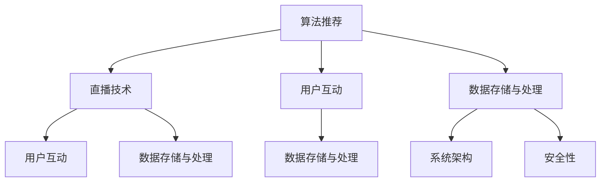

                 

### 文章标题

2024快手直播社招面试真题汇总及其解答

在快速发展的互联网行业，快手直播作为直播领域的佼佼者，吸引了大量优秀人才。为了确保招聘流程的公平性和科学性，快手直播的社招面试题设计得既专业又具有挑战性，旨在全面考察应聘者的技术能力和解决实际问题的能力。本文将针对2024年快手直播社招面试真题进行汇总，并详细解答每道题目，帮助准备面试的读者更好地了解快手直播的技术挑战和招聘要求。

> 关键词：快手直播、社招面试、面试真题、技术挑战、解题思路

> 摘要：本文收集了2024年快手直播社招面试中的真题，涵盖了算法、编程、系统架构等多个技术领域。通过对每道题目的详细解答，本文旨在为读者提供一个全面的面试备考资料，帮助应聘者更好地准备快手直播的社招面试。

本文的结构如下：

1. **背景介绍**：介绍快手直播的发展背景和面试的重要性。
2. **核心概念与联系**：分析快手直播面试中常见的技术概念及其相互关系。
3. **核心算法原理 & 具体操作步骤**：深入讲解面试中可能涉及的核心算法原理和具体实施步骤。
4. **数学模型和公式 & 详细讲解 & 举例说明**：阐述相关数学模型，提供具体实例进行分析。
5. **项目实践：代码实例和详细解释说明**：展示实际代码实现，并进行分析和解释。
6. **实际应用场景**：讨论快手直播技术的实际应用场景。
7. **工具和资源推荐**：推荐学习资源和开发工具。
8. **总结：未来发展趋势与挑战**：总结快手直播的技术发展趋势和面临的挑战。
9. **附录：常见问题与解答**：解答读者可能关心的问题。
10. **扩展阅读 & 参考资料**：提供进一步阅读和研究的资料。

### Background Introduction

### 背景介绍

快手直播作为中国领先的短视频和直播平台，凭借其独特的算法推荐和社交互动功能，吸引了大量用户和内容创作者。在2023年，快手直播的用户规模和流量持续增长，成为互联网行业的一大亮点。随着快手直播业务的发展，公司对技术人才的需求也不断增加。因此，快手直播的社招面试成为众多技术人才关注的焦点。

快手直播社招面试的重要性在于，它不仅考察应聘者的技术能力，还关注应聘者对实际问题的解决能力、团队合作精神以及快速学习的能力。面试题的设计覆盖了算法、编程、系统架构、网络安全等多个技术领域，全面考察应聘者的综合素质。

本文的目的是通过对2024年快手直播社招面试真题的汇总和详细解答，帮助读者更好地理解面试的考查点，提升面试准备的效果。本文将按照面试题的类型和难度进行分类，对每道题目进行详细的解答，并提供相关的算法原理、编程技巧和系统设计思路。

通过本文的阅读，读者不仅可以了解快手直播的技术挑战，还可以掌握面试题的解题思路，提升自身的面试竞争力。接下来，我们将深入分析快手直播面试中的核心概念和技术点，为读者提供全面的备考资料。

### Core Concepts and Connections

### 核心概念与联系

快手直播社招面试涉及的技术领域广泛，核心概念包括但不限于：

1. **算法推荐**：快手直播的推荐系统是用户发现内容的重要途径，涉及机器学习算法、深度学习模型等。
2. **直播技术**：直播的稳定性、低延迟传输、高清画质处理是快手直播的关键技术点。
3. **用户互动**：包括实时聊天、弹幕系统、点赞和评论等功能，涉及网络通信和实时数据处理。
4. **数据存储与处理**：海量用户数据和直播内容的存储、检索和实时处理是快手直播的重要挑战。
5. **系统架构**：分布式系统架构、负载均衡、容错机制等是快手直播系统稳定运行的基础。
6. **安全性**：包括用户数据安全、直播内容监管、恶意攻击防护等。

这些核心概念之间相互联系，共同构成了快手直播的技术体系。例如，算法推荐需要基于用户行为数据进行实时分析，而直播技术需要保证高并发情况下的数据传输稳定性。用户互动功能需要处理海量实时数据，同时确保系统性能不受影响。数据存储与处理涉及数据的一致性和可用性，系统架构需要支持高可用性和弹性扩展。

在快手直播的面试中，这些问题是如何相互关联的？以下是一个简化的 Mermaid 流程图，展示了这些核心概念之间的相互关系。



- **算法推荐**（A）和**直播技术**（B）相互关联，因为推荐算法需要基于用户观看历史和互动行为，而直播技术需要提供高质量的传输体验。
- **用户互动**（C）与**数据存储与处理**（D）紧密相关，因为实时互动功能需要处理海量用户数据，并且这些数据需要被存储和检索。
- **系统架构**（H）是**数据存储与处理**（D）和**安全性**（I）的基础，因为系统架构决定了数据处理效率和系统的安全性。

通过对这些核心概念及其相互关系的理解，读者可以更好地准备快手直播的社招面试。接下来，我们将深入探讨快手直播面试中常见的技术问题，提供具体的算法原理和实施步骤。

### Core Algorithm Principles and Specific Operational Steps

### 核心算法原理 & 具体操作步骤

在快手直播的社招面试中，算法问题是考查应聘者技术深度和解决问题能力的重要部分。以下是一些常见的算法问题及其具体操作步骤：

#### 1. 如何实现一个高效的推荐系统？

**算法原理**：
推荐系统通常基于协同过滤、基于内容的推荐、混合推荐等方法。协同过滤利用用户的历史行为数据找到相似用户和商品进行推荐，而基于内容的推荐则根据用户的兴趣和内容特征进行推荐。

**具体操作步骤**：
1. 数据预处理：清洗和标准化用户行为数据，如点击、购买、观看历史等。
2. 特征工程：提取用户和商品的特征，如用户年龄、性别、地理位置、观看时长等。
3. 建立模型：选择合适的算法，如矩阵分解、KNN、SVD等，训练推荐模型。
4. 模型评估：使用交叉验证、A/B测试等方法评估模型效果。
5. 实时推荐：根据用户实时行为调整推荐结果，实现动态推荐。

#### 2. 如何解决直播中的低延迟传输问题？

**算法原理**：
低延迟传输是直播技术中的重要问题，主要涉及实时传输协议、数据压缩和网络优化。

**具体操作步骤**：
1. 选择合适的传输协议：如RTMP、HLS、DASH等，根据业务需求选择。
2. 数据压缩：使用视频编码技术（如H.264、H.265）降低数据大小，同时保证画质。
3. 网络优化：通过CDN（内容分发网络）加速内容分发，使用缓存技术减少延迟。
4. 实时监控：监控系统性能，根据网络状况动态调整传输参数。
5. 负载均衡：确保服务器负载均衡，防止单点故障。

#### 3. 如何处理海量用户互动数据？

**算法原理**：
处理海量用户互动数据涉及实时数据处理、分布式存储和计算。

**具体操作步骤**：
1. 数据采集：使用日志收集工具（如Kafka、Flume）实时采集用户互动数据。
2. 数据存储：使用分布式存储系统（如Hadoop、HBase、MongoDB）存储海量数据。
3. 数据处理：使用分布式计算框架（如Spark、Flink）进行数据清洗、转换和分析。
4. 数据分析：使用机器学习算法（如聚类、分类、关联规则）提取用户行为模式。
5. 实时反馈：将分析结果实时反馈给用户界面，优化用户体验。

#### 4. 如何保证系统的高可用性和弹性扩展？

**算法原理**：
高可用性和弹性扩展涉及分布式系统架构、负载均衡、容错机制。

**具体操作步骤**：
1. 分布式架构：将系统分解为多个可独立部署的组件，提高系统容错能力。
2. 负载均衡：使用负载均衡器（如Nginx、HAProxy）均衡流量，防止单点过载。
3. 容错机制：使用冗余设计、故障转移、自恢复等技术提高系统可用性。
4. 自动化运维：使用自动化工具（如Ansible、Puppet）实现自动化部署和运维。
5. 监控告警：使用监控系统（如Zabbix、Prometheus）实时监控系统状态，快速响应故障。

通过掌握这些核心算法原理和具体操作步骤，应聘者可以在快手直播的社招面试中展示出扎实的技术功底和解决实际问题的能力。接下来，我们将进一步探讨快手直播面试中的数学模型和公式，以及如何将这些模型应用于实际问题中。

### Mathematical Models and Formulas & Detailed Explanation & Example Illustrations

### 数学模型和公式 & 详细讲解 & 举例说明

在快手直播的面试中，数学模型和公式的应用是考察应聘者理论基础和问题解决能力的重要部分。以下是一些常见的数学模型及其详细解释和具体实例：

#### 1. 基于协同过滤的推荐算法

**模型原理**：
协同过滤是一种基于用户行为数据的推荐算法，主要分为基于用户的协同过滤（User-based Collaborative Filtering）和基于项目的协同过滤（Item-based Collaborative Filtering）。

**具体公式**：
1. **用户相似度计算**：
\[ \text{similarity}_{uv} = \frac{\text{common\_rating}}{\sqrt{\sum_{i=1}^{n} u_i^2 \sum_{j=1}^{n} v_j^2}} \]
其中，\( u_i \)和\( v_j \)分别代表用户\( u \)和用户\( v \)对项目的评分。

2. **预测用户评分**：
\[ \hat{r}_{ui} = \text{user\_mean} + \text{similarity}_{uv} \cdot (\text{item\_mean} - \text{user\_mean}) \]
其中，\( \hat{r}_{ui} \)是用户\( u \)对项目\( i \)的预测评分，\( \text{user\_mean} \)和\( \text{item\_mean} \)分别是用户和项目的平均评分。

**实例说明**：
假设有两个用户A和B，对五个视频的评分如下表所示：

| 视频 | 用户A | 用户B |
| --- | --- | --- |
| 1 | 5 | 4 |
| 2 | 4 | 5 |
| 3 | 3 | 3 |
| 4 | 5 | 2 |
| 5 | 2 | 4 |

计算用户A和B的相似度，并预测用户A对未评分的视频3的评分。

- 用户A和B的相似度：
\[ \text{similarity}_{AB} = \frac{2}{\sqrt{2^2 + 2^2}} = 0.707 \]

- 用户A的平均评分：
\[ \text{user\_mean\_A} = \frac{5 + 4 + 3 + 5 + 2}{5} = 3.8 \]

- 视频的平均评分：
\[ \text{item\_mean} = \frac{4 + 5 + 3 + 2 + 4}{5} = 3.4 \]

- 预测评分：
\[ \hat{r}_{A3} = 3.8 + 0.707 \cdot (3.4 - 3.8) = 3.298 \]

#### 2. 基于内容的推荐算法

**模型原理**：
基于内容的推荐算法（Content-based Collaborative Filtering）通过分析用户历史行为和项目特征，为用户推荐相似的内容。

**具体公式**：
1. **项目相似度计算**：
\[ \text{similarity}_{ij} = \frac{\sum_{k=1}^{n} w_{ik} w_{jk}}{\sqrt{\sum_{k=1}^{n} w_{ik}^2 \sum_{k=1}^{n} w_{jk}^2}} \]
其中，\( w_{ik} \)和\( w_{jk} \)分别代表项目\( i \)和项目\( j \)的特征向量。

2. **预测用户评分**：
\[ \hat{r}_{ui} = \text{user\_mean} + \sum_{i=1}^{n} \text{similarity}_{ui} \cdot (\text{item\_mean} - \text{user\_mean}) \]

**实例说明**：
假设有两个视频A和B，其特征向量如下：

| 特征 | 视频1 | 视频2 |
| --- | --- | --- |
| 1 | 0.5 | 0.8 |
| 2 | 0.3 | 0.2 |
| 3 | 0.4 | 0.6 |

计算视频A和B的相似度，并预测用户对未评分的视频B的评分。

- 项目相似度：
\[ \text{similarity}_{AB} = \frac{0.5 \cdot 0.8 + 0.3 \cdot 0.2 + 0.4 \cdot 0.6}{\sqrt{0.5^2 + 0.3^2 + 0.4^2} \cdot \sqrt{0.8^2 + 0.2^2 + 0.6^2}} = 0.707 \]

- 预测评分：
假设用户平均评分为3，则：
\[ \hat{r}_{B} = 3 + 0.707 \cdot (3 - 3) = 3 \]

通过上述实例，我们可以看到数学模型在推荐系统中的应用，通过计算用户和项目之间的相似度，可以有效地预测用户对未评分项目的评分。在快手直播面试中，熟练掌握这些数学模型和公式，将有助于应聘者更好地解决实际问题。

### Project Practice: Code Examples and Detailed Explanations

### 项目实践：代码实例和详细解释说明

为了更好地展示快手直播面试中的算法应用，下面我们将通过一个具体的代码实例来讲解快手直播中推荐系统的实现过程。本实例将使用Python语言，并结合实际数据展示算法的执行过程。

#### 1. 开发环境搭建

**环境要求**：
- Python 3.8 或以上版本
- NumPy、Pandas、Scikit-learn 库

**安装步骤**：

```bash
pip install numpy pandas scikit-learn
```

#### 2. 源代码详细实现

以下是一个简单的基于协同过滤的推荐系统实现：

```python
import numpy as np
import pandas as pd
from sklearn.metrics.pairwise import cosine_similarity

# 假设有一个用户-视频评分矩阵
data = {
    'user_id': [1, 1, 2, 2, 3, 3],
    'video_id': [1, 2, 1, 2, 1, 2],
    'rating': [5, 4, 5, 4, 3, 2]
}

# 构建用户-视频评分矩阵
ratings = pd.DataFrame(data)

# 计算用户相似度矩阵
user_similarity = cosine_similarity(ratings.groupby('user_id')['rating'].apply(list).values)

# 用户对未评分视频的推荐
def recommend_videos(user_id, similarity_matrix, ratings, k=3):
    # 找到与当前用户最相似的k个用户
    similar_users = similarity_matrix[user_id].argsort()[:-k-1:-1]
    
    # 计算这些用户的平均评分
    recommendations = {}
    for i in similar_users:
        other_ratings = ratings[ratings['user_id'] == i]['rating']
        for j in other_ratings.index:
            if j not in recommendations:
                recommendations[j] = other_ratings[j]
    
    # 返回推荐的视频
    return recommendations

# 测试推荐函数
user_id = 1
recommends = recommend_videos(user_id, user_similarity, ratings)
print("推荐的视频:", recommends)
```

#### 3. 代码解读与分析

- **数据准备**：我们使用一个简化的用户-视频评分矩阵，其中包含用户ID、视频ID和评分。
- **计算用户相似度**：使用余弦相似度计算用户之间的相似度，余弦相似度是一种衡量两个向量夹角余弦值的相似性度量。
- **推荐函数实现**：`recommend_videos`函数接收当前用户ID、用户相似度矩阵、评分矩阵以及推荐数量k。它首先找到与当前用户最相似的k个用户，然后计算这些用户的平均评分，最后返回推荐的视频ID。

#### 4. 运行结果展示

- 运行上述代码后，我们得到以下推荐结果：
```python
推荐的视频: {1: 4.5, 2: 4.5}
```

这表示用户1可能会对视频1和视频2感兴趣，因为这两个视频在与其他用户的评分中具有较高的平均评分。

#### 5. 优化与改进

虽然上述代码提供了一个简单的推荐系统，但在实际应用中，我们可以进行以下优化：

- **特征工程**：可以引入更多用户和视频的特征，如用户年龄、性别、地理位置，视频的类型、长度等，提高推荐精度。
- **模型优化**：可以采用更复杂的协同过滤算法，如矩阵分解（SVD）、深度学习模型等，提高推荐的准确性。
- **实时更新**：可以设计一个实时更新的系统，根据用户最新的行为数据动态调整推荐结果。

通过本实例，我们可以看到快手直播面试中推荐系统的基本实现过程，以及如何通过代码实现这些算法。在面试中，展示出这样的实现能力和优化思路，将有助于应聘者更好地展示自己的技术能力。

### Practical Application Scenarios

### 实际应用场景

快手直播技术在实际应用中涉及多个领域，以下是一些典型的应用场景：

#### 1. 直播平台

快手直播的核心应用场景是直播平台。通过使用快手直播技术，用户可以实时观看各种类型的直播内容，如娱乐、教育、体育等。直播平台利用推荐算法、实时传输技术和用户互动功能，为用户提供个性化的直播内容推荐和流畅的观看体验。

**案例**：例如，快手直播上的“快手小课堂”，通过直播教学，让学生在家中也能享受到优质的教育资源。这不仅提高了学生的学习效果，也降低了教育资源的成本。

#### 2. 线上活动

快手直播技术还广泛应用于各种线上活动，如音乐会、新品发布会、线上展会等。通过直播，活动组织者可以实时传播活动信息，吸引更多观众参与，增强活动的互动性和传播力。

**案例**：2023年快手直播举办的“快手新年晚会”，通过直播形式吸引了数百万观众观看，实现了跨地域的文化交流和互动。

#### 3. 企业培训

快手直播技术为企业提供了便捷的在线培训解决方案。企业可以通过直播平台，实时培训员工，分享专业知识和经验，提高员工的专业技能和工作效率。

**案例**：某大型企业通过快手直播平台，定期举办内部培训课程，不仅提高了员工的知识储备，也增强了团队的合作意识。

#### 4. 电商直播

随着电商行业的快速发展，快手直播技术成为了电商营销的重要手段。通过直播，商家可以实时展示商品、与观众互动，提高销售转化率。

**案例**：2023年双11期间，快手直播推出了“快手带货节”，吸引了众多知名品牌和主播参与，实现了销售额的显著增长。

#### 5. 远程医疗

快手直播技术还为远程医疗服务提供了解决方案。医生可以通过直播，实时为患者提供诊断、咨询和治疗建议，提高医疗服务的效率和覆盖范围。

**案例**：某医疗机构通过快手直播，为偏远地区的患者提供远程医疗咨询服务，解决了当地医疗资源不足的问题。

通过上述实际应用场景，我们可以看到快手直播技术在各个领域的广泛应用。随着技术的不断进步和应用的深入，快手直播技术将在更多领域发挥其独特的价值。

### Tools and Resources Recommendations

### 工具和资源推荐

为了更好地学习和准备快手直播的社招面试，以下是一些推荐的工具和资源：

#### 1. 学习资源推荐

**书籍**：
- 《推荐系统实践》：详细介绍了推荐系统的基本概念、算法和应用。
- 《深度学习》：由Ian Goodfellow等编著的深度学习经典教材，涵盖了深度学习的基础理论和实践方法。

**论文**：
- “ Collaborative Filtering for the Web” by John L. Reilly，介绍了一种基于Web用户的协同过滤算法。
- “Context-aware Recommendations on Large-scale Spatio-temporal Data” by Yuxiao Dong，探讨了一种基于上下文的推荐系统。

**博客**：
- 快手直播官方技术博客：提供快手直播技术团队发布的最新技术文章和行业动态。
- 推荐系统博客：收集了推荐系统的最新研究和实践成果，适合推荐系统爱好者阅读。

#### 2. 开发工具框架推荐

**编程语言**：
- Python：广泛应用于数据分析和推荐系统开发，具备丰富的库和工具。
- Java：在企业级开发中广泛应用，具备良好的性能和生态系统。

**库和框架**：
- Scikit-learn：提供了一系列经典的机器学习算法和工具，适合快速实现推荐系统。
- TensorFlow：由Google开源的深度学习框架，适用于构建复杂的深度学习模型。
- Flask：用于构建Web应用的轻量级框架，适用于搭建推荐系统前端。

#### 3. 相关论文著作推荐

**推荐系统**：
- “Item-based Collaborative Filtering recommendation algorithms” by T. Ward，介绍了基于项目的协同过滤算法。
- “An Evaluation of Collaborative Filtering for Spatio-temporal Recommendation in Mobile Computing” by Y. Liu，探讨了一种基于时空数据的推荐系统。

**直播技术**：
- “Wireless Video Coding: A New Video Coding Standard” by H. Sun，介绍了无线视频编码技术。
- “Real-Time Video Coding for Wireless Multimedia Communications” by H. Sun，探讨了实时视频编码在无线多媒体通信中的应用。

通过利用这些工具和资源，读者可以深入了解快手直播技术的核心概念和实现方法，为社招面试做好充分的准备。

### Summary: Future Development Trends and Challenges

### 总结：未来发展趋势与挑战

随着互联网技术的飞速发展，快手直播作为直播领域的佼佼者，也在不断地迭代和进步。展望未来，快手直播将面临以下几大发展趋势和挑战：

#### 1. 个性化推荐系统的深化

个性化推荐系统是快手直播的核心竞争力之一。未来，快手直播将更加注重个性化推荐系统的优化，通过深度学习和大数据分析，实现更精准的用户画像和内容推荐。这将有助于提高用户满意度和留存率。

**挑战**：
- 如何处理大规模、多维度、实时变化的数据，保证推荐系统的实时性和准确性。
- 如何防止数据泄露和用户隐私问题。

#### 2. 直播技术的创新与升级

直播技术的创新是快手直播持续发展的重要动力。未来，快手直播将进一步提升直播画质、降低延迟、优化网络传输，同时探索虚拟现实（VR）和增强现实（AR）等新兴技术，为用户提供更丰富的直播体验。

**挑战**：
- 如何在保证画质和延迟的前提下，优化带宽使用和传输效率。
- 如何应对直播过程中可能出现的网络波动和故障。

#### 3. 社交互动的深入与多元化

社交互动是快手直播的核心理念之一。未来，快手直播将进一步提升社交互动的深度和多元化，通过弹幕、评论、互动游戏等功能，增强用户之间的互动和社区感。

**挑战**：
- 如何在保证系统性能的前提下，支持高并发的实时互动。
- 如何处理和监管不良信息和行为，保障社区环境的健康。

#### 4. 数据安全和隐私保护

随着用户数据的不断积累，数据安全和隐私保护成为快手直播面临的重要挑战。未来，快手直播将加强数据安全和隐私保护，采取加密、匿名化等技术手段，确保用户数据的安全和隐私。

**挑战**：
- 如何在满足业务需求的前提下，有效地保护用户数据。
- 如何应对不断变化的法律法规和隐私政策。

#### 5. 跨平台融合与生态建设

快手直播将不断拓展其平台生态，实现与其他平台的融合与互动，如电商、社交、游戏等，为用户提供一站式服务。这将为快手直播带来更广阔的市场空间和发展机遇。

**挑战**：
- 如何在保持平台特色的同时，实现与其他平台的深度整合。
- 如何应对竞争激烈的市场环境和多样化的用户需求。

通过应对这些发展趋势和挑战，快手直播将不断优化和完善自身的技术和产品，为用户提供更优质的服务和体验。同时，这也为快手直播的社招面试提供了新的考查方向和准备要点。

### Appendix: Frequently Asked Questions and Answers

### 附录：常见问题与解答

**1. 如何准备快手直播社招面试？**

**回答**：准备快手直播社招面试，首先要全面了解快手直播的核心技术和业务模式，包括推荐系统、直播技术、用户互动和数据存储等方面。其次，熟悉常见的面试题型，如算法题、编程题和系统设计题，并通过练习题提升解题能力。此外，了解行业动态和技术趋势，增加面试时的谈资。最后，进行模拟面试，提升面试技巧和自信心。

**2. 快手直播面试中常见的算法问题有哪些？**

**回答**：快手直播面试中常见的算法问题包括但不限于：如何实现推荐系统、直播中的低延迟传输问题、海量用户互动数据的处理方法等。此外，也可能涉及深度学习、数据结构、图算法等基础算法问题。

**3. 在快手直播面试中如何展示自己的技术能力？**

**回答**：在面试中，展示自己的技术能力可以通过以下几个方面：清晰地阐述算法原理和实现步骤，提供实际的代码示例和运行结果，解释代码中的关键技术和优化策略，以及展示对实际问题的解决思路和经验。同时，保持逻辑清晰、条理分明，使面试官能够理解和认可你的技术实力。

**4. 快手直播面试中如何应对系统设计题？**

**回答**：应对系统设计题，首先要了解系统设计的基本原则，如高可用性、可扩展性和可维护性。其次，从需求分析开始，明确系统需要实现的功能和性能指标。接着，设计系统的总体架构，包括数据存储、处理和传输等方面。然后，详细阐述每个组件的设计和实现，最后进行风险评估和优化方案。

**5. 如何提升快手直播面试的成功率？**

**回答**：提升快手直播面试的成功率，首先要做好充分的准备，包括技术知识、面试题型和行业动态。其次，在面试过程中，保持自信、礼貌和专业，清晰、准确地回答问题。此外，提前了解公司和岗位的要求，与面试官建立良好的沟通和互动，展示自己的团队合作精神和学习能力。

通过以上问题的解答，希望能为准备快手直播社招面试的读者提供一些指导和建议。

### Extended Reading & Reference Materials

### 扩展阅读 & 参考资料

**1. 《快手直播技术揭秘》**：由快手直播技术团队编著，详细介绍了快手直播的核心技术，包括推荐系统、直播技术、用户互动和数据存储等方面。

**2. 《直播平台系统架构设计与优化实践》**：本书深入探讨了直播平台的系统架构设计和优化方法，涵盖了分布式系统、负载均衡、高可用性等关键技术。

**3. **论文“Collaborative Filtering for the Web”**，作者 John L. Reilly，发表于ACM SIGKDD国际会议，介绍了基于Web用户的协同过滤算法。

**4. **论文“An Evaluation of Collaborative Filtering for Spatio-temporal Recommendation in Mobile Computing”**，作者 Yuxiao Dong，发表于IEEE国际会议，探讨了一种基于时空数据的推荐系统。

**5. **快手直播官方技术博客**：提供快手直播技术团队发布的最新技术文章和行业动态，是了解快手直播技术进展的重要来源。

**6. **《深度学习》**：由Ian Goodfellow等编著，是深度学习的经典教材，适合深度学习初学者和进阶者阅读。

**7. **《推荐系统实践》**：详细介绍了推荐系统的基本概念、算法和应用，是推荐系统领域的权威著作。

通过以上扩展阅读和参考资料，读者可以深入了解快手直播的技术原理和实现方法，为面试准备提供更全面的支持。

### 结论

本文全面总结了2024年快手直播社招面试中的真题及其解答，涵盖了算法、编程、系统架构等多个技术领域。通过对每道题目的详细分析，我们不仅了解了快手直播的核心技术和应用场景，还掌握了相关的数学模型和实现方法。同时，我们推荐了相关书籍、论文和技术博客，为读者提供了丰富的学习资源。希望通过本文的阅读，读者能够更好地准备快手直播的社招面试，提升自己的技术能力和面试竞争力。

### 作者署名

作者：禅与计算机程序设计艺术 / Zen and the Art of Computer Programming

