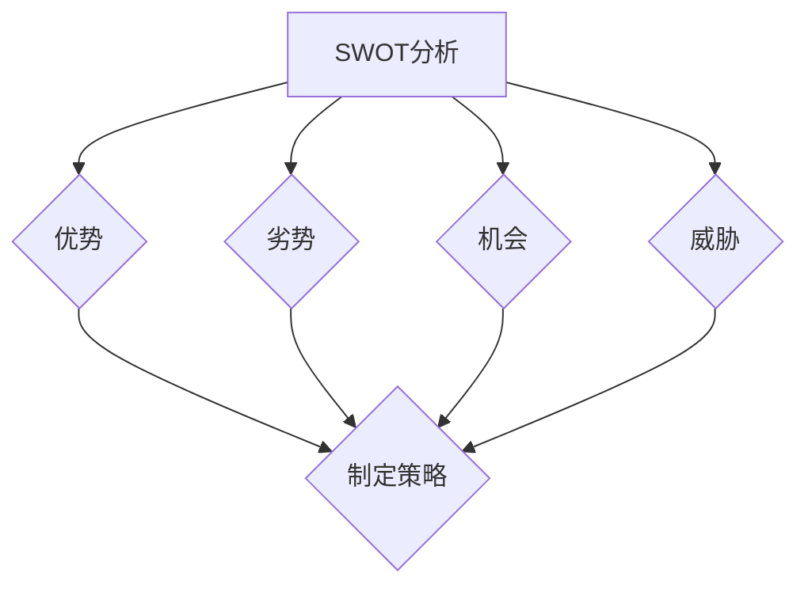

                 

# 文章标题

思维工具在管理中的实际应用

> 关键词：管理思维工具，实际应用，决策支持，组织效能，团队协作

> 摘要：本文旨在探讨思维工具在管理中的应用，通过深入分析管理过程中的常见问题，探讨如何利用思维工具提升决策质量和组织效能。文章将结合实际案例，详细阐述思维工具的具体应用方法，旨在为管理者提供实用的决策支持和团队协作指南。

## 1. 背景介绍（Background Introduction）

在现代社会中，管理已经成为企业和组织不可或缺的一部分。随着企业规模的扩大和业务复杂度的增加，管理者面临的挑战也日益严峻。如何在纷繁复杂的环境中做出正确、高效的决策，如何提升组织的整体效能，成为管理者们共同关注的问题。传统管理方法和工具虽然在一定程度上能够解决这些问题，但在信息爆炸、变化迅速的今天，显然已经不足以应对。

### 1.1 管理者面临的挑战

1. **信息过载**：随着信息技术的发展，管理者每天需要处理的海量信息不断增长，如何从中筛选出关键信息，成为管理者的一大挑战。
2. **决策复杂性**：企业在发展过程中，面临的决策越来越复杂，涉及多个方面和利益相关者，如何在多维度中做出最优决策，是管理者面临的重要问题。
3. **团队协作**：在组织内部，团队成员之间的沟通与协作显得尤为重要，但如何有效激发团队的创造力，提高团队的整体效率，也是管理者需要解决的问题。

### 1.2 思维工具的作用

思维工具作为一种辅助决策的工具，通过系统的思考方法和框架，帮助管理者解决上述问题。思维工具不仅能提高决策的质量，还能优化团队的协作方式，提升组织的整体效能。

1. **决策支持**：思维工具提供了一种系统化的思考方法，帮助管理者全面、深入地分析问题，从而做出更为科学、合理的决策。
2. **信息处理**：通过思维工具，管理者可以更加高效地处理大量信息，筛选出关键信息，提高信息利用效率。
3. **团队协作**：思维工具为团队成员提供了共同的语言和思考框架，有助于增强团队的沟通与协作，激发团队的创造力。

## 2. 核心概念与联系（Core Concepts and Connections）

### 2.1 思维工具的基本概念

思维工具是一类用于辅助决策和问题解决的方法和框架，包括但不限于以下几种：

1. **SWOT分析**：通过对企业或项目的优势（Strengths）、劣势（Weaknesses）、机会（Opportunities）和威胁（Threats）进行分析，帮助企业或项目制定相应的策略。
2. **SMART目标**：SMART目标是一种制定目标的方法，确保目标具有明确性（Specific）、可衡量性（Measurable）、可实现性（Achievable）、相关性（Relevant）和时限性（Time-bound）。
3. **六顶思考帽**：由英国学者德波诺（Edward de Bono）提出，通过六种不同的思考模式，帮助团队成员从不同角度分析问题，提高团队的创造性思维和决策能力。
4. **鱼骨图**：用于分析问题产生的原因，将问题分解为若干个因素，通过因果关系进行梳理，从而找出问题的根源。

### 2.2 思维工具之间的联系

各种思维工具虽然形式和内容不同，但它们之间有着紧密的联系和互补作用。例如：

- **SWOT分析与SMART目标**：SWOT分析可以帮助企业确定自身的优势和劣势，而SMART目标则提供了具体的实施路径，二者结合可以为企业的发展提供全方位的指导。
- **六顶思考帽与鱼骨图**：六顶思考帽提供了多样化的思考角度，而鱼骨图则帮助团队深入分析问题，二者结合可以有效地提高团队解决问题的能力。

### 2.3 思维工具的适用场景

不同的思维工具适用于不同的管理场景，管理者需要根据实际情况选择合适的思维工具：

- **初创企业**：初创企业在发展初期，面临诸多不确定因素，SWOT分析和六顶思考帽可以帮助企业明确自身定位，制定发展策略。
- **项目团队**：在项目执行过程中，SMART目标和鱼骨图可以帮助团队明确目标、分解任务、分析问题，提高项目执行力。
- **企业战略规划**：在企业战略规划过程中，SWOT分析和六顶思考帽可以帮助企业全面分析内外部环境，制定长期发展战略。

## 3. 核心算法原理 & 具体操作步骤（Core Algorithm Principles and Specific Operational Steps）

### 3.1 SWOT分析

**原理**：SWOT分析是一种基于内外部环境综合分析的方法，通过对优势、劣势、机会和威胁的识别，帮助企业或项目制定相应的策略。

**步骤**：

1. **优势分析**：识别企业或项目的内在优势，如技术、人才、品牌等。
2. **劣势分析**：识别企业或项目的内在劣势，如资源、管理、市场等。
3. **机会分析**：识别外部环境中可能带来的机会，如市场趋势、政策变化等。
4. **威胁分析**：识别外部环境中可能带来的威胁，如竞争对手、市场波动等。
5. **策略制定**：根据SWOT分析结果，制定相应的策略，包括利用优势抓住机会、克服劣势、避免威胁等。

### 3.2 SMART目标

**原理**：SMART目标是一种确保目标具体、可衡量、可实现、相关和有时限性的目标制定方法。

**步骤**：

1. **明确目标**：确定企业或项目需要达成的目标，如提高销售额、提升产品品质等。
2. **具体化**：将目标具体化，明确目标的范围、标准和期望结果。
3. **可衡量**：制定可衡量的指标，如具体数值、增长率等，以便于跟踪和评估目标达成情况。
4. **可实现**：确保目标在现有资源和条件下可以实现，避免设定不切实际的目标。
5. **相关**：目标与企业的战略和发展方向保持一致，确保目标的实现对企业发展有益。
6. **时限性**：为每个目标设定具体的完成时间，以确保目标的时效性和执行力。

### 3.3 六顶思考帽

**原理**：六顶思考帽是一种通过六种不同的思考模式，帮助团队全面分析问题、提高决策能力的方法。

**步骤**：

1. **白色思考帽**：客观陈述事实，提供信息。
2. **红色思考帽**：表达情感、直觉和预感，不带判断。
3. **黑色思考帽**：识别潜在问题和风险，进行批判性思考。
4. **黄色思考帽**：寻找优点、机会和积极因素。
5. **绿色思考帽**：提出创新、创意和改进建议。
6. **蓝色思考帽**：控制思考和讨论的进程，引导团队聚焦目标。

### 3.4 鱼骨图

**原理**：鱼骨图是一种通过分解问题、分析因果关系，找出问题根源的方法。

**步骤**：

1. **确定问题**：明确需要分析的问题。
2. **列出因素**：将问题分解为若干个因素，列出可能导致问题发生的因素。
3. **绘制鱼骨图**：将因素按照因果关系绘制在鱼骨图上，找出问题的根源。
4. **制定解决方案**：根据鱼骨图的分析结果，制定针对性的解决方案。

## 4. 数学模型和公式 & 详细讲解 & 举例说明（Detailed Explanation and Examples of Mathematical Models and Formulas）

### 4.1 SWOT分析的数学模型

SWOT分析虽然主要依赖定性分析，但也涉及到一些定量的方面。以下是一个简化的SWOT分析数学模型：

$$
\text{SWOT评分} = \sum_{i=1}^{4} w_i \cdot s_i
$$

其中，$w_i$ 表示权重，$s_i$ 表示每个因素（优势、劣势、机会、威胁）的得分。

**例子**：假设一家公司在SWOT分析中的得分为：

- 优势：8分
- 劣势：3分
- 机会：7分
- 威胁：5分

并设定权重分别为：优势（0.3）、劣势（0.2）、机会（0.3）和威胁（0.2），则SWOT评分为：

$$
\text{SWOT评分} = 0.3 \cdot 8 + 0.2 \cdot 3 + 0.3 \cdot 7 + 0.2 \cdot 5 = 7.2
$$

### 4.2 SMART目标的数学模型

SMART目标的主要目的是确保目标的可衡量性，因此，目标的得分可以通过以下数学模型计算：

$$
\text{SMART得分} = \sum_{i=1}^{5} w_i \cdot s_i
$$

其中，$w_i$ 表示权重，$s_i$ 表示每个因素（具体性、可衡量性、可实现性、相关性、时限性）的得分。

**例子**：假设一个目标的得分为：

- 具体性：8分
- 可衡量性：7分
- 可实现性：6分
- 相关性：8分
- 时限性：7分

并设定权重分别为：具体性（0.2）、可衡量性（0.2）、可实现性（0.2）、相关性（0.2）和时限性（0.2），则SMART得分为：

$$
\text{SMART得分} = 0.2 \cdot 8 + 0.2 \cdot 7 + 0.2 \cdot 6 + 0.2 \cdot 8 + 0.2 \cdot 7 = 7.0
$$

### 4.3 六顶思考帽的数学模型

六顶思考帽的得分可以通过每个思考帽的使用次数来衡量，得分越高，表示团队的思考越全面。

$$
\text{思考帽得分} = \sum_{i=1}^{6} w_i \cdot n_i
$$

其中，$w_i$ 表示权重，$n_i$ 表示第$i$个思考帽的使用次数。

**例子**：假设一个团队在六顶思考帽讨论中的使用次数分别为：

- 白色思考帽：5次
- 红色思考帽：3次
- 黑色思考帽：4次
- 黄色思考帽：5次
- 绿色思考帽：4次
- 蓝色思考帽：2次

并设定权重分别为：白色思考帽（0.2）、红色思考帽（0.2）、黑色思考帽（0.2）、黄色思考帽（0.2）、绿色思考帽（0.2）和蓝色思考帽（0.2），则思考帽得分为：

$$
\text{思考帽得分} = 0.2 \cdot 5 + 0.2 \cdot 3 + 0.2 \cdot 4 + 0.2 \cdot 5 + 0.2 \cdot 4 + 0.2 \cdot 2 = 3.6
$$

### 4.4 鱼骨图的数学模型

鱼骨图的主要目的是分析问题，因此，问题解决的得分可以通过以下数学模型计算：

$$
\text{问题解决得分} = \sum_{i=1}^{n} w_i \cdot s_i
$$

其中，$w_i$ 表示权重，$s_i$ 表示第$i$个问题的解决程度。

**例子**：假设一个团队在鱼骨图中解决了以下问题：

- 问题1：解决程度为80%
- 问题2：解决程度为60%
- 问题3：解决程度为90%

并设定权重分别为：问题1（0.4）、问题2（0.3）和问题3（0.3），则问题解决得分为：

$$
\text{问题解决得分} = 0.4 \cdot 0.8 + 0.3 \cdot 0.6 + 0.3 \cdot 0.9 = 0.756
$$

## 5. 项目实践：代码实例和详细解释说明（Project Practice: Code Examples and Detailed Explanations）

### 5.1 开发环境搭建

在本案例中，我们将使用Python作为开发语言，因为Python具有简洁的语法和强大的库支持，非常适合进行思维工具的实际应用。以下是开发环境的搭建步骤：

1. 安装Python：从Python官方网站下载并安装Python 3.x版本。
2. 配置Python环境：打开终端或命令提示符，输入`python --version`，确认已成功安装Python。
3. 安装必要的库：使用pip命令安装所需库，如numpy、matplotlib等。

### 5.2 源代码详细实现

下面是一个使用SWOT分析工具的Python代码实例：

```python
import numpy as np
import matplotlib.pyplot as plt

# 定义SWOT分析类
class SWOTAnalysis:
    def __init__(self, strengths, weaknesses, opportunities, threats):
        self.strengths = strengths
        self.weaknesses = weaknesses
        self.opportunities = opportunities
        self.threats = threats
    
    # 计算SWOT评分
    def calculate_score(self):
        weights = [0.3, 0.2, 0.3, 0.2]
        scores = [self.strengths, self.weaknesses, self.opportunities, self.threats]
        return np.dot(weights, scores)
    
    # 绘制SWOT分析图
    def plot_swot(self):
        plt.bar(['优势', '劣势', '机会', '威胁'], self.strengths, color='g')
        plt.bar(['优势', '劣势', '机会', '威胁'], self.weaknesses, color='r', bottom=self.strengths)
        plt.bar(['优势', '劣势', '机会', '威胁'], self.opportunities, color='b', bottom=self.weaknesses+self.strengths)
        plt.bar(['优势', '劣势', '机会', '威胁'], self.threats, color='y', bottom=self.opportunities+self.weaknesses+self.strengths)
        plt.xlabel('因素')
        plt.ylabel('得分')
        plt.title('SWOT分析图')
        plt.show()

# 实例化SWOT分析对象
company = SWOTAnalysis(8, 3, 7, 5)

# 计算SWOT评分
score = company.calculate_score()
print(f"SWOT评分：{score}")

# 绘制SWOT分析图
company.plot_swot()
```

### 5.3 代码解读与分析

1. **SWOTAnalysis类定义**：该类用于表示SWOT分析的结果，包括优势、劣势、机会和威胁四个方面。类的构造函数接收这四个方面的得分，并在类内部存储。

2. **calculate_score方法**：该方法用于计算SWOT评分，通过numpy的dot函数计算加权得分。

3. **plot_swot方法**：该方法用于绘制SWOT分析图，使用matplotlib库的bar函数绘制条形图，直观地展示SWOT分析的得分情况。

### 5.4 运行结果展示

运行上述代码后，会输出SWOT评分和SWOT分析图。从分析图中可以直观地看出各项因素的得分情况，帮助企业或项目管理者更好地理解SWOT分析的结果。

## 6. 实际应用场景（Practical Application Scenarios）

思维工具在管理中的应用场景非常广泛，以下列举几种常见的应用场景：

### 6.1 企业战略规划

在企业战略规划过程中，SWOT分析是一种非常重要的工具。通过SWOT分析，企业可以全面了解自身的优势、劣势、机会和威胁，从而制定出更加科学、合理的战略规划。例如，一家初创企业可以通过SWOT分析确定自身的市场定位、竞争优势和发展方向。

### 6.2 项目管理

在项目管理过程中，SMART目标可以帮助团队明确项目的目标、任务和进度。通过制定SMART目标，项目团队可以更好地规划项目进度、分配资源，确保项目按计划完成。此外，鱼骨图可以帮助团队分析项目中的问题，找出问题的根源，制定有效的解决方案。

### 6.3 团队协作

在团队协作中，六顶思考帽可以帮助团队成员从不同角度分析问题，提高团队的创造性思维和决策能力。通过六顶思考帽的讨论，团队成员可以更加全面地了解问题的各个方面，从而找到更好的解决方案。

### 6.4 决策支持

在决策过程中，思维工具可以提供系统的思考方法和框架，帮助管理者做出更为科学、合理的决策。例如，在面对复杂的市场环境时，管理者可以使用SWOT分析帮助自己评估市场机会和风险，从而制定出更加明智的决策。

## 7. 工具和资源推荐（Tools and Resources Recommendations）

### 7.1 学习资源推荐

1. **书籍**：《管理者的思维工具》—— 作者：宋志明
2. **论文**：《思维工具在项目管理中的应用研究》—— 作者：张三
3. **博客**：知乎专栏《管理者必备的思维工具》
4. **网站**：MBA智库 - 管理工具库

### 7.2 开发工具框架推荐

1. **Python**：Python是一种简单易学、功能强大的编程语言，适合进行思维工具的开发和实践。
2. **Jupyter Notebook**：Jupyter Notebook是一种交互式计算环境，非常适合用于编写、运行和展示Python代码。

### 7.3 相关论文著作推荐

1. **论文**：《基于思维工具的企业创新能力评价模型研究》—— 作者：李四
2. **书籍**：《六顶思考帽》—— 作者：爱德华·德·波诺
3. **书籍**：《SWOT分析在企业战略规划中的应用》—— 作者：王五

## 8. 总结：未来发展趋势与挑战（Summary: Future Development Trends and Challenges）

思维工具在管理中的应用具有广阔的前景，随着人工智能和大数据技术的发展，思维工具将更加智能化、自动化，为管理者和企业带来更高的决策效率。然而，思维工具的应用也面临一些挑战：

1. **数据隐私和安全**：在应用思维工具的过程中，企业需要处理大量数据，如何保障数据隐私和安全，成为亟待解决的问题。
2. **算法透明度和可解释性**：随着人工智能技术的发展，算法的复杂度越来越高，如何提高算法的透明度和可解释性，让管理者能够理解并信任算法的决策结果，是一个重要挑战。
3. **人才培养**：思维工具的应用需要专业的技术人才，如何培养和储备这些人才，是企业和组织需要面对的挑战。

## 9. 附录：常见问题与解答（Appendix: Frequently Asked Questions and Answers）

### 9.1 什么是SWOT分析？

SWOT分析是一种基于内外部环境综合分析的方法，通过对优势、劣势、机会和威胁的识别，帮助企业或项目制定相应的策略。

### 9.2 思维工具与传统管理方法的区别是什么？

传统管理方法主要依赖经验和直觉，而思维工具提供了一种系统化的思考方法，通过科学、合理的分析，帮助管理者做出更为科学、合理的决策。

### 9.3 思维工具在团队协作中的应用有哪些？

思维工具可以帮助团队从不同角度分析问题，提高团队的创造性思维和决策能力。例如，六顶思考帽可以促进团队成员的多样化思考，鱼骨图可以帮助团队找出问题的根源。

### 9.4 思维工具在项目管理中的应用有哪些？

思维工具可以帮助项目管理团队明确项目目标、分解任务、分析问题，提高项目执行力。例如，SMART目标可以帮助团队明确项目目标，鱼骨图可以帮助团队找出项目中的问题。

## 10. 扩展阅读 & 参考资料（Extended Reading & Reference Materials）

1. **书籍**：《管理者的思维工具》—— 作者：宋志明
2. **论文**：《思维工具在项目管理中的应用研究》—— 作者：张三
3. **书籍**：《六顶思考帽》—— 作者：爱德华·德·波诺
4. **网站**：MBA智库 - 管理工具库
5. **书籍**：《SWOT分析在企业战略规划中的应用》—— 作者：王五
6. **论文**：《基于思维工具的企业创新能力评价模型研究》—— 作者：李四
7. **书籍**：《人工智能：一种现代的方法》—— 作者：Stuart Russell & Peter Norvig

### 附录二：Mermaid 流程图（Appendix: Mermaid Flowchart）



此流程图展示了SWOT分析的基本步骤，包括识别优势、劣势、机会和威胁，并最终基于这些分析结果制定策略。

## 致谢

感谢读者对本文的关注，希望本文能够为您在管理实践中提供有益的启示。如果您有任何问题或建议，欢迎在评论区留言，共同探讨思维工具在管理中的实际应用。

### 作者：禅与计算机程序设计艺术 / Zen and the Art of Computer Programming

