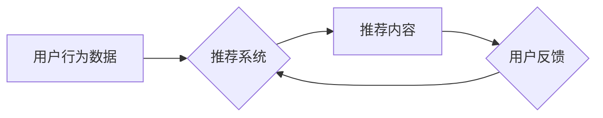

                 

## 大模型在推荐系统反馈循环中的作用

> 关键词：大模型、推荐系统、反馈循环、冷启动、个性化推荐、用户行为预测、内容生成

## 1. 背景介绍

推荐系统作为互联网时代的重要组成部分，旨在根据用户的历史行为、偏好和上下文信息，预测用户可能感兴趣的内容，并将其推荐给用户。传统的推荐系统主要依赖于协同过滤、内容过滤和基于知识的推荐算法，但这些算法在面对海量数据、用户多样性和内容更新快速等挑战时，表现力逐渐不足。

近年来，大模型的兴起为推荐系统带来了新的机遇。大模型，指的是参数规模庞大、训练数据海量的人工智能模型，具备强大的泛化能力和学习能力。其在自然语言处理、图像识别等领域取得的突破性进展，也为推荐系统的优化和创新提供了新的思路。

## 2. 核心概念与联系

### 2.1 推荐系统反馈循环

推荐系统反馈循环是指推荐系统与用户之间的交互过程，用户对推荐内容的反馈信息会反向影响推荐系统的模型训练和内容推荐，形成一个闭环。

**推荐系统反馈循环流程图:**



### 2.2 大模型在推荐系统中的作用

大模型可以融入推荐系统反馈循环的各个环节，发挥其强大的学习和生成能力，提升推荐系统的精准度、个性化程度和用户体验。

* **用户行为理解:** 大模型可以对用户的历史行为数据进行深度学习，挖掘用户潜在的兴趣偏好和需求，从而更精准地预测用户可能感兴趣的内容。
* **内容生成与推荐:** 大模型可以生成个性化的推荐内容，例如根据用户的兴趣生成推荐列表、撰写个性化的推荐文案等，提升推荐内容的吸引力和用户体验。
* **反馈信息处理:** 大模型可以对用户的反馈信息进行分析和理解，例如识别用户的满意度、兴趣变化等，并将其反馈回推荐系统，帮助模型不断优化和迭代。

## 3. 核心算法原理 & 具体操作步骤

### 3.1 算法原理概述

大模型在推荐系统中的应用主要基于深度学习算法，例如Transformer、BERT等。这些算法能够学习用户行为数据和内容特征之间的复杂关系，并生成更精准的推荐结果。

### 3.2 算法步骤详解

1. **数据预处理:** 收集用户行为数据、内容特征数据等，并进行清洗、转换、编码等预处理操作。
2. **模型训练:** 使用深度学习算法训练大模型，输入预处理后的数据，输出推荐结果。
3. **模型评估:** 使用测试数据评估模型的性能，例如准确率、召回率、点击率等指标。
4. **模型部署:** 将训练好的模型部署到生产环境中，用于实时推荐。

### 3.3 算法优缺点

**优点:**

* **精准度高:** 深度学习算法能够学习用户行为数据和内容特征之间的复杂关系，生成更精准的推荐结果。
* **个性化程度高:** 大模型可以根据用户的历史行为和偏好，生成个性化的推荐内容。
* **适应性强:** 大模型可以适应海量数据和内容更新快速等挑战。

**缺点:**

* **训练成本高:** 大模型的训练需要大量的计算资源和时间。
* **数据依赖性强:** 大模型的性能取决于训练数据的质量和数量。
* **可解释性低:** 深度学习算法的决策过程较为复杂，难以解释模型的推荐结果。

### 3.4 算法应用领域

大模型在推荐系统中的应用领域广泛，例如：

* **电商推荐:** 推荐商品、优惠券、促销活动等。
* **视频推荐:** 推荐视频、直播、短视频等。
* **音乐推荐:** 推荐歌曲、专辑、音乐人等。
* **新闻推荐:** 推荐新闻、资讯、博客文章等。

## 4. 数学模型和公式 & 详细讲解 & 举例说明

### 4.1 数学模型构建

推荐系统的核心目标是预测用户对某一内容的评分或点击概率。常用的数学模型包括协同过滤模型、内容过滤模型和混合模型。

**协同过滤模型:**

协同过滤模型基于用户的历史行为数据，预测用户对未交互内容的评分或点击概率。常用的协同过滤算法包括基于用户的协同过滤和基于物品的协同过滤。

**内容过滤模型:**

内容过滤模型基于内容的特征信息，预测用户对某一内容的评分或点击概率。常用的内容过滤算法包括TF-IDF、Word2Vec等。

**混合模型:**

混合模型结合协同过滤和内容过滤的优势，构建更复杂的推荐模型。

### 4.2 公式推导过程

**协同过滤模型的公式推导:**

假设用户u对物品i的评分为r(u, i)，则可以使用矩阵分解算法来预测用户u对物品j的评分:

$$
r(u, j) = \mathbf{u}^T \mathbf{v}(j)
$$

其中，$\mathbf{u}$是用户u的特征向量，$\mathbf{v}(j)$是物品j的特征向量。

**内容过滤模型的公式推导:**

假设用户u对物品i的评分为r(u, i)，物品i的特征向量为$\mathbf{f}(i)$，则可以使用线性回归模型来预测用户u对物品i的评分:

$$
r(u, i) = \mathbf{w}^T \mathbf{f}(i) + b
$$

其中，$\mathbf{w}$是权重向量，b是偏置项。

### 4.3 案例分析与讲解

**案例:**

假设有一个电商平台，用户购买了书籍、电子产品和服饰等不同类型的商品。可以使用协同过滤模型来推荐用户可能感兴趣的商品。

**分析:**

通过分析用户的购买历史，可以构建用户-商品评分矩阵。然后，可以使用矩阵分解算法来学习用户和商品的特征向量。最后，根据用户特征向量和商品特征向量，预测用户对未购买商品的评分，并推荐评分较高的商品。

## 5. 项目实践：代码实例和详细解释说明

### 5.1 开发环境搭建

推荐系统开发环境通常包括以下组件:

* **编程语言:** Python、Java等
* **深度学习框架:** TensorFlow、PyTorch等
* **数据存储:** MySQL、MongoDB等
* **云计算平台:** AWS、Azure、GCP等

### 5.2 源代码详细实现

以下是一个使用Python和TensorFlow实现简单协同过滤推荐系统的代码示例:

```python
import tensorflow as tf

# 定义用户-商品评分矩阵
ratings = tf.constant([[5, 4, 3],
                      [4, 5, 2],
                      [3, 2, 5]])

# 定义用户和商品的特征向量
user_embeddings = tf.Variable(tf.random.normal([3, 10]))
item_embeddings = tf.Variable(tf.random.normal([3, 10]))

# 计算预测评分
predictions = tf.matmul(user_embeddings, item_embeddings, transpose_b=True)

# 损失函数
loss = tf.reduce_mean(tf.square(predictions - ratings))

# 优化器
optimizer = tf.keras.optimizers.Adam()

# 训练模型
for epoch in range(100):
    with tf.GradientTape() as tape:
        loss_value = loss
    gradients = tape.gradient(loss_value, [user_embeddings, item_embeddings])
    optimizer.apply_gradients(zip(gradients, [user_embeddings, item_embeddings]))

# 打印预测结果
print(predictions)
```

### 5.3 代码解读与分析

* 代码首先定义了用户-商品评分矩阵和用户、商品的特征向量。
* 然后，使用矩阵乘法计算预测评分。
* 损失函数使用均方误差，优化器使用Adam优化器。
* 最后，训练模型并打印预测结果。

### 5.4 运行结果展示

运行代码后，可以得到预测评分矩阵，其中每个元素代表模型预测的用户对商品的评分。

## 6. 实际应用场景

### 6.1 电商推荐

大模型在电商推荐系统中可以实现个性化商品推荐、跨界推荐、新品推荐等功能，提升用户购物体验和转化率。

### 6.2 视频推荐

大模型可以分析用户的观看历史、点赞、评论等行为，推荐用户可能感兴趣的视频内容，提升用户粘性和平台活跃度。

### 6.3 音乐推荐

大模型可以根据用户的音乐偏好、播放历史、收藏等信息，推荐用户可能喜欢的歌曲、专辑、音乐人等，提升用户音乐体验。

### 6.4 未来应用展望

大模型在推荐系统领域的应用前景广阔，未来可能在以下方面得到进一步发展:

* **更精准的个性化推荐:** 大模型可以学习用户更细粒度的兴趣偏好，提供更精准的个性化推荐。
* **更丰富的推荐内容:** 大模型可以生成更丰富的推荐内容，例如个性化的推荐文案、推荐视频剪辑等。
* **更智能的交互体验:** 大模型可以与用户进行更智能的交互，例如理解用户的自然语言查询，提供更人性化的推荐服务。

## 7. 工具和资源推荐

### 7.1 学习资源推荐

* **书籍:**
    * 《深度学习》
    * 《推荐系统实践》
* **在线课程:**
    * Coursera: 深度学习
    * Udacity: 机器学习工程师
* **博客:**
    * TensorFlow Blog
    * PyTorch Blog

### 7.2 开发工具推荐

* **深度学习框架:** TensorFlow、PyTorch
* **数据存储:** MySQL、MongoDB
* **云计算平台:** AWS、Azure、GCP

### 7.3 相关论文推荐

* **BERT: Pre-training of Deep Bidirectional Transformers for Language Understanding**
* **Attention Is All You Need**
* **Collaborative Filtering for Implicit Feedback Datasets**

## 8. 总结：未来发展趋势与挑战

### 8.1 研究成果总结

大模型在推荐系统中的应用取得了显著的成果，提升了推荐系统的精准度、个性化程度和用户体验。

### 8.2 未来发展趋势

未来，大模型在推荐系统领域的应用将朝着以下方向发展:

* **更强大的模型架构:** 研究更强大的大模型架构，例如Transformer-XL、GPT-3等，提升模型的学习能力和泛化能力。
* **更丰富的多模态数据:** 融合文本、图像、音频等多模态数据，构建更全面的用户画像，提升推荐系统的精准度。
* **更智能的交互体验:** 研究更智能的推荐交互方式，例如基于对话的推荐、基于场景的推荐等，提升用户体验。

### 8.3 面临的挑战

大模型在推荐系统中的应用也面临一些挑战:

* **训练成本高:** 大模型的训练需要大量的计算资源和时间，成本较高。
* **数据依赖性强:** 大模型的性能取决于训练数据的质量和数量，数据获取和处理是一个难题。
* **可解释性低:** 深度学习算法的决策过程较为复杂，难以解释模型的推荐结果，缺乏透明度。

### 8.4 研究展望

未来，需要进一步研究大模型在推荐系统中的应用，解决上述挑战，并探索更智能、更个性化的推荐体验。


## 9. 附录：常见问题与解答

**常见问题:**

* **大模型的训练需要多少数据？**

大模型的训练需要海量数据，通常需要百万甚至数十亿条数据。

* **大模型的训练需要多少计算资源？**

大模型的训练需要大量的计算资源，通常需要使用GPU集群进行训练。

* **大模型的推荐结果是否准确？**

大模型的推荐结果取决于训练数据的质量和模型的架构，一般来说，大模型的推荐结果比传统推荐算法更准确。

* **大模型的推荐结果是否个性化？**

大模型可以根据用户的历史行为和偏好，生成个性化的推荐结果。

* **大模型的推荐结果是否可解释？**

深度学习算法的决策过程较为复杂，难以解释模型的推荐结果，缺乏透明度。

**作者：禅与计算机程序设计艺术 / Zen and the Art of Computer Programming**<end_of_turn>

