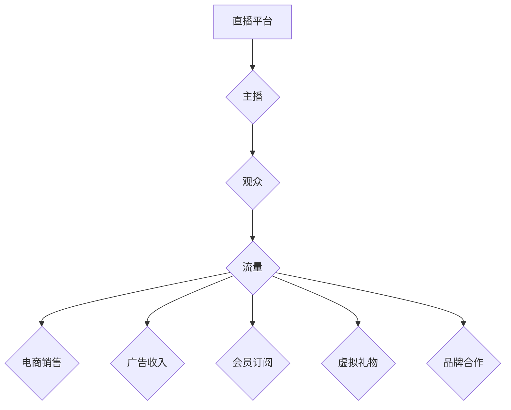

                 

## 如何利用直播平台进行流量变现

> 关键词：直播平台、流量变现、电商直播、内容营销、互动直播、数据分析、直播技术、直播运营

## 1. 背景介绍

直播平台近年来发展迅速，成为互联网用户获取信息、娱乐消遣和购物的重要渠道。其实时互动、沉浸式体验和内容丰富等特点，为商家和创作者提供了独特的流量变现机会。

随着直播平台的普及，越来越多的人开始关注如何利用直播平台进行流量变现。无论是电商商家、品牌企业还是个人创作者，都希望通过直播平台获得更高的曝光度、用户粘性和商业回报。

## 2. 核心概念与联系

### 2.1 直播平台生态

直播平台生态是一个复杂而动态的系统，包含以下关键要素：

* **平台方:** 提供直播技术、基础设施和运营服务的平台，例如抖音、快手、淘宝直播等。
* **主播:** 通过直播平台进行内容创作和互动传播的个人或团队。
* **观众:** 观看直播内容、参与互动和消费的互联网用户。
* **商家:** 利用直播平台进行产品推广、销售和品牌营销的企业。

### 2.2 流量变现模式

直播平台上的流量变现模式主要包括以下几种：

* **电商直播:** 通过直播平台销售商品，实现直接的销售转化。
* **广告投放:** 在直播过程中插入广告，获取广告收入。
* **会员订阅:** 提供付费会员服务，获得持续的订阅收入。
* **虚拟礼物:** 观众可以通过虚拟礼物向主播表达支持，主播可以将虚拟礼物兑换成现金。
* **品牌合作:** 与品牌企业合作，进行产品推广和营销活动。

### 2.3 流量变现架构



## 3. 核心算法原理 & 具体操作步骤

### 3.1 算法原理概述

直播平台的流量变现主要依赖于以下核心算法：

* **推荐算法:** 根据用户的观看历史、兴趣偏好和行为数据，推荐相关直播内容，提高用户粘性和参与度。
* **匹配算法:** 根据主播的直播内容、目标受众和商业需求，匹配合适的商家和品牌合作机会，实现精准营销。
* **转化算法:** 分析用户在直播过程中的行为数据，预测用户转化概率，优化直播内容和营销策略，提高销售转化率。

### 3.2 算法步骤详解

* **推荐算法:**

    1. 收集用户观看历史、点赞、评论、分享等行为数据。
    2. 利用机器学习算法，构建用户兴趣模型，识别用户偏好的直播内容类型、主播风格和商品类别。
    3. 根据用户兴趣模型，推荐相关直播内容，并根据用户反馈进行算法优化。

* **匹配算法:**

    1. 收集主播直播内容、目标受众和商业需求等信息。
    2. 利用自然语言处理和机器学习算法，分析主播内容和商家产品信息，识别潜在的合作机会。
    3. 根据主播和商家的匹配度，推荐合适的合作项目，并进行智能匹配和协商。

* **转化算法:**

    1. 收集用户在直播过程中的行为数据，例如观看时长、互动次数、加购、下单等。
    2. 利用机器学习算法，构建用户转化模型，预测用户转化概率。
    3. 根据用户转化模型，优化直播内容、营销策略和商品推荐，提高销售转化率。

### 3.3 算法优缺点

* **推荐算法:**

    优点: 可以精准推荐用户感兴趣的内容，提高用户粘性和参与度。
    缺点: 可能存在推荐偏差，导致用户体验下降。

* **匹配算法:**

    优点: 可以帮助主播和商家找到合适的合作机会，实现精准营销。
    缺点: 需要大量的用户数据和算法模型支持，实现难度较高。

* **转化算法:**

    优点: 可以帮助商家优化营销策略，提高销售转化率。
    缺点: 需要收集和分析大量的用户行为数据，保护用户隐私是一个重要问题。

### 3.4 算法应用领域

直播平台的流量变现算法广泛应用于以下领域:

* **电商直播:** 推广商品、提高销售转化率。
* **内容营销:** 提升品牌知名度、影响力。
* **用户运营:** 提高用户粘性和活跃度。
* **数据分析:** 挖掘用户行为数据，优化运营策略。

## 4. 数学模型和公式 & 详细讲解 & 举例说明

### 4.1 数学模型构建

直播平台的流量变现可以抽象为一个多目标优化问题，目标函数可以定义为：

$$
Maximize: Revenue = \alpha * Sales + \beta * Ads + \gamma * Subscriptions + \delta * Gifts
$$

其中：

* $Revenue$ 表示总收入
* $Sales$ 表示商品销售额
* $Ads$ 表示广告收入
* $Subscriptions$ 表示会员订阅收入
* $Gifts$ 表示虚拟礼物收入
* $\alpha$, $\beta$, $\gamma$, $\delta$ 为权重系数，代表不同收入来源的相对重要性

### 4.2 公式推导过程

为了最大化收入，需要优化以下因素：

* **推荐算法:** 提高用户观看直播的概率和时长，从而增加商品曝光和广告展示机会。
* **匹配算法:** 匹配合适的商家和主播，提高合作效率和转化率。
* **转化算法:** 优化直播内容和营销策略，提高用户购买意愿和转化率。

这些因素之间存在复杂的相互影响关系，需要通过数据分析和模型训练，找到最佳的优化方案。

### 4.3 案例分析与讲解

假设一个电商直播平台，其收入主要来自商品销售和广告收入。

* $\alpha = 0.7$, $\beta = 0.3$

为了最大化收入，平台需要：

* **提高商品销售额:** 通过推荐算法推荐用户感兴趣的商品，优化直播内容和营销策略，提高用户购买意愿。
* **增加广告收入:** 通过匹配算法匹配合适的广告商，优化广告展示位置和时间，提高广告点击率和转化率。

## 5. 项目实践：代码实例和详细解释说明

### 5.1 开发环境搭建

* **操作系统:** Windows/macOS/Linux
* **编程语言:** Python
* **开发工具:** PyCharm/VS Code
* **库依赖:** numpy, pandas, scikit-learn, tensorflow

### 5.2 源代码详细实现

```python
# 导入必要的库
import numpy as np
from sklearn.linear_model import LogisticRegression

# 定义用户行为数据
user_data = np.array([
    [1, 0, 2, 5],  # 用户ID,观看时长,点赞数,评论数
    [2, 3, 1, 3],
    [3, 5, 4, 2],
    [4, 2, 3, 1],
])

# 定义用户转化标签
user_labels = np.array([1, 0, 1, 0])  # 1表示转化, 0表示未转化

# 创建逻辑回归模型
model = LogisticRegression()

# 训练模型
model.fit(user_data, user_labels)

# 预测新用户的转化概率
new_user_data = np.array([[2, 4, 3, 2]])
predicted_probability = model.predict_proba(new_user_data)

# 输出预测结果
print(predicted_probability)
```

### 5.3 代码解读与分析

* 该代码示例展示了如何使用逻辑回归模型预测用户的转化概率。
* 用户行为数据包括观看时长、点赞数和评论数等特征。
* 用户转化标签表示用户是否进行了购买行为。
* 训练模型后，可以预测新用户的转化概率。

### 5.4 运行结果展示

运行结果将输出新用户的转化概率，例如：

```
[[0.6 0.4]]
```

表示新用户的转化概率为60%。

## 6. 实际应用场景

### 6.1 电商直播

电商直播平台可以利用流量变现算法，推荐用户感兴趣的商品，提高商品曝光和销售转化率。例如，淘宝直播可以根据用户的观看历史和购买记录，推荐相关的商品，并通过直播间的互动和优惠活动，刺激用户购买。

### 6.2 内容营销

内容营销平台可以利用流量变现算法，推荐用户感兴趣的内容，提升品牌知名度和影响力。例如，抖音可以根据用户的兴趣偏好，推荐相关的内容，并通过直播间的互动和合作，提升品牌曝光度。

### 6.3 用户运营

用户运营平台可以利用流量变现算法，提高用户粘性和活跃度。例如，快手可以根据用户的观看习惯和互动行为，推送个性化的内容推荐，并通过直播间的互动和活动，增强用户粘性。

### 6.4 未来应用展望

随着直播平台的不断发展，流量变现算法将更加智能化和个性化。未来，直播平台将更加注重用户体验，提供更加精准的推荐和互动，实现更加高效的流量变现。

## 7. 工具和资源推荐

### 7.1 学习资源推荐

* **书籍:**
    * 《深度学习》
    * 《机器学习实战》
    * 《推荐系统实践》
* **在线课程:**
    * Coursera: 深度学习
    * Udacity: 机器学习工程师
    * edX: 推荐系统

### 7.2 开发工具推荐

* **编程语言:** Python
* **机器学习库:** scikit-learn, TensorFlow, PyTorch
* **数据分析工具:** Pandas, NumPy

### 7.3 相关论文推荐

* **推荐系统:**
    * Collaborative Filtering for Implicit Feedback Datasets
    * Matrix Factorization Techniques for Recommender Systems
* **机器学习:**
    * Support Vector Machines
    * Logistic Regression
    * Decision Trees

## 8. 总结：未来发展趋势与挑战

### 8.1 研究成果总结

直播平台的流量变现算法取得了显著的成果，为电商、内容营销和用户运营等领域提供了新的商业模式和增长点。

### 8.2 未来发展趋势

* **更智能化的推荐算法:** 利用深度学习和自然语言处理等技术，实现更加精准的个性化推荐。
* **更有效的转化算法:** 通过用户行为分析和数据挖掘，优化直播内容和营销策略，提高用户转化率。
* **更丰富的互动体验:** 利用虚拟现实、增强现实等技术，打造更加沉浸式的直播体验。

### 8.3 面临的挑战

* **数据隐私保护:** 收集和分析用户行为数据需要谨慎处理，确保用户隐私安全。
* **算法公平性:** 算法模型需要避免歧视和偏见，确保公平公正的流量分配。
* **内容监管:** 直播平台需要加强内容监管，防止虚假信息和不良内容的传播。

### 8.4 研究展望

未来，直播平台的流量变现算法将朝着更加智能化、个性化、互动化和安全化的方向发展，为用户和商家带来更加丰富的体验和价值。

## 9. 附录：常见问题与解答

* **如何提高直播观看量？**

    * 优化直播内容，制作高质量的直播节目。
    * 利用平台推荐算法，提高直播曝光度。
    * 进行有效的推广宣传，吸引更多用户观看。

* **如何提高直播转化率？**

    * 优化直播内容，突出商品卖点。
    * 利用直播间的互动和优惠活动，刺激用户购买。
    * 提供优质的售后服务，提升用户满意度。

* **如何保护用户隐私？**

    * 明确收集和使用用户数据的目的和范围。
    * 加强数据加密和安全防护措施。
    * 尊重用户隐私选择，提供数据删除和管理功能。


作者：禅与计算机程序设计艺术 / Zen and the Art of Computer Programming 
<end_of_turn>

