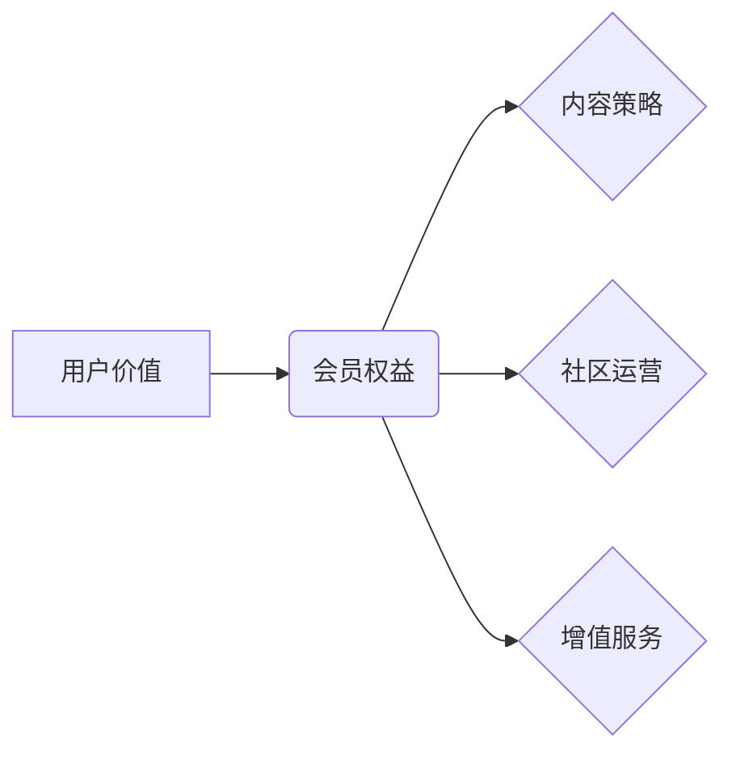

                 

## 如何设计有吸引力的知识付费会员权益

> 关键词：知识付费、会员权益、用户价值、内容策略、社区运营、增值服务、会员体验

### 1. 背景介绍

知识付费已成为近年来互联网行业发展的重要趋势，其核心在于通过提供优质的知识产权和服务，为用户带来价值，并实现商业化。而会员权益作为知识付费的核心组成部分，直接影响着用户是否愿意付费，以及付费后是否能够获得持续的价值感。

传统的会员权益往往停留在内容的层面，例如提供付费课程、电子书等。然而，随着用户需求的不断变化，单纯依靠内容的付费模式已难以满足用户的多元化需求。因此，设计有吸引力的会员权益，提升用户粘性和复购率，成为知识付费平台的关键挑战。

### 2. 核心概念与联系

**2.1 核心概念**

* **用户价值:** 指用户从知识付费平台获得的实际利益和体验，包括知识学习、技能提升、社交互动、资源获取等方面。
* **会员权益:** 指知识付费平台为会员提供的专属福利和服务，旨在提升用户价值，增强用户粘性。
* **内容策略:** 指知识付费平台在内容生产、更新、分类、推荐等方面的规划和执行，旨在满足用户需求，提供优质内容。
* **社区运营:** 指知识付费平台围绕用户构建的线上线下互动社区，旨在促进用户之间的交流和学习，增强用户粘性。
* **增值服务:** 指除了核心内容之外，为会员提供的额外服务，例如一对一辅导、职业规划、资源推荐等。

**2.2 架构关系**



**2.3 核心联系**

会员权益是知识付费平台吸引和留住用户的关键因素。通过设计有吸引力的会员权益，平台可以提升用户价值，增强用户粘性，最终实现商业化目标。

### 3. 核心算法原理 & 具体操作步骤

**3.1 算法原理概述**

设计有吸引力的会员权益需要遵循一定的算法原理，例如：

* **价值最大化:** 权益设计应最大化满足用户的需求，提供真正有价值的内容和服务。
* **差异化竞争:** 权益设计应与竞争对手形成差异化，突出平台的独特优势。
* **用户画像:** 针对不同用户群体的特点，设计个性化的权益方案。
* **数据驱动:** 通过数据分析，了解用户行为和偏好，不断优化权益设计。

**3.2 算法步骤详解**

1. **用户调研:** 通过问卷调查、用户访谈等方式，了解用户需求、痛点和期望。
2. **竞争对手分析:** 分析竞争对手的会员权益，找出他们的优势和劣势。
3. **用户画像构建:** 根据用户调研结果，构建不同用户群体的画像，例如年龄、职业、兴趣爱好等。
4. **权益方案设计:** 根据用户画像和竞争对手分析，设计不同类型的会员权益方案，例如内容、服务、社区等。
5. **权益价值评估:** 对每个权益方案进行价值评估，确定其对用户的吸引力和价值。
6. **权益组合优化:** 根据用户画像和权益价值评估，组合不同类型的权益方案，形成最终的会员权益体系。
7. **数据监控与优化:** 通过数据分析，监控会员权益的有效性，并根据用户反馈和数据变化，不断优化权益设计。

**3.3 算法优缺点**

* **优点:** 

    * 能够根据用户需求和市场变化，设计更具吸引力的会员权益。
    * 能够提高用户粘性和复购率，提升平台的商业化效益。

* **缺点:** 

    * 需要投入大量的时间和资源进行用户调研和数据分析。
    * 需要不断迭代优化权益设计，才能保持竞争力。

**3.4 算法应用领域**

* 在线教育平台
* 知识分享平台
* 社交媒体平台
* 游戏平台
* 订阅服务平台

### 4. 数学模型和公式 & 详细讲解 & 举例说明

**4.1 数学模型构建**

我们可以使用一个简单的数学模型来衡量会员权益的价值：

$$Value = \frac{Benefit}{Cost}$$

其中：

* **Value:** 会员权益的价值
* **Benefit:** 会员从权益中获得的利益
* **Cost:** 会员为获得权益支付的成本

**4.2 公式推导过程**

这个公式的推导过程很简单，就是将会员权益的价值定义为获得的利益与支付的成本的比值。

**4.3 案例分析与讲解**

假设一个在线教育平台推出了一项会员权益，会员可以获得以下福利：

* 观看所有课程
* 参加线上直播
* 获得导师一对一辅导

会员支付的费用为每月100元。

如果会员通过观看课程和参加直播，获得了价值200元的知识和技能，那么会员权益的价值为：

$$Value = \frac{200}{100} = 2$$

这个结果表明，会员权益的价值大于会员支付的成本，因此这项权益对会员来说是具有吸引力的。

### 5. 项目实践：代码实例和详细解释说明

**5.1 开发环境搭建**

为了实现会员权益的管理和运营，需要搭建一个合适的开发环境。

* **服务器:** 选择一个稳定可靠的服务器，例如阿里云、腾讯云等。
* **数据库:** 选择一个适合存储会员信息和权益数据的数据库，例如MySQL、MongoDB等。
* **框架:** 选择一个适合开发会员管理系统的框架，例如Django、Laravel等。

**5.2 源代码详细实现**

以下是一个简单的会员权益管理系统的代码示例，使用Python和Django框架实现：

```python
# models.py
from django.db import models

class Member(models.Model):
    name = models.CharField(max_length=100)
    email = models.EmailField()
    # 其他会员信息

class Benefit(models.Model):
    name = models.CharField(max_length=100)
    description = models.TextField()
    # 其他权益信息

class Membership(models.Model):
    member = models.ForeignKey(Member, on_delete=models.CASCADE)
    benefit = models.ForeignKey(Benefit, on_delete=models.CASCADE)
    start_date = models.DateTimeField()
    end_date = models.DateTimeField()
```

**5.3 代码解读与分析**

* **models.py:** 定义了会员、权益和会员权益关系的模型。
* **views.py:** 定义了会员权益管理的视图函数，例如添加权益、查看权益、续费权益等。
* **templates:** 定义了会员权益管理的模板文件，例如会员权益列表页面、权益详情页面等。

**5.4 运行结果展示**

通过运行上述代码，可以搭建一个简单的会员权益管理系统，实现会员权益的添加、查看、续费等功能。

### 6. 实际应用场景

**6.1 在线教育平台**

在线教育平台可以提供不同等级的会员权益，例如：

* **基础会员:** 观看部分课程，获得部分学习资源。
* **标准会员:** 观看所有课程，获得所有学习资源，参加线上直播。
* **高级会员:** 除了标准会员的权益之外，还可以获得一对一辅导、职业规划等增值服务。

**6.2 知识分享平台**

知识分享平台可以提供以下会员权益：

* **付费文章:** 会员可以阅读平台上的所有付费文章。
* **专栏订阅:** 会员可以订阅自己感兴趣的专栏，获得最新文章推送。
* **社区交流:** 会员可以加入平台的社区，与其他用户交流学习。

**6.3 社交媒体平台**

社交媒体平台可以提供以下会员权益：

* **个性化推荐:** 会员可以获得更精准的个性化内容推荐。
* **优先使用新功能:** 会员可以优先使用平台的新功能。
* **专属活动:** 会员可以参加平台举办的专属活动。

**6.4 未来应用展望**

随着人工智能、大数据等技术的不断发展，知识付费平台的会员权益将会更加个性化、智能化和多元化。例如：

* **AI个性化推荐:** 利用人工智能技术，为每个会员推荐最适合他们的权益方案。
* **虚拟现实体验:** 利用虚拟现实技术，为会员提供沉浸式的学习体验。
* **区块链安全保障:** 利用区块链技术，保障会员权益的安全性。

### 7. 工具和资源推荐

**7.1 学习资源推荐**

* **书籍:** 《会员经济》、《知识付费商业模式》
* **课程:** 网易云课堂、慕课网等平台的会员权益相关课程
* **博客:** 知乎、CSDN等平台的会员权益相关博客

**7.2 开发工具推荐**

* **服务器:** 阿里云、腾讯云等
* **数据库:** MySQL、MongoDB等
* **框架:** Django、Laravel等
* **支付平台:** 支付宝、微信支付等

**7.3 相关论文推荐**

* **会员经济的理论与实践**
* **知识付费商业模式的创新与发展**
* **人工智能在会员权益设计中的应用**

### 8. 总结：未来发展趋势与挑战

**8.1 研究成果总结**

通过对知识付费会员权益的设计和实践的研究，我们发现：

* 会员权益是知识付费平台的核心竞争力之一。
* 会员权益的设计需要遵循用户价值最大化、差异化竞争、用户画像和数据驱动等原则。
* 会员权益的未来发展趋势是更加个性化、智能化和多元化。

**8.2 未来发展趋势**

* **AI个性化推荐:** 利用人工智能技术，为每个会员推荐最适合他们的权益方案。
* **虚拟现实体验:** 利用虚拟现实技术，为会员提供沉浸式的学习体验。
* **区块链安全保障:** 利用区块链技术，保障会员权益的安全性。

**8.3 面临的挑战**

* **用户需求的多样化:** 如何满足不同用户群体的个性化需求。
* **权益价值的评估:** 如何准确评估会员权益的价值，并将其转化为商业效益。
* **数据安全和隐私保护:** 如何保障会员数据的安全和隐私。

**8.4 研究展望**

未来，我们将继续深入研究知识付费会员权益的设计和运营，探索更有效的会员权益模式，为用户提供更优质的知识付费体验。

### 9. 附录：常见问题与解答

**9.1 如何设计吸引用户的会员权益？**

* 了解用户需求和痛点。
* 分析竞争对手的权益方案。
* 构建用户画像，针对不同用户群体设计个性化权益。
* 提供真正有价值的内容和服务。
* 定期更新和优化权益方案。

**9.2 如何评估会员权益的价值？**

* 通过用户反馈和数据分析，了解用户对权益的满意度和使用频率。
* 计算权益带来的收益和成本，评估其经济效益。
* 比较不同权益方案的价值，选择最优方案。

**9.3 如何保障会员权益的安全性？**

* 使用安全的数据库和服务器，保护会员数据免受攻击。
* 加强用户身份验证，防止账号被盗用。
* 明确会员权益的条款和规则，保障会员权益。


作者：禅与计算机程序设计艺术 / Zen and the Art of Computer Programming 
<end_of_turn>

